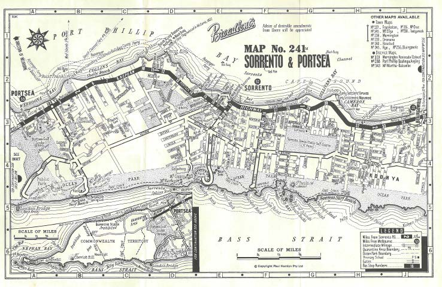

Here is member's news for the current year.
Other years member news may be
found at:

* 2023
* [2022](membnews2022.html)
* [2021](membnews2021.html)
* [2020](membnews2020.html)
* [2019](membnews2019.html)
* [2018](membnews2018.html)
* [2017](membnews2017.html)
* [2016](membnews2016.html)

Please note, links in member news are not maintained in general, they remain as a record of what was sent to members.

## April 2023

Hello everyone, and welcome to the April 2023 ATA Members News.

### UPDATE ON OUR PRESIDENT ANDREW JAMES’ MOVE TO NEW ZEALAND

Andrew has just finished the Train Control school, managing to obtain the second highest overall score out of the school of seven, despite having to complete a 10 week course in 4.5 weeks.  He is now starting on-the-job training for his position as Network Control Manager, KiwiRail.

His house is still condemned after damage caused by the recent cyclone.  He has found somewhere else to live for at least the next year, a 19th century villa in Greenlane.   Resolution of the cyclone damage may take about 12 months.  He has still been unable to get access to the contents in his damaged house.

### WORKERS FOR THE CHALLENGES AHEAD

In recent years, membership of ATA has remained strong, and we have been able to keep going with our activities and projects.  But as we all grow older, we need to encourage more participation by members, using the many varied skills, expertise and interests that we share.  Here are some of the activities where members are encouraged to consider becoming involved.

* Writing articles for The Times  In this, our fortieth year, we would like to publish articles in The Times  from long-time members of the Association about their memories and experiences in the Association.  Please contact Geoff Lambert at <thetimes@timetable.org.au> or 0437&nbsp;854&nbsp;025.
* Updating the history of ATA  The last ATA history was written by Victor Isaacs 15 years ago.  It now needs to be updated in time for the 40th year anniversary issue of The Times  in September this year.  Access to archive records is available.  Geoff Lambert would keenly like to hear from you if you are interested.
* National Timetable Collection  With over 500 boxes of timetables stored in easily accessible order at CAVAL in Bundoora, Melbourne, work on sorting, culling and cataloguing the Collection is interesting, challenging and enjoyable.  One team of members works at CAVAL each Thursday, but another team could work on Tuesdays, doubling the progress on getting timetables deposited in the State Library.  This work is varied and satisfying.  Please contact Len Regan at <archives@timetable.org.au> or 0409&nbsp;209&nbsp;114 to find out more details.
* Book sales  ATA has well over $1000 worth of quality second-hand transport books it has received from donations.  The immediate task is to compile a list of them which can be placed on the new website.  Later, we need someone to manage the sale of these books.  They are currently stored in a garage at Hughesdale in Melbourne.  Len Regan is the person to contact if you might be interested in this project.
* Website Some of the content of the new website has still to written.  But then all of it has to be converted into Wordpress before it can be uploaded.  If you are competent with Wordpress and have some spare time in the next few weeks, your help with this project would be very much appreciated.  Please contact Richard May, <secretary@timetable.org.au>  or 0438&nbsp;364&nbsp;568.
* Sydney Division Meetings  Duncan MacAuslan has made available a room at the Sydney Bus Museum in Leichhardt for ATA meetings.  All we need now is a Sydney member to liaise with Duncan to organise meetings and notify members.  Not a difficult job, and a very rewarding one.  Please contact Richard May if this might be your contribution to ATA activities.

### ARCHIVAL COPIES OF DISTRIBUTON LISTS

The ATA archives have print and digital copies of the Distributions Lists only as far back as January 2005.  We would certainly like to have Distribution Lists in our archives for many years prior to that.  The Distribution Lists have been a staple feature of the Association and it is fascinating to explore how they developed over the years, including the range of content and the payment systems.

If you have kept Distribution Lists prior to 2005, we would certainly like to hear from you.  We could discuss a number of options ranging from a donation to ATA archives up to a loan of them so that we can scan them.  If you can contribute anything for this project, can you please contact Len Regan, Archives Officer, on <archives@timetable.org.au>  or 0409&nbsp;209&nbsp;114.

### OLD MAGAZINES

Following the item in Members News March 2023, an ATA member has donated a full set of *Transit Australia* magazines from February 2015 inclusive up to June 2018.  For this we are very grateful.

### ANNUAL GENERAL MEETING 2023

This year’s AGM will be held in Melbourne with a special 40^th^ Anniversary celebration.  The ‘usual’ date would be Saturday 21 October.  Please contact Secretary Richard May if you are aware of any conflicts with this date.  We will confirm the date in the next issue of Members News.

***Len Regan\
Membership Officer***

## March 2023

Hello everyone, and welcome to the March 2023 ATA Members News.

### Farewell event for ATA President Andrew James

A function to farewell our President Andrew James was held on Monday evening 13 February at the Auburn Hotel in Melbourne.  Twelve members and partners attended the night which was enjoyed by everyone present.  As members would know, Andrew has vacated his position as a Train Controller at Melbourne Metro and moved to Auckland, his home town, to take up a position with KiwiRail as Network Control Manager in the Auckland Integrated Rail Management Centre.   Andrew will retain his position as President even though he lives in New Zealand.

Unfortunately, Andrew arrived home in Auckland to face a serious problem with his house.  As a result of the recent weather in Auckland, a slip has occurred underneath Andrew’s house which has impacted the piles holding up the house.  While the house does not appear to have moved, the house cannot currently be entered after being  assessed by engineers.  It is unclear what challenges lie ahead for Andrew.  We wish Andrew well as he seeks to resolve his housing issues.

### Members event in Adelaide

In December 2022 a gathering of Adelaide members took place at Glenelg.   While only 3 members attended there was a good discussion about the many cuts to services, some haphazard, in the Adelaide Metro system, ostensibly due to staff shortages.  Numerous “temporary” cuts made in January 2022 are still effective.  We thank Robert Field for organizing this meeting and hope that further meetings will be possible during 2023.

### Members meetings in Sydney

For some time it has not been possible for Sydney members to gather due to the difficulty in finding a suitable location to meet.  An offer to use meeting facilities at the Sydney Bus Museum in Leichhardt has been received from Duncan MacAuslan who is both a member of the ATA and also a Director of the Sydney Bus Museum.  In order to commence meetings, we need a Sydney member to take on the role of convenor and to arrange an appropriate time for an initial meeting at the Sydney Bus Museum.  Interested members should make contact with Secretary Richard May at <secretary@timetable.org.au> or phone 0438&nbsp;364&nbsp;568.

### Membership fees

As usual in February each year, the ATA Committee has considered and adopted the Membership Fees of the coming financial year.   There will be no increases in fees for 2023-24, and the lower fee for members who receive the monthly mailout only by email will remain.  The overseas only-email
mailout fee will be adjusted to be the same as for Australian members.  A new fee is introduced in the remote possibility that we may get new members from New Zealand who wish to receive the mailouts by post.  
Here is the Membership Fee schedule for 2023-24:

| | Year | Per Month  
|:-|-:|-:|
Australian Member: post mailout | $72 | $6.00
Australian Student Member (aged under 25 Years) | $36 | $3.00
All Members: only email mailout | $66 | $5.50
New Zealand Member: post mailout | $96 | $8.00
Other Overseas Member: airmail post mailout | $108 | $9.00

### Old magazines

One of our ATA members is keen to obtain a full set of *Transit Australia* magazines from February 2015 inclusive up to the end of publication in about 2018.

If you have a set of these magazines and have no further use for them, they can go to a good new home.  Please contact Len Regan, Archives Officer, <archives@timetable.org.au> or 0409&nbsp;209&nbsp;114.

### Cobb & Co: new publication

*Along the tracks of Cobb and Co. - Cobb’s Coach Drivers*  by Hazel Johnson is a new publication of historical significance that may be of interest to members.

Hazel Johnson has compiled words written about Cobb & Co between the mid-1800s to the mid 1900s, thus letting history tell its own story.  The book has 208 pages, identifies 700+ coach drivers with 65+  Cobb and Co. images.

The retail price is $29.95 and is available from [www.cobbandcotracks.au](https://cobbandcotracks.com.au/)

***Richard May\
Secretary***

## February 2023

Hello everyone, and welcome to the February 2023 ATA Members News.

### Farewell event for ATA President Andrew James

Our esteemed President Andrew James has accepted the high-profile KiwiRail position of Network Control Manager at the Auckland Integrated Rail Management Centre.  We offer Andrew our sincere congratulations.

Andrew has vacated his position as a Train Controller at Melbourne Metro and moves to Auckland, his home town, on 19 February 2023.

Andrew was elected President of ATA in October 2022.  He will retain this position after he moves to New Zealand.  This is feasible given that most of our management functions are now conducted on-line.

A function to recognise Andrew’s significant contributions to ATA will be held in Melbourne at 6.00pm on Monday evening 13 February 2023.  All ATA members are invited to attend with their partners and friends.

The function will be an evening meal in a dining room at the Auburn Hotel, 85 Auburn Rd, Hawthorn East very close to Auburn Station.  The table booking has been made in the name of Richard May.

The arrangement is that you buy your own drinks at the bar.  The bill for the meals will be paid by ATA.   You are asked to pay ATA for your meal.   This can be done by:

* Cash on the night
* EFT deposit to the ATA bank account on the night
* EFT deposit to the ATA bank account as soon as you get home
* Deduction from your ATA credit account.

Here are ATA’s Bendigo Bank account details: BSB 633-000 Account 1925 46489.

For catering purposes, if you can come, can you please send an email to Richard May, secretary@timetable.org.au  or phone 0438 364 568, before Friday 10 February.

If you wish to contact Andrew, his email address is president@timetable.org.au.

If there is sufficient interest, arrangements can be made for members to inspect ATA’s National Timetable Collection facility at CAVAL in the grounds of La Trobe University, Bundoora, on the next day, Tuesday 14 February.  For security protocols, please advise Richard May before Friday 10 February if you are interested in this inspection.

We hope that you may be able to join us for this special event on 13 February 2023 where you can meet Andrew, our President, and other ATA members.

### New Members

We welcome two new members to ATA:

* Leigh Zaghet, Seven Hills, Sydney
* David Bowman, Mount Waverley, Melbourne.

We look forward to working with Leigh and David and help them with their interests in timetables.

### National Timetable Collection at CAVAL

The National Timetable Collection (NTC) is now well established at CAVAL which is on grounds of La Trobe University at Bundoora in Melbourne.

All the boxes containing the timetables are now stacked and labelled in order of transport mode within each State, so it is easy to find the timetables for any locality or region.  The work routines for processing the timetables are now well established and we are keen to attract more members to join the team of workers on this challenging project.

ATA’s name for the facility at CAVAL is Mern Merna, after the next station beyond Hookina on the old narrow-gauge Central Australian Railway.

The ATA computer has been set up permanently at Mern Merna and can be used not only for the NTC  project but also for other ATA management tasks.

There are many tasks to be done, and these can be tailored to individual members needs and capabilities.

* The timetables need to be sorted when they are initially received.
* Timetables need to be separated from maps, guides and information, and from material that is more suited to the ATA’s archives.
* The new timetables need to be merged with timetables already received.
* Timetables from collections in large heavy boxes need to be repacked into smaller lighter boxes.
* Duplicate copies of timetables need to be separated and filed in the ‘duplicates’ boxes.
* Batches of timetables need to be selected from the duplicates for Auction catalogues.
* Timetables for the core Collection need to be sorted and bundled into date order.
* Sorted timetables need to be catalogued in Excel for the State Library.  This is best done with two people working together.
* The catalogued timetables need to be coded, checked, packed and labelled ready to be deposited at the State Library.

Workers can take on particular tasks of their choice, and they can work on these tasks on each of their visits to Mern Merna.   At present, we are working usually on Thursdays each week at Mern Merna, but this can be varied to meet member’s needs.

As more workers become in involved, it may be possible for small teams to work at CAVAL on more days each week.  The Association’s stocks of overseas timetables and transport books are currently stored in Steven Haby’s garage at Hughesdale.  There is a lot of sorting, labelling and filing to be done there, and this work is done on Saturdays for the time being.

ATA’s name for the storage at Hughesdale is Federation, after the name of the street where it is located.

If you are interested and able to work on any of these tasks, you will be very welcome.  If you are able to work only occasionally, you are still welcome.  It is a major task that the Association has undertaken, and all the help that can be given will improve the results that can be achieved.

There are security protocols for working in Mern Merna at CAVAL.  There are no formalities for working at Federation.

To discuss your interests in being involved with the National Timetable Collection and the Association’s archives, please contact Archives Officer Len Regan on archives@timetable.org.au, or phone 0409&nbsp;209&nbsp;114.

### Map Memories

The NTC’s collection scope does include public transport maps and guides.  The following treasure was discovered when Steven Haby was sorting through a collection of brochures. Note the bus stops marked on the map and the Queenscliff ferry route which included a stop at Portsea.  

{maxwidth="100%"}

***Steven Haby\
Vice President***

## January 2023

Hello everyone, and welcome to the January 2023 ATA Members News.

### 40TH ANNIVERSARY OF THE AUSTRALIAN TIMETABLE ASSOCIATION

2023 marks the 40th anniversary of the Australian Timetable Association, and there are already several supporting activities in the planning to support this important anniversary.

We will be reprinting and updating feature articles from the past, including the History of AATTC and ATA, in The Times.  There will be special tributes to our founder Jack McLean.  36 of the original first 100 members are still members of the Association – we will be inviting them to contribute reminiscences of their time in AATTC and ATA.  There might even be a national Zoom meeting so that we can all ‘meet’ each other. Members suggestions for special activities are very welcome.

### POSTAGE RATE CHANGES

Australia Post increases its basic postage rates from 3 January 2023.  For postage of Distribution List and Auction times we can absorb the increase to $1.20 in the cost for small letters, but we will need to pass on the cost for all other items.  

### CALL FOR DIGITAL ARCHIVES OFFICER

As the ATA progresses with the sorting and eventual cataloguing of the digital aspect of the National Timetable Collection, we are in need of an officer to assist in the reception of material and sorting those files. The files will be sorted by year, month, and mode to allow for easy recall of files should they be requested. The officer will act as the receiver of items for the digital arm of the National Timetable Collection from members, and sort them according to the file structure. Assistance can also be provided by those who have access to the ATA’s computer located at CAVAL.

The collection is managed within the ATA’s Dropbox account, so the officer should either be familiar with Dropbox, or be willing to learn. Dropbox works as an extension of the Windows native File Explorer, so if you are familiar with this, then Dropbox should present no problem for you. The ATA has a spare Dropbox account allocation should you need it. In turn, we ask that the value of the digital data be respected and protected, as the collection represents a valuable asset to the ATA, as well as a potential revenue stream in the future.

On a more wide-ranging aspect, the ATA wishes to expand its digital collection, and calls for digital material that members may have to be submitted to the ATA for inclusion into the digital National Collection. If you would like to submit material to us, and you already have Dropbox, the ATA will share the Digital Timetable Deposit folder with you so you can place items for incorporation into the collection for sorting.

### SYDNEY DIVISION MEETING LOCATION

I am pleased to report that the ATA has been offered a meeting space for the Sydney Division by the management committee of the Sydney Bus Museum in Leichhardt, and the ATA has accepted this generous offer. The meeting space is available to us on Saturdays, and access can be provided by Duncan MacAuslan, a fellow ATA member and member of the management committee of the Sydney Bus Museum. In return, the Sydney Bus Museum ask for a small donation for the use of their space.

The position of Sydney Convener is vacant. The ATA would appreciate a volunteer to fill this position, so we can get the Sydney group actively meeting again.

### MEANWHILE DUG OUT OF THE ARCHIVES...

{maxwidth="100%"}

Recently, David Hennell was sorting ATA’s archival collection of Victorian railway magazines. He came across an article on Sandringham Station in April 1982 which featured ATA member Peter Walhouse. Peter retired recently from Metro Melbourne after working on the railways for over 50 years, 41 of them at Sandringham. Peter joined AATTC in the late 1980s and has remained an active and supportive member ever since.

Peter is a prolific supplier of timetables and brochures for the Distribution List, and he is a generous donor of many useful stationery items. He still enjoys travelling extensively throughout Australia and New Zealand and takes every opportunity to collect timetables and brochures for ATA.

We are very grateful for the support that we continue to receive from Peter.

### UNINTERRUPTABLE POWER SUPPLY

When ATA bought its own computer in August 2021, it expected that it would be able to move into its own premises in a vacant railway building or council community centre.  For either location, an uninterruptible power supply unit would be essential, and we bought a CyberPower Pro 1200VA/720W unit for $230 .  However, the eventual move to CAVAL in November 2022 has negated the need for this unit, and it can be made available to a member or community group who may have a use for it at a negotiated price.  If you might be interested, please contact Treasurer Len Regan on 0409 209 114.  

### RELOCATION TO NEW ZEALAND

Since the last edition of the Members News, I have been offered and accepted a new position with KiwiRail in their Auckland Integrated Rail Management Centre (AIRMC) as Network Control
Manager. The AIRMC is currently under construction in Ellerslie in the inner suburbs of Auckland, New Zealand, scheduled for opening in the middle of 2024. The current network control functions are shared by the National Train Control Centre in Wellington, and a temporary control centre in the operations building of Westfield Marshalling Yard in South Auckland. This is an outcome of the current de-centralisation project for the network control functions of KiwiRail, which also includes the relocation of Wellington’s train control centre to the former AgResearch facility in Wallaceville, Upper Hutt.

This will mean I am relocating back home to New Zealand in the middle of February. I have notified the Committee of my pending relocation but have also stated my intention to remain as President of the ATA, and to continue my current roles and responsibilities to the organisation. For the most part, those responsibilities are digital in nature, and can be done from anywhere. There will be some minor disruption while I am in the process of moving back home, but this shouldn’t present any ongoing operational problems. I am grateful to the Committee for their endorsement, and ongoing support while I transition back to life overseas.

**Andrew James**\
**President**

### FAREWELL TO ANDREW JAMES

We congratulate Andrew on his prestigious appointment at KiwiRail and we wish him all the best with his return to New Zealand.  We are also very pleased and grateful that he will retain his position and activity as President of ATA.

We are planning a farewell function for Andrew which will most likely be an evening event somewhere between 12 and 16 February 2023, inclusive.  We invite all ATA members to participate in this event and show our gratitude to Andrew for the constructive work he has already done for ATA.

Further details will be included in the February 2023 Members News.  If you need to know the details before then, please contact me on 0438 364 568.

**Richard May**\
**Secretary**

