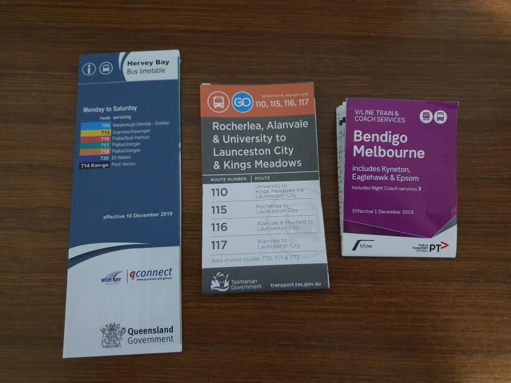
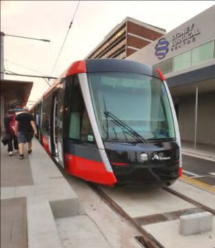

Here is member's news for the current year. Previous years member news may be
found at:

* [2019](membnews2019.html)
* [2018](membnews2018.html)
* [2017](membnews2017.html)
* [2016](membnews2016.html)

Please note, links in member news are not maintained in general, they remain as a record of what was sent to members.

## August 2020

### Train Times of Australia and New Zealand Update

As previously reported, Alex Sims, our webmaster, has placed a link to Victor Isaacs’ website [Train Times](https://traintimes.net.au/) Australia and New Zealand on [our own](https://www.timetable.org.au/) website. David Matheson has offered to manage the NSW timetable pages. Some members have offered to look after V/Line Victorian timetables and the pages giving details of Melbourne’s tram systems. However, more members are needed to take responsibility for maintaining further designated timetable pages: e.g. Brisbane suburban trains, Western Australia (Transwa) country trains and buses. If you are interested, please contact me by phone on 0409 463 209 or by email at <president@timetable.org.au>.

### AGM Rescheduled to Saturday November 21

Our AGM has been rescheduled to Saturday November 21, 2020 at 2pm AEDT using the online conference facilities. If Covid restrictions allow, members may gather at a central place or several locations in each capital city (with appropriate social distancing being practised). Individual members may join the meeting at home by an internet or phone connection. Our committee is looking at making the AGM accessible to all members and maintaining the integrity of voting. At the next committee meeting on 19 August 2020 the 2019-2020 financial report will be presented along with draft annual reports from those responsible for various areas of the work of ATA.

### “The Times” and “Table Talk”

The August “The Times” has an article by Jim Wells on a confusing timetable, a report on options to improve rail journey times between Sydney and Wollongong, and my recollections of Toowoomba bus services in 1970s. The August “Table Talk” has a bumper bus news, which includes commentary on the now cancelled Adelaide Bus Network Review and news of recent Transperth changes. Our thanks to Geoff Lambert for editing “The Times” and Chris Pandilovski and Steven Haby for editing “Table Talk”. Our thanks to Geoff and Judy Lambert for collating and sending our monthly mailout.

### Victorian Historical Journal

The ATA became a member of the Royal Historical Society of Victoria ([RHSV](https://www.historyvictoria.org.au/)) this year, as a result of taking out public liability insurance brokered by the RHSV. The historical society produces an informative journal twice a year which we are able to circulate to interested members of the ATA. The most recent
volume contains 225 pages and includes 7 feature articles covering a wide range of historical events and people relevant to the development of Victoria as well as a number of smaller contributions including reviews of recently released books. If any member is interested in reading a copy of this journal they should email Richard May <secretary@timetable.org.au> who will be able to send them a pdf of the journal via email.

Hilaire Fraser, <president@timetable.org.au>

## July 2020

### [Train Times of Australia and New Zealand](https://traintimes.net.au/)

After contacting John Mikita of [TransitGraphics](https://transitgraphics.com.au), Alex Sims, our webmaster, is in the process of transferring Victor Isaacs’ website Train Times of Australia and New Zealand to our own [website](https://www.timetable.org.au/), which currently has a link to [Victor’s website](https://traintimes.net.au/). Although last updated on 25 September 2019, it contains a wealth of information and well worth a look. There are three sub-sections providing timetables, [links to related websites](https://traintimes.net.au/links) and a [feedback form](https://traintimes.net.au/feedback). The timetables sub-section covers each state and New Zealand. The NSW sub-section, for example, is divided into regions. Detailed timetables for long distance train and bus services are provided with distances from Sydney, elevations of stations and opening dates for stations. Sample timetables are provided for Intercity and Suburban services. Under the Victoria heading are details of Melbourne’s tram system. The “Indian Pacific” reference has the public timetable as well as GSR and NSW working timetables! Also there are various rail network guides. These remind me of Bradshaws as they contain geographical and historical references. The guide to heritage railways is amazing! Victor’s website is a valuable asset that should be preserved and, if possible, kept up to date. Agnes Boskovitz will provide the necessary Excel spreadsheets and Word documents to ATA to allow traintimes to be kept up to date. David Matheson has offered to manage some timetable pages. However, more members are needed to take responsibility for maintaining designated timetable pages: e.g. Brisbane suburban trains, Victorian country trains. If you are interested, please contact me by phone on 0409 463 209 or by email at [president@timetable.org.au](mailto:president@timetable.org.au).

### Zoom ATA Meeting 30 May 2020

Our Sydney convener, Geoffrey Clifton, organised a Zoom ATA Meeting on Saturday May 30 at 2pm AEST. Twenty members participated and over the two hours allocated we were able to introduce ourselves and enjoy a general transport and timetable discussion. It was good to see, in person, people with whom we had previous contact only by email, conventional mail or Facebook. Hopefully another Zoom meeting can be organised before long.

### AGM Rescheduled to Saturday November 21

Our AGM has been rescheduled to Saturday November 21, 2020 at 2pm AEDT using a hybrid format where members gather at a central or several locations in each capital city (with appropriate social distancing being practised) and each venue is connected using one of the online conference facilities in order to conduct a full
meeting.

### Membership Renewals

We are very pleased that so far 92 members have renewed their ATA membership for 2020-21. The remaining members will receive the July 2020 mailout with a reminder notice. Hopefully they will be able to send their renewal promptly so that they can continue to receive all the membership benefits.

Hilaire Fraser, <president@timetable.org.au>

## June 2020

### Report of the ATA Committee Meeting Wednesday 20 May 2020

The work of ATA has been challenged by the COVID-19 pandemic. Our regular meetings are haven’t been held and there have been frustrating postal delays. Our thanks to committee members and volunteers who have continued to prepare and distribute our monthly mail-out and provide our auction and distribution services. Pleasingly, many members have been in contact with each other through emails, phone calls and, more recently, visits. Below, under various headings, are more details of matters dealt with at the ATA Committee held on
Wednesday, 20 May 2020. Although long, it was a productive meeting. Sadly our Treasurer, Len Regan is unwell and will be undergoing a period of therapy and recovery until the end of September. Many of us enormously appreciate Len’s work for ATA, his friendship and our best wishes and prayers are extended to Len and Mary. During this period some other committee members will be assisting with the various jobs performed by Len. At this time no further progress has been made with the updating of our website. We welcomed Dave Brown of Inglewood WA as a new member. Chris Pandilovski was appointed permanent “Table Talk” editor. Previously he was the interim editor.

### AGM Rescheduled to Saturday November 21 using Multiple Locations

Our AGM was to be held in Sydney on Saturday August 15, 2020. Our committee decided to reschedule the meeting to Saturday November 21, 2020 at 2pm AEDT using a hybrid format where members gather at a central or several locations in each capital city (with appropriate social distancing being practised) and each venue is connected using one of the online conference facilities in order to conduct a full meeting. This would avoid the need for long distance travel but still enable those without individual access to computers or networks to attend the meeting in person at their local hub and enjoy some interaction with other members. This assumes that there will be an easing of limits to meeting numbers by November. We have the offer of a member to access his Zoom account for the AGM. Consultation with Geoffrey Clifton, our Sydney Convener, and Steven Haby means a meeting space can be available at Uni of Sydney and PMI for our Sydney and Melbourne members respectively. Canberra, Adelaide and Brisbane members may wish to arrange their own venue. Of course anyone can link up to the meeting as an individual.

### Zoom ATA Meeting

Our Sydney convener, Geoffrey Clifton, organised a [Zoom video conferencing](https://en.wikipedia.org/wiki/Zoom_Video_Communications) Meeting for ATA Meeting on
Saturday May 30 at 2pm AEST. This meeting had a general transport and timetable discussion in a format similar to our Sydney meetings. [Note from Production Manager- this meeting has already occurred, but there will be more].

### Membership Renewals

Our committee formally adopted a proposal to offer concessional membership fees to those who may be in financial or social difficulties as a result of the COVID-19 restrictions. Included with the recent membership renewals was a copy of the ATA’s promotional brochure. Already some members have requested additional copies to pass onto friends who may be interested in joining ATA. Many thanks to many members who have already renewed their membership. Some have included a donation to support our work. This is very much appreciated. We would encourage those who have not renewed their membership to do so promptly.

### New Logo Approved

Our committee approved the new logo presented above. We are pleased with its modern and crisp appearance. The new logo has already appeared on our Distribution List and mail-out envelopes. Our thanks to TransitGraphics who designed the new logo in conjunction with the preparation of our recent promotional brochure.

### ATA Finances

At the end of April ATA had an accrual surplus of $1812 for the 2019-2020 financial year. A small profit is anticipated at the end of the financial year.

### traintimes.net.au

At its Committee meeting in February 2020, ATA agreed to work towards the retention of Victor Isaacs’ website Train Times Australia and New Zealand ([https://traintimes.net.au/](https://traintimes.net.au/)). Victor’s website is considered by many people to be a valuable asset that should be preserved and, if possible, kept up to date. Our webmaster Alex Sims will consult with John Mikita of [TransitGraphics](https://transitgraphics.com.au/) and Agnes Boskovitz to integrate this website with our website. David Matheson has offered to manage a section. However, more members are needed to take responsibility for maintaining designated sections of Victor’s website: e.g. Brisbane suburban trains, Victorian country trains. If you are interested, please contact me by phone on 0409 463 209 or by email at <president@timetable.org.au>.

### National Timetable Collection

We recently received a large collection of Adelaide train, tram and bus timetables from the 1990s from Dave Stephens in Adelaide. We have not heard anything yet about our application for $15000 under the Local History Grants. Further discussions with Melbourne Metro about the use of vacant premises at a railway station – Windsor Station in particular – are also in abeyance. A larger storage unit for NTC material has been leased at National Storage Kilsyth. We have also accepted an offer from Steven Haby to use some storage space in his unit at Kennards. Some NTC sorting and cataloging is continuing at the homes of Victorian members.

### Distribution Service & Auction Report

Agnes Boskovitz has provided an extensive range of recent rail magazines for the May List. Each item has had at least one order. The June List will contain historic timetables and guides from Europe, North American and New Zealand. Matthew Gibbons, Andrew Woods and Robert Henderson have been assisting with the preparation of auction catalogues. Geoff Hassall and Len Regan have been assessing bids. Airline timetables have not produced much interest.

Hilaire Fraser, <president@timetable.org.au>

## May 2020

### Something New

{width="3.6in" height="2in"}

The ATA Committee at its meeting on 20 May 2020 will consider the adoption of the new. ATA logo above. We would appreciate your views on this. Please send them to Secretary, Richard May, 0438 364 568 or <rim@bigpond.net.au>.

### Membership Renewals

With the May mail out you have received Membership Renewal for 2020-2021. A prompt renewal is always
appreciated. If, due to a loss of regular income as a result of the coronavirus crisis, you are experiencing financial or social difficulties, you can obtain a concessional membership of $30 for 2020-2021 compared with the normal membership of $60. Included with your membership renewal is a copy of the ATA’s promotional brochure. We hope that you will be able to pass this onto a friend who may be interested in joining ATA.

### ATA Postal and Electronic Mail Outs

Our thanks to Geoff and Judy Lambert, who are seeking to maintain our postal and electronic mail outs. If you wish to change from a postal mail out to an electronic mail out or receive both contact Len Regan, <membership@timetable.org.au>. I receive both and the electronic editions contain colour illustrations and maps which mostly appear in black and white inside the print version.

### Divisional Meetings & NTC Workdays

Due to continuing social restrictions created by the need to reduce the spread of the coronavirus, all ATA meetings and NTC workdays have been suspended. If, and when, social restrictions are eased ATA can restart its activities in a responsible way. Some NTC sorting and cataloguing is continuing at the homes of some Victorian members.

### Annual General Meeting Form and Date

Our AGM is due to be held in Sydney on Saturday August 15, 2020. At the ATA committee Skype meeting to be held on Wednesday May 20 at 8pm AEST our committee will decide on the form of the AGM and a change of date, if needed. A number of folk have become familiar with Zoom meetings for work, education, family, community and religious gathering. This may be a possibility.

### Distribution Service Report

On the April Distribution List popular items included Sydney & NSW Trains working timetable summary of alterations, V/Line pocket timetables, Stawell bus timetables and Tasmanian bus timetables. For the May List South Australian member Joel Taggart has offered in print and electronic form a bus timetable for the remote island of St Helena. St Helena is situated in the South Atlantic Ocean and is a territory of the United Kingdom.

Hilaire Fraser, <president@timetable.org.au>

## April 2020

### Coronavirus and ATA

Due to the social restrictions created by the need to reduce the spread of coronavirus, all ATA meetings and working bees on the National Timetable Collection have been suspended. We are expecting our April electronic and postal mail&#8209;outs to proceed as normal. Our AGM is due to be held in Sydney on Saturday August 15, 2020. The time and place of this meeting may have to be reviewed closer to the date.

### Coronavirus and Transport Changes

With the Queensland border now closed, NSW Trainlink train and coach services are no longer entering Queensland. New bus networks which would have been introduced in Burnie and Devonport on 19 April have been postponed until January 2021. Alterations to the Canberra bus network due to have commenced on 28 April have also been postponed. Although no announcement has been made, there seems to be no hurry to commence light rail services on the L3 to Kingsford. Transport authorities have encouraged customers to be more conscious of good hygiene habits and have provided some protection for bus drivers such as greater use of the centre door. Reduction of services is likely as more people work from home.

### Alternative Arrangements for Melbourne NTC Working Bees

We have had to suspend the working bees on the National Timetable Collection at the Prahran Mechanics’ Institute (PMI) for the time being, but we have been able to arrange for work to continue in other ways.
Some members have been able to take bundles of timetables home where they are culling, sorting and labelling them. Others have taken bundles of sorted timetables home and are cataloguing them in an Excel&#8209;like spreadsheet (Google Sheets) for the State Library of Victoria. This work is being monitored, and online assistance given as needed. Planned work on scanning timetables has been deferred for the time being.
Luckily, some timetables are in self&#8209;storage locations, and they can be accessed without going to PMI. It may be possible to make arrangements for members who may wish to cull, sort or catalogue boxes of these timetables at home. If you are interested in this work, please contact Len Regan on 0409 209 114
or <lenregan.ata@gmail.com>.

### Volunteers Needed

At its Committee meeting in February 2020, ATA agreed to work towards the retention of Victor Isaacs’ website Train Times Australia and New Zealand. <https://traintimes.net.au/>.

Victor’s website is considered by many people to be a valuable asset that should be preserved and, if possible, kept up to date.

To do this we need a group of members to volunteer to maintain current information on the website as an ATA project.

Victor’s website is worth looking at. It covers all the intercity and regional rail lines in Australia and New Zealand. It shows geographical information for all stations and landmarks along each line, and a summary of the current timetables for each line.

As a start, two ATA members have indicated that they are willing to assist with this project. David Lewis, in Adelaide, is the editor of GetAbout Australia: [www.getaboutaustralia.com](http://www.getaboutaustralia.com). David Matheson, in Springwood NSW, has his own website Railways and Tramways of Australia: [http://www.railtram.com.au](https://www.railtram.com.au)
However, more members are needed to take responsibility for maintaining designated sections of Victor’s website: e.g. Brisbane suburban trains, Victorian country trains.

Len Regan has undertaken to set up this group which will then organise how it will operate. If you are interested, please contact Len on 0409 209 114 or <lenregan.ata@gmail.com> by mid&#8209;April 2020.

Hilaire Fraser, <president@timetable.org.au>

## March 2020

### Report of the ATA Committee Meeting Wednesday 20 November 2019

Our meeting comprised the usual reception of reports on the work of the ATA. For the first seven months of the 2019&#8209;2020 financial year, our bank balance has been in a healthy position due to the renewal of memberships. The distribution list and auction have been running at a surplus. Our work has been impacted by increased costs for postage and printing. Membership fees are unchanged for 2020/21, so normal membership will be maintained at $60. Membership is now 134 and we welcome Robin Bromby of Edgecliff, NSW as a new member. In recognition of the assistance given to ATA by Samuel Rachdi of Fahrplancenter, Switzerland we will offer him free membership for 2020/21. Samuel has been able to provide ATA members with many overseas timetables. Matthew Gibbins and Richard May are assisting in the preparation of auction catalogues. They join Len Regan, Geoff Hassall and Robert Henderson as well as other volunteers in the work of the auction. Early in January 2019 we submitted an application for $15000 under the Local History Grants Program to cover the costs of computer, printer, book scanner access and storage shelving in a new work area for the Victorian Segment of the National Timetable Collection. Scanning hard&#8209;bound working timetables is being done by members at Docuvan in Bayswater, Victoria. Remember the date for the AGM to be held in Sydney is Saturday August 15, 2020.

### Melbourne & Sydney National Timetable Collection Working Sessions

Melbourne Working Sessions will be held on Saturdays 7 & 21 March, 4 & 18 April, Thursdays 12 & 26 March, 9 & 23 April at Prahran Mechanics’ Institute 39 St&nbsp;Edmonds Rd, PRAHRAN. Sydney Working Sessions will be held on Saturday March 21 (full day) and Saturday May 16 (half day) at 378 Abercrombie St DARLINGTON. These days are very successful. Full day sessions run from 10am to 4pm.

Hilaire Fraser, <president@timetable.org.au>

## February 2020

### Sydney National Timetable Collection Working Session February 15

In response to the need to assist the development of the NTC a working session will be held in Sydney at 10 am on Saturday February 15, prior to the next Sydney Division, at 378 Abercrombie St DARLINGTON. (Sydney meeting venue). We will be cataloguing Sydney private bus timetables. Lunch will be at 1pm and can be obtained at a nearby café or bring your own. Just come along or contact Geoffrey Clifton or myself.

Hilaire Fraser, <president@timetable.org.au>

## January 2020

### The Year Ahead

The hope with which we usually start a New Year has been adversely affected with the devastation of horrendous bushfires across many states. We would hope that our members, their families and friends are safe at this very difficult time.
2019 brought the opening of new light lines in Newcastle, Canberra and Randwick (Sydney) as well as the Chatswood to Tallawong (Sydney) Metro. The Kingsford branch of the Sydney Light Rail Network is due to open in March 2020 with a recast of South East bus routes to take place four to six weeks later. When the new bus network is in operation it will be interesting to see the extent to which routes operating past Randwick or Kingsford will continue to operate to and from the CBD in light of the slow journey times being experienced on the tram. On 5 January, 2020 the Carlingford (Sydney) rail line closed for conversion to light rail as part of the Parramatta Light Rail Line due to commence operation in 2023. Meanwhile in Perth a recasting of bus routes in the Mirrabooka and Wanneroo Road areas is planned for 2020. This will provide better connections between new residential areas, train stations and business centres.

### National Timetable Collection Report

Included in the January Mail Out is very important report on the National Timetable Collection prepared by Len Regan. ATA members are encouraged to support this project.

### Sydney National Timetable Collection Working Session February 15

In response to the need to assist the development of the NTC a working session will be held in Sydney at 10 am on Saturday February 15, prior to the next Sydney Division, at [378 Abercrombie St DARLINGTON](https://www.google.com/maps/place/378+Abercrombie+St,+Darlington+NSW+2008/@-33.892803,151.1892184,17z/data=!3m1!4b1!4m5!3m4!1s0x6b12b1d23648774f:0x2d2b97b7c7de61e2!8m2!3d-33.8928075!4d151.1914071). (Sydney meeting venue). Lunch will be at 1pm and can be obtained at a nearby café or bring your own. Just come along or contact Geoffrey Clifton or myself.

Hilaire Fraser, <president@timetable.org.au>

