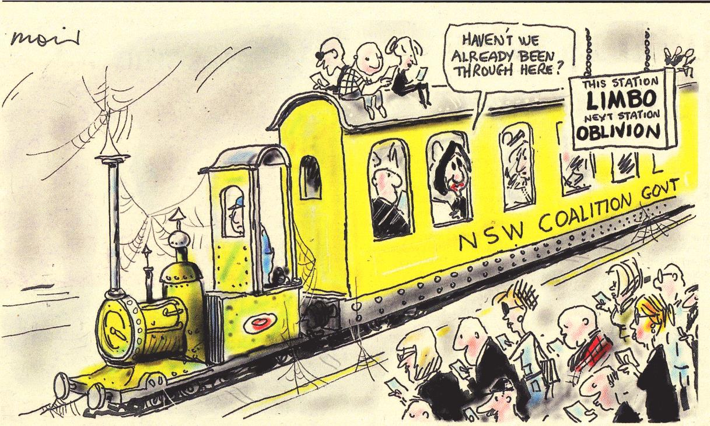
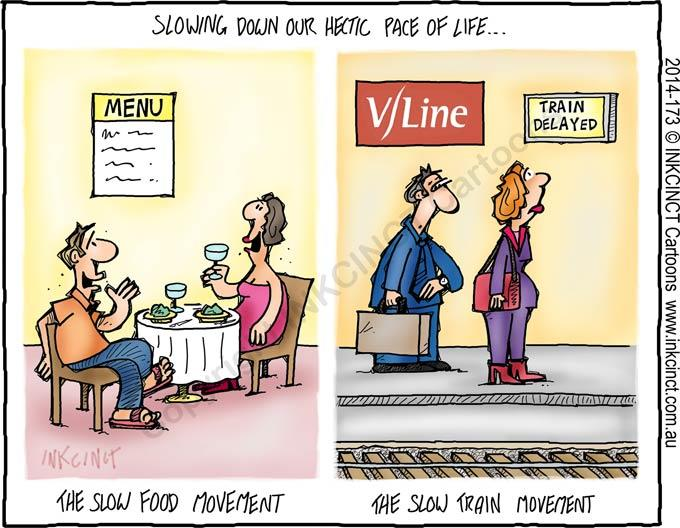

Here is member's news for 2018. Other years member news may be
found at:

* [2023](membnews.html)
* [2022](membnews2022.html)
* [2021](membnews2021.html)
* [2020](membnews2020.html)
* [2019](membnews2019.html)
* 2018
* [2017](membnews2017.html)
* [2016](membnews2016.html)

Please note, links in member news are not maintained in general, they remain as a record of what was sent to members.

## December 2018

### Report of ATA Committee Meeting 21 November 2018

It is very pleasing that financially the ATA continues to perform well. Our balance sheets are similar to the
same time last year. Discussions are underway with Prahran Mechanics’ Institute regarding the purchase,
installation and usage of computer, printer and scanner equipment in the work area. A project proposal for
scanning railway working timetables is being prepared, with a view to quality digital documents being
available from ATA on request. There could be a small revenue stream for ATA arising from this. Our
agreement with the PMI has been renewed. UK member Jim Fergusson has an amazing website where he is
attempting to document every passenger station that has ever existed in most parts of the world. He has
approached ATA to take over his website when he is no longer able to manage it. The committee agreed to
this in principle but has also suggested that his website be moved to Wikipedia to ensure its longevity. ATA
has accepted his offer of CDs of his Australian station lists. The ATA committee has also accepted the offer
of NSW member Ben Lewis of NSW working TTs. These are exceptionally crisp B&W documents, with a
colour cover.

### New Book from ATA member Tim Fischer AC

Tim Fischer has released a new book entitled “Steam Locomotives that galvanized the Nation”. It comprises
255 pages and is available from Dymocks, QBD and ARHS NSW Division bookshop. Cost $39.95

> Hilaire Fraser, President

## November 2018

### Annual General Meeting Report

ATA members enjoyed a successful Annual General Meeting at the Prahran Mechanics Institute and
associated program on Friday and Saturday 12th and 13th October 2018.

On Friday 12th, there was working session for the National Timetable Collection in the James Mason Room, ground floor at the Prahran Mechanics Institute. While I was there, eight ATA members were present. Some were working downstairs and others were setting up for the AGM in the auditorium upstairs. All enjoyed sharing the company and our common interests. I must commend the work of Len Regan and his team with the National Timetable Collection. The PMI has an extensive library featuring many aspects of Victoria’s history, including the ARHS Victorian Division collection. Members visiting Melbourne may wish to attend the NTC working bees and inspect the PMI. Please contact Len Regan for working days, usually twice a month. As well as storing the NTC prior to dispatch to the State Library of Victoria, the ATA archives are also stored at the PMI. The PMI provides a base for ATA in Victoria and, to some extent, nationally.

Just prior to 10am on Saturday 13th October nine members met at Flinders Street station to catch a Metro train to Caulfield. Our original plan was to ride on the recently opened Mernda rail extension. Because this line was closed for the weekend, we re-planned a train ride to Cranbourne over the new elevated track of the Dandenong Line, now elevated in many sections to avoid level crossings. As it happened, a Seymour Heritage train chartered by the Level Crossing Authority as a free event, also operated over this line on the day of our AGM meeting, independent of our plans, stopping at the re-built stations, so we were able to enjoy this ride. The train comprised five passenger cars hauled by B74 and X31 in a push-pull arrangement. Our group joined its first trip from Caulfield, which arrived at Dandenong in time for us to catch the 11.31am Metro train back towards the city. Our Metro train was delayed at Caulfield by the Heritage Train, which had arrived late and was awaiting instructions from Train Control. Once the Heritage Train departed Caulfield for the next trip towards Dandenong, our Metro train pulled into Caulfield station and continued towards the city. We had missed our connection at South Yarra for Prahran, so we travelled on to Richmond for a connection to the next Sandringham train to Prahran.

Before the AGM, many members enjoyed lunch at St Edmonds Café (next to PMI). Also prior to the AGM, members had a chance to inspect the National Timetable Collection, a large Grab Box and the Victorian History Library housed at PMI. The formal AGM commenced just after 2pm in the auditorium at the PMI and concluded just after 3pm. Steven Haby then made a video presentation detailing Victoria’s transport history and David Hennell presented a video showing the operation of rail motor service between Thomastown and Whittlesea in 1959. Participants received handouts on the histories of the Sandringham and Mernda (Whittlesea) train lines. Afternoon tea was provided by PMI. Our thanks to Len Regan, Steven Haby and David Hennell for organising a very successful AGM and associated events.
The results of the Election of Office Bearers at the AGM for 2018-2019 were:- Hilaire Fraser (President), Victor Isaacs (Vice President), Geoff Lambert (Secretary), Len Regan (Treasurer), Geoff Hassall, Chris Pandilovski, Alan Gray, Alex Sims and Steven Haby as Ordinary Committee Members. Steven served on the Committee many years ago and we welcome him back. Jim Wells was appointed auditor. Congratulations to all those elected. Len Regan was appointed a life member due to his contributions to the transport industry and ATA. Congratulations Len!

The Canberra Division was invited to host the 2019 AGM. Initial arrangements for the Canberra meeting include a ride the newly opened light rail line from Canberra City to Gungahlin and return to the city after lunch for a meeting at the premises of TransitGraphics.

Following the AGM the new committee was able to make the following appointments for 2018-2019:-\
Times Editor:- Geoff Lambert\
Table Talk Editor:- Victor Isaacs\
Production Manager:- Geoff Lambert\
Auctioneers:- Geoff Hassall & Alan Gray\
Archives Officer:- Len Regan\
Webmaster:- Alex Sims\
Social Media Officer:- Paul Brown\
Distribution Manager:- Hilaire Fraser\
Membership Officer:- Len Regan\

Each division will elect their own Convenor at their next meeting.

### Table Talk Bus Editor

The ATA is delighted to announce the appointment of Steven Haby as Bus Editor of Table Talk. Steven also
recently joined the ATA Committee. Victor Isaacs will continue as the Table Talk Rail and Tram, Air and Ferry Editor, as well as putting the final product together. Steven has an email to receive your contributions of Bus news. Please send Bus news to Steven at <busnews@timetable.org.au>

### ATA member Tim Fischer AC

Newspapers are reporting that ATA member Tim Fischer AC is suffering from, and receiving treatment for,
leukaemia. ATA extends best wishes to Tim Fischer and his family.

> Hilaire Fraser, President

## October 2018

### Revised Annual General Meeting Outing 13 October 2018

Because Metro will be replacing trains with buses from Clifton Hill to Mernda, from 21:00 Friday 12/10/18
to 04:00 Monday 15/10/18 it has been necessary to arrange another outing prior to the Annual General
Meeting. Initial advice was that there were no trains on the Caulfield line this weekend, but this has now been
corrected. From 21:00 Friday 12/10/18 to 04:00 Monday 15/10/18 power will be off from Southern Cross to
Richmond Junction on the Caulfield Underground Loop for a Fire and Life Safety Upgrade and Caulfield
Group trains will operate direct to and from Flinders St Station. Members arriving by Skybus from
Melbourne Airport would need to catch a train or tram from Southern Cross Station to Flinders St
Station. Thus our outing will now be a train ride to Cranbourne. This would travel over the two sections of
new “Skyrail”, pass many of the current level crossing renewals, travel along the single track Cranbourne line
before it is duplicated, and see the level crossing removal work at Abbotts Rd and the new Thompsons Road
overpass at Merinda Park. Depart Flinders St Station 10:08, Cranbourne 11:07 – 11:18, South Yarra
12:07. Change to Sandringham train depart 12:15, arrive Prahran 12:18. There is a 10 minute frequency on
the line to Dandenong, and a 20 minute frequency on the Cranbourne line.

### Other Annual General Meeting Details

For the benefit of our members the details of our Annual General Meeting are repeated in this edition of our Members’ News. Our Annual General Meeting will be held on Saturday 13 October at 2pm in the Auditorium of the Prahran Mechanics’ Institute 39 St Edmonds Rd, Prahran. You will have received the notice of the AGM, nomination forms and detailed directions to the venue in the September mail-out. The AGM allows members to receive reports on the activities of the ATA, bring any business requiring further consideration and elect a committee for the following 12 months. New members to our committee are always welcome as well as members willing to share the load of running the ATA. The social side of the AGM has become increasingly important and the annual luncheon associated with the AGM will be held at St Edmonds Café (next to PMI) at 12.30pm, (the route 6 Glen Iris tram from Federation Square at 12.09 to Stop 31, High St will get you there in time as will the schedule for our outing above). The PMI is also accessible from Prahran railway station on the Sandringham line and has an on-site car park. The luncheon and AGM allow us to catch up with friends, some from interstate with the same interests. Also on Friday 12 October there will be a working session for the National Timetable Collection in the James Mason Room, ground floor at PMI, from 10am to 4pm.

### Vale Tony Bailey

Members of the ATA were saddened to hear of the sudden death of Tony Bailey, of Botany Sydney, on Tuesday 18th September. Tony had been an ATA member for many years. He overcame a lot of physical hardship, as he was one of the last people to be afflicted with polio. He was totally committed to public transport, both professionally and as a hobby. For many years Tony was a volunteer then manager of the Sydney ARHS bookshop. Although Tony was editor of his own magazine, *Transit Australia*, he always contributed generously to the ATA’s news magazine, *Table Talk*, in all categories of news, and until the end.
He always provided Geoff Lambert, as *Times* Editor, with valuable material and had an uncanny ability to
source hard-to-find material, In 2018 *Transit Australia* was only covering costs as its readership was aging
and new younger readers were hard to find. Tony was planning to retire as editor and in the absence of
someone coming forward as a new editor *Transit Australia* was to cease publication with the January 2019
issue. On September 20, I received the late June 2018 edition of “Transit Australia”. This sadly may be the
last edition published. I knew Tony through his numerous newsworthy Facebook posts and occasional
correspondence by email. On behalf of the ATA I would like to convey our sympathy to Tony’s daughter
Kim and his family and friends.
He will be greatly missed.

> Hilaire Fraser, President

## September 2018

### 2018 Annual General Meeting

The 2018 ATA Annual General Meeting will be hosted by the Melbourne Division and will be held on Saturday 13 October, at 2pm in the Auditorium of the Prahran Mechanics’ Institute 39 St Edmonds Rd, Prahran. The train trip on the new Mernda extension has had to be cancelled, due to a planned closedown of the line. More details are provided in the AGM Notices.

### Report of ATA Committee Meeting 15 August 2018

In preparation for our AGM, the ATA Committee noted that ATA continues to maintain a strong financial position. Both the Distribution List and Auction have produced healthy surpluses. This is particular pleasing for the Distribution Service, because printed Sydney timetables are usually not available. Also there have
been supply difficulties with some listed distribution items and many members have focused on their particular interests and have ordered fewer items. Our membership for 2018-2019 stands at 130.The Committee reviewed our presence on social media --- Facebook and Twitter. Your Committee is aware that our posts on Facebook generate a healthy interest and this is a worthwhile activity. We commend Paul Brown our Media Officer for his work. ATA is continuing to look for a suitable template so that the appearance and functionality of our website can be improved. Our new website address is [www.timetable.org.au](https://www.timetable.org.au)

> Hilaire Fraser, President

## August 2018

### 2018 Annual General Meeting

The 2018 ATA Annual General Meeting will be hosted by the Melbourne Division and will be held on Saturday 13 October, at 2pm in the Auditorium of the Prahran Mechanics’ Institute 39 St Edmonds Rd, Prahran. This location has many suitable eateries available nearby for lunch. Prior to the meeting the Melbourne Division will arrange a suitable public transport tour. A large grab box is anticipated.

### Vale Lachlan Richardson

We were saddened to be informed that Lachlan Richardson of Airey’s Inlet died on 1 June, 2018. Our
 Treasurer, Len Regan met Lachlan some years ago when he passed on part of his timetable collection to the
 ATA. These timetables now form part of the National Timetable Collection housed in the State Library of Victoria
On the behalf of the ATA I wish to covey our sympathy to Lachlan’s family and friends

### Changing Buses

Recent bus network reviews for Sydney’s Northern Beaches and Newcastle have required passengers to change from a feeder bus service of low frequency to a high frequency service. This does not present much of a problem. However, changing from a high frequency service to low frequency feeder service on the return journey can add significantly to the journey time. Prior to January 14 you could travel from Newcastle City to Westfield Kotara on route 317 with a 28 minute journey time. These days one catches route 13 from Newcastle City to Broadmeadow, a journey of 18 minutes, then waits 16 minutes before changing to route 25 to continue the journey to Westfield Kotara taking another 10 minutes. Thus the journey time has been increased by 16 minutes. Of course the direct route 14 bus to Kotara via Glebe takes 26 minutes but this does not serve the parts of New Lambton previously served by the 317.

> Hilaire Fraser, President

## July 2018

### 2018-2019 Membership Renewal

You will have received your 2018-2019 membership renewal with the May mail-out. Our 2018-2019 Membership Fees will be unchanged, that is $60.00 for a normal membership.
Thank you to all the members who have already renewed their membership. It is important for the remaining members to renew their
membership promptly so that they can ensure that they receive the August 2018 mailout on time. The July
2018 postal mailout has an
EXP
on the mailing label for those who had not renewed by 29 June 2018.

### 2018 Annual General Meeting

The 2018 ATA Annual General Meeting will be hosted by the Melbourne Division and will be held on Saturday 13 October, at 2pm in the Auditorium of the Prahran Mechanics’ Institute 39 St Edmonds Rd, Prahran. This location has many suitable eateries available nearby for lunch. Prior to the meeting the Melbourne Division will arrange a suitable public transport tour. A large grab box is anticipated.

### Vale Frank Goldthorpe

We were saddened to be informed that Frank Goldthorpe of Marrickville died at home on 8 June, 2018.
Frank joined ATA in 2008 and has been a regular contributor to our Distribution Service. He supplied
photocopies of historic Sydney bus timetables, some of which were laminated. 1940s and 1950s timetables
created much interest. Robert Henderson reported that Frank
had a
very detailed knowledge of bus services, particularly around Hurstville, where he lived in his early days and this information was incorporated into
Robert’s website, with due acknowledgment. He regularly ordered NSW bus timetables from the Distribution Service and was a frequent bidder in the auctions. Frank has donated his timetable collection to the ATA. His contributions and knowledge will be sadly missed. On the behalf of the ATA I wish to convey our sympathy to Frank’s family and friends.

> Hilaire Fraser, President

## June 2018

### 2018-2019 Membership Renewal

You will have received your 2018-2019 membership renewal with the May mail-out. Our 2018-2019 Membership Fees are unchanged, that is $60.00 for a normal membership. If you have not already done so please renew your membership promptly to ensure that you continue to receive ATA journals and mail-outs.

### 2018 Annual General Meeting

The 2018 ATA Annual General Meeting will be hosted by the Melbourne Division and will be held on Saturday 13 October, at 2pm in the Auditorium of the Prahran Mechanics’ Institute 39 St Edmonds Rd, Prahran. This location has many suitable eateries available nearby for lunch. Prior to the meeting the Melbourne Division will arrange a suitable public transport tour. A large grab box is anticipated.

### Report of ATA Committee Meeting 16 May 2018

In February ATA took possession of timetables and books from Owen Johnstone-Donnet and these items will be sorted for National Timetable Collection, The ATA continues to maintain a strong financial position. All areas of the ATA continue to function well. We welcome two new members Alan Williams from Melbourne and Dale Budd OBE from Canberra. Since November 2017 11 members have participated in 27 working bees at the Prahran Mechanics’ Institute to sort and cull timetables ready for indexing for the National Timetable Collection. ATA is continuing to look for a suitable template so that the appearance and functionality of our website can be improved. Our new website address is [www.timetable.org.au](https://www.timetable.org.au)

> Hilaire Fraser, President

## May 2018

### 2018-2019 Membership Renewal

If you are a paying member and your “dues are due”, you should receive your personalised 2018-2019 membership renewal via a separate e-mail-out later today. If you also receive paper, there will be a paper copy in your envelope next week. Our 2018-2019 Membership Fees will be unchanged, that is $60.00 for a normal membership. Please renew your membership promptly to ensure that you continue to receive ATA journals and mail-outs.

### 2018 Annual General Meeting

The 2018 ATA Annual General Meeting will be hosted by the Melbourne Division and will be held on Saturday 13 October, at 2pm in the Auditorium of the Prahran Mechanics’ Institute 39 St Edmonds Rd, Prahran. This location has many suitable eateries available nearby for lunch. Prior to the meeting the Melbourne Division will arrange a suitable public transport tour. A large grab box is anticipated.

### Vale Graham Davis

We were saddened to be informed that Graham Davis of Sunshine died  peacefully and at home on 27 March,2018. Over a period if twelve years Graham had been a regular subscriber to our Distribution Service.
Graham’s family have kindly offered to provide access to Graham’s timetable collection so that our representatives can collect any items of interest to the Australian Timetable Association. On the behalf of the ATA I wish to covey our sympathy to Graham’s family and friends.

> Hilaire Fraser, President

## April 2018

### Report of ATA Committee Meeting 28 February 2018

In February ATA took possession of timetables and books from Owen Johnstone-Donnet. These items will go the National Timetable Collection, Auction and the Distribution List. We thank Owen for his generous donation to ATA. Due to the ATA having a strong financial position there will be no need to increase membership fees for 2018-2019. Thus normal annual Australian Membership will remain at $60. The auction of working timetables in February produced a good result. Alan Gray has been updating lists of timetables and Alex Sims, our webmaster is progressively placing them on our website [www.austta.org.au](https://www.timetable.org.au). An updated Adelaide list is now on our website. ATA is looking to purchasing a suitable template so that the appearance and functionality of our website can be improved.

### Working Sessions on National Timetable Collection

Nine members have participated in working sessions at the Prahran Mechanics Institute to sort material into state and mode for the National Timetable Collection. In April working sessions will be held on Thursday 12, Saturday 14, Thursday 26 and Saturday 28. If you are able to assist contact Len Regan on 0409 209 114

### Welcome to New Members

We welcome new members Matthew Gibbins from Melbourne and Sean Menzies from the United Kingdom.

### 2018 Annual General Meeting

The 2018 ATA Annual General Meeting will be hosted by the Melbourne Division and will be held on Saturday 13 October, at 2pm in the Auditorium of the Prahran Mechanics Institute 39 St Edmonds Rd, Prahran. This location has many suitable eateries available nearby for lunch. Prior to the meeting the Melbourne Division will arrange a suitable public transport tour. A large grab box is anticipated.

> Hilaire Fraser, President

## March 2018

### Distribution List Report

In 2018 finding timetables and network guides for the Distribution List has been an on-going challenge. This is due to an increasing use of electronic media whereby some timetables are only available in electronic form and reduced print runs for those which are printed. In these cases operators are often not able to supply the ATA. Whilst not denying the usefulness of electronic timetables and apps, some operators have forced transport users to move to electronic versions whereas customer-based business practices would slowly reduce the print runs for timetables as electronic versions become more popular and the demand for printed timetables became less. Scott Ferris has been able to provide Sydney Train timetables effective 26 November 2017. These were distributed in mid-January and his provision of these timetables was invaluable as there were unexpected supply problems with our original source. Michael Marshall has been able to provide a good many Victorian bus timetables. Alex Sims has been able to supply orders for the Adelaide Metro bus timetables effective 17 December 2017. Not only did these timetables feature the opening of the O-Bahn tunnel to the city centre, but also showed changes to many other services. This was a typical Adelaide event in which numerous timetables where issued effective on the same date. David Whiteford, assisted by his brother Donald, will be providing new Transperth bus timetables effective 28 January 2018 for the Distribution List. Rover Coaches pleasingly provided ten sets of their 14 January timetables and these will be included in the March List.

> Hilaire Fraser, President

## February 2018

### Timetables and the New Newcastle Network

During a visit to Newcastle at the time of the introduction of the new Newcastle Bus Network on January 14, I was able to make a number of observations about the distribution, use and display of timetables. On arrival in Newcastle on January 11 I visited the Newcastle Transport Hub at 152 Hunter St. The customer service assistant on duty was the ATA’s contact. She was very helpful, but due to a shortage of supplies was unable to supply me with a full set of paper timetables. However, she was able to give me the four timetables for the four services I was planning to ride the following Sunday as well as the network map which as she said “brings the network together.” At the transport hub another customer was supplied with timetables for her commute from the Lake Macquarie Region to the Newcastle City Council Offices at the eastern end of the Newcastle CBD. On Saturday January 13 my wife and I were at Kotara Shopping Centre and our Newcastle Transport contact and her team were distributing paper timetables by the box load at a pop-up counter in the arcade. This was a big contrast to State Transit who have closed their timetable outlets. On Sunday January 14, we approached our local bus stop on the Pacific Highway at Charlestown to find the now outdated timetables still on display. The Queens Wharf city terminus had a stand showing it was served by routes 11, 13 and 14 but no timetable displays! Glendale Shopping Centre also had no new timetables displayed and no indication of which stand various routes served. By observation we boarded the right bus to Belmont via Warner’s Bay. Some Newcastle Transport people were at Belmont as we made a quick change from one bus to the other. Earlier some assistants wearing pick shirts were seen in the civic area of the city. New timetables were on display at Charlestown Square Shopping Centre. On this day some travelers were seen with smart phones in hand displaying trip information. A feature of the new network is the need to change from one bus to another. In some cases the point of interchange is not obvious and an electronic trip planner is essential.

> Hilaire Fraser, President

## January 2018

### Agreement with Prahran Mechanics Institute

The ATA has entered into an agreement with the Prahran Mechanics Institute (PMI) until 31 October 2018. Through the agreement the ATA is provided with space to enable storage of timetables and archives and a work area to process timetables for shipment to the State Library of Victoria for the National Timetable Collection (NTC). Already some Victorian members have held working bees at the PMI to sort and catalogue timetables for the NTC. Our members have access to the PMI kitchen and tea room. We also have access to power, a printer and Wifi for laptop computers. We also have access to a meeting room at PMI and this will be the venue for our 2018 Annual General Meeting to be held on Saturday 13 October, 2018. In the agreement ATA will acknowledge the support of the PMI in its publications and website, particularly in reports of cooperative work done by PMI and ATA. Our acknowledgement may include a formal statement such as the one which appears at the bottom of his page. Our thanks to ATA member Steven Haby, the secretary/librarian at PMI, and our Treasurer, Len Regan for making this agreement possible.

### Move away from printed timetables in NSW

Three days before new train timetables were to be introduced throughout NSW on 26 November 2017 some printed timetables appeared. Unfortunately due to a reduced printing of timetables they were not available on self-serve racks and some outlets were not supplied with printed timetables. However, our distribution service managed to supply everyone ordering timetables with at least three timetables each.

> Hilaire Fraser, President

### Now is the Summer of Our Discontent

### Christmas/New Year on the trains

