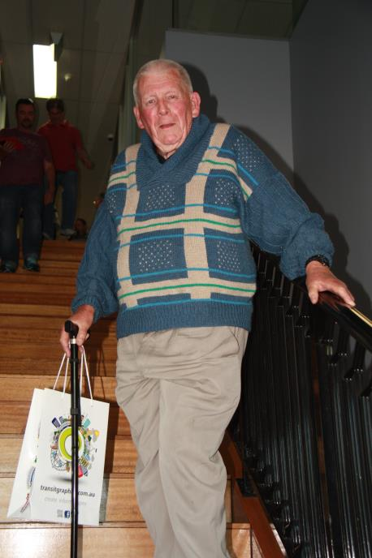
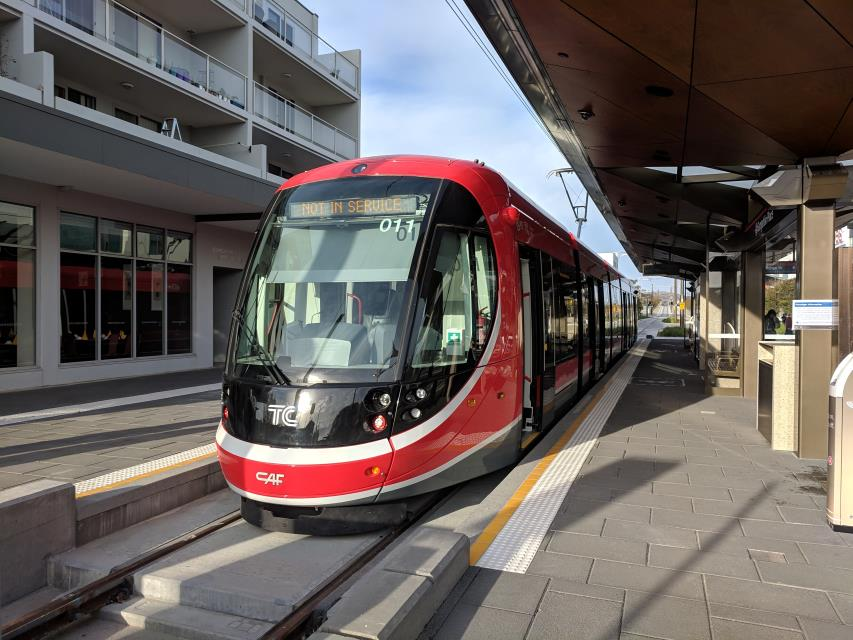
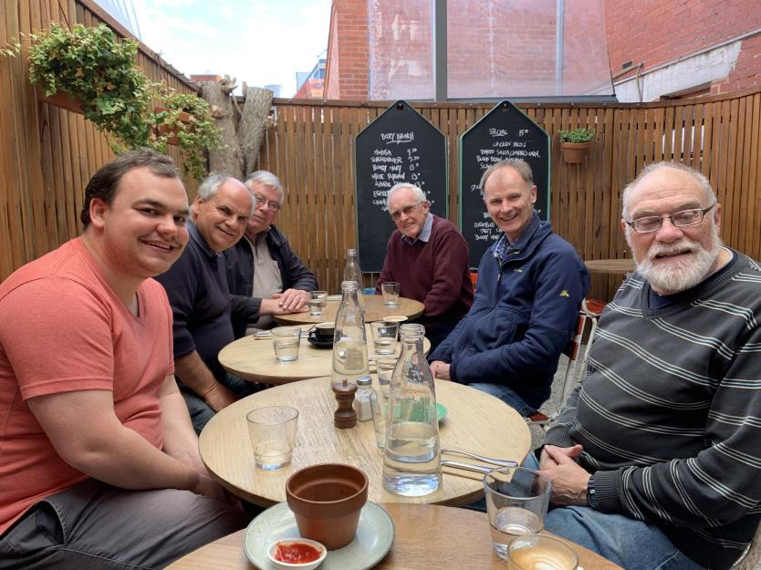

Here is member's news for the 2019. Other years member news may be
found at:

* [2021](membnews.html)
* [2020](membnews2020.html)
* 2019
* [2018](membnews2018.html)
* [2017](membnews2017.html)
* [2016](membnews2016.html)

Please note, links in member news are not maintained in general, they remain as a record of what was sent to members.

## December 2019

### Vale Tris Tottenham

Sadly Tris Tottenham passed away on Saturday 26th October at North Shore Private Hospital after a long battle with serious illness. He was 78. He had performed the roles of President, Treasurer and Magazine editor for the Sydney Bus Museum's predecessor, the Historic Commercial Vehicle Association. In his Facebook tribute, ATA member Paul Nicholson wrote “Tris was a colourful transport identity if ever there was one and was well known throughout Australia but especially in New South Wales. Many of us knew him affectionately as ‘Lord Totteringham’.” Often he would contribute news about the more obscure timetable changes and some outside our interests appreciated the affectionate and respectful title “Lord Totteringham”! I meet Tris at the ATA AGM at Queanbeyan in 2011. Len Regan took the above photo at the 2014 AGM in Canberra and I recall speaking to Tris at the 2017 AGM in Sydney. Among other things we spoke about his recent move to Hallidays
Point. Tris was a regular subscriber to the ATA Distribution List and last January offered a selection of airline timetables. Tris’s wife Kaye has offered his timetable collection to the ATA. On behalf of the ATA I wish to express our sympathy and condolences to Kaye and Tris’s family. Tris will be missed by many of us.

### ATA Auction

The Auction is one area of our work that often does not get the recognition it deserves. Rail Working Timetables are keenly sought after. It is exciting to hear that the auction attracts the interest of both older and younger members. Our thanks to Geoff Hassall, Len Regan and Robert Henderson for their work on the auction.

### Alan Gray Collection

On Monday 18th November a group of ATA members led by our Archives Officer, Len Regan, went to Alan Gray’s former home to sort and collect 600 kg of books and timetables. After making an assessment of the contents of the boxes, some items were forwarded to the Sydney Bus Museum, some will be used for the Distribution List and auction. The remaining boxes will be sent by courier to Melbourne where ATA would arrange storage for eventual sorting for the National Timetable Collection. There is no room for them at PMI. Our thanks to Denise, the very cooperative and supportive lady who is the manager of units where Alan lived, and who has acted in our interests to protect Alan’s collection.

### Report of the ATA Committee Meeting Wednesday 20 November 2019

Our meeting comprised the usual reception of reports on the work of the ATA. For the first four months of the 2019-2020 financial year, our bank balance has been in a healthy position due to the renewal of memberships. The distribution list and auction have been running at a surplus. Our work will be impacted by increased parcel post rates from 1 October 2019 and increases in basic postal rates in 2020. Three members did not renew their memberships and members Tim Fischer AC, Victor Isaacs and Tris Tottenham have passed away. We welcome Agnes Boskovitz has as a new member. Geoff Lambert will be looking after the Jim Fergusson collection replacing Victor Isaacs in this role. On our website there is list of printed bus timetables which is very much out of date. If members have lists of timetables which could be included on our website or are willing to assist with the updating of this information they can contact our webmaster Alex Sims, <webmaster@timetable.org.au>

### January Mail Out may be later than usual

Due to a possible printers’ holiday the January mail out could occur at least a week later than usual.

### 2020 AGM

The Sydney Division has set the date and time of the 2020 AGM as Saturday 15 August at 2pm at the School of Business at the University of Sydney. Our program on the day will include a ride on the newly opened light rail line from Circular Quay to Randwick, a short bus trip to the Souths Juniors Club (Kingsford tram terminus) and a trip by tram and bus to Sydney University after lunch for our AGM. Delegates could ride the Chatswood-Tallawong Metro at their leisure. Please put this date in your 2020 diaries.

-Hilaire Fraser, President

## November 2019

### Vale Victor Isaacs

We were very saddened by the passing of Victor Isaacs on 8th October 2019. Having our 2019 AGM in Canberra was Victor’s initiative so that we could combine it with a ride on Canberra’s new tram. Victor was a long-standing and hard-working member serving at various times as President, Vice-President and Secretary as well as "Table Talk" editor. “Table Talk” benefitted greatly due to Victor’s encyclopaedic knowledge of rail operations. He also contributed to “The Times” and in 2019 we have been enjoying his series of articles on Australian Rail Timetables. He was also a mainstay of the Canberra Division of the ATA. In his working life Victor had been a public servant spending some time in the Department of Prime Minister and Cabinet. He also belonged to the ACT division of the Australian Railway Historical Association where among other duties he served in the booking office at Queanbeyan Railway Station while the ARHS ACT division had a contract with NSW Trainlink. Victor also had an interest in newspapers, belonging to a newspaper history and interest group. In his travels he would purchase regional newspapers to satisfy this hobby. Victor would present talks at the University of the Third Age in transport and newspaper topics, amongst other things. Victor and his wife were keen travellers, both within Australia and overseas. Victor in particular was keen to ride on various train and tram networks. He visited Newcastle with Agnes only a couple of months ago to ride the local system and talk to the local U3A. Another feature of their travels would be in meeting up with relatives. Any tribute to Victor would be incomplete without reference to his wife Agnes. Agnes encouraged Victor’s interests and was always a wonderful carer. On his passing Agnes described Victor as "My beloved husband, centre of my universe, rock of my life, and bringer of cheer to many." Victor will be very much missed in the ATA. He often provided wise counsel and encouragement. He also will be missed on a personal level by many of us as a valued friend. On behalf of ATA I wish to express our condolences and sympathy to Agnes, Victor’s brother Albert and their families. (Reprinted from 2018- 2019 Annual Report.)

### Updating ATA Website

On Friday 18^th^ October Len Regan, Andrew James, Alex Sims (by phone) and Hilaire Fraser meet with Damiane Muller and Kyle Hanley from transitgraphics in Canberra seeking an update of our website. We are looking at improving the appearance of the website and making it more accessible so that the information on the website could be updated more regularly. We would like our website to convey the idea that our association may be worth joining, particularly among younger people. Some people have become members through our website. The possibility of updating our logo was also suggested. We appreciated the assistance Damiane and Kyle were able to provide. We thank John Mikita, Studio Director for arranging this meeting. We are looking forward to receiving a proposal from transitgraphics.

### ATA Annual General Meeting 19 October 2019, Canberra

Our Annual General Meeting programme started at 12 noon on Saturday 19 October, 2019 with a tram ride from Canberra City to Gungahlin. Twelve folk enjoyed lunch at Cherry Beans Café from which we could view arriving and departing trams. We returned by tram to the city and walked to the offices of transgraphics where we were welcomed by John Mikita, Studio Director. Our formal meeting was attended by five members from Melbourne, three from Canberra, three from Sydney and one from each of Newcastle and Wollongong. At the beginning of the meeting we remembered Victor Isaacs and his contribution to our organization. Victor’s wife Agnes Boskovitz, now a member, was welcomed. We were pleased Agnes could join us for the entire AGM programme. John Mikita was invited to address the meeting to detail the work of transitgraphics. Transitgraphics now produce timetables and guides for nearly all Australian Capital Cities. They now have the contract to produce new timetables and guides for the Tasmanian Department of State Growth Transport division. This covers Hobart, Launceston, Devonport, Burnie, intercity and regional services. Transitgraphics often is employed by bus companies to prepare network plans to assist them to provide a tender to operate a contract area.

Discussion prompted by the President’s report concerned the future of the ATA. Matters discussed included intergenerational change
when older members are no longer able to serve as office-bearers, committee
 members or assist the work of ATA. Members will need to come forward to take up roles which will keep the
ATA going. Also discussed was the possibility of greater use of electronic distribution for our mail-out. Here we need to weigh up the economies of scale for posting and printing in bulk as against smaller print runs and
 postal dispatch.

The results of the Election of Office Bearers at the AGM for 2019-2020 were:- Hilaire Fraser (President), Geoff Lambert (Vice President), Richard May (Secretary), Len Regan (Treasurer), Geoff Hassall, Chris Pandilovski, Andrew James, Alex Sims and Steven Haby as Ordinary Committee Members. We welcome Richard who has experience in management and Andrew a train controller with Metro Melbourne to our committee.

The Brisbane Division declined the invitation to host the 2020 AGM in favour of Sydney, thus the Sydney Division was invited to host the 2020 AGM. Initial arrangements for the Sydney meeting include a ride the newly opened light rail line from Circular Quay to Randwick, a short bus trip to the Souths Juniors Club (Kingsford tram terminus) and a trip by tram and bus to Sydney University after lunch for our AGM. Delegates could ride the Chatswood-Tallawong Metro at their leisure.

Following the AGM the new committee was able to make the following appointments for 2019-2020:-
*Times* Editor:- Geoff Lambert, Interim *Table Talk* Editor:- Chris Pandilovski., *Table Talk* Bus Editor:- Steven Haby, Production Manager:- Geoff Lambert, Auctioneer:- Geoff Hassall, Archives Officer:- Len Regan, Webmaster:- Alex Sims, Social Media Officer:- Paul Brown, Distribution Manager:- Hilaire Fraser and Membership Officer:- Len Regan. Our thanks to Steven Haby who has offered to edit the November *Table Talk*. Chris will take over from the December edition.

ATA thanks John Makita and the team at transitgraphics for hosting the 2019 AGM and Kyle Hanley for a ride in his ex-Newcastle bus 2619 after the meeting. A map showing the route taken in the bus is on page 16 of *Table Talk* November 2019. We also thank Geoff Hassall who was acting secretary in the absence of Geoff Lambert.

-Hilaire Fraser, President

## October 2019

### ATA Annual General Meeting 19 October 2019, Canberra

The 2019 ATA Annual General Meeting will be hosted by the Canberra Division and will be held on Saturday 19 October at 2pm in the offices of [TransitGraphics](https://www.google.com/maps/place/Transit+Graphics/@-35.274808,149.1253197,17z/data=!3m1!4b1!4m5!3m4!1s0x345eee03ba77bf:0x8e9030a83ada22b9!8m2!3d-35.274808!4d149.127503) Suite 3, Level 1, 11 McKay Lane, Turner ACT 2612. We thank TransitGraphics for their provision of the AGM venue. This location is near the city centre. Already many people have shown interest in attending the AGM. Members, families and friends are invited to the pre-meeting activities which will commence with the 12 noon Light Rail departure from Alinga St Canberra City to Gungahlin. Participants are requested to be at the [Alinga St](https://www.google.com/maps/place/Alinga+St,+Canberra+ACT+2601/@-35.2782991,149.1262771,17z/data=!3m1!4b1!4m5!3m4!1s0x6b164d680b663907:0x95a50cffbec97392!8m2!3d-35.2783072!4d149.128529) stop by 11.55am. Single and Daily Cash Tickets are available from ticket vending machines on the platform. Canberra’s electronic fare card, MyWay is also available from various outlets. Information is found on [transport.act.gov.au](transport.act.gov.au). We will enjoy lunch at a café in Gungahlin and return by tram to Canberra City in time for the meeting. No doubt AGM participants will be able to obtain a variety of transport guides and timetables from TransitGraphics. Further information including nomination and proxy forms were contained in the September mail-out. At the AGM there will be elections for the positions of President, Vice President, Secretary, Treasurer and Committee members. Please give some thought as to whether you are prepared to nominate for one of these positions.

### Future of ATA

Although we have had some new and younger members join ATA recently our future becomes uncertain when older members are no longer able to serve as office-bearers, committee members or assist the work of ATA. The difficulty for ATA is compounded by the steep learning curve for some of the “working positions”. Also by the recent changes to legislation and banking laws/rules that constrain an organisation like ours from making and implementing snap decisions on management. For something like Production Management, it should be in the State with the largest number of members because postal rates are cheaper if the mail-out is send from that state. It seems that the state with the most number of members is shifting back towards VIC from NSW. Our Facebook posts can be seen by over 200 people who are happy to view them without seeking membership.
Members need to come forward to take up roles which will keep the ATA going.

## 100^th^ Working Session on National Timetable Collection

On September 5^th^ the 100^th^ Working Session on the National Collection was held at the Prahran Mechanics’ Institute. This was certainly a milestone. Pictured below from left to right are participants and visitors Lachlan Fraser, Hilaire Fraser, Michael Marshall, Len Regan, Richard May and David Hennell. Photograph taken by Nerelle Fraser.

-Hilaire Fraser, President

## September 2019

### ATA Annual General Meeting 19 October 2019, Canberra

The 2019 ATA Annual General Meeting will be hosted by the Canberra Division and will be held on Saturday 19 October at 2pm in the offices of [TransitGraphics](https://www.google.com/maps/place/Transit+Graphics/@-35.2748036,149.1253143,17z/data=!3m1!4b1!4m5!3m4!1s0x345eee03ba77bf:0x8e9030a83ada22b9!8m2!3d-35.274808!4d149.127503) Suite 3, Level 1, 11 McKay Lane, Turner ACT 2612. We thank TransitGraphics for their provision of the AGM venue. This location is near the city centre. Already many people have shown interest in attending the AGM. Members, families and friends are invited to the pre-meeting activities which will commence with the 12 noon Light Rail departure from [Alinga St Canberra City](https://www.google.com/maps/place/Alinga+St,+Canberra+ACT+2601/@-35.2782947,149.1262717,17z/data=!3m1!4b1!4m5!3m4!1s0x6b164d680b663907:0x95a50cffbec97392!8m2!3d-35.2782991!4d149.1284604) to [Gungahlin](https://www.google.com/maps/place/Gungahlin+ACT+2912/@-35.1712248,149.1183228,14z/data=!4m5!3m4!1s0x6b1654b7fbf65f0f:0x500ea6ea76957c0!8m2!3d-35.1831!4d149.133). Participants are requested to be at the Alinga St stop by 11.55am. Single and Daily Cash Tickets are available from ticket vending machines on the platform. Canberra’s electronic fare card, MyWay is also available from various outlets. Information is found on [transport.act.gov.au](transport.act.gov.au). We will enjoy lunch at a café in Gungahlin and return by tram to Canberra City in time for the meeting. No doubt AGM participants will be able to obtain a variety of transport guides and timetables from TransitGraphics. Further information including nomination and proxy forms are contained in the September mail-out. At the AGM there will be elections for the positions of President, Vice President, Secretary, Treasurer and Committee members. Please give some thought as to whether you are prepared to nominate for one of these positions. Anyone who wishes to picked up from [Canberra Railway Station](https://www.google.com/maps/place/Canberra+Railway+Station/@-35.319384,149.1471696,17z/data=!3m1!4b1!4m5!3m4!1s0x6b164cfe83c0da7f:0xf1d77febc545d6d7!8m2!3d-35.3193884!4d149.1493583) should contact [Victor Isaacs](mailto:'Victor%20Isaacs%20and%20Agnes%20Boskovitz'%20%3cabvi@iinet.net.au%3e).

### Vale Tim Fischer AC

On August 22 Tim Fischer passed away following a battle with cancer. The media have presented many fine tributes to Tim and the ATA heartily endorses these. Here I will outline his connection with the ATA. Tim became an ATA member in 2012. He had been working on “Australian Timetables at Their Peak”, a joint project with ATA. 1939 had been agreed as the peak year and Tim was interested in concentrating on idiosyncratic and vanished services. He enjoyed reading our journals and was very supportive of the ATA. He contributed occasional articles to The Times. We were always happy to promote his books. Some saw Tim as our nation’s chief train enthusiast. On behalf of ATA, I offer our condolences to his wife Judy and their sons Dominic and Harrison and their wider family and friends.

### Vale Howard Quinlan

A Memorial Service was held in August for Howard and Valerie Quinlan at All Souls Anglican Church, Ainslie, Canberra. Howard wrote a book on Australian Railway Routes listing lengths and opening and closing dates of all lines, an important publication for railway historians. Howard, although not an ATA member, was known to many Canberra members. Howard’s wife Valerie passed away shortly after Howard’s death. On behalf of ATA, I offer our condolences to Howard and Valerie’s family and friends.

### Report of the ATA Committee Meeting Wednesday 21 August 2019

For the financial year concluded on 30 June, ATA made an accrual surplus of $1096. Membership fees do not completely cover the mail-out costs, the website, National Timetable Collection and other expenses. Auction and Distribution Service surpluses help to pay these expenses and bring our finances into the black. Our thanks to our Treasurer, Len Regan for his work and our auditor, Jim Wells, for his helpful assistance.

We welcome new members Peter Dempster from Epping NSW, Peter Kilburn from Junee NSW, Nick Hiscock from Hampton East Victoria, Aljosa Veljovic from Hampton Victoria and Andrew Woods from Torquay Victoria. There are now 136 ATA Members, a net increase of 2 since May. TransitGraphics have updated and printed our information and membership brochure at no charge to ATA. Our thanks to John Mikita at TransitGraphics.

Work has continued on the National Timetable Collection at Prahran. Donations of timetables (detailed overleaf) will occupy the time of our NTC team for some time to come. The State Library of Victoria User Organisations Council (SLUOC) ‘On Time’ seminar on the National Timetable Collection on 3 August 2019 was successful, with very good presentations and about 30 attendees. The PowerPoint presentations as PDF files are included in the September 2019 Distribution List. These are distributed free of charge and are well recommended. Plans were made for our AGM. Our next committee meeting will be held on 20 November.

### Donation of 327 NSWR Working Timetables

Our thanks to Ben Lewis who has donated 327 working timetables from 1919 to 1959. These are A4 spiral- bound print copies of scans of the original documents. They have been transported to Prahran and are being sorted by Andrew James.

### Donation of Timetables from former ARHS ACT Library

We thank the former ARHS ACT for the offer of timetables which were contained in its library. Of interest are many Working Timetables and public timetables from around Australia and overseas. Once any gap is filled in the National Timetable Collection these items will go to auction. Once these timetables are sold, a donation to the ARHS ACT successor, the Canberra Railway Museum will be made. We thank Victor Isaacs for receiving this collection and sending it to the PMI.

### Alan Gray Collection

Alan Gray has bequeathed his timetable collection to ATA. Len Regan and Geoff Hassall have made a trip to
Alan’s apartment to appraise the collection.
They were helped greatly by Denise, who lives in a unit below Alan’s, and is the maintenance manager of the 8-unit apartment block. We thank Denise for her assistance.
Alan’s collection is vast. It is all well organised, bundled, and labelled where necessary and some of it is already packed in boxes. The timetables are predominantly buses from Sydney, outer metropolitan regions and country areas in NSW. But there are also bundles of bus timetables from the metropolitan and country areas of the other States and New Zealand. Other items in the collection include train timetables from around Australia and from the UK. We now must wait until probate of Alan’s will is granted before ATA can take possession. There is not enough room at Prahran to accept this amount of material in the short term, so self- storage may have to be considered.

### Donation from Jim Fergusson

We thank UK member Jim Fergusson for his donation to the ATA. Altogether we have 5 volumes of NSWR WTTs dated as follows:-
25 Oct 1925: Main Suburban, Illawarra Northern Western 3 Nov 1935: Southern

-Hilaire Fraser, President

## August 2019

### ATA Annual General Meeting

The 2019 ATA Annual General Meeting will be hosted by the Canberra Division and will be held on Saturday 19 October at 2pm in the offices of [Transit Graphics](https://www.google.com/maps/place/Transit+Graphics/@-35.274808,149.125309,17z/data=!3m1!4b1!4m5!3m4!1s0x345eee03ba77bf:0x8e9030a83ada22b9!8m2!3d-35.274808!4d149.127503), Turner, ACT. Rides on the new -[light rail](https://www.transport.act.gov.au/about-us/public-transport-options/light-rail) system and inspections of the [National Library of Australia](https://www.google.com/maps/place/National+Library+of+Australia/@-35.2966239,149.1276278,17z/data=!3m1!4b1!4m5!3m4!1s0x6b164d17a74ac511:0x699681870a900677!8m2!3d-35.2966239!4d149.1298218) are being arranged as pre-meeting activities. At the AGM there will be elections for the positions of President, Vice President, Secretary, Treasurer and Committee Members. Please give some thought as to whether you are prepared to nominate for one of these positions. The next committee meeting is set for August 21.

### Vale Alan Gray

Alan Gray, formerly of Long Jetty, a long-standing member of the AATTC/ATA passed away on Friday 28
June. Alan became known to me through his regular Distribution Service orders. As well as train timetables he had a particular interest in bus timetables including the historic timetables supplied by Frank Goldthorpe. Our records show that Alan would have joined the AATTC/ATA during the 1980s. Alan was an important contributor of Bus news to Table Talk for a long time. At our 2017 Annual General Meeting Alan offered his services to the ATA. He was willing to undertake a steep learning curve in word processing, the operation of a database and using Skype to assist the work of the ATA. He was very much involved in preparing the ATA auction and handling auction items as well as the compilation of lists of timetables for the ATA website. Before his retirement Alan had worked as a bus driver at State Transit’s [Brookvale Bus Depot](https://www.google.com/maps/place/Brookvale+Bus+Depot/@-33.7666019,151.2675494,17z/data=!3m1!4b1!4m5!3m4!1s0x6b12aa5c999ee749:0xbf4e6498778ec991!8m2!3d-33.7666019!4d151.2697434). Alan’s nickname at work was “Mother Gray” because he was known to constantly offer advice on the proper handling of the buses! Alan’s solicitor has confirmed that Alan’s entire collection of timetables and related material is bequeathed to ATA, and the family has accepted our offer to collect it, once probate is granted. On behalf on the ATA I wish to offer our condolences to Alan’s brother David, his wife and niece Leonie. We also thank Alan’s neighbour Denise who has staunchly supported us out of respect for Alan’s passionate interests.

-Hilaire Fraser, President

## July 2019

### A Seminar Featuring the National Timetable Collection

The [State Library of Victoria](https://www.slv.vic.gov.au/) (SLV) User Organisations’ Council will hold a seminar entitled “On Time” at
the [Prahran Mechanics Institute](https://www.google.com/maps/place/Prahran+Mechanics'+Institute+Victorian+History+Library/@-37.8497957,144.9894703,17z/data=!3m1!4b1!4m5!3m4!1s0x6ad6683ae6b4e1b9:0xe5a3cc5f53ac51d9!8m2!3d-37.8498!4d144.991659) (PMI) at 1.15 pm, Saturday 3 August 2019. The seminar has been inspired
by the [National Timetable Collection](https://www.timetable.org.au/) (NTC), which SLV regards as being unique in that it is a large
comprehensive collection on a specific topic. Papers will be presented by ATA members Steven Haby
(Welcome), Len Regan (NTC), Andrew James (Digitised timetables), John Mikita (Timetable Design) and
David Hennell (“Oddities”). Papers will also be presented by Donald Barker (ARHS) and Peter Pereyra
(historical research). ATA members and visitors will be very welcome. A brochure for this seminar was
included in your June mail-out.

### ATA Annual General Meeting

The 2019 ATA Annual General Meeting will be hosted by the Canberra Division and will be held on Saturday 19 October at 2pm in the offices of [Transit Graphics](https://www.google.com/maps/place/Transit+Graphics/@-35.2748036,149.1253143,17z/data=!3m1!4b1!4m5!3m4!1s0x345eee03ba77bf:0x8e9030a83ada22b9!8m2!3d-35.274808!4d149.127503) in the centre of Canberra. Rides on the new light rail system and inspections of the [National Library](https://www.google.com/maps/place/National+Library+of+Australia/@-35.2966195,149.1276331,17z/data=!3m1!4b1!4m5!3m4!1s0x6b164d17a74ac511:0x699681870a900677!8m2!3d-35.2966239!4d149.1298218) are being arranged as pre-meeting activities. The next committee meeting is set for August 21.

### Metro/Train versus Bus

By now many members will have ridden the new North West Metro in Sydney. A Metro trip leaving Rouse
Hill at 7.12am will connect with a Sydney Trains service at Chatswood to arrive Wynyard at 8.07am, journey
time 55 minutes cost $6.89. A 607X bus will leave Rouse Hill at 7.10am and is due to arrive at Wynyard at
8.33am, journey time 1 hour 23 minutes, cost $4.80. The above Metro service departs Castle Hill at 7.25am
also reaching Wynyard with the Sydney Trains connection at 8.07am, journey time 42 minutes, cost $5.15. A
610X bus will leave Rouse Hill at 7.28am and is due to arrive at Wynyard at 8.35am, journey time 1 hour 7
minutes, cost $4.80.

> -Hilaire Fraser, President

## June 2019

### 2019-2020 Membership Renewal

You will have received your 2019-2020 membership renewal with the May mail-out or by email. If you have not already done so, please renew your membership promptly to ensure that you continue to receive ATA journals and mail-outs in the new financial year.

### Report of the ATA Committee Meeting Wednesday 15 May 2019

Financially, the ATA continues to perform well. There has been some reduction in expenditure and we
expect to break even at the end of the financial year. We welcome new member Ivan Ploskonka, and Robert
Daniel and Chris Zucker who reactivated their memberships. Work continues on the sorting and cataloguing
of the National Timetable Collection at [Prahran Mechanics’ Institute](https://www.google.com/maps/place/Prahran+Mechanics'+Institute+Victorian+History+Library/@-37.8497957,144.9894703,17z/data=!3m1!4b1!4m5!3m4!1s0x6ad6683ae6b4e1b9:0xe5a3cc5f53ac51d9!8m2!3d-37.8498!4d144.991659). In the next batch, 2,834 timetables will
be deposited with the State Library. This will bring the total number of timetables deposited to 3,145.The
State Library User Organisation Council will hold a seminar on Saturday 3rd August 2019 at 1.15pm devoted
to the National Timetable Collection, which the State Library of Victoria regards as being unique, in that it is
a large comprehensive collection on a specific topic. ATA members Steven Haby, Len Regan, Andrew
James, John Mikita and David Hennell are to be presenters. ATA members will be very welcome and a
brochure has been included in the June Mail-Out. The ATA information and membership brochure will be
updated for this occasion and following events.
The 2019 ATA Annual General Meeting will be hosted by the Canberra Division and will be held on Saturday 19 October at 2pm in the offices of [Transit Graphics](https://www.google.com/maps/place/Transit+Graphics/@-35.2748036,149.1253143,17z/data=!3m1!4b1!4m5!3m4!1s0x345eee03ba77bf:0x8e9030a83ada22b9!8m2!3d-35.274808!4d149.127503) in
the centre of Canberra. Rides on the new light rail system and inspections of the National Library of Australia are being arranged as pre-meeting activities. The next committee meeting is set for August 21.

> Hilaire Fraser, President

## May 2019

## 2019-2020 Membership Renewal

You will have received your 2019-2020 membership renewal via a separate e-mail from the Membership Officer. A non-personalised renewal form can be found [HERE](https://www.timetable.org.au/renew.html). Our 2019-2020 Membership Fees are unchanged, that is $60.00 for a normal membership. Please renew your membership promptly to ensure that you continue to receive ATA journals and mail-outs.

### 2019 Annual General Meeting

The 2019 ATA Annual General Meeting will be hosted by the Canberra Division and will be held on Saturday 19 October at 2pm in the offices of [Transit Graphics](https://www.google.com/maps/place/Transit+Graphics/@-35.2748036,149.125309,17z/data=!3m1!4b1!4m5!3m4!1s0x345eee03ba77bf:0x8e9030a83ada22b9!8m2!3d-35.274808!4d149.127503) in centre of Canberra. Rides on the new light rail system and inspections of the [National Library](https://www.google.com/maps/place/National+Library+of+Australia/@-35.2966195,149.1276278,17z/data=!3m1!4b1!4m5!3m4!1s0x6b164d17a74ac511:0x699681870a900677!8m2!3d-35.2966239!4d149.1298218) are being arranged as pre-meeting activities.

### Distribution List Report

The Distribution List continues to perform well with about twenty orders each month. The April List received eight orders for the set of three recent Rover Coaches, Cessnock timetables. Sydney Trains Working Timetables are also popular. The May List will contain sets of recent Red Bus, The Entrance timetables as well as Port Stephens Coaches, Ballina and Lismore bus timetables. Also included is the [Transport Canberra Holiday Bus Timetable](https://www.transport.act.gov.au/getting-around/timetables/holiday-services-2018) booklet which was effective from 24 December 2018 to Friday 11 January and a fascinating set of nine guides to walking and cycling in Canberra. We thank [Rover Coaches](https://www.rovercoaches.com.au/site/bus-timetables) and [Transit Graphics](https://transitgraphics.com.au/) for the supply of these timetables and guides.

> Hilaire Fraser, President

## April 2019

### Scans of South African Railway Timetables

Member Tony McIlwain has drawn our attention to a [fascinating new website](https://grant.dev.openstreetmap.org/sar-time-tables/) which contains reproductions of old South African railway timetables. Timetables included are Cape Government Railways Midland System (based on Port Elizabeth) Working Timetable 1882, South African Railways Public Timetable 1949 (a very big document!), SAR Public TT 1987, SAR colourful front covers of Public TTs 1949 to 1987. Timetables include connecting trains to South West Africa, Bechuanaland, Southern Rhodesia, Northern Rhodesia, Belgian Congo and Portuguese East Africa. We promote this website with the permission of Grant Slater, the compiler of the site, and acknowledge his work. Grant states that more timetables will be added.

SAR timetables may prompt the writing of an article or series of articles for “The Times”.
Access to these
The timetables are fascinating social and political documents as well as a listing of train times.

> Hilaire Fraser, President

### Rail and Tram Books offered for Sale by Tender

Included are some rare and “collectable” books, the earliest of which was published in 1935-36, and some reference books dating back to 1952. A few have inscriptions or other minor markings. For a detailed list and information on this sale by tender, please [email](mailto:dale.budd@dbas.com.au) or write to Dale Budd, PO Box 7104, Yarralumla ACT 2600.

## March 2019

## Report of the ATA Committee Meeting Wednesday 20 February 2019

It is very pleasing that financially the ATA continues to perform well. Our balance sheets are similar to the
same time last year with some additional reduction in expenditure. 2019-2020 membership fees will not
increase and will remain unchanged, that is sixty dollars for a normal membership. We welcome new
member Domenic Haby and Flynn Hogan who has reactivated his membership after a time overseas. Steven
Haby's contribution to "Table Talk" is very much appreciated. In the February edition, the bus news was
bigger that the rail news and four colour pages better displayed aspects of bus news. In the auction rail timetables continue to be popular while bus timetables get little interest. Work continues on the sorting and
cataloguing the National Timetable Collection at Prahran Mechanics' Institute. The State Library User Organisation Council will hold a seminar on Saturday 3 August 2019 at 1.15pm on the National Timetable Collection, which the State Library of Victoria regards as being unique in that it is a large comprehension collection on a specific item. ATA members Steven Haby, Len Regan Andrew James, John Mikita and David Hennell are to be presenters. ATA members will be very welcome. Saturday October 19 was set as the date for the Annual General Meeting. This year's meeting will be held in Canberra and provide the opportunity for delegates to ride the Gungahlin light rail line due to open in late March or April. The meeting venue will be the offices of TransitGraphics close to the city centre. The next committee meeting is set for May 15.

> Hilaire Fraser, President

## February 2019

### Network Changes

With Sydney Buses Eastern Network changes effective 2nd December 2018 services operating from Sydney CBD as 301 Eastgardens via Eastlakes, 302 Eastgardens via West Kensington and 303 Sans Souci via West Kensington & Eastlakes commenced and terminated at Redfern Station. Surry Hills was now served by new 304 Circular Quay to Rosebery. Similarly 310 Railway Square-Eastgardens via East Botany was replaced by 307 Mascot Station-Port Botany via East Botany & Eastgardens. Thus some suburban services are operating as rail feeders rather than running through to the city. With Adelaide Metro Changes effective 27 January 2019 route 224 City-Elizabeth via Salisbury Highway is now mainly a feeder service Mawson Lakes Station-Elizabeth and route 750 Colonnades-Sellicks Beach is now mainly a feeder service to Seaford Station- Sellicks Beach. The Colonnades is the major shopping centre in the Noarlunga region south of Adelaide and now these two longer services act as feeders to a nearby station. If current through bus services from the Sydney CBD to the Hills District operate as feeders to the new Sydney North-West Metro from mid-2019, a journey to the city would involve both a bus/Metro and a Metro/Sydney Trains change. The creation of Sydney 304 mentioned above demonstrates another Sydney network development, simplifying the network, in this case 301/2/3 have been replaced by 304 through Surry Hills. On 23rd September 2018, services along Sydney’s Bondi Rd between Bondi Jct and Bondi Beach were simplified with 333 380 381 382 slimmed down to 333 and 380 although 381 still operates down Bondi Rd to Tamarama, rather than Bondi Beach. Thus 361 Bondi Jct-Tamarama via Birrell St was withdrawn leaving only one route on Birrell St namely 360 Bondi Jct-North Clovelly. Thus redirecting buses to train stations and simplification of the network are two interesting developments of interest to analysts of timetables.

> Hilaire Fraser, President

## January 2019

### The Year Ahead

2019 promises to be a very interesting year for those of us interested in transport infrastructure. Canberra will have a new light rail line 12 kilometres in length from the City Centre to Gungahlin. This line is due to open early in 2019, if not before, on April 27 when a new complementary bus network will be in place. This new network will comprise ten high frequency rapid routes, including the light rail line, compared with four rapid routes at present. The 2019 ATA AGM will be held in Canberra and AGM delegates will be able to ride the new line. Newcastle in due to have a light rail line 2.7 kilometres in length set to open in early 2019. This line will operate from Newcastle Interchange at Wickham to Newcastle Beach. This line will have batteries which will be recharged at each stop rather than overhead powerlines. Some bus routes will be cut back to feed the light rail vehicles at Newcastle Interchange. As early as May the new Sydney Metro Line from Chatswood to Rouse Hill (Tallawong) could open. This line will comprise 19 kilometres of new railway from Epping to Tallawong and conversion of the existing Epping Chatswood Rail Link to automated metro operation. At the time of opening metro train will feed the existing Northern Line at Epping and North Shore Line at Chatswood. With present planning this metro line will be extended under Sydney Harbour into the Sydney CBD and beyond to incorporate the existing Bankstown Line. A new bus network will commence at the time of operation of the new line. I would like to see routes numbered with a NW prefix say NW1 to NW30 to give the new network its own identity. At the ATA Committee Meeting in November 2018, we
decided to change the domain name in all the ‘official’ email addresses from @austta.org.au to
@timetable.org.au. For example I can be contacted at president@timetable.org.au. Any emails that still use
austta will be redirected to the new domain name.

> Hilaire Fraser, President
