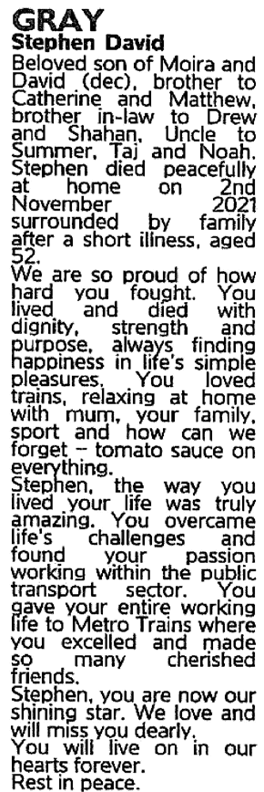
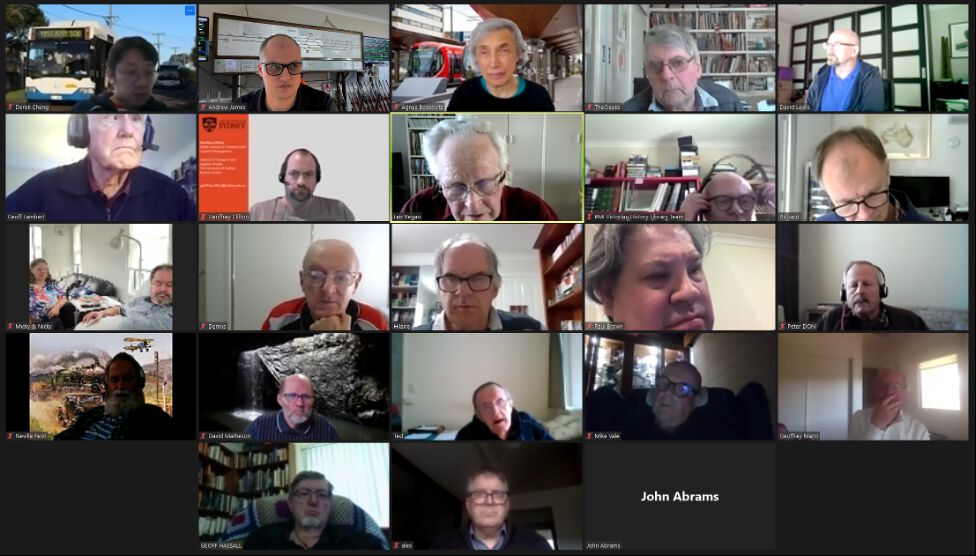

Here is member's news for 2021.
Other years member news may be
found at:

* [2023](membnews.html)
* [2022](membnews2022.html)
* 2021
* [2020](membnews2020.html)
* [2019](membnews2019.html)
* [2018](membnews2018.html)
* [2017](membnews2017.html)
* [2016](membnews2016.html)

Please note, links in member news are not maintained in general, they remain as a record of what was sent to members.

## December 2021

### Vale Stephen Gray

{maxwidth="100%"}

We were saddened to hear of the passing of our friend Stephen Gray on 2nd November. Attached is the death notice for Stephen Gray that was in The Age on Wednesday 3 November 2021. It is such a lovely and touching notice.

Stephen joined The Met 'Rail Division' around 1988, as a Messenger in the Timetables Section. His main role was to deliver copies of Train Running Circulars to other CBD Offices, Metrol Building (Batman Ave), and Flinders St Yard, (Drivers & Guards Rosters, Fleet Allocation). It is understood that he had spent some time previously there under the "Work Experience" Program. He continued in this situation through all of the name changes, e.g. Bayside Trains, Hillside Trains, Connex, National Express (MTrain) & Metro Trains.

With the change to Electronic Distribution of such documents at the start of the 2000’s, Stephen developed the skill to prepare Route Maps (with a CAD type package) for Bus Drivers operating Rail Replacement Services.

He was a renowned Collector of Bus, Rail & Tram Timetables, and spent much leisure time travelling on all Melbourne Bus Routes, (including late-night and Night-rider). Much time was spent at the former ‘Met Shops’ collecting timetables, including extra copies for some of his Collector friends.

He regularly attended ATA Sydney Meetings, travelling from Melbourne by XPT, or the cheaper Interstate Overnight Coaches. He would return back with a copious supply of goodies from the Grab Table.

For much of his early working life, Stephen commuted into the City from Doncaster by bus, and with his friendly outlook was warmly
regarded by many of the Drivers from Doncaster Depot. Similarly, he was well-liked by his many work colleagues.

David Hennell, Geoff Mann and Len Regan visited Moira Gray (Stephen’s mother) and on behalf of ATA, gave her a fuchsia plant in a pot as a growing and lasting remembrance of Stephen’s infectious spirit of happiness, endurance and perseverance. Moira plans to deposit Stephen’s ashes under the fuchsia. The following message was written on a sympathy card. "Moira. Stephen was a much loved member of the Australian Timetable Association and the group working in Melbourne on the National Timetable Collection. We thoroughly enjoyed his company and were inspired by the dedication and enjoyment he displayed in sorting and studying timetables. His smile was always there, even when we now know that he had a serious illness. We will miss him greatly, but his determination and his spirit will live on within all of us". Stephen has donated his "crates" of timetables to ATA.

Thanks to Graeme Cleak and Len Regan for their assistance in preparing this tribute.

### Report on ATA Committee Meeting Wednesday 17 November 2021

The ATA Committee met on Wednesday 17 November 2021. ATA member Agnes Boskovitz was able to organize a meeting by Zoom. Our thanks to Agnes. Below under various headings are details of matters dealt with at the recent meeting.

### Treasurer’s Report

Income for the period July to October 2021 was $8905, expenses were $6529, giving an accrual surplus of $2375, compared with $3711 twelve months ago. The main source of income in this period was the renewal of membership fees for 2021-22.
The ATA Committee resolved to create the position of Assistant Treasurer and appoint Jim Wells to this position. Jim will be a great asset to ATA as Assistant Treasurer and also free Len Regan to spend more time on the National Timetable Collection

### Stephen Gray Memorial Distribution List

The ATA Committee resolved to name the Distribution List the Stephen Gray Memorial Distribution List in honour of Stephen’s contributions to ATA particularly as a Distribution List contributor and subscriber.
Recent lists have attracted 17 to 25 orders. Working timetables and track and signal diagrams continue to be popular. Recent PDF timetables are listed. These are also provided to ATA archives.

### Production and Mail Out

As we no longer have access to the printer at the Prahran Mechanics’ Institute as Stephen Haby no longer works there, our magazines, newsletter, auction catalogue and distribution list will be printed by members for six months after which we hope to have sufficient savings to purchase our own printer. Unfortunately, our mail out will only appear in A4 black and white until colour and A3 can be reintroduced on our own printer. The electronic mail out will continue to maintain colour items.

### Other News

“Table Talk” continues to maintain its extensive coverage of transport and timetable news. Articles continue to be written for “the Times”. The Brisbane Division has continued to meet in person and the Canberra Division on Zoom. The Melbourne Division met on November 3 and examined the 2008 Frankston Bus Service Review, which like many of these, was not implemented. Len Regan, Steven Haby and Matthew Gibbins hope to relaunch our delayed website development.

Hilaire Fraser, <president@timetable.org.au> 0409 463 209

## November 2021

### Hawker Relocation

The COVID-19 restrictions in Melbourne have given a short reprieve for the need to relocate the NTC and ATA archives. The move can now take place outside lockdown conditions sometime during November 2021. We have made numerous inquiries about suitable new premises, including local council facilities, scout halls, church halls and vacant commercial premises at an affordable rent. There are a few possible locations, but nothing ideally suitable yet. We have pursued the case for leasing the vacant building at Windsor Station, including an interview on ABC Melbourne radio on 12 October 2021 followed by strong support from the local member Sam Hibbins MP. Metro Trains Melbourne has been unable to obtain a commercial lease for this heritage-listed building, so it makes sense to allow a heritage group like ATA to use it with a community lease. With the easing of Covid restrictions members were able to resume work at Hawker from Saturday 23 October. Any member who knows of possible suitable premises for the National Timetable Collection should contact Richard May, ATA Secretary, urgently on 0438 364 568.

### The Times They Are a-Changin’

On Wednesday October 13, the first of the four “Freshwater” class ferries “Queenscliff” was retired The “Freshwater” class have served Sydney for four decades. The traditional timetable allowed for departures from Circular Quay on the hour and half-hour and Manly at quarter past and quarter to the hour. The journey time was thirty minutes and with a turnaround at each end of fifteen minutes the round trip took ninety minutes, and the timetable was fulfilled by three ferries with a spare. The new hybrid timetable effective October 9 is provided by two “Freshwater” class ferries with departures from Circular Quay at five past the hour and Manly at twenty to the hour. Thus, with a thirty-minute journey time, a five-minute turnaround at Manly and a fifty-five-minute turnaround at Circular Quay, the round trip takes two hours. Two smaller “Emerald” class ferries will provide departures from Circular Quay on the half-hour and ten minutes to the hour and departures from Manly on the hour and twenty past the hour. The journey time is twenty-two minutes and with a turnaround at each end of eight minutes the round trip takes sixty minutes. Later the “Narrabeen” will be retired leaving one “Freshwater” class on the timetable as a supplementary service. This will occur when the delayed arrival of the first of three new “Emerald” class ferries occurs. Three “Emerald" class ferries alone can provide a twenty-minute service between Circular Quay and Manly.

## October 2021

### ATA Annual General Meeting 18 September 2021 by Zoom

{style="max-width:100%;"}(Photo: Andrew James)

Our 2021 Annual General Meeting commenced shortly after 2pm on Saturday 18 September 2021 by Zoom. Our meeting was attended by eight members from Victoria, thirteen from New South Wales, two from Adelaide and Canberra, and one from Brisbane.

Efforts to obtain a Community Lease for the vacant building at Windsor Station, Melbourne to provide storage and a work area for the National Timetable Collection have proven futile with ATA being taken from Metro Trains to VicTrack and back to Metro Trains. In April the NTC and ATA archives were moved to new premises. Our lease on these premises expires this month and ATA will have to move by October 24. Our application to the Public Record Office Victoria for a Local History Grant was unsuccessful. This was particularly disappointing as ATA had carefully followed the guidelines.

ATA finances showed a deficit of $2,279. Distribution List revenue had declined, monthly mail-out costs had increased, and rent was a major expense of $2,543. Due to continuing development and capital expenses, another deficit of up to $5000 could be expected.

Member David Lewis outlined the Getabout Australia Project detailing timetables. Past President’s Victor Isaacs Train Times Australia and New Zealand is now on ATA’s website. ATA members may be able to avoid duplication of effort in linking the development of the Getabout Australia with the updating of Train Times.

The AGM resolved that there be up to eight ordinary committee members. The results of the Election of Office Bearers at the AGM for 2021-2022 were: - Hilaire Fraser (President), Steven Haby  (Vice President), Richard May (Secretary), Len Regan (Treasurer), Chris Pandilovski, Andrew James, Alex Sims, Geoff Lambert, Derek Cheng, Matthew Gibbins and Michael Vale (Ordinary Committee Members). Geoff Lambert was thanked for his service to ATA as president, vice-president, and secretary. Geoff Lambert continues to serve as a committee member. Geoff Hassall was thanked for his service to ATA as committee member and auctioneer. Derek Cheng, Matthew Gibbins, and Michael Vale were welcomed to the committee.

The most controversial matter considered was the location of the 2022 (39^th^) AGM, and the Sydney Division was invited to host the 2022 AGM, as a proposal to invite the Melbourne Division was not acceptable. Members were looking forward to a Sydney visit, not possible in 2020 and 2021.

Following the AGM the new committee was able to make the following appointments for 2021-2022:- *Times* Editor:- Geoff Lambert, *Table Talk* Editor:- Chris Pandilovski., *Table Talk* Bus Editor:- Steven Haby, Production Manager:- Steven Haby, Auctioneer:- Matthew Gibbins, Archives Officer:- Len Regan, Webmaster:- Alex Sims, Distribution Manager:- Hilaire Fraser Membership Officer:- Len Regan and On-Line Convenor:- Geoffrey Clifton.

ATA thanks to Geoffrey Clifton for arranging the Zoom meeting and our secretary Richard May for preparing the Annual Report and business for our AGM.

### Vale Vance Findlay

Recently we received the sad news of the passing of ATA member Vance Findlay of Albury on August 15. He was aged seventy-eight and his funeral was held on August 27. Vance worked in OTC (Overseas Telecommunications Commission, now absorbed into Telstra), in Administration. When OTC moved headquarters from Melbourne to Sydney, Vance took redundancy rather than move interstate. Vance was one of the foundation members of the ATA in the mid-1980s. He attended almost every ATA Melbourne Division meeting at David Hennell’s place.  If he couldn’t attend, he would always send an apology. He had a gentle, quiet personality. Vance lived in Burwood until 2013 when he moved to Albury. He donated all of his extensive collection of Victorian railway working timetables to ATA for the National Timetable Collection. He moved into an aged care home at Thurgoona in March 2020. As well as ATA Vance was involved in many transport interest organisations. He was a long-standing member of Association of Railway Enthusiasts (A.R.E.) and on the Vintage Train Committee, (part of Steamrail Victoria). He also spent some time on the Council of the former Victorian Division of the AETA (Australian Electric Traction Association) and was a member of the Signalling Record Society Victoria. Vance was the #1 member of the Victorian Goldfields Railway, known as Castlemaine Maldon Railway, but wasn’t heavily involved in later years due to a divergence of opinion about the future direction of the tourist railway operation. Vance was a single gentleman and is survived by sister, Joan, and several nieces and nephews. On behalf of the ATA I wish to extend our sympathy and condolences to Vance’s family and friends. Thanks to Graeme Cleak, Paul Nicholson, David Hennell, Brian Sherry and Len Regan for their assistance in preparing this tribute to Vance.

Hilaire Fraser, <president@timetable.org.au> 

## September 2021

### ATA AGM Saturday September 18 2pm AEST by Zoom

Saturday September 18, 2pm AEST has been set as the date and time for the ATA AGM. Our Online Convener Geoffrey Clifton will organise a meeting by Zoom. Details of the link will be emailed to members in early September. Members need to consider joining the ATA Committee so that our organisation can continue. Len Regan, our treasurer would like to train a new treasurer to take over from him, so that he can concentrate on the National Timetable Collection. We are also looking to appoint a new Membership Officer. The official AGM documents, the formal notice, nomination form and proxy form, were sent with the August mailout. If you have not received a link to the AGM by September 11, please email me so that I can send the link to you. The Annual Report and Members List will be emailed to members with an email address, otherwise these may be ordered in print at no cost to our members through the September Distribution List.

### Update on ATA Mail Outs

Due to the continuing Covid related lockdown of Sydney, the print production and the postal August mail out came from Melbourne. The September postal and electronic mail outs will also come from Melbourne. Our thanks to Steven, Len, and the Melbourne team.

### 2020-2021 Financial Report

ATA experienced a deficit of $2280 over the last financial year. This compares with a surplus of $986 for 2019-2020, and accumulated surpluses of $19609 since 2012. Our auction produced a surplus of $1800 and the distribution service produced a surplus of $500. Mail out costs had increased by $150. Rental costs for our archives and NTC have been $2543. As the printing in Melbourne is now done on a non-profit basis, this provides a great saving. Australian members of ATA who choose to receive paper copies of the mail-out (“snail-mail”, about 100 people) receive their “standard item” by what is known as Print Post, for which there is a significant postage cost-saving for ATA compared to “Ordinary Post”. At this point 99 members receiving “snail mail” by Ordinary Post would cost ATA $218, compared with $140 for 100 members receiving “snail mail” by Print Post. By mid-2021 the supply of paper timetables had considerably dried up. This will lead to reduced income from the Distribution Service. Thus, the Distribution List will carry electronic timetables and any paper timetables our members can obtain.

### ATA Live Auction by Zoom

We are looking forward to a Live Auction by Zoom late in 2021. At this stage interested members are asked to send a description of potential items for the Auction to auction@timetable.org.au.  Your description should include your feelings about the condition of the lot.  Albert Isaacs will assess the suitability of your items.  If acceptable, arrangements will then be made for you to submit the items.

Hilaire Fraser, <president@timetable.org.au> 0409 463 209

## August 2021

### ATA AGM Saturday September 18 2pm AEST by Zoom

Saturday September 18 2pm AEST has been set as the date for the ATA AGM. Our Online Convener Geoffrey Clifton will organise a meeting by Zoom. Details of the link will be emailed to members in early September. Members need to consider joining the ATA Committee so that our organisation can continue when our present office-bearers are no longer able to continue in their positions. In particular, we are looking to appoint a new Membership Officer. The [official AGM documents, the formal notice, nomination form and proxy form]({{ site.named_cdn_url }}/agmpapers2021issue.pdf), have been sent with the August mailout

### ATA Production Transferred to Melbourne

Due to a Covid related lockdown of Sydney from 26 June, the print production and the postal mail out were transferred to Melbourne at short notice. Steven Haby was able to arrange for the printing of our journals at the Prahran Mechanics Institute, the mail out was collated and placed in envelopes ready for posting on Saturday July 3 by the Hawker team and Len Regan handled the postal despatch on Monday July 5. Our thanks to Steven, Len and the Melbourne team. Geoff Lambert provided the electronic despatch on July 5. Sydney members received their postal mail out at the end of that week. At the time of writing both Sydney and Melbourne were in lockdown. However, we hope to print and send the August mail out from Melbourne.

### Distribution Service Report

The June List attracted twenty-seven orders with the Sydney Trains and NSW Trainlink working timetables proving popular along with PTV and NSW regional bus timetables. At the time of writing the July List has attracted fifteen orders with PTV bus timetables once again being popular. The June List had incorporated some direct links to timetables. The July List gave lists of timetables under the relevant web address. This is a service to members, producing no revenue. To date feedback has only come from one member who endorsed this initiative. More feedback would be appreciated.

### ATA Live Auction by Zoom

We are looking forward to a Live Auction by Zoom late in 2021. At this stage interested members are asked to send a description of potential items for the Auction to <auction@timetable.org.au>. Your description should include your feelings about the condition of the lot. Albert Isaacs will assess the suitability of your items. If acceptable, arrangements will then be made for you to submit the items.

### Ticket Collector’s Request

In the July Members’ News a request was made on behalf of member Joe Hicks for Adelaide public
transport tickets. Another Adelaide member was able to hand over his collection of tickets to Joe. This is an example of where ATA works well to bring members together.

## July 2021

### Report on ATA Committee Meeting Wednesday 2 June 2021

The ATA Committee met on Wednesday 2 June 2021. Committee member Steven Haby was able to organize a meeting by Zoom. Our thanks to Steven. Below, under report headings, are matters dealt with at the recent meeting.

### Treasurer’s Report

Our Treasurer, Len Regan, highlighted that there
were a range of issues impacting finances. These include rent on the South Yarra Property, higher monthly mailout costs and a smaller surplus from the Distribution Service and Auction. These issues were likely to result in no surplus for the current financial year.

### Membership Report

We welcome four new members, Jimmy Liu and Derek Cheng from Sydney, Steven Lau from Brisbane, and Ryan Orchard from Adelaide. Membership renewals were being received at the same rate as last year. A review has shown that it is now feasible to separate the roles of Treasurer and Membership Officer.

### Distribution Service Report

As timetables are now moving to an electronic format, Len Regan and I are looking to include information on recent electronic timetables in the Distribution List. Member Nick Hiscock has also brought this matter to our attention. The June List incorporated some direct links. The July List gives lists of timetables under the relevant web address. This is a service to members, producing no revenue, and feedback would be appreciated so we will know whether or not, to continue this service, or whether or not the Distribution List is the right place for this initiative.

### Archives and NTC Report

Len Regan has estimated that we could get 10,000 timetables to the State Library of Victoria by the end of the year. The outcome of our grant application under the Local History Grants Program should be known shortly.

### ATA, Windsor Station & Victorian Parliament

ATA applied to VicTrack in September 2020 for a community lease on the vacant building above Windsor Station. After 9 months there has been no determination by VicTrack. The ***local member for Prahran, Sam Hibbins,*** raised the matter in the Victorian Parliament on 10 June 2021. Here is an extract from his speech:

*"The action I seek is for the Minister for Transport Infrastructure to work with VicTrack and the Australian Timetable Association to facilitate their tenancy of the vacant Windsor station building. It was great to hear from the Australian Timetable Association last year that they were interested in leasing the site.*

*They are undertaking really important work preserving Australian public transport timetables for the State Library of Victoria. They have run out of space at the Prahran Mechanics Institute and have taken a short-term lease elsewhere. This site has been empty for many, many years. The Australian Timetable Association are in dire need of a new workspace. They are keen to lease this site, so I would ask that the minister work with VicTrack to provide the Association with clear information, timelines and processes for their application. Windsor station is a valuable and historic community landmark in the Prahran electorate. Leasing the building would have strong community benefit whilst respecting the station’s heritage listing and providing the Australian Timetable Association with a perfect location for their transport-related work."*

***The Minister for Transport Infrastructure*** replied: *"I have now educated myself a lot about the Australian Timetable Association and the work they do and their desire to take up an opportunity to lease the Windsor station building. I will have to get some advice from VicTrack on both the process for the leasing arrangements around the Windsor station building and also the opportunities for the Association to be part of that process"*.

### ATA Live Auction by Zoom

We are looking forward to a Live Auction by Zoom late in 2021. At this stage interested members are asked to send a description of potential items for the Auction to <auction@timetable.org.au>. Your description should include your feelings about the condition of the lot. Albert Isaacs will assess the suitability of your items. If acceptable, arrangements will then be made for you to submit the items.

### ATA Zoom Meeting 12 June 2021

Geoffrey Clifton, our Sydney Convener, hosted a Zoom Meeting open to all members on Saturday 12 June from 2 to 4pm. Ten members attended from Sydney, Blue Mountains, NSW Central Coast, Newcastle, Melbourne and Canberra. Among other things, there was discussion of Sydney’s loop bus services such as 161 Manly to North Head and 100 Taronga Zoo to QVB. Geoffrey Clifton was endorsed as Online Convener, and he will continue to organise these meetings.

### ATA AGM Saturday September 18 2pm AEST by Zoom

Saturday September 18 2pm AEST has been set as the date for the ATA AGM. Due to continuing uncertainty
regarding the possibly of various Covid restrictions, our Online Convener Geoffrey Clifton will organise a meeting by Zoom. Possibly our Melbourne members could join the meeting as a group at the PMI. Perhaps Sydney Members could also join as a group if a suitable venue is found. Members need to consider joining the ATA Committee so that our organisation can continue when our present office-bearers are no longer able to continue in their positions. In particular, we are looking to appoint a new Membership Officer. The official AGM documents, the formal notice, nomination form and proxy form, will be sent with the August mailout.

### Ticket Collector’s Request

ATA member Joe Hicks wants to know if there is anyone who collects Adelaide public transport tickets, and who would perhaps be willing to sell some. While anything from this sector would be greatly appreciated, there are a few specific things Joe would be willing to pay a fair bit for. They include anything from the ‘Crouzet era’ (1987-2012), specifically ticket blocks and employee related material, or special services tickets. If anyone could source these items, Joe would be happy to elaborate. Any help would be greatly appreciated. Please contact Joe if you think you might be able to help. His email address is <joefiegs@gmail.com>.

### Vale Peter Hobbis

We were saddened to recently hear of the passing of Adelaide Member Peter Hobbis. Peter joined the Australian Timetable Association soon after it was founded in the 1980s, and has remained an active member. In April 2013 he willingly accepted the position of Distribution Manager, a position he held with dignity until November 2016. Every month he diligently and meticulously processed the orders from Association members for timetables, and he actively collected Adelaide timetables for inclusion in the List. He also served with distinction for several years on the Association’s management committee. For many years Peter had various illnesses and he was the recipient of home care, which he appreciated. His determination to overcome his infirmities was a continuing inspiration to many. He enjoyed studying his working timetables on his lap while watching the football on television. In working together on the Distribution List Peter and I had a friendly competition to be
the first to be aware of Adelaide service and timetable changes. On a visit to Adelaide many years ago, I was
able to avoid a visit to the Adelaide Transport Information Centre as all my timetables were up to date, thanks to Peter and ATA. On behalf of ATA, I wish to extend our sympathy and condolences to David and Karen Hobbis and their family.

Hilaire Fraser, <president@timetable.org.au>

## June 2021

### ATA Zoom Meeting Saturday 12 June 14:00 AEST

The Sydney Division will be hosting another ATA Zoom meeting on Saturday 12 June from 14:00 to
16:00 AEST (13:30 from SA, 12:00 from WA). All are welcome to join this meeting. We held a
successful meeting last year and we look forward to seeing you again. On the day, open the link https://... on your browser to join the meeting (do not share this
link) but you will need to have the Zoom client installed first <https://zoom.us/download> . Please
contact Geoffrey Clifton at <geoffrey.clifton@sydney.edu.au> or 0405 387 478 for help on getting
online. You can also join the meeting by phone, audio only. Contact Geoffrey or myself for details.
The Sydney Division will be hosting our Annual General Meeting later in the year. Details are yet to
be finalized.

### Membership Renewals

Membership Renewal forms were sent out with the May 2021 mailout. Our many thanks go to the many members who have promptly renewed their membership – this is encouraging support for the Association. We encourage everyone else to renew their membership by 30 June 2021. The easiest way to renew is to send payment (usually $60) by EFT to BSB 034-083, account 163088. Other payment options are included on the Membership Renewal form.

### ATA Live Auction by Zoom

We are planning to replace one of our regular monthly Mail Auctions with a Live Auction by Zoom late in 2021. This is an Auction of quality material including timetables, booklets, books, tickets, memorabilia and ephemera about railways, trams, buses, ferries and airlines – Australia and worldwide. In general terms, quality material could be described as items with a minimum reserve price of $50. The Auction will be conducted by veteran Auctioneer and ATA Life Member Albert Isaacs, assisted by ATA member Stephen Ward.

Now is the time to consider what interesting items you might have for inclusion in the Auction – items that have been stored in the attic or on bookshelves in the back room for years, waiting for a suitable opportunity to dispose of them. The Auction will be conducted under the ATA’s usual terms: you can donate the items to ATA, or you can sell them as a vendor and ATA takes 25% commission.

If you have a number of items that are probably under the minimum reserve price of $50, we may consider accepting a bulk lot consisting of more than one individual item.

At this early stage we ask you to send a description of your potential items for the Auction to <auction@timetable.org.au>. Your description should include your feelings about the condition of the lot. Albert will assess the suitability of your items. If acceptable, arrangements will then be made for you to submit the items. This is a unique opportunity to support the ATA as well as gain some benefits for yourself. Please give it some serious thought.

Hilaire Fraser, <president@timetable.org.au> [0409&nbsp;463&nbsp;209](tel:+61409463209)

## May 2021

### ATA Zoom Meeting Saturday 12 June 14:00 AEST

The Sydney Division will be hosting another ATA Zoom meeting on Saturday 12 June from 14:00 to 16:00 AEST (13:30 from SA, 12:00 from WA). All are welcome to join this meeting. We held a successful meeting last year and we look forward to seeing you again. On the day, open the link <https://uni-sydney.zoom.us/j/87000110044> on your browser to join the meeting but you will need to have the Zoom client installed first <https://zoom.us/download>. Please contact Geoffrey Clifton at <geoffrey.clifton@sydney.edu.au> or [0405&nbsp;387&nbsp;478]([tel:+61405387478]) for help on getting online. You can also join the meeting by phone, audio only. Contact Geoffrey or myself for details. The Sydney Division will be hosting our Annual General Meeting later in the year. Details are yet to be finalized.

### New premises for National Timetable Collection

We applied for a lease of the empty building at Windsor Station in September 2020. However, the only response so far from VicTrack is that our proposed use of the building is acceptable. We had certainly planned and budgeted to have moved from our current premises at PMI by now. The situation at PMI is such that we had to move to new premises as soon as possible.

* The space available is not adequate to securely store all the NTC stock and ATA archives.
* It is difficult to undertake NTC cataloguing in the space available.
* The space is needed by the Victorian History Library.

In the search for new temporary premises, pending a permanent outcome with VicTrack at Windsor Station, Steven Haby found premises nearby at 14-16 Wilson St South Yarra. They have been inspected by the NTC volunteers and deemed to be suitable. The secure brick building was previously used as an internet call centre, but the staff are now working at home. The desks and facilities are still available. A lease for a period of six months has been obtained. The NTC and ATA Archives were moved to the new location on 24 April 2021. Our thanks to the NTC team.

### Membership Renewal 2021 – 2022

With this May mailout you have received your Membership Renewal for 2021-2022. A prompt renewal is always appreciated. Membership fees remain the same as last year: $60 for normal membership and $36 for students. Members who are having financial hardship can pay a concessional membership of $30. All members with an email address will receive a Membership Renewal form by email – this caters for those who prefer the print version or email version.

### ATA Auctions

Auction 137, Railway DVDs, adopts a simpler bidding format. Details are in the Auction Catalogue.
Initial planning is underway for a Live Auction by Zoom, conducted by Albert Isaacs, possibly in late October 2021. Please think about this opportunity for you to submit **QUALITY MATERIAL** you may wish to sell by Auction. More details will be included in the June 2021 Members News.

Hilaire Fraser, <president@timetable.org.au> [0409&nbsp;463&nbsp;209](tel:+61409463209)

## April 2021

### Update on National Timetable Collection

With the COVID-related hiatus in activity now behind us, working bees for the National Timetable Collection have recommenced at Prahran this year. A total of 12 people have so far been able to continue the sorting and culling of the many timetables now in our possession. It is hoped that work to sort and catalogue bus timetables that was started earlier last year by a small group in Sydney can also restart soon. Cataloguing of railway working timetables from NSW and Victoria has been recently completed and these are now almost ready to be lodged with the State Library of Victoria.
Recent sorting has also enabled us to have a large number of additional timetables ready to be catalogued. The process of cataloguing can be completed by anyone who has access to a computer and no special computing skills are necessary. Timetables can be sent to those interested in helping with this work so that the work can be completed from home. Training and advice can be readily provided by phone or email. Please contact Len Regan if you are interested in helping with any aspect of the National Timetable Collection or simply interested to know more about any aspect of the project.

Len Regan, <treasurer@timetable.org.au> Richard May, <secretary@timetable.org.au>

### Update on Distribution Service

The February List received twenty-eight orders with the Metro Melbourne working and public timetables, Adelaide Seaford and Tonsley Lines train timetable, and Ventura, Melbourne bus timetables popular. The March List has received twenty orders with the Sydney Trains and NSW Trainlink working timetables popular along with the regional Victoria bus timetables from Bendigo, Geelong, Sale and Kilmore/Seymour/Wallan. David Whiteford has supplied sets of recent Transperth bus timetables and these are available in the April List. In addition, Michael Marshall has obtained a good number of the recent Melbourne bus timetables from PTV for the April List. Also,for the April List, Alex Sims has provided complete sets of current Adelaide Metro bus timetables (except already provided City Connector service) and some superseded timetables. Although the proposed new Adelaide bus network has not been implemented recent bus timetables effective 5 July 2020 and 26 January 2021 reflect repositioning of bus stops and time changes on the current network.

Hilaire Fraser, <president@timetable.org.au>

## March 2021

### Report on ATA Committee Meeting Wednesday 17 February 2021

The ATA Committee met on Wednesday 17 February 2021. Committee member Steven Haby was able to organize a meeting by Zoom. Our thanks to Steven. Below under various headings are details of matters dealt with at the recent meeting.

### Membership Fees Unchanged for 2021-2022

Given current circumstances and the good financial position of the Association it was agreed that membership fees should remain unchanged. Members are free to make an optional donation to the Association when renewing membership. Thus, membership fees will remain at $60, $36 for students.

### New Members

We welcome two new student members Joe Hicks and Matthew Schoepf of Adelaide. They have a strong interest in South Australian timetables.

### Simplification of Auction Procedures

Consideration is being given to a possible simplification of the current Auction procedures. The
main change being considered is to replace the Minimum and Maximum bids with a single bid. The
catalogue would show an estimate of the Lot’s value which is slightly higher than the Reserve
price. In recent times, some Auction bidders have been submitting only one bid, which has been
deemed to be both a minimum and maximum bid. The suggested changes would overcome this
problem and would allow a simpler management of future auctions and access to additional auction
sources. Some features of the current auction process, which are well established and acceptable,
would be retained. Comments on the suggested changes are encouraged, and these can be sent to
Auctioneer Geoff Hassall at <auction@timetable.org.au> or by phone to [0432&nbsp;291&nbsp;791](tel:+61432291791).

### Website Development

The committee has accepted the offer of Melbourne member Matthew Gibbins to assist with our website development and has appointed him as our Website Development Manager. As members of our website development committee were either stretched for time or had limited understanding of the technology it was decided to hand the process over to a member who had the skills and time to drive the process forward. Matthew will work closely with the ATA executive and committee.

Hilaire Fraser, <president@timetable.org.au>

## February 2021

### Changing Networks

With only a few weeks between the deadlines for the January and February mailouts, there is no more ATA news to report for the February Members’ News. Thus, I will do some commentary for this Members’ News. I hope this is of interest.

Looking at Metropolitan Transport Trust Perth, Bus and Ferry Guides dated September 1971 and September 1972 you can see changes to Perth to Morley via William St services. In 1971, the William St corridor was served by routes 60 (Morley), 61, 62 & 63 (North of Morley) and 56 (Lockridge). In September 1972, the Morley Bus Station opened, and the network was reconfigured with 60 Perth-Morley (High Frequency All Stops) and new 66 Perth-Morley (Peak Hour Express), whilst 56, 61, 62 and 63 became feeder services. This has been a continuing pattern in Australia and New Zealand over the last fifty years.

As Canberra developed transport hubs were developed in the CBD, Woden, Belconnen and Tuggeranong. Prior to 1999, the high frequency route 333 required passengers to change at an interchange. Since 1999, network refinements meant buses continued through interchanges into outer suburbs to provide a one-seat journey from the CBD. This continues in the current Canberra network.

This principle of high frequency services with accompanying hub and spoke bus networks has been promoted by American transit consultant Jarrett Walker. We see this in Sydney’s new Lower North Shore and Northern Beaches network, effective 20 December 2020, with 244 City-Chowder Bay, 245 City-Balmoral, 247 City-Mosman Junction and 430 City-Taronga Zoo being combined into high frequency 100 QVB-Taronga Zoo. Chowder Bay is served by new 111 from South Mosman Wharf via Mosman Junction. Balmoral is served by new 114 from Royal North Shore Hospital.

From 2016 to 2018, network reviews across Auckland progressively introduced a high frequency network. This implementation was successful with local buses feeding high frequency trains and buses. Many lengthy bus routes were replaced by a faster train connecting with a short local bus journey. In 2018, a frequent bus network was implemented in Central Wellington, New Zealand. This resulted in passengers travelling on what was previously a relatively short route having to change to reach the CBD. In 2020, these changes were reversed with passengers preferring an hourly frequency with no need to change, to a half-hourly frequency with a change.

Hilaire Fraser, <president@timetable.org.au>

## January 2021

### The Year Ahead

On behalf of the ATA committee, our best wishes to our members and friends for 2021. Fortunately, due to the diligent work of our journal, distribution service and auction teams our monthly mailout continued during 2020. Hopefully, this will continue in 2021. In general, at the time of writing our Brisbane, Adelaide and Canberra divisions may meet regularly in 2021. However, Sydney and Melbourne division meetings and work on the National Timetable Collection will depend on any Covid restrictions in place at the time. Although some worthwhile work on our website redevelopment has taken place by a committee, further progress will require one or two people to drive the process further. We are still awaiting the result of our application to VicTrack for a Community Lease for the vacant building at Windsor Station, Melbourne. If successful, this building will accommodate the continuing work on the NTC. The Distribution Service still receives a good number of orders for New South Wales and Victorian working train timetables. The Distribution Service may receive up to ten orders for the bus timetables Michael Marshall receives from PTV. Four members regularly order Transperth bus timetables, which are provided by David Whiteford. Transperth train timetables receive a few more orders. Metro Hobart, Hobart Launceston, Tassielink and Busways have supplied printed timetables. These received six to seven orders. A contact from Hobart Metro emailed to point out that timetables are available on their website. As timetables are not printed or only printed in small quantities, current printed material will not be readily available on 2021 Distribution Lists.

Looking further afield across the nation Sydney will have new North West and Lower North Shore bus routes and timetables in January 2021. Already M10 and M50 services to Maroubra Junction and Coogee have been discontinued along with UNSW Express services 891 893 and 898. These alterations may foreshadow further changes to the Eastern Suburbs bus network. Melbourne will have new train timetables from 31 January offering more metropolitan and regional services. In late 2021 the new Forrestfield-Airport rail line is due to open in Perth. This is scheduled to be followed by the opening of the Yanchep extension to the Joondalup line, and Byford extension to the Armadale line in 2022. In 2021 work will continue to complete the Gawler line electrification in Adelaide. Devonport, Burnie and North West Tasmania will have new bus networks commencing on 17 January.

Hilaire Fraser, <president@timetable.org.au>

