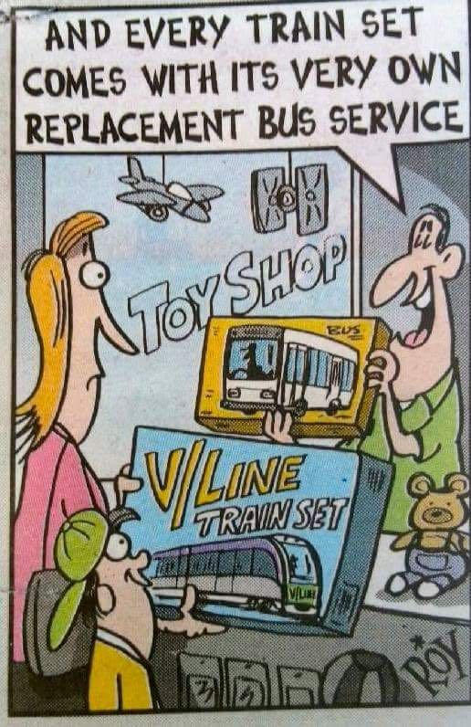

# *TABLE TALK*

**AUSTRALASIAN TIMETABLE NEWS**

**No. 283, March 2016 ISSN 1038-3697, RRP \$4.95**

**Published by the Australian Timetable Association**

[**www.austta.org.au**](https://www.timetable.org.au)

## **TOP TABLE TALK – V/LINE CRISIS**

Cartoon from *Herald Sun*

While there have been extensive repairs to both rolling stock and track,
as far as the travelling public is concerned, the inconvenience of a
large number of cancelled trains on V/Line services continues, and will
do so for the foreseeable future.

Every night from 9 to 11 February and 23 to 25 February a VLocity DMU
made four test runs in each direction between Sunshine and Little River.
From 2200 on 14 February until 0400 on 15 February an N class locomotive
made test runs over the North Melbourne flyover.

From 4 February until at least 13 March the trains listed below will be
replaced by buses. There seems to be about 85 cancelled trains per
weekday. Trains still running are sometimes run by smaller VLocity sets
than usual. Travel on replacement buses is free. The cost of these buses
is estimated at about \$2 million a week. On 4 February the Minister
said that she expects disruptions to continue until mid-June.

Geelong line: 91 services are scheduled to operate as trains. Buses are:

-   0432 Waurn Ponds to Southern Cross
-   0651 Waurn Ponds to SC
-   0716 Wyndham Vale to SC
-   0804 South Geelong to SC
-   0840 South Geelong to SC
-   0855 Waurn Ponds to SC
-   1201 South Geelong to SC
-   1612 Waurn Ponds to SC
-   1730 Waurn Ponds to SC
-   0625 SC to Wyndham Vale
-   0649 SC to Waurn Ponds
-   0710 SC to South Geelong
-   1030 SC to South Geelong
-   1450 SC to Waurn Ponds
-   1610 SC to Waurn Ponds
-   1740 SC to South Geelong
-   2315 SC to Waurn Ponds

Ballarat line: 59 services are scheduled to operate as trains. Buses
are:

-   0513 Wendouree to SC
-   0638 Wendouree to SC
-   0914 Wendouree to SC
-   1414 Wendouree to SC
-   1552 Ballarat to SC
-   2110 Wendouree to SC
-   0613 SC to Ballarat
-   1117 SC to Wendouree
-   1537 SC to Melton
-   1602 SC to Wendouree
-   1654 SC to Wendouree
-   1753 SC to Wendouree
-   1915 SC to Wendouree
-   2225 SC to Wendouree (this will be a train on Fridays)

Bendigo line: 34 services are scheduled to operate as trains. Buses are:

-   0507 Bendigo to SC
-   0622 Eaglehawk to SC
-   0721 Kyneton to SC
-   0617 SC to Bendigo
-   1625 SC to Eaglehawk
-   1704 SC to Kyneton
-   1731 SC to Epsom

Seymour line: Normal services scheduled (40 trains per day).

Gippsland line: Due to a safety investigation involving metropolitan
level crossings, V/Line's VLocity fleet is not currently able to operate
into the metropolitan network.

Ten Traralgon and Bairnsdale trains are scheduled to operate as normal.
Buses are:

-   0436 Traralgon to SC
-   0557 Traralgon to SC
-   0720 Traralgon to SC
-   0803 Traralgon to SC
-   0920 Traralgon to SC
-   1020 Traralgon to SC
-   1120 Traralgon to SC
-   1220 Traralgon to SC
-   1316 Traralgon to SC
-   1516 Traralgon to SC
-   1615 Traralgon to SC
-   1715 Traralgon to SC
-   1750 Traralgon to SC
-   0614 SC to Traralgon
-   0746 Flinders St to Traralgon (bus from Pakenham)
-   0813 SC to Traralgon
-   0915 SC to Traralgon
-   1020 SC to Traralgon
-   1120 SC to Traralgon
-   1220 SC to Traralgon
-   1420 SC to Traralgon
-   1520 SC to Traralgon
-   1616 SC to Traralgon
-   1938 SC to Traralgon
-   2044 SC to Traralgon
-   2144 SC to Traralgon
-   2330 SC to Traralgon (Friday only service)

**Saturday**: Geelong line: All 39 services are scheduled to operate as
trains.

Ballarat line: 28 services are scheduled to operate as trains.2215 SC to
Wendouree is a bus.

Bendigo line: All 28 services are scheduled to operate as trains.

Gippsland line: 12 services are scheduled to operate as trains. Buses
are:

-   0601 Traralgon to SC
-   0721 Traralgon to SC
-   1140 Traralgon to SC
-   1258 Traralgon to SC
-   1454 Traralgon to SC
-   1629 Traralgon to SC
-   0645 SC to Traralgon
-   0805 SC to Traralgon
-   1025 SC to Traralgon
-   1336 SC to Traralgon
-   1456 SC to Traralgon
-   1935 SC to Traralgon
-   2135 SC to Traralgon

**Sunday**: Geelong line: 30 services are scheduled to operate as
trains. Buses are:

-   2237 Waurn Ponds to SC
-   2110 SC to Waurn Ponds

Ballarat line: 22 services are scheduled to operate as trains. Buses
are:

-   2055 SC to Wendouree
-   2215 SC to Wendouree

Bendigo line: All 24 services are scheduled to operate as trains.

Gippsland line: 10 services are scheduled to operate as trains. Buses
are:

-   0601 Traralgon to SC
-   1140 Traralgon to SC
-   1258 Traralgon to SC
-   1415 Sale to SC
-   1629 Traralgon to SC
-   1025 SC to Sale
-   1156 SC to Traralgon
-   1336 SC to Traralgon
-   1456 SC to Traralgon
-   1935 SC to Traralgon.

The number of weekday cancellations increased from 85 to 87. For the
public, these cancellations were noted on V/Line’s website. For V/Line
personnel, these were detailed in notices S16/7055 Weekdays, S16/7053
Saturdays, S16/7054 Sundays. These also detailed the associated
cancellations of empty trains and reductions in the size of some trains.

On 19 February, V/Line issued an S Circular detailing altered network
carriage working, routings and platform working for Mon-Fri. and on 25
Feb issued S-Circulars for Fridays, Saturdays and Sundays. These are
8000-series circulars- thus WTT amendments i.e. semi-permanent. It is,
in fact, the first WTT amendment for 2016. The major change is the
alteration of platform working, where 103 services (Mon-Thu). have had
altered platform working. It seems that VLocities that formerly came and
went via the Flyover have been re-routed to the Regional Rail Link
platforms (15 & 16) and non-VLocity services that came and went via the
RRL platforms have been re-routed at Spion Kop to run via the flyover to
and from platforms 1-8. These seems to indicate that the flyover is the
main problem and that the RRL lines in other places are innocent. 108
trains now altered in some way on Saturdays, compared to “only” 43
formerly. As with 8001, the big jump is largely caused by platform
changes – 66 of them on Sats, compared with 103 on Mon-Thu. The circular
introduced a new Fleet Plan, version 44-I.

**SUMMARY OF VLINE CANCELLATIONS AND BUS REPLACEMENTS SINCE 18 JAN**

*Table compiled by Geoff Lambert. (EC = Empty Carriages)*

On 5 February it was revealed that Metro Trains, also, has found some
“thin” flanges on wheels.

On 9 February interim V/Line chief executive Gary Liddle told a State
Parliamentary inquiry that V/Line was spending up to \$300,000 a day
hiring 200 coaches to replace trains. The total cost of the crisis was
then claimed to be about \$33 million. Metro Trains chief executive
Andrew Lezala​ told the hearing that they had stepped up the greasing of
tracks around Melbourne to avoid the risk of wheel damage that might
force it to pull trains from service. The accelerated rate of wheel wear
afflicting V/Line's VLocity fleet has an abrasive effect on tracks,
causing yet more damage to train wheels, Mr Lezala said. "You can get a
cascading effect once you've got this kind of wheel damage and you've
got high friction between wheel and rail, until you restore your
lubrication regime. What we did find is we had got some drying of grease
around the network and so we stepped up our lubrication regime to try
and avoid any cascade and so far that has kept everything under
control."

Eight hundred metres of track on the North Melbourne flyover were ripped
up and replaced on the weekend of 13-14 February. The track replacement
work required the shutdown of part of the \$3.65 billion Regional Rail
Link, which has been in full service for less than seven months. The
cause of the VLocity wheel damage is still being investigated by Monash
University rail experts, who are due to report in March, but the
decision to replace the tracks on the flyover effectively confirms it is
one of the chief causes of accelerated wheel wear. Albury line trains
were replaced by buses between Southern Cross and Broadmeadows, and
Geelong, Bendigo and Ballarat line trains used Metro tracks through the
city. Damaged track on the Geelong and Ballarat lines will be replaced
in coming weeks. The North Melbourne rail flyover was not part of the
original design of the Regional Rail Link, but was included after it was
judged that building a new flyover would be too expensive and
disruptive.

The present State Labor Government has pointed out that the former
Coalition Government imposed cost savings of \$70 million on V/Line,
implying that this led to the present crisis.

To add to the woes, on the morning of 12 February a person was struck by
a train near North Shore, and all Geelong line trains were then
suspended for a few hours.

V/Line passengers who have been forced onto replacement buses complained
of being left in the dark, with no information about when buses will
depart from towns along the line.

There appears to be no temporary WTT – at least not one that is publicly
available. V/Line has printed temporary timetables for the Geelong,
Ballarat, Bendigo and Traralgon services dated 15 February 2016 and will
be included the March 2016 ATA Distribution List. The link for web
versions is
[https://www.vline.com.au/Timetables/Additional-pages/Timetable-list\#train%20timetables](https://www.vline.com.au/Timetables/Additional-pages/Timetable-list#train%20timetables)
They have an end date of “at least March 13”. The GTFS (General Transit
Feed System) feeds since late January are much shrunken and only contain
V/Line TTs for Sats and Suns. At the moment, the weekday schedules in
the GTFS are full week only on and after 14 March.

# **RAIL AND TRAM NEWS**

**Infrastructure Australia recommendations**

Infrastructure Australia released a 15 year **Australian Infrastructure
Plan** on 18 February. It recommended fundamental changes to the way
infrastructure is planned, funded, delivered and used.

The Chairman Mark Birrell said Australia can get the infrastructure it
needs and improve living standards and productivity, if it acts now to
introduce nation-shaping reforms. “Our Plan sets out 78 recommendations
for reform and provides a vision and roadmap to address today's
infrastructure gaps, and set us up to meet the challenges of tomorrow.
In developing the Plan, we have prioritised the user—the commuter
waiting for a train, the family paying their electricity bill and the
business looking to capitalise on overseas markets.” He said if the Plan
is delivered, Australians can expect more affordable, innovative and
competitive energy, telecommunications, water and transport services.
The Plan recommends reforming the funding and operation of transport
infrastructure, completing the national electricity market, improving
the quality and competitiveness of the water sector and delivering a
telecommunications market that responds to user demand. “By completing
the major reforms to infrastructure markets the average Australian
household will be almost \$3000 better off every year.” Mr Birrell said.

Alongside the Plan is IA's reinvigorated Infrastructure Priority List
which identifies 93 projects and initiatives. “The Priority List is
ultimately a platform for better infrastructure decisions—it provides
rigorous, independent advice to governments and the public on the
infrastructure investments Australia needs.” Mr Birrell said.

Key investments recommended include:

-   New metro rail systems in Sydney, Melbourne and Brisbane;
-   Road and rail initiatives to bust urban congestion in Perth;
-   Public transport improvements in Adelaide and Canberra;
-   Urban renewal in Hobart;
-   Metropolitan water supply upgrades to support Darwin's growing
    population, and
-   Protection of the corridors for High Speed Rail and new ring roads
    around Melbourne and Sydney.

IA will update the Plan at least every five years, and the Priority List
regularly throughout each year. For more information and to download the
Plan and the Priority List go to
[***www.infrastructureaustralia.gov.au***](http://www.infrastructureaustralia.gov.au/)

**Pacific National: Future**

The board of Asciano, parent company of Pacific National, has
recommended investors accept a \$9.05 billion takeover bid from the Qube
consortium. Asciano has signed binding transaction documentation with
the Qube consortium, the company said [in a statement to the stock
exchange](http://www.asx.com.au/asxpdf/20160216/pdf/43529dswhhpz1l.pdf)
on 16 February.

[Qube
said](http://www.asx.com.au/asxpdf/20160216/pdf/43529wmr5mz88b.pdf) that
the combination of its logistics business with Asciano's Patrick
container ports businesses would be "transformational. The combination
creates significant opportunities for productivity improvement and
innovation across the Australian logistics and transportation sector."

Qube plans to take Patrick ports while its consortium partners will buy
Asciano's Pacific National Rail businesses.

On 23 February Qube, Brookfield and Asciano advised that they were in
talks on developing “an improved proposal” to be put to shareholders.

## Queensland

**Aurizon: Townsville intermodal terminal**

Aurizon began construction in mid February of a \$40 million intermodal
facility at Stuart near Townsville. The project includes construction of
a freight distribution centre, a modern container terminal and three new
rail tracks specifically designed for Intermodal operations.

**Queensland Rail Travel: Inlander altered**

The Inlander passenger train from Townsville to Mt Isa and v.v. will be
changed from 6 April. It will depart Townsville on Wednesdays and
Saturdays (presently Thursdays and Saturdays) at 1240, arriving Mt Isa
next morning at 0935. It will depart Mt Isa on Sundays and Thursdays
(presently Mondays and Fridays) at 1330, arriving Townsville next day at
1010. The timetable itself is not changed, only the days of running. The
change will provide good connections (by Queensland standards) with
northbound and southbound Spirit of Queensland trains at Townsville.
Until April, southbound passengers have to stay overnight in Townsville.
There will be a trial of a tablet device provided for each passenger

**Queensland Rail Citytrain: Gold Coast extension**

The Queensland Government is purchasing land for the extension of the
Gold Coast line south from the present Varsity Lakes terminus. It has
purchased for \$9 million most of a large, prominent wrecker yard.

**Queensland Rail Citytrain: Rail Management Centre**

On 10 February a \$40 million Rail Management Centre at Bowen Hills was
opened by Queensland Minister for Public Transport Stuart Hinchliffe. It
co-locates all rail management functions.

**Queensland Railways Citytrain: EMU depot**

On 13 February the Queensland Government and Bombardier opened the depot
to maintain the New Generation Rollingstock electric multiple-units at
Wulkuraka near Ipswich. The depot, which cost \$190 million, contains
ten roads, a wheel lathe, lifting jacks, and cleaning and decanting
facilities. There is an automated visual inspection system that scans
trains to assess their condition. It will maintain the 75 six-car EMUs
that Bombardier is supplying as part of the \$4·4bn NGR programme. The
Queensland Government signed an availability-based PPP contract in
January 2014 with the Bombardier NGR Consortium of Bombardier
Transportation, John Laing, Itochu Corp and the Uberior investment
division of Lloyds Bank. The EMUs are being assembled at Bombardier’s
Savli plant in India. The first cars were shipped from Mumbai at the end
of January, and unveiled in Brisbane in early February. Deliveries are
scheduled to run for 2½ years. The first EMU is due to enter service in
mid-2016, and Bombardier is contracted to provide 30 years of
maintenance.

**Gold Coast monorail**

A major rebuild of the Gold Coast Casino will result in the closure of
the monorail in the very near future.

**Brisbane Tram? Central Coast Tram?**

The Labor candidate in the Brisbane Lord Mayoral election has promised a
light rail line from Brisbane CBD via Newstead and West End to the
University of Queensland, 9 km, with construction starting by 2020. A
second stage would be from the CBD to Princess Alexandra Hospital.

The Wyong Mayor has proposed a tram from Gosford to Terrigal and The
Entrance on the NSW Central Coast.

## New South Wales

**NW NSW wheat lines**

The line from Camurra to North Star was re-opened from 29 December 2015
(ARTC SAFE Notice 2-2483 refers). The line from Camurra West to Weemelah
was re-opened from 26 January 2016 (John Holland Rail NSW Country
Regional Network SAFE Notice 55-15 refers). These re-openings are usual
in the wheat season.

From 1 January appropriate licensed parties will be permitted to
undertake mobile grain loading mid-section at Old Burren, 667 km, and
Rowena, 683 km, on the Merrywinebone line. Trains loading at these
locations must be in push-pull configuration. (John Holland Rail NSW
Country Regional Network SAFE Notice 54-15 refers).

**ARTC: Hunter Valley 2016 closedowns**

Regular scheduled closedowns of the Hunter Valley network for civil
engineering works this year are expected to be 23-26 February, 27-29
April, 31 May-3 June, 23-25 August, 11-13 October and 21-25 November.

**ARTC: Working Timetable 6 March**

A new ARTC WTT will be introduced on 6 March. It can be accessed at
[www.artc.com.au/customers/operations/mtp](http://www.artc.com.au/customers/operations/mtp)

**Sydney Trains: Public timetables and displays**

Although the Leppington shuttles were replaced by through-running trains
on the T2 City Circle – Liverpool service in December, a booklet
timetable (Version 5.0) for this did not appear until mid-February and
even then only a few stations had them. All other timetables have had a
sticker pasted onto the covers announcing that the only “paper” tickets
now issued are singles and returns.

Plasma screen timetable displays with their white on blue graphics are
now gradually being changed over to new software with black on white
displays, identical in colour scheme to the big new screens at Central
station. These are much easier to read.

**Rail line to Badgerys Creek**

Plans for a high-speed metro rail line from Sydney CBD to Badgerys Creek
airport will be considered by the NSW and Federal Governments as part of
long-term rail options for western Sydney. The \$8 billion project,
would be funded largely by a private consortium. Proponents claim it
would take just 34 minutes from the CBD to Badgerys Creek, 18 minutes
between the City and Parramatta, and 16 minutes from Parramatta to
Badgerys Creek. It would link the major economic zones of Sydney.
Beginning at a new Metro station at Central, the Metro West Link would
link the CBD with Barangaroo, Darling Harbour, the Bays precinct and
Strathfield and Olympic Park with Strathfield, Camellia, Parramatta and
Westmead.

Stage two of the project would then extend to the western Sydney
employment precinct, Badgerys Creek and the southwest growth centre.

The plan envisages only \$2 billion of state and federal funding — and
would take over the role and funding planned for the Parramatta light
rail — with the rest funded by private sector.

More than 90 million passenger trips per year have been forecast on the
proposed system, with the NSW Government spared the expense of having to
spend \$11 billion over the next 20 years on the existing heavy rail
system.

Centurion China Rail Corp is in discussion with the joint-venture
engineering proponents, BG & E and Conybeare Morrison, which have
submitted the project to the NSW long-term transport strategy. Federal
Minister for Major Projects Paul Fletcher said the Federal Government
was seeking high-speed rail options for the second airport which also
acted as commuter services.

“The Commonwealth is working with the NSW Government on a joint study to
consider rail options which not only service the airport but which
address commuter needs in Western Sydney too,” he said.

A spokesman for NSW Transport Minister Andrew Constance said that all
proposals would be considered for long-term rail options for western
Sydney. “All serious proposals will be given consideration in the
future. We’re a little more than three years away from completing Sydney
Metro North West and before that we’ll have construction under way on
the next phase of the project through the CBD. There’ll also be an
opportunity to consider projects further down the pipeline.”

**Sydney Trains: Southern Highlands line**

Sydney Trains has had standby buses at Campbelltown and Moss Vale for
some time now to cover breakdowns. It appears Premier/Pioneer Coaches of
Nowra is contracted for this work on Mondays-Fridays. No spare rolling
stock is kept at Moss Vale on weekdays so these buses are stationed to
cover any delays. For example, on 17 February, the 0753
Campbelltown-Moss Vale was delayed by a slow-moving freight train, so
the return service from Moss Vale at 1001 was bus worked.

## Victoria

**V/Line: Albury trains**

A public forum to urge increased train services between Albury and
Seymour was held in Wodonga on 29 February. The Border Rail Action Group
proposes the use of a standard gauge VLocity DMU between Albury and
Seymour, connecting there with broad gauge trains to Southern Cross. It
claims this would take 20 minutes off present Seymour to Southern Cross
times and provide improved comfort and reliability compared to the
present “breakdown plagued” 35-year old carriages and locomotives.

(The Group requested copies of past timetables from the Australian
Timetable Association, which we provided).

**Metro Trains: Death of the wallsheet timetable**

With the introduction of the Night Network in January, Metro has done
away with issuing wallsheet timetables for display on station platforms.
Station specific departure posters are still issued, which include
stopping pattern details and timetabled connections to shuttle services.
Factors contributing to their demise would include the ten minute
daytime headways, the lack of space to include the Night Network
timetables and the fact an ever-increasing number of customers use
smartphone apps or online timetables to plan their journey.

(Sydney Trains still produces them, but only for stations that do not
have rolling display screens – which is not very many these days.)

**Metro Trains: Additional Pakenham trains**

From Monday 15 February, two additional morning and evening peak train
services have operated between Pakenham and Flinders St, providing
Gippsland V/Line passengers with the option of using a train for part of
their journey. The extra services, capable of carrying up to 800
passengers each, will depart from Pakenham at 0549 (0643 arrival at
Flinders St) and 0710 (0817 arrival at Flinders St), and from Flinders
St at 1526 (1625 arrival at Pakenham) and 1622 (1725 arrival at
Pakenham) on weekdays. The trains will operate to the normal V/Line
service pattern, stopping at Berwick (for the 1526 ex Flinders St only),
Dandenong, Clayton, Caulfield and Richmond. V/Line replacement coaches
will be timetabled to connect with Metro services at Pakenham.
Passengers who catch a free V/Line replacement coach will be provided
with a paper ticket that allows them to continue their journey on the
Metro network.

**Metro Trains: Altona line**

The Altona loop line will be closed for up to three months to remove the
quiet Kororoit Creek Road level crossing. The crossing, in an industrial
part of Williamstown, closes for just 11 minutes in the two-hour morning
peak but has been fast-tracked for removal by 2019 as part of the
Victorian Government's \$6 billion level crossing removal project. The
railway will also be straightened as part of the works. Altona
passengers were told that services would improve after the Regional Rail
Link opens, but a timetable upgrade has been deferred until later this
year.

**Metro Trains: Gardiner level crossing eliminated**

The replacement Gardiner station in Melbourne has opened, and
concurrently the first grade separation has been completed under a
programme to eliminate 50 level crossings, announced as part of the 2014
election campaign. The Glen Waverley line has been rebuilt on a new
sunken alignment. The platforms at the new station opened on 19 January
and are accessed via lifts as well as stairs. The car park is being
rebuilt on the old station site, and a new foot and cycle path provided.
Three former tram stops have been consolidated into one, located
adjacent to the new station, which has rail and tram passenger
information displays.

Removal of the Burke Road level crossing enables traffic, including
trams, to move unimpeded, where 150 train movements per day had caused
the gates to be down for 40 minutes during the peak hour, disrupting an
estimated 25,000 road vehicles and 180 trams. The project forms part of
a package that includes removing crossings at Ormond, McKinnon and
Bentleigh stations at a cost of \$524m. The contract was awarded to John
Holland in alliance with Kellogg Brown & Root, VicRoads, MTM and PTV.
Construction is underway at seven level crossings, with the Government
expecting work on 30 of the 50 crossings to be underway or completed by
2018.

**Dandenong line level crossing removal**

The Victorian Government proposes to rebuild three sections of the
Pakenham/Cranbourne line on an elevated structure nine metres above the
existing alignment. This is part of a \$1.6 billion project to remove
level crossings along the busy line. Nine level crossings will be
removed, and five stations rebuilt at Carnegie, Murrumbeena, Hughesdale,
Clayton and Noble Park. A consortium of CPB Contractors and Lend Lease
have been awarded the contract to build the project, which is due to be
completed by November 2018. Premier Daniel Andrews says the project will
create a quieter rail line, and will commence later this year. He said,
"every single level crossing between Caulfield and Dandenong will become
history. This tired and ugly rail corridor will become one of
Melbourne's largest community open spaces, with room for parks,
playgrounds, netball courts and thousands of new car parks."

The longest section of elevated rail will be over 3.5 kms built between
Grange Road in Carnegie and Poath Road in Hughesdale. A 2.7-km stretch
of elevated railway will be built between Corrigan and Chandler Roads in
Noble Park. A further two km elevated structure will run through Clayton
between Clayton and Centre Roads. Barricades will also be put in place
to ensure passengers on elevated trains cannot see into nearby houses!
Stations will be longer to accommodate longer trains. Signalling will be
upgraded for additional trains that will carry an extra 11,000
passengers during peak hour on the lines which currently carry more than
60,000 passengers daily.

As the elevated rail lines would be built above existing railway lines,
the existing train services would not be disrupted by the construction.
The elevated railway line will also free up an extra 225 square kms -
equivalent to 11 MCGs - of public open space.

[The Opposition has criticised the
proposal](http://www.theage.com.au/victoria/elevated-rail-could-run-through-melbournes-southeast-in-level-crossing-project-20160110-gm32yq.html)
as a cost-cutting measure to remove level crossings that would create
vulgar "eyesores" several storeys high that would divide neighbourhoods.

**Melbourne Metro rail tunnel**

On 23 February, Victorian Premier Dan Andrews released the business case
for the Melbourne cross-city suburban rail tunnel. The case claims
benefits of 1 to 1.1 to 1.5 depending upon how many side benefits are
considered. He also asked the Federal Government for funding of \$4.5
billion towards the total cost of \$10.9 billion. A website has been
established for this project. It is
[http://mmrailproject.vic.gov.au/](http://mmrailproject.vic.gov.au/)

Anticipated patronage at the new stations is:

| |Daily passengers  | Residents | Workers | Students |
|:---|-----:|-----:|----:|----:|
|  **Arden**   |                       ?   |                   7,000       |    12,000      
|  **Parkville**    |                 60,000      |           14,000     |     45,000   |     70,000
|  **CBD North** plus **CBD South**  | 1,100,000  
|  **Domain**      |                   36,000     |            17,000       |   33,000     

The business plan says that the service plan through the tunnel should
establish the Sunshine – Dandenong line operation via the new tunnel
alignment, including passenger services to the new stations at Arden,
Parkville, CBD North, CBD South and Domain; provide service increases
appropriate to meet the demands forecast for the corridor; and operate
all services on the line with high capacity rolling stock; re-establish
a consistent Frankston line routing through the inner core with all
services operating via the City Loop and provide service increases
appropriate to meet the demands forecast for the corridor; re-establish
a consistent routing of Craigieburn and Upfield lines within the inner
core with all services operating via the City Loop and, provide service
increases appropriate to the demands for each corridor; establish a
consistent through operation from the Sandringham line via Richmond,
Flinders St and Southern Cross and North Melbourne as part of the Cross
City group including provision of additional peak period services from
South Yarra to Flinders St; modify operation on the Werribee,
Williamstown and Laverton lines as part of changes to the Cross City
group, to provide service increases appropriate for the corridor.

**Metro Trains: Services dogged**

A new reason for service delays: On Monday 15 February trains on the
Sandringham line were delayed in the middle of the day by up to an hour
after a dog was hit by a train between Balaclava and Windsor. The dog
survived.

## Tasmania

**Hobart light rail**

The Tasmanian Government announced on 30 January that it will preserve
the rail corridor from Hobart to Granton, in the city’s northern
suburbs, for the long-term consideration of a light rail line. It said
it will look into value capture methods which could make a light rail
line economically feasible.

The move is the result of [a study by Infrastructure
Tasmania](http://www.stategrowth.tas.gov.au/__data/assets/pdf_file/0004/129613/Light_Rail_Strategy_210116.pdf),
which found that a light rail line was not economically feasible under
current economic conditions, but that there was potential for it to
become a viable source of transport in the future. The review found that
apart from the capital costs, which have been previously estimated at
\$100 million, the major impediment to the operation of the light rail
service is projected significant operation losses. The Government will
work with both Glenorchy and Hobart City Councils to develop a
comprehensive understanding of land use planning and rezoning issues for
commercial and residential opportunities adjacent to the rail corridor.
Increased land utilisation along the corridor, particularly residential,
will contribute to making the light rail more sustainable.

## International

**European Rail Timetable App**

The European Rail Timetable will soon introduce an App. In addition to
the existing printed timetable there will be a digital edition available
to download to smart-phones, tablets, e-book readers or computers. (The
European Rail Timetable, which is published monthly. is the successor to
the Thomas Cook Rail Timetable. Despite its name, it is in fact a
worldwide railway timetable).

**European sleeper trains: an update**

An update to the news about withdrawal of sleeper trains by DB German
Railways (January *Table Talk*, page 7):

Neighbouring ÖBB Austrian Railways remains committed to overnight trains
with sleepers. Indeed, it is ordering new sleeping carriages. ÖBB is
currently in discussion with DB about it operating internal overnight
trains within Germany. There is even a possibly of RZD Russian Railways
operating some sleeper trains within Germany.

France’s Ssecretary of State for Transport has announced plans to stop
funding all but two of the overnight train services operated by French
National Railways (SNCF) and to put their operation out to tender. The
Government will issue a call for expressions of interest in the next few
weeks in conjunction with the regional governments in areas served by
the trains which will otherwise be withdrawn. However, the government
will not provide any subsidy to new operators. The result of the tender
will be announced on 1 July.

**Plane or train?**

Swedish airline ticket retailer Flygstolen now provides comparisons on
its site of air and rail journey times and fares – see
[***www.flygstoken.se***](http://www.flygstoken.se)

**Thanks** to Craig Halsall, Geoff Hassall, Victor Isaacs, Geoff
Lambert, Dennis McLean, Len Regan, Tris Tottenham, Roger Wheaton,
[*www.railexpress.com.au*](http://www.railexpress.com.au)*,*
[*www.railpage.com.au*](http://www.railpage.com.au)*, Age, Daily
Telegraph, Herald Sun, Railway Digest, Sydney Morning Herald* and
*Today’s Railways Europe* for Rail news.

# **BUS NEWS**

## **Australian Capital Territory**

The annual Canberra Multicultural Food Festival has become huge event –
so much so that for the past two years it has taken over the City Bus
Interchange. From Friday 12 to Sunday 14 February this vital Interchange
was closed and buses diverted to stops on Northbourne Avenue and London
Circuit. This year - unlike in 2015 - London Circuit remained open for
buses only, and temporary bus stops placed there, lessening the
disruption compared to last year. On the nights of 12/13 and 13/14
February ACTION operated all-night Nightrider services to take people
home from the Festival.

## **New South Wales**

**Sydney Buses**

There were changes to bus services on the northern beaches from Sunday
14 February:

E32 and E35 to Manly Wharf - services will be discontinued due to low
patronage.

[E50](http://www.sydneybuses.info/routes/E50_20160214_tt.pdf) - Manly to
Milsons Point - one additional service at 0636 to Milsons Point.

[E65](http://www.sydneybuses.info/routes/139_20160214_tt.pdf) South Curl
Curl to the City - two additional AM peak services to the City at 0600
and 0845

[Route 132](http://www.sydneybuses.info/routes/131_20160214_tt.pdf)
North Balgowlah to Manly - one additional service to connect with 0635
ferry.

[Route 139](http://www.sydneybuses.info/routes/139_20160214_tt.pdf)
Warringah Mall to Manly - two additional services connecting with the
0610 and 0635 ferries.

[Route 142
](http://www.sydneybuses.info/routes/142_20160214_tt.pdf)Skyline Shops
to Manly - three additional services connecting with the 0610, 0635 and
0820 ferries and two additional services connecting with 1830 and 1920
ferries at Manly.

E36 North Curl Curl to Manly - an additional stop at Pitt and Griffin
Roads, North Curl Curl.

E41 North Balgowlah to Manly - an additional stop at Balgowlah Shops.

[L88 ](http://www.sydneybuses.info/routes/151_20160214_tt.pdf)Avalon to
the City **-** additional services to and from the City.

[L90](http://www.sydneybuses.info/routes/151_20160214_tt.pdf) Avalon to
the City - three additional early morning services from Avalon to the
City.

Despite the route alteration in the Haymarket area for routes
423/L23/426/428/L28 last year, the State Transit map still shows these
services running inward via Hay and Elizabeth Streets whereas the route
is via Pitt and Goulburn Streets to Elizabeth St. Outward journeys are
via Goulburn and Pitt Streets rather than via Hay St.

**Griffith Buslines**

A complete set of new timetables and a network map, produced by Transit
Graphics, was introduced in January. See
[www.buslinesgroup.com.au/images/pdf/griffith/BUSLINES\_Griffith\_A4.pdf](http://www.buslinesgroup.com.au/images/pdf/griffith/BUSLINES\_Griffith\_A4.pdf)

## **Queensland**

**Brisbane Buses**

From Monday 22 February, route P332 Chermside to City will be extended
to begin at St. Flannan’s primary school at Zillmere, instead of
Chermside, and will end at UQ Lakes instead of the CBD. Two morning peak
trips will also be added, with the final morning inbound service leaving
later at 0851 (instead of 0751). Route P332 will be renamed from this
time due to the route change and will become route P332 Zillmere to
University of Queensland (UQ). The changes to route P332 are being made
to reduce overcrowding on routes 330 Bracken Ridge to City BUZ and route
66 University of Queensland to Royal Brisbane and Women’s Hospital. They
will be introduced as a 12-month trial and may be made permanent if it
proves popular. The changes are a Brisbane Transport initiative and are
funded by Brisbane City Council.

A new peak bus service, Route 238 ‘The Riverlink’ was introduced from 22
February. It starts at Hawthorne ferry terminal, connects with services
at Riverside at Eagle St and also serves Morningside station and the
Cannon Hill Bus Interchange. The initial service has five trips between
0700 and 0810 and six between 1700 and 1820. It should improve access
from the eastern part of Park Hill Village at Murarrie to the CBD and
will also increase access to the Lytton Road industrial area.

The proposed bus network on the Redcliffe Peninsula following opening of
the Kippa-Ring railway in mid 2016 is:

-   An upgraded network with an additional 261 services a week and a
    range of new options, including additional early morning and
    night-time services and an increased operating hours on six routes
    every weekday;
-   More buses on the weekend, with increased operating hours on eight
    routes;
-   Better access to weekend buses, with 98% of residents within a 400 m
    walk of a Sunday service;
-   More daily bus trips, with an extra 157 trips each weekday and an
    additional 104 trips every weekend; and
-   Higher frequency services during peak hour so that 31% of residents
    will be within a 400m walking distance of a high frequency service
    in the morning peak. This is nearly four times the number of
    residents who have close access to these types of services now.

## **Victoria**
*by Craig Halsall*

**New University shuttles for 2016**

On 15 February PTV announced details of the new weekday only university
express shuttles that commenced as soon as the following day, along with
improvements to two other services serving tertiary institutions for the
start of the 2016 academic year. The first three services were promised
in the \$100M Labor Bus Plan announced prior to the state election at
the end of 2014.

Some publicity suggests the routes will only run during university
semesters/trimesters, however there are no notes on the actual
timetables that indicate this. Routes 201, 301 and 403 will operate on
Labour Day as classes are held on this day, but at this stage 887 is not
shown to be running. It is also interesting to note the 201 commenced
three weeks before the 768 service to Deakin Uni resumes for Trimester
1.

The shuttles are:

-   201 (Ventura Knoxfield depot) between Deakin Uni and Box Hill -
    operating every 20 minutes from 0700 until 2200, commenced
    22 February. This is in addition to the existing 281, 732, 767 and
    768 services along this corridor, providing a combined 12 services
    an hour during peak periods from Box Hill. Services skip the stop
    outside the Elgar Road sub-campus, however the 281, 767 and 768 stop
    here – Ventura citied concerns about potential overcrowding.
-   301 (East-West (Dysons subsidiary)) between La Trobe Uni and
    Reservoir - every 10 mins from 0700 to 1900, in addition to existing
    561 which operates every 20 minutes during the day and until
    after 2200. Counter-peak trains between the City and Reservoir
    operate every 10 minutes (better in some cases). Although the
    service is designed to provide a ‘best option’ for students coming
    from the inner area (compared to the slow 86 tram, 350 bus or myriad
    of train-bus options, including those from Ivanhoe, Heidelberg and
    Macleod Stations on the Hurstbridge lines), however generous
    runtimes mean in many cases the journey planner continues to
    recommend alternative options. On the first afternoon, buses were
    arriving at Reservoir up to seven minutes ahead of schedule.\
    301 commenced 16 February to coincide with the enrolment day for
    international students. A new access point and improved bus facilities
    have been provided at the Thomas Cherry building on campus, with the
    service not serving the eastern stop near David Myers building or the
    Plenty Road bus interchange.
-   403 (Sita) interpeak shuttle between Melbourne Uni and Footscray
    between 0900 and 1500, eliminating the need for students coming from
    regional area having to change from at V/Line service at Footscray
    to a Metro train and then change again at North Melbourne for the
    401 shuttle bus. Commencing 22 February, roughly three trips per
    hour operate, timed to meet V/Line services. The service supplements
    the 402 service from Footscray, which was upgraded last June to run
    at 10 minute headways interpeak., Like the 401 shuttles, buses make
    an intermediate stop at Royal Melbourne Hospital.
-   505 (Dysons Bundoora depot) – a new timetable from 21 February sees
    a small number of additional peak services between Moonee Ponds and
    Melbourne Uni, improving access for students living in Parkville
    Gardens, the former Commonwealth Games village, however the former
    hourly clockface headway has been lost and the second bus only
    operate a handful of additional trips. Runtimes have also been
    speeded up. Buses continue to be timed to meet trains at Royal Park,
    providing an alterative to the connecting 19 and 55 trams for
    CBD access.
-   670 (Ventura Lilydale depot) – services from Ringwood to Lilydale
    via Maroondah Hwy have been extended to Box Hill Institute of TAFE’s
    new Lilydale Lakeside campus from 22 February, although classes
    resumed the week before. The timetable remains unchanged from when
    services previously operated into the Swinburne Uni campus at the
    same location in July 2013, after Liberal government funding cuts
    saw campuses consolidated (Labor has since provided funding to
    reopen the site). In the interim, services terminated at Lilydale
    Marketplace, with a turning loop near the gate to the former campus.
    Readers may recall PTV only updated the online timetable and signage
    along the route nine months after the campus shut, after *Nine News*
    aired a story about the bus to a closed university.
-   887 (Ventura Rosebud depot) – a new limited stops service began on
    22 February between Rosebud, Mornington, Frankston and Monash Uni’s
    Peninsula Campus. A campaign had been run on the Peninsula for
    several months to retain a service after funding for the former free
    PenBus service, introduced in May 2013 by the Federal Government
    under Labor, ran out. Last semester the council ran the service with
    \$3 fares while a permanent solution could be found. One bus
    operates back and forth, resulting in an approximately 125 minute
    headway from 0645 until 1830, which is coincidentally timed to suit
    CBD commuters changing to the train at Frankston. The service, which
    saves about 15 minutes on the regular 788 option, plus the need to
    change buses, is timed to meet the intercampus bus to Monash Uni’s
    Clayton Campus, which now operates on a slightly revised timetable.
    PenBus previously continued to the Clayton Campus, providing an
    hourly headway between campuses in conjunction with the university
    funded intercampus option; along with a better span catering for 8am
    classes and 6pm finishes at the Clayton campus.

Buses on 201 & 301 wear a modified PTV livery, with large route numbers
on the side similar to that worn by vehicles operating 401 and 601,
while two Sita buses have also gained PTV colours for the 403. Most
buses on the 887 should be in PTV colours, replacing the coaches in a
special PenBus livery.

In addition to the changes to the intercampus bus between the Clayton
and Peninsula campuses, Monash Uni has also removed the footnote that
selected trips on the intercampus bus between the Clayton and Caulfield
campuses are limited to 57 seated passengers. Qunices have recently
purchased a third low floor bus to operate on the service, accommodating
a further 20 students or staff members. Since the start of last year
this route runs at a 17-18 min headway.

**Dandenong City Loop to end**

Greater Dandenong Council have announced that their free City Loop bus
around Dandenong, linking the station, civic centre, market, hospital,
Chisholm TAFE and plaza will cease on 8 March. The service was initially
introduced in December 1996, and in early years featured Grenda’s B10Ms
heavily decorated for Christmas and Easter. The service is operated by
Ventura on behalf of the Council. Factors contributing to its demise
include the frequent 901 SmartBus serving Dandenong Hospital, relocation
of about two-thirds of bus routes from Thomas St to Langhorne Place next
to Dandenong Plaza, a decision to reroute trips past the Metro 3175
housing estate (and Ventura head office) and the decision to reduce the
span to 1000 to 1500 last May.

**St Kilda festival changes**

Service changes for the annual St Kilda Festival on Sunday 14 February
largely focused on detours, with no extra services:

-   246 (Clifton Hill – Elsternwick) south of Alma Rd again operated as
    a connecting shuttle during most of the day to avoid traffic
    congestion around the festival impacting on-time running north of St
    Kilda Junction, with through passengers required to change buses.
-   600 and 922 (St Kilda – Southland and 623 (St Kilda – Glen Waverley)
    were truncated at Barkly St instead of St Kilda Light Rail Station
    and Luna Park respectively.
-   606 (Port Melbourne – Elsternwick) was truncated on the north side
    of St Kilda at Park St & Mary St. Any passengers travelling to
    Elwood or Elsternwick were advised to find their own way through the
    festival to connect to the 246.

Until 2013, 600, 922 and 923 operated to a Saturday timetable to/from
Southland, while 623 traditionally ran an extended evening timetable,
with the last bus to Glen Waverley an hour later at 2145 last year, and
as late as 0045 for previous festivals.

**White Night festival changes**

CBD bus services were disrupted from 1700 Saturday 20 February until
0730 Sunday 21 February due to numerous road closures across the CBD for
the annual overnight White Night cultural and arts festival, which again
attracted huge crowds, with reports suggesting as many 600.000 showed up
over the 12 hour event.

-   Passengers for 216, 219, 220, 232, 234, 235, 236, 250 and 251, along
    with Night Buses 941, 942, 944, 945, 951 and 952 were directed to
    board buses at the “Western Transport Hub” on Queen St between
    Bourke St and Little Bourke St
-   Passengers for 200, 207, 302, 304, 605, 905, 906 and 907, along with
    Night Buses were directed to board buses at the “Eastern Transport
    Hub” on Spring St outside Parliament Station
-   Services on Sita’s 402 (Footscray – East Melbourne) diverted along
    Rathdowne St, Faraday St, Nicholson St & Victoria Parade
-   A rare mention of a detour to McKenzies’ Elidon service was
    provided, with the 1810 service travelling via Dudley St, Peel St,
    Victoria St to St Vincent's Hospital in lieu of LaTrobe St,. However
    no stops were missed

Unlike 2015’s event, there was no overnight service provided on the DART
routes to the Doncaster area, with passengers having to catch the 961
and 966 Night Bus services instead. Online information implied Night Bus
services would be extended by an hour to around 0630 but no timetable
details were given.

**Antipodes Festival service changes**

Melbourne’s annual street festival celebrating Greek culture on the
weekend of 27/28 February saw Lonsdale St closed to traffic. Transdev
detoured its services via Franklin St, with alternative stops available.
CDCM’s 605 service to Gardenvale travelled along LaTrobe St with
passengers required to board buses in either Queen St or Exhibition St.

**Thanks** to Jason Blackman, Craig Halsall, Matthew Gibbins, Peter
Parker and various contributors on *Australian Transport Discussion
Board* for Victorian Bus news.

## **Western Australia**

From Sunday 21 February TransPerth services changed as follows:

**Routes 24, 25, 27, 28 and 950** time changes only.

**Routes 23, 102, 107 and 950** no longer serve stop 10389 Mounts Bay
Road at UWA. Route 23 will also undergo time changes.

**Thanks** to Victor Isaacs, Tris Tottenham and *Transit Australia* for
non-Victorian Bus news.

# **AIR NEWS**

## **International**

**Tigerair** will introduce daily Melbourne-Bali flights from 23 March.

**Hong Kong Airlines** will commence year-round flights from Hong Kong
to the Gold Coast and Cairns from early April. This follows the success
of their seasonal service which commenced in January. It will fly
twice-weekly then thrice-weekly from July on the same direct route to
the Gold Coast, returning via Cairns.

**All Nippon Airways** commenced daily flights from Tokyo Haneda to
Sydney on 11 December: dp Tokyo 2210, arr Sydney 0935; dp Sydney 2130,
arr Tokyo 0505.

**Air Asia X** will commence flights from the Gold Coast to Auckland and
v.v. from 23 March. This removes the need to lay up an aircraft at
Coolangatta during the day.

**Philippine Air** is to fly Cairns-Auckland and v.v. four times weekly
from December 2016.

## **Domestic**

From 9 February **Qantas** introduced an additional direct flight from
the Sunshine Coast to Sydney departing at 0640.

On 28 February **Rex** commenced flights from Perth to Albany 23 times a
week and to Esperance 18 times a week

**Thanks** to Tony Bailey, Tris Tottenham and the *Australian* for Air
news.

# **ODD SPOT**

There used to be comprehensive Bus information available at Manly Wharf.
There was a small dispatcher’s office in the forecourt bus bay area
where paper timetables could be obtained (we are talking 1970s here).
This later shifted to the old tram sidings across the road. When the
Information Centre opened timetables were stocked – at first inside,
later outside. However, Council staff were driven nuts by people coming
in to ask questions about buses. Having the timetables inside or outside
did not stem the flow. So Council decided not to have anything to do
with Sydney Buses. An infamous Sydney Buses sign (“*Sydney Buses
Timetables are NOT stocked here”*) arose from this. One night, coming
home on route 135, Geoff Lambert, ATA President, overheard no fewer than
five people having extended conversations with the driver at the wharf
before deciding not to travel. These were probably non-locals.

Nothing beats the experience Geoff had with two German girls who wanted
to get to Melbourne from Manly Wharf – on the ferry and the train! He
told them it would take a minimum of 12 hours because it was a thousand
kilometres. He thinks they didn’t believe him. No paper timetable for
that. He found it rather surprising that they were so ill-informed. It
is something you might expect of Americans but not Germans. His
experience of dealing with German tourists at Bandicoot Heaven on North
Head is that they generally arrive there with a map they printed out
before they left Germany!

# **About *Table Talk***

***Table Talk*** is published monthly by the Australian Timetable
Association Inc. (Registration No. A0043673H) as a journal of record
covering recent timetable news items. The ATA also publishes the
***Times*** covering timetable history and analysis. Contributions are
invited and are very welcome. Please send these to the appropriate
Editor. ABN 74248483468.

The **deadline** **for *Table Talk*** is the last weekend of the month,
but contributions are welcome at all times.

**Editor, Rail and Tram, Air, Ferry:** Victor Isaacs,
[***abvi@iinet.net.au***](mailto:abvi@iinet.net.au)***,*** 11 Blacket St
Downer ACT 2602.

**Editor,** **Bus**: As an interim arrangement, please send your Bus
news to [***abvi@iinet.net.au***](mailto:abvi@iinet.net.au)

**Production and Mailout**: Geoff and Judy Lambert.

**Proofreaders:** Agnes Boskovitz, David Cranney and Geoff Hassall.

Original material appearing in ***Table Talk*** may be reproduced in
other publications but acknowledgement is required.

**Membership of the Australian Timetable Association** includes monthly
copies of the *Times*, *Table Talk*, the Distribution List of
timetables, and the monthly Auction catalogues. The membership fee is
\$60 (Adult) and \$36 (Junior) pa. Membership enquiries should be
directed to the Membership Officer, Len Regan, at
***[membership@austta.org.au](mailto:membership@timetable.org.au)***

Back issues of ***Table Talk*** are available on the Australian
Timetable Association’s website, ***[austta.org.au](https://www.timetable.org.au),*** after three
months.

**Table Talk Newswire** is an advance monthly email of Rail news. To
obtain this, ask the Rail Editor at
[***abvi@iinet.net.au***](mailto:abvi@iinet.net.au)
