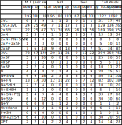
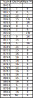

# *TABLE TALK*

**AUSTRALASIAN TIMETABLE NEWS**

**No. 284, April 2016 ISSN 1038-3697, RRP \$4.95**

**Published by the Australian Timetable Association**

[**www.austta.org.au**](https://www.timetable.org.au)

# **TOP TABLE TALK – V/LINE CRISIS**

Substantial progress has been made in re-instating trains on the V/Line
network. Damaged wheels on most VLocity DMUs have been replaced and
tight curves on the North Melbourne flyover replaced. However, there is
still some way to go before services are fully restored.

On the early morning of Thursday 17 March a VLocity DMU operated test
runs over the North Melbourne flyover to test a lubricating system.

From Monday 21 March 43 of the 64 weekday rail replacement buses
returned to being operated by trains instead of buses. 93% of the
VLocity DMUs have been returned to service as the wheel replacement
program is continuing. Train replacement coach services continue to be
free. Circular S 16/8009 covers cancellations and alterations on
Mondays-Thursdays, S 8010 on Fridays, S 16/8011 on Saturdays and S
16/8012 for Sundays (and Good Friday). The following services are now
operating.

**Weekdays:**

**Geelong line** 98 services are scheduled to operate as trains. Ten
services are replaced by buses. These are:

-   0651 Waurn Ponds to Southern Cross
-   0716 Wyndham Vale to SC
-   0804 South Geelong to SC
-   0840 South Geelong to SC
-   1730 Waurn Ponds to SC
-   0625 SC to Wyndham Vale
-   0710 SC to South Geelong
-   1610 SC to Waurn Ponds
-   1740 SC to South Geelong
-   2315 SC to Waurn Ponds

**Ballarat line** 70 services are scheduled to operate as trains. Three
services are replaced by buses. These are:

-   2110 Wendouree to SC 
-   1537 SC to Melton
-   1915 SC to Wendouree 

**Bendigo line** 35 services are scheduled to operate as trains. Six
services are replaced by buses. These are:

-   0507 Bendigo to SC
-   0622 Eaglehawk to SC
-   0721 Kyneton to SC 
-   1625 SC to Eaglehawk
-   1704 SC to Kyneton
-   1731 SC to Epsom

**Seymour line** Normal services continue to be scheduled (40 trains per
day).

**Gippsland line** VLocity trains will return to the Gippsland line,
meaning 34 services are scheduled to operate as trains. Two services are
replaced by buses. These are:

-   1615 Traralgon to SC
-   1120 SC to Traralgon

**Weekends:** All weekend services are scheduled to run as trains.

This table summarises the situation (EC = Empty carriage):

This table summarises current carriage formations (VL = VLocity DMUs, N
= N carriage sets, SH = H carriage sets,
SP = P carriage sets):

Platform working at Southern Cross has been altered to obviate VLocities
going over the North Melbourne flyover:

**Thanks** to Geoff Lambert for these tables.

***More detailed tables showing cancellations, reinstatements and
altered carriage formations for individual trains are available on
request to the* Table Talk *editor on [abvi@iinet.net.au](mailto:abvi@iinet.net.au)<abvi@iinet.net.au> or to the*
Times *editor on [G.Lambert@iinet.net.au](mailto:G.Lambert@iinet.net.au)***

*Postscript 1*: Test runs by VLocity DMUs took place between Little
River and Corio on the nights of 4 March and 8 to 10 March. *Geoff
Lambert writes*: These were tests of new intermediate trailer cars for
the conversion of 2-car VLocity sets to 3VL sets. Since the Network
Service Plan (Working Timetable) started in June 2015 TM 1300-1312 have
been added to 2VL sets 00 to 12, to convert them to 3VLs. During 2015,
2VL sets ran to Newport and return, and then to Bombardier as a 2VL set
and came back a little later as a 3VL set. Thence follows the test
drive. There are 6 more TM cars to be delivered (13 to 18), so we should
see 6 more test runs. So these trains are not associated with the
VLocity disaster - they were not testing the RRL track at all.

*Postscript 2*: VLine is not the only important passenger train operator
to suffer a major fleet failure at the present time. In Britain, the
entire fleet of trains used on Heathrow Express services are withdrawn
indefinitely due to safety concerns. The Heathrow Connect stopping
service has been suspended to allow its train fleet to operate Heathrow
Express services. Passengers who would normally use Heathrow Connect are
being directed to use London Underground and local bus services.

# **RAIL AND TRAM NEWS**

**Pacific National: Future**

The bidding war for Asciano, the parent company of major rail freight
operator Pacific National, finished on 15 March, when both bidders, the
Canadian infrastructure company Brookfield, and a consortium including
rail operator Qube and the Canadian Pension Fund, announced that they
will jointly acquire the company. Asciano will be broken up. Brookfield
and its partners will acquire the ports business. Qube and its partners
will acquire the Pacific National rail business. A joint venture of both
will acquire the container business plus non-container terminals. This
outcome is subject to approval by competition and foreign investment
authorities in Australia and NZ.

**Glencore for sale**

Anglo-Swiss commodities company Glencore, operator of coal trains in the
Hunter Valley, announced on 17 March that it has put its coal train
fleet up for sale, hoping to fetch more than \$1 billion as it looks to
cut debt.

**Inland Freight Railway**

In early March a number of contracts were let for environmental
assessments and engineering design for the proposed Brisbane-Melbourne
Inland Rail project.

There is a new website for this project at
[***www.inlandrail.artc.com.au***](http://www.inlandrail.artc.com.au)

**Telstra causes havoc**

On Thursday evening, 17 March, the Telstra 3G mobile network went down
across most of SE Australia. V/Line, ARTC and John Holland Rail all now
use the ICE (In-cab Communications Equipment) train control system which
relies on this Telstra system. Train Controllers at Bourke St Melbourne,
Mile End Adelaide, and Broadmeadow were unable to change points or
signals or communicate. Consequently, most trains on these systems were
stopped for about 90 minutes.

**Queensland Rail: North Coast line**

Queensland Premier Annastacia Palaszczuk announced a \$500m State
Infrastructure Fund on 13 March, which will include \$95 million for
upgrading work and capacity improvement projects on the North Coast
line.

The plan also includes planning for other rail projects, such as the
Brisbane Cross-River Rail suburban link, the Springfield – Redbank line
in southwest outer Brisbane, and a high-capacity connection to the Port
of Brisbane, However, she made it clear that these would be dependent on
a matching contribution from the Federal Government.

**Queensland Rail Citytrain: Kippa-ring line**

The first electric train operated a test run on the Kippa-ring line on
16 March.

**ARTC & NSW Train Link timetables 6 March**

The reference in March *Table Talk* (page 5) to a new ARTC WTT
commencing on 3 March should have been 6 March.

In addition to the alterations to NSW Train Link South Coast trains from
6 March, which were mentioned in February *Table Talk* (page 4),
additional weekday trains will stop at Austinmer as a trial for three
months. Additional stops by up trains will be at 0630, 0650, 0710, 0731
and 0810. Additional stops by down trains will be at 1709, 1800, 1839,
1919 and 1959.

**ARTC East-West upgrade**

On 9 March the Prime Minister and ARTC CEO announced an upgrade to the
east-west line between Adelaide and Tarcoola, 724 km. The upgrade will
replace 47kg per metre rail with 60kg per metre, enabling an increase in
axle weight from 23 tonnes to 25 tonnes at 80 kms per hour.

## New South Wales

**NSW Government: Open data**

The NSW Government has announced an open data policy of putting as much
information as possible on the internet. This may extend to Working
Timetables and Special Train Notices.

**Transport for NSW: Train Operating Conditions Manual**

Transport for NSW re-issued its Train Operating Conditions (TOC) Manual
dated 18 December 2015 in three volumes:

-   1 General Instructions (295 pages), including locomotive and rolling
    stock data.
-   2 Division Pages (96 pages) with tables of loads for specific
    locomotives classes on specific sections of line.
-   3 Track Diagrams (60 pages).

Copies are available at
***<http://www.asa.transport.nsw.gov.au/ts/asa-standards#rolling-stock>***
along with other documents.

**NSW Trains: Real time information**

A data feed from transport technology and communications firm 4Tel gives
NSW regional passengers access to real-time service information through
their mobile phones. They can check on their service through popular
mobile apps TripView, NextThere, Arrivo Sydney, Triptastic, Metarove,
abil.io, Moovit and Transit App with train updates every 30 seconds, and
buses every few minutes. 4Tel, an SME founded by Derel Wust in 2001,
which operates out of Newcastle, generates the real-time information
through its 4Trak application, which it has been using to track trains
since 2008. The 4Trak system collects real-time position information
(track and GPS data) of trains and coaches on the NSW regional network,
then compares that data to the planned timetable. It then calculates the
estimated arrival times for passenger information systems, and for the
external application feed.

**Sydney Trains: Control centre**

A central control centre, under construction at a cost of \$276 million
will open at Green Square in 2018. It will replace separate control
centres which at present manage trains, disruptions, tracks, security
and customer communications. Sydney Trains chief executive Howard
Collins said the new centre would ensure all relevant staff would be
informed the moment an issue is reported.

**Sydney: Fast train to Badgerys Creek?**

On 11 March Prime Minister Malcolm Turnbull backed plans for a fast
train between Sydney CBD and the second airport at Badgerys Creek,
saying he hopes it will be ready when the airport opens in the mid
2020s, however it was also too early to commit to a fully-functioning
rail line by the time the airport is ready in 2026. He did not reveal a
dollar figure for any rail projects or who would fund the line. "There
is too little known about the route, the cost, the value created and the
sources of funding," he told delegates at a Western Sydney Ideas Summit.
"We are already setting aside space for rail, including station boxes,
and approaches so that the rail link can be established whether at the
time the airport opens, which would be preferable, or later." Traffic
forecasts show there won't be a demand for a rail link until the 2040s,
Mr Turnbull said. The airport is expected to cater for an estimated 10
million passengers a year by 2030 and there are no plans for a curfew
like its Sydney counterpart. NSW Premier Mike Baird said the airport
couldn't be built without a rail link and he welcomed the announcement.

**Parramatta Light Rail**

Work will begin on Parramatta Light Rail in 2018 on two lines — from
Westmead to Parramatta to Strathfield and a branch from Camelia to
Carlingford. The NSW Government has committed \$1 billion to the
project, with hundreds of millions more to complete the job expected to
come from ­infrastructure contributions from developers who will build
adjacent to the line. Consultation on the exact route will take place
later this year.

## ACT

**Canberra Light Rail**

The ACT Government has shelved a possible extension of light rail to the
Russell defence precinct until after the 15 October ACT election. ACT
Chief Minister Andrew Barr said he will now develop a much more
ambitious "stage 2" for light rail, taking in not only Russell, but the
wider Parliamentary Triangle, and possibly also Canberra Airport and the
Australian National University. He will take that package to Prime
Minister Malcolm Turnbull and to the federal Labor opposition in the
hope of persuading them to help pay for the next stage. The details of
stage 2 will be released before the ACT election, including precisely
where the tram would run, and the government would seek a mandate for it
from voters, he said.

## Victoria

**V/Line: Trains and books go well together**

In connection with the annual Clunes Booktown Festival, V/Line will
again run special trains – VLocity DMUs – between
Ballarat-Clunes-Maryborough on Saturday 30 April and Sunday 1 May. The
specials will depart Ballarat at 0955, 1210 and 1530, and Maryborough at
1100, 1355 and 1705. One could combine going to the Book Festival with
riding over a usually hard-to-do line.

**V/Line: Warrnambool line closedown**

The Warrnambool line was closed over Easter, Friday 25 to Sunday 27
March for planned engineering works. However, a service of VLocity DMUs
still operated between Wyndham Vale and Southern Cross.

**V/Line: Locomotive transfers**

Commencing 4 April train paths will be operated, as required, for the
transfer of locomotives from South Dynon locomotive depot to Bendigo and
return for maintenance at the Southern Short Haul facility at the
Bendigo locomotive depot. Depending upon crew availability these
services will be operated by either Southern Short Haul or by Pacific
National. To facilitate track access recording in this age of the
break-up of the railways, therefore, the services will have different
numbers depending upon the operator. SSH services will be numbered 81
and 82, and PN 85 and 86. Service 82/86 is timetabled to depart Bendigo
at 2050 (2105 on Saturdays) and 81 /85 to depart South Dynon at 0110
daily.

**Metro Trains: On to Mernda**

The Victorian Government has called for Expressions of Interest to
design and construct the extension of the South Morang line to Mernda,
in the city’s north-east. The new extension will include an intermediate
station near Marymede Catholic College. The Government has instructed
bidders to investigate and price a proposed station near Hawkstowe
Parade as part of the process. A tender will be awarded in 2016, for
construction to begin in 2017 with completion in 2019.

**Metro Trains: New trains**

The Victorian Government has nearly doubled its order of high-capacity
trains, making it the biggest single order of trains in Victoria’s
history. Premier Daniel Andrews and Minister for Public Transport
Jacinta Allan announced on 15 March that its order of High Capacity
Metro Trains has been increased from 37 to 65 seven-carriage sets. The
new trains will begin arriving in 2018.

*\[* Table Talk *does not usually report rolling stock news, being a
little remote from timetabling matters, and leaving this to many other
magazines. But the very large size of this order deserves an
exception.]*

**Melbourne: Rail freight**

On 26 and 27 February a rail shuttle was trialled between DP World’s
West Swanson Dock and SCT’s freight hub at North Altona, 24 km. The
companies say they are heartened by the results. In a joint statement,
the two businesses said intermodal networks were necessary to manage
surging freight volumes.

**Great Southern Rail: Overland survives – again**

The Victorian Minister for Public Transport, Jacinta Allan, announced on
22 March that the Victorian Government will provide \$10.35 million to
keep the Overland running between Melbourne and Adelaide until at least
the end of 2018 This follows a similar announcement by the SA
Government. However, the Federal Government has announced it will not
continue its funding for pensioner travel on the service beyond 30 June
this year.

# South Australia

**Adelaide Metro**

The Adelaide Cup race meeting was held on Monday 4 March. Special
services were not highlighted on the Adelaidemetro website but were
accessible if searched for. The Motor Accident Corporation and SA Jockey
Club provided free transport on trams, trains and buses for passengers
with an event ticket. Trams were scheduled to operate every ten minutes
to the Racecourse from Glenelg 0900 to 1900 and from the Entertainment
Centre 1000 to 2000. A service every 15 to 20 minutes operated outside
these hours.

## Tasmania

**Light Rail for Hobart? Yes, But!**

Political pressure brought by several Tasmanian politicians on the Prime
Minister to assist in the funding of the restoration of passenger rail
services in the Greater Hobart area received a favourable response on 29
February - but only as a matter of principle.

The Prime Minister has clearly reiterated his view that the provision of
a light rail line in Hobart is a State matter and the State Government
must provide a lead on the project, including references to
opportunities for urban renewal and regional development.

On 29 February the Hobart *Mercury* quoted the Prime Minister as saying
“Should light rail be a priority for the Tasmanian Government, we will
carefully consider this project to the extent that it drives these
outcomes, delivers economic benefits to communities and seeks to apply
innovative financing models such as value capture.”

But Tasmanian Infrastructure Minister Rene Hidding maintains light rail
is not economically feasible at the moment. Infrastructure Tasmania is
however working with the Glenorchy and Hobart Councils on assessing the
future of the disused heavy rail corridor, including a study of future
land use from Claremont to Hobart City. It is highly relevant to note
that the local government planning studies in Hobart City are focussed
on a rail service which would terminate at the current City bus
interchange at the intersection of Elizabeth and Macquarie Streets. Most
previous studies had identified the city terminus as being on the edge
of the waterfront at Macquarie Point, a rather isolated location for
most light rail passengers.

## International

**Europe: Innovative new international service**

High-speed operator Thalys is to launch a low-cost train service between
Paris Nord and Brussels Midi. The service, branded Izy, will start on 3
April and use Thalys staff and specially liveried trains. Izy services
will operate on classic lines to avoid paying the high access charges
levied for using high-speed lines. The trains will have no buffet and
tickets will only be available through the website
***[www.izy.com]()***
and certain select agents. The initial service will be two round trips
per day with an additional train on Fridays and Sundays. Journeys will
take between 2 hours 10 minutes and 2 hours 30 minutes.

**German timetable app extended to neighbouring countries**

Deutsche Bahn (DB) is now offering passengers real-time information on
transnational connections. Via the DB Navigator,
[bahn.de](http://bahn.de) and [m.bahn.de](http://m.bahn.de), customers
can now find out whether, for instance, their ICE will arrive in Zürich
on time and what onward connections are available. Up to now, customers
would have had to consult the respective partner railway’s corresponding
app or website. The information will also be shown on onboard displays
and in-station information boards. For the time being, real-time data
will be available for Railteam’s partner railways, i.e. for connections
to and from Austria, Switzerland, France, Belgium (ICE/Thalys), the
Netherlands and Great Britain (Eurostar). The update will cover roughly
60,000 journeys per day. Railteam is an alliance of Europe’s leading
high-speed rail operators. Besides customers, the additional information
will also benefit onboard staff, who are now better equipped to provide
passengers travelling abroad with information on onward connections.

**Thanks** to Ian Cooper, Victor Isaacs, Geoff Lambert, Len Regan, Roger
Wheaton, Ross Willson,
*[www.railexpress.com.au](http://www.railexpress.com.au),
[www.railpage.com.au](http://www.railpage.com.au), Age, Daily Telegraph,
Herald Sun,* and *Sydney Morning Herald* for Rail news.

# **BUS NEWS**

## **National**

**Greyhound**’s Adelaide-Mildura service was discontinued from 29
February because of low passenger numbers. There is no replacement.

## **South Australia**

From 21 March all O Bahn buses will arrive in the City five minutes
later and depart from City five minutes earlier. This will last for six
weeks. It is due to the start of tunnel works for the O Bahn in the
middle of Hackney Road. The tunnel when complete will exit into Grenfell
St East. Consequently the M44 times will also be five minutes later/
earlier to the Marion Shopping Centre. M44 runs Golden Grove/Modbury via
O Bahn to City, then Marion. Since these services normally through-route
to 645/646, Seaview Downs, these two services will also be changed by
five minutes. However, route 281, City to Paradise via Walkerville,
which also runs along Hackney Road, will have a revised timetable for at
least a year.

The Bay to City Run was held on Sunday 20 March with approximately 3500
participants. Special buses were operated from King William Road City
between 0630 and approximately 0800 dropping participants off at 4.5 and
12 km starting points. For the return journey after the race, buses were
scheduled to leave the City at approximately 0930 and then as required
until approximately 1300, stopping also at the 4.5km point as well as
Glenelg. Free transport tokens were available from the *Advertiser*.
Additional trams ran as required – no details in the official advice. As
usual, a number of bus diversions were required.

**Thanks** to Peter Hobbis, Victor Isaacs and Roger Wheaton for Bus
news.

# **FERRY NEWS**

The opening of Elizabeth Quay, **Perth**, has produced an immediate
increase in ferry patronage to the extent that there is already an
investigation into increasing services. Evening services have already
been increased. Passenger numbers increased by about 450% in the Quay's
first week, compared to the same period last year.

**Thanks** to Tony Bailey and *Transit Australia* for Ferry news.

# **AIR NEWS**

**Qantas** will offer twice daily flights from Sydney to Hong Kong from
April to July.

**Thanks** to the *Australian* for Air news.

# **REVIEW**

***Why short-haul intermodal rail services succeed,*** Bureau of
Infrastructure, Transport and Regional Economics Research Report.
Available at
***[http://bitre.gov.au/publications/2016/rr\_139.aspx](http://bitre.gov.au/publications/2016/rr_139.aspx)***

The shipping container has revolutionised freight transport over the
last half-century but its success is bringing challenges, not least in
landside container movements. Port-induced road traffic congestion
impacts on port arteries and communities and undermines port efficiency.
Policymakers and planners seek to shift activities from roads to rail.
This is a challenge, however, because most of the containers move over
short distances, where trains are relatively uncompetitive. Despite
that, there are instances where port–hinterland rail services exist.
This report analyses the underlying necessary conditions that need to
prevail for those rail services to be sustainable.

**ODD SPOT**

Think we are mad? What about these people? An enthusiastic group of
hobbyists calling themselves baggists go to significant efforts to
collect airline vomit bags (unused). They have a website at
***[http://www.bagophily.com/baggists.htm]()***

A station in
[Hokkaido](https://www.japan-rail-pass.com/pass-regional/hokkaido/jr-hokkaido-pass),
northern Japan, was open for a single passenger. Trains stopped at
Kami-Shirataki station twice a day for a lone school girl: once to take
her to school, and once to take her back home. Although the station was
intended to close in 2012, it remained open until March 2016, when she
graduated from high school. The student’s story went viral and train
fanatics are rumoured to have harassed her into posing for photos with
trains.

**Thanks** to *The Australian* and ***[jprail.com](http://jprail.com)*** (Japan Rail travel
advice website) for Odd Spot.

# **About *Table Talk***

***Table Talk*** is published monthly by the Australian Timetable
Association Inc. (Registration No. A0043673H) as a journal of record
covering recent timetable news items. The ATA also publishes the
***Times*** covering timetable history and analysis. Contributions are
invited and are very welcome. Please send these to the appropriate
Editor. ABN 74248483468.

The **deadline** **for *Table Talk*** is the last weekend of the month,
but contributions are welcome at all times.

**Editor, Rail and Tram, Air, Ferry:** Victor Isaacs,
***[abvi@iinet.net.au](mailto:abvi@iinet.net.au)***, 11 Blacket St,
Downer ACT 2602.

**Editor,** **Bus**: As an interim arrangement, please send your Bus
news to ***[abvi@iinet.net.au](mailto:abvi@iinet.net.au)***

**Production and Mailout**: Geoff and Judy Lambert.

**Proofreaders:** Agnes Boskovitz, David Cranney and Geoff Hassall.

Original material appearing in ***Table Talk*** may be reproduced in
other publications but acknowledgement is required.

**Membership of the Australian Timetable Association** includes monthly
copies of the *Times*, *Table Talk*, the Distribution List of
timetables, and the monthly Auction catalogues. The membership fee is
\$60 (Adult) and \$36 (Junior) pa. Membership enquiries should be
directed to the Membership Officer, Len Regan, at
***[membership@austta.org.au](mailto:membership@austta.org.au)***

Back issues of ***Table Talk*** are available on the Australian
Timetable Association’s website, ***[austta.org.au](https://www.timetable.org.au),*** after three
months.

**Table Talk Newswire** is an advance monthly email of Rail news. To
obtain this, ask the Rail Editor at
***[abvi@iinet.net.au](mailto:abvi@iinet.net.au)***
