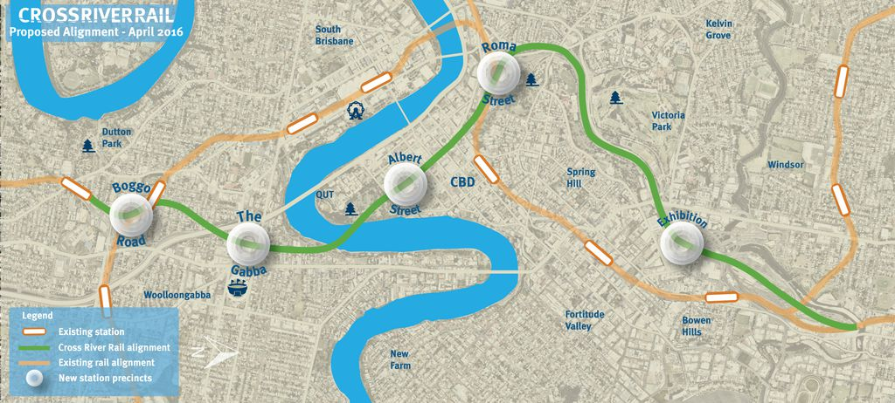
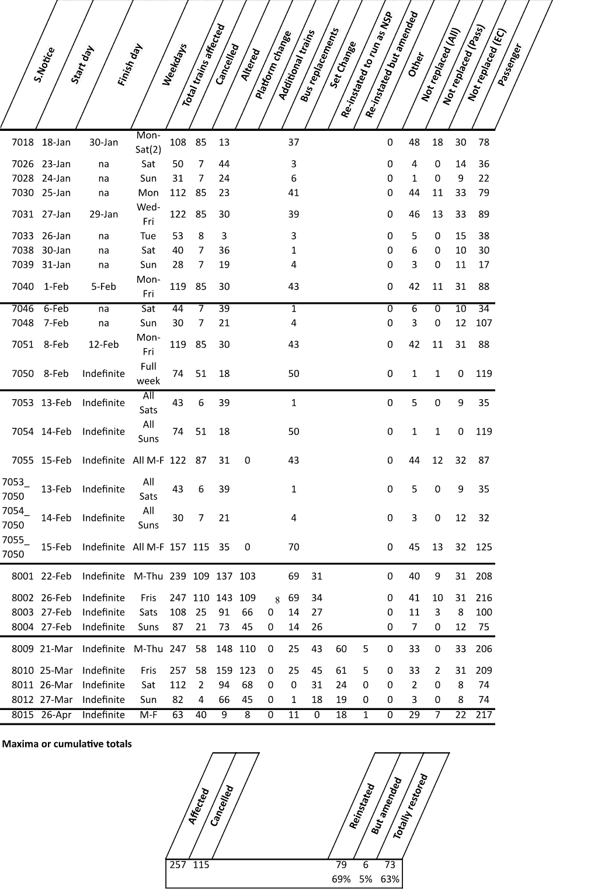

# *TABLE TALK*

**AUSTRALASIAN TIMETABLE NEWS**

**No. 285, May 2016 ISSN 1038-3697, RRP \$4.95**

**Published by the Australian Timetable Association**

[**www.austta.org.au**](http://www.austta.org.au)

# **RAIL AND TRAM NEWS**

**A Public Transport Election?**

A Federal election is expected on 2 July. It is likely that railway and
public transport issues will figure to a significant extent. The Prime
Minister, Malcolm Turnbull, has placed the construction of a very fast
passenger train, Melbourne-Sydney, and eventually Brisbane, back on the
national agenda. The main front page story in the national daily, the
*Australian* on 11 April was clearly a government-inspired story. It
said “A key plank of the government’s infrastructure and cities policy
will be to use high-speed rail developments to encourage population
growth in regional centres and ease growth pressures in Sydney and
Melbourne”. The article, however, also said that a railway to Badgerys
Creek Airport in Western Sydney was the Federal Government’s top
priority.

The election campaign is also likely to bring forward promises by both
sides for funding of urban public transport projects.

On 29 April the Mr Turnbull, announced a plan to harness the money and
skills of private enterprise to help deliver his “smart cities” plan and
its improved rail and road connections. Much of the money would come
from the “value capture” produced by major projects. When completed, the
projects increase the value of associated real estate, boosting revenue
to state authorities. Not much of the funding will actually come from
the Federal Government itself.

Mr Turnbull announced \$50 million for studies into major infrastructure
proposals, including Melbourne’s controversial Metro Tunnel rail
project.

At the core of the policy is the 30-minute city, in which residents can
get to schools, shops, work, hospitals and other essential destinations
within half an hour, preferably by public transport, bicycle paths and
footpaths rather than a private car. It is part of a recognition that 15
million Australians live in capital cities, with two thirds of the
national population in major metropolitan centres, producing 80%t of
GDP. And those cities are hugely inefficient with their wealth creation
hampered by traffic congestion and high costs. Further, they can be
uncomfortable places for residents who have to struggle with outdated
transport routes to get to work. For example, about 40% cent of Sydney’s
jobs growth is in the city centre.

In addition, it is strongly predicted that the Federal Budget on 3 May
will include appropriations to commence work on the Brisbane-Melbourne
Inland Freight Railway.

The Federal Government has foreshadowed that a decision on the future of
the ARTC will be announced in the Federal Budget of 3 May. This may
involve privatisation, and/or may involving breaking up the Corporation.

The Budget decisions will be reported in next month’s edition of *Table
Talk*. They will also be reported – immediately – in a special edition
of ***Table Talk Newswire***. *Table Talk Newswire* is sent via email
and appears between each month’s hard copy edition of *Table Talk*.
*Table Talk Newswire* is available to ATA members upon request to the
editor at ***[abvi@iinet.net.au](mailto:abvi@iinet.net.au)***

**Melbourne-Sydney Fast Rail**

A new version of the plan that will not die, a fast train between
Melbourne and Sydney was put to the Prime Minister, Malcolm Turnbull, at
a meeting on 31 March. Consolidated Land and Rail Australia is a
Melbourne-based company with directors in Victoria and NSW that will
make an "unsolicited offer" which it says will help "reshape Australia".

The plan - the latest in a string of proposals since the 1990s - has
been enthusiastically embraced by the federal MP for Bennelong and
former tennis champion John Alexander, who heads a Federal Parliamentary
committee looking at how transport can better stimulate economic
activity. Mr Alexander said the company was genuine in its plan, which
is understood to involve the firm buying or taking options on land in
regional towns near where the rail line would run.

Mr Alexander said Consolidated Land and Rail Australia had links to a
major American investment group. He said the group was one of "three
separate groups who are looking at similar ideas, of securing land in
the corridor between Sydney and Melbourne". The inquiry Mr Alexander
chairs is analysing the effect of light rail, metro rail and high speed
rail on the value of real estate, and how to capture the increased value
arising from improved transport links. "There are a number of groups
that are looking at securing their own land at the current price,
funding the infrastructure and then paying for it in the uplift of the
properties," he said.

A federally funded study into high-speed rail on Australia's east coast
in 2012 identified Mittagong, Canberra, Wagga Wagga, Albury Wodonga and
Shepparton as likely stops between Sydney and Melbourne. The train
between Melbourne and Sydney takes 11 hours, while the air corridor
between the two cities is said to be the fifth busiest commercial route
in the world. The last attempt involved an initial Sydney-Canberra link,
but failed in 2000 when the Howard government baulked at its \$4.5
billion price tag.

**Queensland Rail: Kippa Ring line opening**

It is believed that operations on the new 12.6 km Petrie – Kippa Ring
will commence on Monday 11 July. On the preceding weekend, there is
likely to be opening celebrations with free travel.

The first electric test trains operated on the line on 16 March. On
Saturday 23 April two 12 car EMU trains (one ac, one dc) were used to
for high voltage performance testing on the new Kippa Ring line,
including parallel running on the double track. A copy of the special
train notice is available from ATA’s May Distribution List.

**Brisbane Cross-River rail tunnel**

On 7 April Queensland Deputy Premier and Transport Minister Jackie Trad
revived the Brisbane Cross-river rail project, announcing a revised
route and a proposal to set up a statutory authority she said would
deliver the infrastructure free of political interference. Ms Trad could
not say how much the state government would contribute for the project’s
latest version beyond the \$5 million it had budgeted to draw up a new
business case, and would not say whether the state would borrow to fund
the project, adding to its \$80bn debt. “I’m not ruling anything out,
I’m not ruling anything in,” she said.

A Cross River Rail Delivery Authority will be established to find \$5.2
billion in funding for what is at least the third major version of the
rail project. The 10.2 km route would run from Dutton Park to Bowen
Hills, with a 5.9 km tunnel under the Brisbane River and new stations at
Boggo Road, The Gabba, Albert St and the Exhibition. Brisbane CBD's only
cross-river-rail crossing, the Merivale bridge, is nearing capacity.

Both major parties acknowledge something must be done to shift the
increasing number of commuters from one side of the river to the other.
Government modelling shows rail demand will almost triple by 2026, with
the system at capacity by 2021. The Newman government scrapped the
project — turning down the offer of federal funding — in favour of a
\$5bn bus and train tunnel that was to be part-funded by privatisation.

Ms Trad said the state would seek funding from the Brisbane City
Council, the Federal Government and the private sector. Infrastructure
Australia has said the project would be needed in the next five years.
Although Bill Shorten has labelled it Labor’s “No 1 infrastructure
project for Brisbane”, he would not say how much the Commonwealth should
commit.

Transport Minister Stirling Hinchliffe said if the second crossing were
not built, “we’ll be sitting in traffic for years”.

A website has been established for this project at
<http://www.crossriverrail.qld.gov.au/>

**Queensland Rail: Western line upgrade**

On 6 April Queensland Treasurer Curtis Pitt and Minister for Transport
Stirling Hinchliffe announced \$2.5 million expenditure to upgrade rail
sidings on the Western line, and re-open part of the Cecil Plains branch
(closed in 1994) to support the expansion of Oakey Beef Exports. This
will allow the movement of cattle by rail from Quilpie, Charleville,
Morven, Roma and Mitchell, to Oakey. “I have asked Queensland Rail to
start planning activities immediately and begin work to upgrade the
infrastructure within six months,” Hinchliffe said.

**Carmichael mine and railway**

On 3 April the Queensland Premier announced her Government’s approval of
coal mining leases to Indian company, Adani. This is a significant step
in this giant project’s progress towards its Central Queensland coal
mine and railway to the coast near Mackay. However there are still
further approvals and legal challenges to be resolved.

**Aurizon: Track diagrams**

Aurizon has updated its infrastructure and line diagrams of the Central
Queensland coal network to December 2015 – see
<http://www.aurizon.com.au/~/media/aurizon/files/what%20we%20do/network/network%20downloads/reports%20and%20qca/review%20of%20rail%20transport%20infrastructure%20and%20line%20diagrams%20-%20december%202015.ashx>

**Newcastle tram**

Transport for NSW has identified ten options for an extension of the
planned 2·6 km light rail line in Newcastle. These have been published
for public consultation. Major works on the initial line linking Wickham
and Pacific Park are expected to start in early 2017. Passenger services
would start in 2019, replacing the heavy rail line into the city centre,
which was closed at the end of 2014. An area of 5 km around the city
centre has been identified for possible extensions, as this is
relatively flat and has a high population and employment density. Four
routes at the western end of the initial route are being studied:

-   Wickham – Broadmeadow;
-   Broadmeadow – Stadium;
-   Broadmeadow – Adamstown;
-   Wickham – Mayfield.

In addition, Transport for NSW says that community feedback has
identified a further six options:

-   Wickham – John Hunter Hospital;
-   Warrabrook – University;
-   Wickham – Newcastle Airport;
-   Broadmeadow/Stadium – Lake Macquarie Transport Interchange;
-   city centre – Merewether/Bathers Way;
-   a loop through Pacific Park, Newcastle Mall and Hunter St.

**NSW TrainLink economies**

The long-distance part of NSW TrainLink is to introduce economies,
including reducing staffing at all stations:

-   TrainLink travel centres at Strathfield and Parramatta were closed
    from 16 February.
-   Sale of combined travel and accommodation packages ceased from 1 April.
-   Staff numbers will be reduced at Albury, Armidale, Bathurst,
    Canberra, Casino, Coffs Harbour, Cootamundra, Dubbo, Goulburn,
    Grafton, Gunnedah, Junee, Kempsey, Narrabri, Orange, Sydney,
    Tamworth, Taree, Wagga Wagga and Wauchope.
-   Staff will be removed entirely from Blayney, Broken Hill (which has
    merely one TrainLink train a week, but has TrainLink buses), Byron
    Bay (which has no trains, but TrainlLnk buses), Griffith (which has
    merely one TrainLink train a week, but has TrainLink buses), Lismore
    (which has no trains, but has TrainLink buses), Macksville,
    Murwillumbah (which has no trains, but has TrainLink buses),
    Nambucca Heads, Parkes (which has merely one TrainLink train a week,
    but has TrainLink buses), Wellington and Yass Junction.
-   The Central Reservations Centre at Broadmeadow will be downgraded
    and reservations diverted, as far as possible, to an
    upgraded website.
-   The hours of the Sydney travel centre will be reduced.

The aim is to have passengers, as far as possible, use TrainLink’s
website to book their travel.

It was also proposed that the number of ticket agencies be reduced and
that the commission paid to ticket agencies be reduced from varying
amounts (depending upon when the contract was signed) to 10%. However,
after existing agencies had to submit new tenders, TrainLink decided
that “all current ticket agency arrangements will remain in place and
unchanged.”

**Sydney Trains & TrainLink: Royal Easter Show**

The Sydney Royal Easter Show was held at the Showgrounds, near Olympic
Park station, from Thursday 17 March until Wednesday 30 March. It is
estimated that the event was attended by 850,000 people, of whom 450,000
(53%) travelled by train. Of these 234,000 (52%) were estimated to
travel from suburbs east of Olympic Park, and 216,000 (48%) from suburbs
west of Olympic Park.

During the event, the shuttle train service from Lidcombe to Olympic
Park continued to operate on weekdays at its usual ten minute frequency.
In addition on weekdays:

-   Direct trains from Central to Olympic Park were provided from 0736
    until 1021 approximately every 20 minutes by using otherwise empty
    TrainLink trains returning to Flemington Car Sheds, and from 1300
    until 2200 every 20 minutes.
-   Blue Mountains trains stopped at Lidcombe between the peaks.

On weekends (including the Easter weekend):

-   Direct trains operated from Central to Olympic Park from 0830 until
    2400 every 8 to 10 minutes.
-   Lidcombe to Olympic Park shuttle trains operated every ten minutes
    from 0530 to 0900.
-   Two trains an hour operated from Penrith to Olympic Park between
    0900 and 2400.
-   Two trains an hour operated from Blacktown to Olympic Park between
    0900 and 2300.
-   Two trains an hour operated from Schofields to Olympic Park between
    0910 and 2400.
-   Two additional trains operated from Hamilton (at 0659 and 0756) to
    Olympic Park (arriving at 0920 and 1040).
-   An additional train operated from Wyong (at 0845) to Olympic
    Park (1031).
-   Two Central (1845 and 1945) to Gosford trains were extended
    to Wyong.
-   An additional train operated from Hamilton at 1306 to Dungog,
    returning at 1517.
-   Blue Mountains and Bathurst trains stopped at Lidcombe.
-   The 1718 Central to Mt Victoria was extended to Lithgow.
-   Two additional trains operated from Central (at 1848 and 2148) to
    Mt Victoria.
-   An additional train operated from Campbelltown (at 2357) to
    Moss Vale.
-   Many interurban trains ran with additional carriages.

There was no trackwork on the Sydney network during the period of the
Show.

ShowLink tickets, which cover travel and admission, were not available
from stations. These are now only sold on line or from Woolworths
supermarkets!

The arrangements were detailed in STN 0248-2016 for 17-18 March, STN
0247-2016 for 19-20 March, STN 0249-2016 for 21-24 March, STN 0250-2016
for 25-28 March and STN 0251-2016 for 29-30 March. Arrangements were
summarized for staff in a 16 page Event Readiness Plan. This covered
train services, ticketing, other major events in Sydney during the
period, and emergency contact details. Copies are available from the May
ATA Distribution List.

**Sydney Metro**

The NSW Government has launched the tender process for the construction
of new twin railway tunnels from Chatswood to Sydenham, under Sydney
Harbour and the CBD, as part of the second stage of the Sydney Metro
project. The first of five giant boring machines are due to start
tunnelling by the end of 2018.

From Sydenham to Bankstown the existing railway will be converted to
Metro. Tens of thousands of commuters will be forced to catch buses each
day for more than six months while the line is converted. Transport
Minister Andrew Constance said the government would try to minimise the
length of time the 13.5 km line would be out of action but conceded that
it would "pose a challenge". "It is going to be a disruptive time – I
won't sugar-coat that," he said. The time-frame for the temporary
closure has yet to be finalized, but Mr Constance said it would not be
for several years. More than 25,000 people travel on the Bankstown Line
during the morning peak between 0600 and 0930. Train stations will need
to be [renovated and tracks and platforms
straightened](http://www.smh.com.au/nsw/builders-of-sydneys-new-metro-line-need-to-straighten-out-curved-platforms-20151204-glfks3.html)
to handle the new trains. Mr Constance said the conversion was likely to
take longer than six months and would "mean changes for commuters during
the build of the project". "We are working through that ... but at the
end of the day those commuters are going to get a brand new metro
service," he said. The planning process for the Bankstown to Sydenham
line is due to start later this year.

Driverless metro trains will begin running on the first stage of
Australia's largest commuter rail project between Cudgegong Road station
in the city's north-west and Chatswood in 2019. From Chatswood to
Bankstown via the CBD and Sydenham is scheduled to be operational by
2024. Before the \$8.3 billion first stage is completed, thousands of
commuters who travel by train on the existing line between Chatswood and
Epping will also have to catch buses for about seven months from late
2018 while it is converted to carry metro trains. The Epping to
Chatswood line via Macquarie Park carries about 8000 passengers during
the morning peak.

**Sydney Tram extension?**

A study into expanding the CBD to South East Light Rail to La Perouse
via Maroubra Junction, has been commissioned by the NSW Government. The
12 km line now being built from Circular Quay will terminate at
Kingsford, but proposals to extend the network have been included in a
variety of transport planning reports for a number of years. An
engineering firm has been asked to look into the viability of building
an 8.2 km line along Anzac Parade from Kingsford, through Maroubra
Junction, and Malabar and then on to the northern shores of Botany Bay.

Construction of the extension could be justified because it would pass
close to major new residential developments near the old Prince Henry
Hospital site at Little Bay. It would also skirt the massive Long Bail
jail complex, which the government is considering closing down and then
selling the land off to developers. The Government already has plans to
increase “urban density” along Anzac Parade.

Once the CBD to South East Light Rail is operating in early 2019,
commuters living south of Kingsford who work in the CBD will have to
catch a bus and transfer to the tram for the ride into the city. It is
estimated up to 2000 people are expected to change in the two peak
morning hours at the interchange on Anzac Parade, just south of the
Rainbow Street roundabout.

In its “Sydney’s Light Rail Future” document released in December 2012,
the Government said “longer term investigations” would include
feasibility studies of light rail “priority” corridors including Anzac
Parade to Maroubra. And in its report responding to submissions made to
the Sydney light rail environmental impact statement, Transport for NSW
wrote in January 2015 that: “The Kingsford interchange does not preclude
the option of an extension (to Maroubra Junction) in the future”.

Until the 1960s, trams ran along Anzac Parade to La Perouse and most of
the tram corridor is still in place.

**Aurizon: Enfield intermodal centre**

Aurizon will start operations at the Enfield Intermodal Logistics Centre
(ILC) in Western Sydney from Monday 9 May. The relocation of Aurizon’s
intermodal freight business from its current location at Yennora to
Enfield will allow the Company to expand its interstate service and
paves the way for the introduction of port shuttle services. The site
supports longer trains, improved scheduling and cycle times, and less
train shunting. It means faster transit time on the Melbourne, Brisbane
and North Queensland corridors and gives us an opportunity to target
increased volumes for both north-south and east-west interstate
operations.

The 60 hectare Enfield ILC is a ‘turn-key’ site is 18 km from Port
Botany via the Metropolitan Freight line and with direct access to the
interstate mainline corridor. It is in close proximity to the M4 and M5
motorways. It includes an intermodal terminal, warehousing and buildings
with vacant land for the development of rail related warehousing,
freight forwarding, import-export (IMEX), transport and distribution
facilities.

With the move to Enfield there will be:

-   Later terminal cut off times for outbound services
-   Earlier freight availability times for movements into Sydney
-   Three services per week with a four day transit from Sydney to Perth
    including the premium delivery windows of Monday, Tuesday and Friday
    into Perth
-   An additional service ex-Melbourne to Sydney on Friday (6MB7), with
    freight availability in Sydney on Saturday at 0930
-   Transit times for container movements between many locations and
    Sydney reduced by up to 24 hours
-   Number of trains servicing Sydney increased from 10 to 12 services
    per week (6 x northbound and 6 x southbound)
-   Future development of a rail shuttle and import-export service
    between Port Botany and Enfield.

**New South Wales country freight rail**

On 1 April the NSW Minister for Roads and Freight Duncan Gay announced
that Expressions of Interest are open for nomination of projects under a
\$15 million Fixing Country Rail pilot program. He suggested that
producers, councils, transporters, intermodal terminal operators and
infrastructure managers could apply for such things as rail sidings,
passing loops, opening unused lines and track upgrades.

**ARTC: Train Order in NW NSW**

Commencing from 15 April the Phoenix Train Order system was implemented
on the following lines:

-   Turrawan-Moree-North Star
-   Camurra-Camurra West
-   Werris Creek (Gap)-Merrygoen
-   Gulgong-Merrygoen-Dubbo
-   Dubbo-Narromine-Goobang Junction.

Once all these lines were converted to Train Order, ARTC’s Network
Control Centre North at Newcastle comprises the following boards:

-   Port Waratah Islington and Port Waratah to Sandgate
-   Kooragang Kooragang Island to Sandgate
-   Lower Hunter Sandgate to Allandale, Telerah and Bloomfield branch
-   Middle Hunter Allandale to Singleton and Mt Thorley, Bulga and Wambo
    branches
-   Upper Hunter 1 Singelton to Mangoola and Aberdeen
-   Upper Hunter2 Aberdeen to Werris Creek
-   Upper Hunter 3 Mangoola to Gulgong
-   North Werris Creek to Turrawan
-   Coast A Telerah to Kempsey
-   Coast B Kempsey to Acacia Ridge
-   Coast C (Mondays-Fridays 0700 to 1500 only) Taree to Boambee Beach
-   Train Order Control The lines specified in the first paragraph.

ARTC SAFE Notice 2016 2-2538 refers.

**Victoria’s Railway-orientated Budget**

The Victorian Government presented a strong Budget on 27 April,
reflecting the present position of Victoria as the fastest growing State
in the country. It was very much a public transport Budget with a large
part of the expenditure proposals directed to Railways. (The Budget was
brought forward by a week to avoiding clashing with the Federal Budget
when the Feds brought their Budget forward to 3 May). Much of the
proposed expenditure, not surprisingly, is for projects already
announced, including some very big projects:

-   Melbourne Metro tunnel from North Melbourne to South Yarra via a
    north-south tunnel across the City (\$2.86 billion over four years
    towards an eventual total expenditure of \$10.9 billion),
-   65 additional electric multiple unit high-capacity trains and a
    depot at Pakenham East (\$875 million),
-   Five Xtrapolis electric multiple unit trains (\$105 million),
-   Removal of 50 level crossings,
-   Extension of the South Morang line to Mernda (\$588 million).

Also announced were:

-   Upgrading the Hurstbridge line, mainly duplication from Heidelberg
    to Rosanna Junction. A new tunnel will be built alongside the
    existing tunnel (\$140 million),
-   Fire safety and intruder detection in the City Loop (\$134 million),
-   Upgrades to Frankston station (\$50 million),
-   Upgrading the Ballarat line, comprising duplication and eventual
    electrification from Deer Park West Junction to Melton (17 km),
    additional platforms at Bacchus Marsh and Ballan, extended platforms
    at Rockbank, additional crossing loops at Bacchus Marsh, Ballan and
    Bungaree (this seems to mean the replacement of the former longer
    original line near Bungaree - the North Loop), conversion of the
    existing two single lines from Warrenheip to Ballarat East to double
    line and stabling facilities at Melton and Rowsley (\$518 million),
-   Once the preceding works are completed, two additional peak services
    on the Ballarat line, and forty minute off-peak frequency,
-   Upgrades to Bendigo and Eaglehawk stations (\$15.8 million),
-   Increased capacity and off-peak services on the Bendigo line (\$2
    million),
-   An additional off-peak service on the Maryborough line on weekdays,
-   North East line improvements, including refurbishment of
    rolling stock. The present three five-carriage sets on this line
    will be replaced by four four-carriage sets. (This is probably for
    additional spare capacity, or possibly it may imply an
    additional service.) (\$15 million),
-   An additional service on the Shepparton line daily,
-   Upgrading stations on the Gippsland line, including bus interchanges
    and car parks (\$9 million),
-   Planning for line capacity improvements on the Gippsland line,
    mainly duplication Bunyip-Longwarry. (\$2.6 million),
-   Two additional off-peak services daily on the Gippsland line,
-   Planning for duplication South Geelong-Waurn Ponds (\$3 million),
-   Fifty additional services weekly on the Geelong line (presumably
    mainly an increase at weekends),
-   An additional service on the Warrnambool line on weekdays and on
    Sundays,
-   Investigation of transport options for Armstrong Creek, south of
    Geelong (\$3 million),
-   Planning for new VLine tracks Upfield to Somerton to provide an
    alternative route into Melbourne (\$5 million),
-   Additional VLocity carriages (\$27 million),
-   Regional rail maintenance (\$141 million),
-   Improved service standards for V/Line (\$198 million),
-   170 additional off-peak V/Line train services (\$131 million),
-   Development of next generation V/Line rolling stock (\$10 million),
-   Minor regional rail works (\$23.6 million),
-   Investigation of the strength of bridges on tram routes to ensure
    the bridges will be able to support E class trams,
-   Upgraded or new grain loading facilities and sidings at
    Warracknabeal, Beulah, Ouyen, Manangatang, Yarrawonga, Donald,
    Yelta, Wycheproof and Quambatook (\$8.5 million),
-   Bus service improvements (\$15.1 million) and new bus services,
    including a new service between Greensborough and Diamond Creek
    (\$10.1 million).

***Comment:*** *It is unusual, and very welcome, for an Australian budget
to contain so much expenditure on Railways.*

*When the Railway capital projects, and additional services, are all
implemented in a few years time, the timetable of V/Line services within
a large radius around Melbourne will be like a giant suburban system.*

**Victoria: Murray Basin project**

The Federal Government will contribute \$220 million for the Murray
Basin Rail project. This is from money left over from the failed
[East-West
project](http://www.abc.net.au/news/2016-02-17/east-west-link-toll-road-project-government-rules-out-revival/7176494)
in Melbourne. The scheme is to upgrade and standardise the rail network
in north and north west Victoria. The [Victorian Government has already
contributed \$220 million for the
project](http://www.abc.net.au/news/2015-08-17/rural-rail-updgrades-announced-for-victoria/6702978).

**Victoria: Additional freight services**

Qube’s twice weekly (Tuesday and Thursday) freight train at 0505 from
Westgate Port Siding, Melbourne to Shepparton has from 19 April been
extended from Shepparton to Tocumwal, arriving at 1045. In addition, it
now also runs on Saturdays (Westgate 0520, Tocumwal 1114). Similarly,
the afternoon Qube freight train from Shepparton, now originates from
Tocumwal at 1605 Tuesdays and Thursdays. In addition, it now also runs
on Saturdays, when it departs Tocumwal at 2200.

Commencing Saturday 23 April, Qube’s Kilmore East-Brooklyn quarry train
will operate on weekends as well as weekdays, as follows: Brooklyn
Hanson Siding depart empty on Saturdays at 0925 and at 1820; Kilmore
East Quarry siding depart Saturdays 1230 and 2130.

**Melbourne level crossing removal**

A consortium including Lend Lease, CPB Contractors, WSP|Parsons
Brinkerhoff, and Aurecon has formally signed a \$1.6 billion contract to
remove nine level crossings and re-build five train stations on the
Cranbourne-Pakenham line. The nine crossings – which together make up
every level crossing between Caulfield and Dandenong – are some of
Melbourne’s worst with some boom gates down for more than 87 minutes of
the two-hour morning peak. The project will remove the crossings, and
rebuild stations at Carnegie, Murrumbeena, Hughesdale, Clayton and Noble
Park.

Thirty station platforms along the line will also be lengthened to cater
for the 37 new high-capacity metropolitan trains, which are currently in
the process of being tendered. The three sections of newly elevated rail
along the line will create 225,000 square metres of community open
space, which Andrews says will be reserved for new parks, playgrounds,
sporting facilities, car parking and a range of other uses chosen by
locals.

The Victorian Government has committed to remove at least 20 of the
state’s most dangerous level crossings by 2018, and 50 by 2022.

**Melbourne: Franchise extensions for Metro Trains and Yarra Trams**

On 29 February Public Transport Victoria issued the following statement:
**“**The current franchise agreements for Melbourne's train and tram
services expire in November 2017. Both Metro Trains and Yarra Trams have
satisfied the necessary conditions in the current contract, which give
them the right to negotiate exclusively with Government to extend the
franchise for a further seven years. Should appropriate terms not be
reached, Government may pursue alternative options.”

**Metro Trains Melbourne: Underground loop**

The Victorian Government will spend \$134 million over three years to
improve safety and security on Melbourne Metro’s city loop. Public
Transport Minister Jacinta Allan announced the funding on 11 April, to
respond to a 2012 safety report from the Victorian Ombudsman. This
recommended a number of safety improvements in the three underground
stations and four tunnels which make up the loop, the heart of the
city’s metropolitan rail network.

“The works will ensure passengers can get to work on time, and home safe
and sound again at the end of the day,” Ms Allan said. “This is the
vital safety upgrade that the city loop needs now, while we get on with
the project that the city loop needs for the future – Melbourne Metro
Rail.” The \$134 million will be spent over three years to install
state-of-the-art intruder detection technology. It will also see the
installation of more CCTV cameras, alarms and platform barriers to
better prevent and detect trespassers on the network. “Sprinkler systems
in Melbourne Central, Parliament and Flagstaff stations will be
upgraded, and a smoke management system will be installed, to keep
passengers safe in the event of a fire”, the Minister added.

**Metro Trains Melbourne: End of Daylight Saving**

The end of Daylight Saving on Sunday 3 April meant, of course, that
there was one additional hour in the early morning. Since January
Melbourne public transport has operated during the night on Friday and
Saturday nights. Metro Trains Melbourne therefore added one extra
service on all lines. Circular S.2400/16 provided the timetables, and is
available from the April ATA Distribution List.

**Metro Trains Melbourne: Belgrave line temporary closure**

Level crossing removal at Bayswater will result in a closure of the
complete Belgrave line (Ringwood-Belgrave) for six weeks from November
to mid December.

**Metro Trains Melbourne: Peak hour chaos**

On 27 April the afternoon peak on the very busy
Lilydale/Belgrave/Alamein lines was in chaos after a man was hit by a
train near Burnley station. Trains were replaced by buses from Burnley
to Camberwell.

**Yarra Trams: Short shunting**

Thousands of passengers are affected on an average of 243 services a day
as Yarra Trams short-shunts tram services so as to maintain its
timetable. While it is used to avoid a knock-on effect on services
during disruptions, the Rail, Tram and Bus Union said the tactic is also
used to hit targets and avoid paying fines. In 2015, about 88,452
services were terminated early — 5.4% of all services. The figure has
been rising over the last five years and jumped from about 78,624 (4.8%
of services) in 2014. Yarra Trams says 80% of Melbourne’s tram network
was on shared roads and accidents, emergency incidents, protests and
traffic jams caused service delays daily.

Protesters are being blamed for many of the disruptions bringing city
passengers to a halt. Passengers were disrupted on 330 services in July
2015 as police had to use capsicum spray when right-wing group Reclaim
Australia clashed with demonstrators from anti-racism groups and
anarchists. And a protest outside Flinders St station in the PM peak led
to 1000 services cancelled for an indigenous rights rally.

Yarra Trams was fined more than \$5.08 million for its poor performance
between October 2014 and December 2015.

**Victorian Fares and Ticketing Manual**

The Victorian Fares and Ticketing Manual dated 1 January 2016 is
available at
<http://www.ptv.vic.gov.au/assets/PTV/PTV%20docs/Ticketing/PTV_Fares-and-Ticketing-Manual-General_2016.pdf>
and the Regional Bus Fares Supplement is at
<http://www.ptv.vic.gov.au/assets/Regional-Bus-Fare-Supplement_Jan2016_WEB.pdf>

**ARTC: East-West line**

The extension of Diapur Loop in Western Victoria was commissioned
between 18 and 22 April.

**V/Line: Civil engineering**

The first tracks for the kilometre long Rowsley Loop on the Ballarat
line were laid in mid April.

On the weekend of 16 and 17 April rail on the Goulburn River bridge at
Mooroopna was replaced, as was rail near Heathcote Junction and Kilmore
East, including the removal of mud holes. Seymour and Shepparton trains
were replaced by buses.

**V/Line crisis**

At a hearing of the Victorian Parliamentary Standing Committee on the
Economy and Infrastructure on 23 February, Gary Liddle, Interim CEO
V/Line and Jeroen Weimar, Acting CEO Public Transport Victoria,
emphasised a number of times that full restoration of V/Line train
services was expected on 20 July. This involves progress with
installation of new wheels on VLocities, rail replacement in places,
increased rail lubrication, and installation of axle counters on Metro’s
Pakenham line.

Mr Liddle also confirmed to the hearing that at the height of the
crisis, bus replacements of trains were costing up to \$300,000 a day.

The Monash University Institute of Rail Technology has provided its
report on the causes of the excessive wheel wear on VLocity DMUs. This
was found to be caused by tight curves and high friction between rail
and wheels – especially on the North Melbourne flyover - low wear
resistance materials in tracks and wheels. The report recommended easing
curves, especially on the North Melbourne flyover, more resistant
materials and better lubrication of rails. Mr Liddle said the
recommendations will be taken on board and implemented. The report can
be accessed at
<https://corporate.vline.com.au/getattachment/News-Alerts/Media-Releases/Release-of-report-into-VLocity-wheel-wear-%281%29/Monash-IRT-Report-April-2016.pdf>

There had hitherto been no lubricators on V/Line tracks. However, V/Line
trains, including VLocity DMUs, had benefited from lubricators on Metro
tracks. This ceased when the Regional Rail Link opened.

From Tuesday 26 April, ten more services were restored as trains, rather
than operated by buses. This means 97% of services are restored. There
are still 11 services operated as bus substitutions: four on the Bendigo
line, four on the Geelong line, two on the Traralgon line and one on the
Ballarat line.

**Weekday services from 26 April are:**

**Geelong** line: Six more services were reinstated as trains, bringing
the weekday total to 104. Trains will return to:

-   0651 Waurn Ponds to Southern Cross
-   0840 South Geelong to SC
-   1730 Waurn Ponds to SC
-   0710 SC to South Geelong
-   1610 SC to Waurn Ponds
-   2315 SC to Waurn Ponds.

Four Geelong line services are still replacement buses:

-   0716 Wyndham Vale to SC
-   0804 South Geelong to SC
-   0625 SC to Wyndham Vale
-   1740 SC to South Geelong.

**Ballarat** line will have two more weekday services reinstated as
trains, bringing the daily total to 72 trains. Trains will return to the
1915 SC to Wendouree and 2110 Wendouree to SC.\

The only train replacement bus service on the Ballarat line will be the
1537 SC to Melton.

**Bendigo** line will have two weekday services reinstated as trains,
bringing the daily total to 37 trains with four services operated by
replacement buses. Trains will return to the 0507 Bendigo to SC and 1625
SC to Eaglehawk.\

Replacement buses still operate four services:

-   0622 Eaglehawk to SC
-   0721 Kyneton to SC
-   1704 SC to Kyneton
-   1731 SC to Epsom

On the **Gippsland** line, trains operate 34 of the 36 weekday services.
The only bus replacement services are the 1120 SC to Traralgon and 1615
Traralgon to SC.

Normal services continue to be scheduled on the **Seymour** line (40
trains per day). Weekend services on all lines are scheduled to run as
trains. Circular S.16/8015 provides details. The following table by
**Geoff Lambert** summarises changes since the crisis began:

(NSP = Network Service Plan, ie, Working Timetable. EC = Empty
Carriages.)

**Pacific National: Leigh Creek coal trains end**

The last coal train from Leigh Creek to Port Augusta operated on 29
April. It was 160 wagons, more than 1000 tonnes and 3 km in length. The
coal mine at Leigh Creek has now closed, and the associated electricity
power station at Port Augusta will close soon. It is expected that this
line, 250 km, will also close.

**Adelaide trams**

Labor will work with SA to deliver a massive expansion of Adelaide’s
tram network, if it wins at this year’s federal election, Anthony
Albanese, shadow minister for infrastructure and transport, says.
AdeLINK, which appears on Infrastructure Australia’s current
Infrastructure Priority List, is an ambitious plan to revive a tram
network. The SA Government wants to build six new lines:

-   **PortLINK** would convert the existing Outer Harbor railway line to
    Outer Harbor, Port Adelaide and Grange, and construct new tram lines
    to West Lakes and Semaphore
-   **EastLINK** would be a tram line running along The Parade to the
    University of SA campus at Magill
-   **WestLINK**, which would incorporate the existing Glenelg Tram,
    would create a line running along Henley Beach Road to Henley
    Square, with a branch to Adelaide Airport
-   **ProspectLINK** would be a tram line running from Grand Junction
    Road along Prospect Road and O’Connell St
-   **UnleyLINK** would run along Unley Road and Belair Road to Mitcham
-   **CityLINK** would run in a continuous loop at regular intervals
    along Morphett St, Sturt St, Halifax St and Frome St with transfers
    available from other tram lines and railway stations.

While he said the network may be cheaper to build than in other cities,
thanks to Adelaide’s relatively flat topography, and relatively wide
roads, Albanese conceded that projects like AdeLINK are not cheap. The
shadow minister indicated the project should be funded in part through
value capture. Albanese’s other priority is an upgrade of the railway
between Gawler and Adelaide, a project Labor committed to fund late last
year. The Gawler line is expected to see a near-doubling of patronage by
2031. The proposed initiative is to electrify the line, and install a
new signalling system.

**Adelaide Metro: Line closures**

Another fault in the electrification system – unexplained – caused
cancellation of trains on the Seaford and Tonsley lines on 28 April. The
fault continued the next day, Friday, when train services were cancelled
on the Grange line, so that Diesel Multiple Units could be diverted to
the Seaford line. Buses ran Seaford-Brighton, and DMUs
Brighton-Adelaide. The substitute services on all three lines were free.

**Perth Airport Railway**

Public Transport Authority of WA on 28 April announced the finalisation
of a \$1·176 billion contract to build the Forrestfield-Airport Link in
Perth. A joint venture of Salini Impregilo and NRW was selected as
preferred bidder in February. It will build 8  km of twin bore tunnels
and three stations, and maintain the tunnels and civil structures for 10
years after completion. PTA estimates that the project will create 600
direct jobs.

Due to open in 2020, the 8·5 km line will leave the Midland Line east of
Bayswater, cross the Swan River and serve stations at Belmont, Airport
Central and Forrestfield. As it is an extension of the city’s 1.067  mm
gauge suburban network that will use existing rolling stock, the project
is envisaged as being fully funded by the state rather than being
tendered as a PPP contract. The Federal Government recently contributed
A\$490m towards the project. Early work worth \$370m is already
underway, including geotechnical work, contract management and land
purchases. In November 2015 a bus route was introduced between the city
centre and the airport as an interim service.

**Public Transport Authority of WA: Network data book**

The PTA of WA’s Network & Infrastructure Access & Information Book
showing the characteristics of the Perth suburban network has been
revised to February 2016 – see
<http://www.pta.wa.gov.au/LinkClick.aspx?fileticket=8mzih5xn9bk%3d&portalid=0&timestamp=1456292906441>

**Brookfield Rail: Network data maps**

Most of the maps on Brookfield Rail’s website showing characteristics of
the WA rural network have been revised to March 2016 – see
<http://www.brookfieldrail.com/about-us/our-network/network-specifications/>

**Rio Tinto: Automation delayed**

Rio Tinto announced on 19 April that its AutoHaul project to convert its
Tom Price heavy-haul railway in the Pilbara to driverless operation is
taking longer than expected. Rio Tinto was due to submit AutoHaul for
regulatory approval and complete full system functionality this year,
but it says "some delays are being experienced." As a result, Rio Tinto
says that iron-ore production in the Pilbara "is now expected to be
between 330 and 340 million tonnes in 2017" rather than its earlier
forecast of 350 million tonnes.

Rio Tinto is investing in automation and other improvements to its
heavy-haul lines in the Pilbara so that it can increase capacity without
the need to purchase additional rolling stock. AutoHaul is part of Rio
Tinto's Mine of the Future project launched in 2008 which also includes
automated trucks and drilling. Testing of AutoHaul [started in
2014](http://www.railjournal.com/index.php/signalling/rio-tinto-gets-set-for-automated-heavy-haul-tests.html),
and throughout 2015 AutoHaul-fitted locomotives were trialled on the
network to test onboard systems, signalling, safety mechanisms and
communications with the Rio Tinto operations centre in Perth. Rio Tinto
says that "over 75,000km of mainline trials have been completed" so far.
Once operational, Rio Tinto says this will be the world's first
fully-autonomous heavy-haul, long-distance railway system.

**Auckland City Underground**

Construction of the Auckland underground City rail link has been
advanced two years. Construction was expected to commence in 2020 but
will now commence in 2018. NZ Prime Minister John Key said this decision
is because “certain thresholds” have been reached. “Strong growth in
rail patronage since 2013 means it will reach the 20 million annual trip
threshold well before 2020. It’s become clear that we need to provide
certainty for other planned CBD developments affected by the CRL. This
means we see merit in starting the project sooner.” The line will run
from Britomart with stations at Aotea and Karangahape to Mt Eden.

**Auckland Transport: Timetable 8 May**

A new timetable from 8 May increases frequencies on the Western
(Swanson) line. After the morning peak, until midday, this was the only
line to still have 30 minute weekday frequencies. To accommodate the
increased frequency, some minor changes are also being made on other
lines:

### Western line:

-   every 10 minutes Monday to Friday peak 0600-09:00 and 1430-1900
-   every 20 minutes Monday to Friday 09:00-14:30
-   every 30 minutes weekends and public holidays

### Pukekohe shuttle:

-   Some services depart earlier
-   First Monday to Friday departure from Pukekohe at 0503
-   Extra Friday night service to Pukekohe departing Papakura at 2301
    (the connecting service departs Britomart at 2158)
-   All Pukekohe trains will depart from and arrive at platform 4 at
    Papakura

### Onehunga line: All weekday services depart a few minutes earlier. There are some minor changes to weekend times

### Southern line: Some changes to departure times 

### Eastern line: No changes.

**NZ Northland line to close**

KiwiRail proposes to close the Northland line from Kauri (13 km north of
Whangerei) to Otiria (the present terminus) in August. There is only one
customer, a woodchip producer, which will switch to road transport.

**Thanks** to Victor Isaacs, Geoff Lambert, Dennis McLean, Len Regan,
Brian Webber, *[www.railexpress.com.au](http://www.railexpress.com.au),
[www.railpage.com.au](http://www.railpage.com.au), Age, Australian,
Daily Telegraph, Herald Sun,* and *Sydney Morning Herald* for Rail news.

## **LETTER TO THE EDITOR**

**Geoff Mann** writes re the **V/Line crisis** (April *Table Talk)*: The
tight curves on the North Melbourne flyover have not been replaced. It
is only the worn rails replaced. For the curves to be replaced (i.e.,
straightened) a re-alignment will be required.

Re the **Flemington Racecourse line** (January *Table Talk)*: There is
actually more than a ‘handful’ of trains each year. There are about 23
race meetings pa. plus exhibitions, concerts and end of year exams for
which special services are usually provided. In my mind, it would have
been an ideal line to test high-capacity signalling due to intense
traffic at times and the line required re-signalling. The Sandringham
line was chosen - I have never heard the reason for this other than it
is an ‘isolated’ operation.

## **RECOMMENDED READING**

“Train Numbering & Some Safety Features” by John Armstrong in *Sunshine
Express*, published by the Australian Railway Historical Society
Queensland Division, March-April 2016, No. 569, Vol. 52, Part 2, pages
36-38. Provides some history and current practice of train numbering on
the Queensland Railways.

## **BUS NEWS**

**Australian Capital Territory by Victor Isaacs**

**CANBERRA TIMETABLING**

ACTION has identified that two Xpresso services operating during the
morning peak have been significantly impacted by traffic approaching the
area of Constitution Avenue and Barton Bus Station, leading to further
disruptions on the ACTION network. To reduce this impact, from Tuesday
26 April route 743 from Fraser Terminus at 0741 and route 717 from
Kippax Bus Station at 0752 have terminated at the City Bus Station.
Passengers continuing to Russell and Barton have been advised to change
to the high frequency Red Rapid 200 or routes 2, 3, 4 or 5.

**CANBERRA DREAMING**

The ACT Liberal Party has announced plans for a complete overhaul of
Canberra's bus network if they win the 15 October ACT election. They
promise six new express lines, a simplified timetable and routes
designed to mirror commuter driving patterns. The plans are in response
to the ACT Labor Government’s plans for a tramway in Canberra. Providing
a \$20 million boost to the ACTION operating budget, an incoming Liberal
government would create a Tuggeranong to Canberra Airport bus route,
link Canberra and Calvary hospitals with express services and increase
weekend and summer service frequency.

Frequent routes would run every seven minutes on weekdays from
Tuggeranong to Belconnen and Gungahlin to Fyshwick. At weekends and
nights, the lines would run every 15 minutes. Weekday ten-minute
services would run from west Belconnen to the city, Tuggeranong to the
airport, Tuggeranong to the city, Gungahlin to Belconnen, Woden to North
Canberra, and Woden to the city. A new Parkway Express would run from
Woden to Belconnen. Outside peaks, these services would run about every
20 minutes. Bus route numbers would operate across a seven day timetable
and late night services would run until about 0100 on Thursday, Friday
and Saturday nights.

New four-door articulated buses would be added to the fleet to increase
capacity and a \$2 million trial of electric buses would be launched. A
Liberal government would build a new depot, possibly adapting plans for
a tram facility to be built at Mitchell. A separate annual \$75,000
technology and innovation fund would also be established for future
improvements.

The Opposition has pledged to tear up contracts for the Government's
city to Gungahlin light rail stage one and say they will make further
announcements about Northbourne Avenue before the October election.

No patronage targets or firm timeline is attached the opposition policy.
The Liberals say many of the changes would be in place within a year of
a Liberal government coming to power at the October election. ACTION's
budget would grow to about \$160 million under the plan, including
revenue diverted from the Capital Metro Agency. A Liberal Government
would not privatise ACTION. Daily passengers would be rewarded with free
travel after eight paid journeys as part of a "Friday free" plan adapted
from Brisbane, more cashless routes would be created in peak periods and
new buses would have colour coding and improved signage on rapid lines.
The MyWay travel card could be made available for use in shops and other
services, while the plan would also see bus priority measures added to
some intersections and new infrastructure built at Manuka Oval and
Canberra stadium to boost public transport use.

**CANBERRA FOOTIE**

Buses departed both City and Woden Interchanges between 1100 and 1300
for the Greater Western Sydney (also claimed to be the Canberra AFL
team) versus Port Adelaide match at Manuka Oval on Sunday 3 April. Buses
from the city seemed full, but not so all the buses from Woden.

On the same afternoon, there was also a rugby league match (Canberra
Raiders versus Sharks) at Canberra stadium, also with free buses from
the interchanges.

**CANBERRA COMMEMORATING**

Passengers were “strongly encouraged” to register to ride on ACTION’s
free buses to the ANZAC Day Dawn Service at the Australian War Memorial.
Last year, the demand for travel on these buses was not met. Registering
for travel on an urban bus is possibly a first for Australia. Free buses
were also provided for the main service later in the morning.

**New South Wales**

Due to works associated with light rail construction, the Moore Park Bus
Roadway is closed. Buses from the City will operate along Anzac Parade
and Alison Road at all times. Buses to the City will operate along the
bus roadway from 0700 to 0900 weekdays and along Alison Road and Anzac
Parade at all other times.

From 24 March Sydney Buses has added extra late night buses on route 190
between Palm Beach and Mona Vale as a trial. There are now services
approximately half hourly until 0100 - and Monday-Friday departures
within five minutes at 0027 and 0032!

**Tasmania by Ian Cooper**

**PROPOSAL FOR NEW BUS SERVICE ON NORTH WEST COAST**

The Department of State Growth called tenders on 9 April (closing 18 May
2016) for the provision of a “commuter-style” bus service between
Latrobe and Burnie, described by the Department as a General Access Bus
Service. Proposals such as this have been advanced on several occasions
over recent decades, especially as residential and commercial
development has created a contiguous belt.

At present, towns along this area of the north-west coast between
Latrobe and Burnie are serviced by: Tasmanian Redline coaches as part of
their trunk intrastate express service from Hobart to Launceston and on
to Devonport and Burnie; Metro Tasmania which operates local services in
Burnie City and onto Ulverstone; and Phoenix Coaches which connect with
Metro in Ulverstone for the local trip to Devonport CBD. Connection
times in King Edward Street, Ulverstone vary but are usually four, five
or six minutes.

Impetus for changes to this structure has been ignited by the State and
Federal Governments’ plan to implement the One Health System reform
which creates a new structure of specialised health services divided
between the North West Regional Hospital at Burnie and the Mersey
Community Hospital at Latrobe. The tender advertisement makes specific
reference to the new health services and a requirement for a reliable
low cost transport option. For example the new health structure could
necessitate residents of Burnie travelling to Latrobe, a distance of 60
kms for some medical treatment and vice versa.

Although there is a co-ordinated, but limited, Metro/Phoenix service
between the Burnie CBD and the Devonport CBD, the hospitals are not
located within the CBDs. Many patients and families could be required to
travel on a local Metro bus in Burnie to connect with the Route 70 bus
to Ulverstone which, in turn connects with the Route 72 Phoenix bus to
Devonport. The route 72 bus then connects with the route 40 Merseylink
bus from Devonport Interchange for the Latrobe community hospital, a
journey of about 25 minutes. Total travel time on the four different
segments could occupy up to three hours each way.

**WEST COAST – NORTH WEST COAST BUS SERVICE REVIVED**

After many years’ absence, a scheduled bus service between Queenstown
and Burnie via the Murchison Highway recommenced on 12 April. Route 747
is operated on Tuesday and Friday by Tassielink under contract to the
State Government. Buses leave Queenstown at 0820 arriving at Burnie at
1110 and depart Burnie on return at 1415. arriving at Queenstown at
1705. Buses divert to Zeehan and Waratah in both directions on request
only.

**Victoria**

From Sunday 1 May a new bus network for South Morang, Doreen and Diamond
Creek will, PTV claims, improve train connections and increase coverage.

Route 381 South Morang to Diamond Creek via Doreen will provide:

-   Services every 20 minutes during the AM and PM peak from Doreen to
     South Morang station
-   Connections between Diamond Creek station, Laurimar Town Centre,
     Westfield Plenty Valley and South Morang station,
-   Services every 40 minute between South Morang and Diamond Creek,
-   Extended coverage into the north-west corner of Doreen along
     Laurimar Boulevard and Eliot Avenue,
-   Morning and afternoon extensions for students attending St Helena
     Secondary College or Diamond Valley College to replace the school
     special services that currently operate,
-   Morning and afternoon deviations for students attending Hazel
     Glen College.

Route 541 – Broadmeadows Station to Roxburgh Park: Minor changes to
the timetable and journey times to better reflect current traffic conditions.

 Route 567 - Northcote to Regent via Northland Shopping Centre will be
 re-routed to travel along Tyler and Albert Streets. Buses will no
 longer service stops on Plenty Road or a section of Chaleyer St
 (between Albert St and Plenty Road).

From Sunday 13 March, new bus timetables for some routes were introduced
to improve service reliability and provide better connections with
metropolitan train services.

Western Services

-   215 – Caroline Springs to Highpoint Shopping Centre
-   216 – Caroline Springs to Brighton Beach
-   219 – South Sunshine to Gardenvale
-   220 – Sunshine to Gardenvale
-   223 – Yarraville to Highpoint Shopping Centre
-   232 – Altona to City.

### Port Melbourne Services

-   235 – City to Fishermans Bend via Williamstown Road
-   236 – Garden City to Queen Victoria Market
-   237 – City to Fishermans Bend via Lorimer St.

For information about accessing the Victorian Fares and Ticketing Manual
and the Regional Bus Fares Supplement see the Rail section above.

For information about bus initiatives in the Victorian State Budget see
the article in the Rail News section (above), last dot point.

**Western Australia**

Melbourne might be gaining a route 381 (above), but from 20 May
TransPerth route 381 will be withdrawn due to poor patronage.

The Shire of Murray is planning to introduce a council funded community
bus service to fill gaps in its public transport network. There are no
buses between Mandurah and Pinjarra on weekends; while nearby towns such
as Dwellingup, Coolup and North Dandalup are not served at all. From
October, the shire plans to trial a fleet of community buses servicing
its nine towns seven days a week, using Pinjarra as the central hub.

**Thanks** to Ian Cooper, Victor Isaacs, the *Canberra Times* and
*Transit Australia* for Bus news.

## **AIR NEWS**

**International**

From 4 July until 28 September **QantasLink** will operate two
additional return services between Brisbane and Alice Springs on Monday
and Wednesday each week, in addition to the existing services on
Saturday and Sunday.

**AirNorth** commenced daily direct flights from the new Wellcamp
Toowoomba Airport to Melbourne and thrice weekly flights from Toowoomba
to Cairns from 14 March. From 29 February **QantasLink** added two extra
Toowoomba-Sydney services, on Mondays and Wednesdays.

**Thanks** to the *Australian* for Air news.

## **ODD SPOT**

Saturday 2 April 16 is the commencement of a four day public holiday in
China for the “Cleaning of the Tombs“. Over these days most people
travel back to their original home towns to re-bond with friends and
family members and to physically carry out cleaning and maintenance
around the family grave sites and home. China Rail have just released
the numbers. From Friday to Saturday evening **41.3 million passengers**
are quoted as have taken rail journeys, each of at least 50 km. Every
China Rail Hi-Speed car ran continuously and trouble free through the
Friday night and Saturday. Typically thirty-two-car trains, both of High
Speed and standard configuration, have ran on all tracks in the People’s
Republic from Nanning in the Southeast to Urumqi in the Northwest.

**Thanks** to Geoff Lambert for Odd Spot.

# **About *Table Talk***

***Table Talk*** is published monthly by the Australian Timetable
Association Inc. (Registration No. A0043673H) as a journal of record
covering recent timetable news items. The ATA also publishes the
***Times*** covering timetable history and analysis. Contributions are
invited and are very welcome. Please send these to the appropriate
Editor. ABN 74248483468.

The **deadline** **for *Table Talk*** is the last weekend of the month,
but contributions are welcome at all times.

**Editor, Rail and Tram, Air, Ferry:** Victor Isaacs,
***[abvi@iinet.net.au](mailto:abvi@iinet.net.au)***, 11 Blacket St,
Downer ACT 2602.

**Editor,** **Bus**: As an interim arrangement, please send your Bus
news to ***[abvi@iinet.net.au](mailto:abvi@iinet.net.au)***

**Production and Mailout**: Geoff and Judy Lambert.

**Proofreaders:** Agnes Boskovitz, David Cranney and Geoff Hassall.

Original material appearing in ***Table Talk*** may be reproduced in
other publications but acknowledgement is required.

**Membership of the Australian Timetable Association** includes monthly
copies of the *Times*, *Table Talk*, the Distribution List of
timetables, and the monthly Auction catalogues. The membership fee is
\$60 (Adult) and \$36 (Junior) pa. Membership enquiries should be
directed to the Membership Officer, Len Regan, at
***[membership@austta.org.au](mailto:membership@austta.org.au)***

Back issues of ***Table Talk*** are available on the Australian
Timetable Association’s website, ***[austta.org.au](http://www.austta.org.au),*** after three
months.

**Table Talk Newswire** is an advance monthly email of Rail news. To
obtain this, ask the Rail Editor at
***[abvi@iinet.net.au](mailto:abvi@iinet.net.au)***
