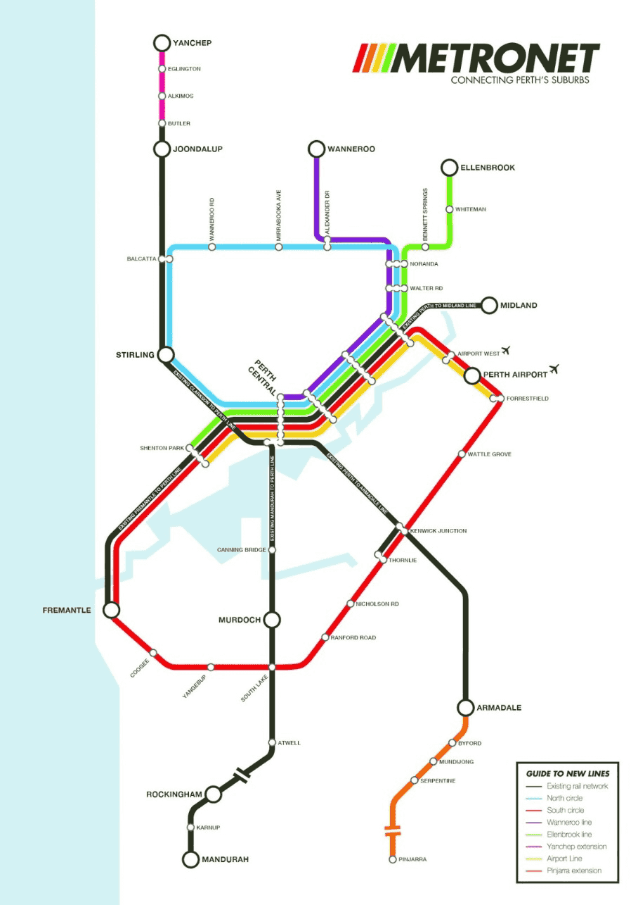

# *TABLE TALK*

**AUSTRALASIAN TIMETABLE NEWS**

**No. 286, June 2016 ISSN 1038-3697, RRP \$4.95**

**Published by the Australian Timetable Association**

[**www.austta.org.au**](http://www.austta.org.au)

# **TOP TABLE TALK**

**V/Line timetable 26 June – V/Line crisis ends**

All V/Line trains will be back on the tracks from 26 June. The final 11
V/Line train services replaced by buses due to excessive wheel wear will
return to being train services.

In addition, the timetable changes planned for introduction on 31
January will be introduced. At this stage, there seem to be no crosses
scheduled at the new Rowsley Loop on the Ballarat line (see article
below).

All weekday outbound Ballarat, Bendigo and Geelong line trains will
depart Footscray one (usually) or two minutes earlier.

Adjustments to some **Ballarat** line services are aimed at reducing
delays on the busiest sections of the line. Some trains have altered
departure and arrival times to better reflect the trip durations and
altered stopping patterns.

-   The 0514 from Melbourne to Wendouree will leave Southern Cross at
    0510 and the 0513 from Wendouree to Melbourne will leave one
    minute earlier. These changes are to reduce congestion at
    Bacchus Marsh.

-   The 0510 Melb-Wendouree and the next train, 0613 Melb-Ballarat will
    not stop at Bacchus Marsh, although they stop at all other stations.
    This is also to reduce congestion at Bacchus Marsh. There is an
    unusual solution to serve Bacchus Marsh. Both of these trains will
    connect with supplementary buses from Melton to Wendouree and
    Ballarat respectively, which will stop at Bacchus Marsh.

-   The 0704 and 0740 from Bacchus Marsh will not stop at Ardeer.

-   Most trains will depart earlier from Deer Park and Ardeer.

Adjustments to some **Geelong** line services are aimed at reducing
delays.

-   Four AM peak Geelong trains will not stop at Sunshine.

-   The 0716 from Wyndham Vale will now depart at 0713 and stop at
    Ardeer instead of Deer Park. It will arrive at SX one minute later.

-   Two Wyndham Vale AM peak trains will have adjusted times to reflect
    that they are operated by Sprinter trains. The 0736 will now depart
    at 0735 and arrive at SX three minutes later at 0814. The 0755 will
    now depart at 0754 and arrive at SX four minutes later at 0834.

-   Some off-peak Geelong line trains to Melbourne have adjusted
    departure times.

Two **Warrnambool** trains will have adjusted timetables.

-   The morning train will leave Warrnambool eight minutes earlier at
    0600 and arrive Melbourne at 0931 instead of 0934. The new timings
    are aimed to reduce delays which have been experienced due to a
    cross with the Pacific National down freight train at Camperdown.

-   The 1912 Mon-Fri from SX will have five minutes recovery inserted,
    and so arrive Warrnambool five minutes later at 2249, to better
    reflect the actual journey time.

Connecting V/Line bus times will be adjusted to reflect the change in
train times.

There will be one additional morning train and an extra PM peak service
on the **Bendigo** line.

-   A new three-carriage VLocity train from Epsom 0700, Bendigo
    0708-0710 to arrive Melbourne at 0907. This will be an
    off-peak train.

-   An additional three-carriage train from Melbourne at 1602 arriving
    in Bendigo at 1755. This will help ease some of the demand on the
    1625 train which is typically very busy.

-   The 1415 SX to Bendigo (Monday to Friday) will be altered to stop
    all stations and is scheduled at Bendigo eight minutes later at
    1608-1613 and then be extended to Epsom 1626.

-   Trains extended from Bendigo to/from Epsom will be extended from
    four to 14 each weekday (in addition to Echuca trains);

-   An additional train is extended from Bendigo to Eaglehawk on weekday
    evenings; and

-   All trains will stop at Kangaroo Flat.

**V/Line buses** also have timetable adjustments to reflect traffic
conditions and journey times. Other routes will have an extra stop while
some are changing by a few minutes to ensure better connections with
trains.

Buses will now stop at Congupna, causing minor changes to timetables on
the Murraylink bus between Albury and Kerang and also on the
Shepparton-Cobram and Seymour-Tocumwal routes.

V/Line buses between Dandenong and Inverloch will have scheduled stops
at Deep Creek Street near Grantville, Wonthaggi North and Inverloch
Police Station, and some departure times will change by up to 19
minutes. The Bay Road stop on this route has been renamed Jam Jerrup.

There will be minor changes to:

-   Mildura and Swan Hill/Bendigo
-   Warrnambool and Heywood/Mt Gambier
-   Ouyen and Ballarat/Ararat
-   Dandenong and Yarram
-   Maryborough and Castlemaine
-   Geelong, Ballarat and Bendigo
-   Speedlink Adelaide-Albury
-   Canberra – Albury (now departs Canberra five minutes earlier at
    0810, and arrives Canberra five minutes later at 2025, the extra
    time being accounted for by additional time at Gundagai, the half
    way stop).

The new Public timetables are available online on V/Line’s website at
<https://www.vline.com.au/Timetables/Additional-pages/Timetable-list>
and - in a different format – on Public Transport Victoria website at
<http://www.ptv.vic.gov.au/timetables>

***Geoff Lambert*** *comments:* I think the different formats is a
consequence of the adoption of GTFS, which is structured to allow this
sort of thing. I also believe all these PDFs are constructed on the fly
and don’t actually exist until you ask for them. This would explain why
the PTV and V/Line PDFs look different. PDF on Demand is an increasingly
common feature and, if you are quick, when you click on a TT in the
V/Line timetable list, you first see that the URL is not a link to a PDF
then you get a message “Your PDF is being printed” after which the
download of the freshly-created PDF commences. If you have (e.g) Acrobat
Pro and can see the metadata, you see that the PDF was created about
three seconds before it was downloaded.

## **RAIL AND TRAM NEWS**

**Federal Budget**

Railway and public transport related expenditure announced in the
Federal Budget presented on 3 May is:

  **Project**                                                                                                                                                                                                **Funding 2016-7**   **Total Funding 2013-20**
  ---------------------------------------------------------------------------------------------------------------------------------------------------------------------------------------------------------- -------------------- ---------------------------------------------------------------------------------------------------------
  Sydney Metro                                                                                                                                                                                                                    \$1.7 billion contingent upon the Asset Recycling Initiative (ie, sell-off of State government assets).
  Sydney’s Rail future                                                                                                                                                                                                            \$98.4 million contingent upon the Asset Recycling Initiative
  Parramatta light rail                                                                                                                                                                                                           \$78.3 m contingent upon the Asset Recycling Initiative
  Concept design for railway to Badgerys Creek Airport, Sydney                                                                                                                                                                    \$26.2 m
  Melbourne Metro                                                                                                                                                                                                                 \$857.2 m contingent upon the Asset Recycling Initiative
  Murray Basin rail                                                                                                                                                                                                               \$20.2 m contingent upon the Asset Recycling Initiative
  Murray Basin rail                                                                                                                                                                                                               \$220 m conditional on the Victorian Government matching dollar for dollar
  Northern Sydney Freight corridor                                                                                                                                                                           \$25.0 m             \$691.6 m
  To Australian Rail Track Corporation for the Brisbane-Melbourne Inland Freight Railway for land acquisition, due diligence and market testing                                                              \$593.7 m            
  To ARTC for Brisbane-Melbourne Inland Freight Railway for pre-construction works                                                                                                                           \$80.7 m             \$300.0 m
  To ARTC for implementation of the Advanced Train Management System                                                                                                                                         \$17.1 m             \$50.0 m
  Melbourne Metropolitan Intermodal Terminal System                                                                                                                                                          \$5.0 m              \$38.0 m
  St Albans grade separation                                                                                                                                                                                 \$60.9 m             \$151.0 m
  Gold Coast Light Rail stage 2                                                                                                                                                                              \$47.5 m             \$95 m
  Moreton Bay rail link (Kippa Ring line)                                                                                                                                                                    \$100.0 m            \$583.0 m
  Forrestfield Airport link, Perth                                                                                                                                                                           \$490.0 m            Not stated
  WA Portlink inland freight corridor concept plan to investigate improved road and rail links between Esperance, Port Hedland, Geraldton, future port of Oakejee and an intermodal terminal at Kalgoorlie   \$0.5 m              \$0.9 m
  Tasmanian rail freight revitalisation to improve the quality of lines                                                                                                                                      \$20.4 m             \$59.8 m
  Rail overpass north of Alice Springs                                                                                                                                                                       \$4.3 m              \$24.1 m
---------------------------------------------------------------------------------------------------------------------------------------------------------------------------------------------------------- -------------------- ---------------------------------------------------------------------------------------------------------

**Australian Rail Track Corporation: Future**

Tucked away in the 2016 Federal Budget papers was a statement that the
Government will retain the ARTC in public ownership. This is to enable
it to access funds at the lowest cost for the Brisbane-Melbourne Inland
Freight Railway.

**Promises, promises**

Possibly this is the only Federal election where both major parties have
tried to outdo each other in promises to fund public transport projects.
Definitely it is the only Federal election where the two major leaders
have vied to be photographed travelling on trains and trams. In the
early stages of the campaign, the Prime Minister was ahead on the
visuals, but the Opposition ahead on promises. At the time of writing
the following were promises made. There will, no doubt, be more to come.

**Coalition**: Extension of Tonsley line to Flinders University
(Adelaide) \$43 million. Improvement of rail freight access to
Townsville port, by construction of the Townsville Eastern Rail access 8
km, \$150 m. improvement of passenger facilities and rolling stock
Puffing Billy tourist railway (Melbourne) \$6.5 million.

**Labor**: On 5 May Opposition Leader Bill Shorten said Labor would
provide Infrastructure Australia with a new \$10 billion funding
facility. He said Labor will invest directly in the Melbourne Metro, a
rail link to the new airport in Western Sydney, Brisbane’s Cross River
Rail, Perth Metronet, the electrification of the Gawler Line, and the
ambitious, multi-line AdeLINK tram network in Adelaide.

On 23 May he committed \$1 billion to the part-funding of WA Labor's
Metronet rail project, but said he would cut all federal support for the
WA Government's Perth Freight Link. Labor says it will contribute \$760
million to the project by 2020, and a further \$240 million over the
following two years. The funding would be contingent on Infrastructure
Australia's approval. State Opposition Leader Mark McGowan originally
presented the Metronet plan at the last state election, when it was
estimated to have a total cost of \$5.2 billion. Mr Shorten's federal
funding would prioritise planning to build the Morley to Ellenbrook rail
line, extend the northern suburbs line to Yanchep, extend the Armadale
line to Byford, and start a circle line, linking the Mandurah line to
the Thornlie line. It would also go towards removing "unsafe level
crossings that slow traffic" on the Midland, Armadale and Fremantle
lines, and build a new station at Karnup on the Mandurah line.

Also promised are Glendale (Newcastle) Interchange \$13 million;
Schofields (western Sydney) station carpark \$5 m; Develop business case
for Frankston-Baxter (SE Melbourne) duplication and electrification
\$1.5 m., Extension of Tonsley line to Flinders University (Adelaide).
\$500 m for AdeLINK suburban tram network; improvement of rail freight
access to Port Botany (duplication Cooks Loop-Botany and new crossing
loop at Warwick Farm on the South Sydney Freight line) \$175 m.

**Pacific National: Future**

The Australian Competition and Consumer Commission (ACCC) has raised a
number of vertical integration concerns over the proposed acquisition of
port and rail giant Asciano by a group led by smaller logistics firm
Qube, and global infrastructure investor Brookfield. The ACC released
its draft statement of issues on the takeover on 26 May, and pushed back
its final ruling to 21 July, to allow the industry to respond to the
paper.

The current takeover offer is the result of months of competition
between a Qube-led consortium, and a Brookfield-led consortium, for the
acquisition of the massive group, which includes rail business Pacific
National and ports giant Patrick. Once rivals, Qube and Brookfield
teamed up their financial backers to submit the current takeover bid.

“The ACCC has received a very large number of submissions from industry
stakeholders expressing a broad range of concerns about the proposed
acquisition,” ACCC Chairman Rod Sims said. The industry has raised
concerns over the level of vertical integration that could result from
Patrick container terminals being in cahoots with both Qube and ACFS –
“the two largest landside import-export container logistics providers in
Australia,” he said. “The ACCC is concerned that Patrick container
terminals may provide preferential access to Qube and ACFS vehicles, and
Qube regional export trains running into Port Botany, and raise rivals’
costs.

**Sydney Trains: WTT 11 June**

A new Working Timetable, version 5.2, will come into effect from 11 June
(Book 2 Weekends) and 13 June (Book 1 Weekdays).

**ARTC: WTT 12 June**

A new Working Timetable will come into effect from 12 June. A copy is
online on their website at
<http://www.artc.com.au/customers/operations/mtp/2016-01-24/>

**John Holland Rail NSW Country Regional Network: WTT 11 June**

A new Working Timetable will come into effect on 11 June. A copy is
online on their website at
<http://www.jhrcrn.com.au/Documents.asp?ID=67> Alterations are:

**Addition West**

**7SP7** Pacific National Intermodal (1500m) Saturdays will run as
tabled by Sydney Trains to pass Hermitage (Lithgow) 0344, Coxs River
0355, Wallerawang 0357, Tarana 0423, Raglan 0454, arrive Kelso 0458,
depart 0503, pass Bathurst 0511, Newbridge 0551, Murrobo 0607, Blayney
0610, Polona 0620, Spring Hill 0627, Orange East Fork Jct 0636, Borenore
0652, Molong 0704, Manildra 0723, Bumberry 0745, Parkes Sub Terminal
0811, Parkes 0816, CRN/ARTC Boundary Parkes 0818 thence as tabled by
ARTC.

**Alterations West**

**6SP7** Pacific National Intermodal (1500m) Fridays will run as tabled
by Sydney Trains to pass Hermitage 0128 (next day), Wallerawang 0143,
Tarana 0212, Raglan 0247, arrive Kelso 0252, depart 0312, pass Bathurst
0320, Newbridge 0400, Murrobo 0416, Blayney 0419, Polona 0429, Spring
Hill 0436, Orange East Fork Jct 0445, Borenore 0501, Molong 0513,
Manildra 0532, Bumberry 0554, Parkes Sub Terminal 0620, Parkes 0625,
CRN/ARTC Boundary Parkes 0627 thence as tabled by ARTC.

**9835** Pacific National (575m) Fridays will run as tabled by Sydney
Trains to pass Hermitage 0403 (next day), arrive Wallerawang 0419,
depart 0427, pass Tarana 0458, Raglan 0533, Kelso 0537, arrive Bathurst
0544, depart 0601, pass Newbridge 0652, Murrobo 0711, arrive Blayney
0715 – terminate, form 8934.

**Deletions West**

**6AS8** Great Southern Rail Indian Pacific eastbound Fridays.

**7SA8** Great Southern Rail Indian Pacific westbound Saturdays.

**6SP6** Pacific National Intermodal westbound Fridays.

**Deletions North**

**1565** QUBE Tue, Thur, Sat to Narrabri West.

**5166** QUBE Mon, Wed, Fri ex Narrabri West.

**Sydney Trains: Epping-Thornleigh Relief road 11 June**

On 11 June the Epping to Thornleigh down relief road will be brought
into use. This is the final section of the North Sydney Freight project.
It will enable slow-moving northbound freight trains ascending the 1 in
40 gradients to be kept moving, without having to be refuged to avoid
delaying passenger trains. It was mainly financed by the Federal
Government. This new track extends from 23.693 km to 29.197 km and is
electrified. There are now three or four tracks on most of the North
line as far as Thornleigh – except for Rhodes to West Ryde, where the
gradients are gentle. There are new platforms at Cheltenham and Pennant
Hills. It is controlled from the Homebush Control Centre.

**Overcrowding on Sydney's trains worsens for passengers during morning peak,**
by Matt O’Sullivan, *Sydney Morning Herald,* 27 May

Overcrowding on trains running through central parts of Sydney in the
morning peak is getting worse, new figures show, making it more
difficult for services to run on time. Average passenger loads on trains
across all lines in the morning have surged 10% in the past year to
114%, a sign of the rapidly rising demand for public transport and the
strain that is placing on the aged rail network. Trains stopping at
Redfern Station on the Inner West Line have the highest average
passenger loads between 8am and 9am, at 141%. Passengers begin to suffer
from overcrowding when trains have loads of 135%, which is the benchmark
used by transport officials. The length of time a train needs to stop at
a station when it becomes overcrowded is likely to blow out and cause
the train, and others following, to run late. Trains running on the
Illawarra Line via Sydenham and Hurstville in the city's south recorded
average loads of 136% in the morning peak, according to the data
collected in September by Transport for NSW. The third most crowded
trains on Sydney's suburban network at peak hour were on the Northern
Line via Strathfield. Trains on that line via Redfern had loads of 135%.

But what is striking is the rate of increase in crowding in just a year.
Average loads on the Western Line – the city's busiest – surged by 21%
to 134% between September 2014 and September 2015. Transport officials
collect the train load data twice a year – in March and September.

Passenger loads are usually higher in March, a month that also tends to
be less affected by seasonal factors. In a sign of the rapidly
increasing demand for public transport, all but one suburban and
intercity line in NSW recorded higher loads in September. The greatest
increase was on trains to the Central Coast, which had passenger loads
of 121% in September, up from 76% a year earlier.

A load factor of 100% means the number of passengers on a train is equal
to the number of seats. Commuters can take some solace from the fact
that trains are less crowded during the evening peak between 5pm and 6pm
than in the mornings. Suburban trains running at that time had average
loads of 90% in September, compared with 89% in the same month a year
earlier.

**NSW TrainLink: A bad day**

Friday 27 May was a memorable day for NSW TrainLink, for the wrong
reasons The up train from Armidale/Moree ran 90 minutes late “for
mechanical reasons”; the 1212 Sydney-Canberra and 1725 Canberra-Sydney –
among the most popular trains on this line – were replaced by buses “due
to mechanical reasons”. And TrainLink’s internet booking site was shut
down because it was hacked. The database does not contain sufficient
credit card information for it to be used in any transaction, but
nevertheless NSW TrainLink notified Police and Transport for NSW engaged
AusCERT, Australia’s leading Cyber Emergency Response team to manage the
investigation of whether the data had been accessed. Transport for NSW
also notified the Information and Privacy Commissioner.

**V/Line: Albury line services**

Following the Victorian Budget (see May *Table Talk* page 5), it is
unclear whether Albury line services will be improved or not. \$15
million was earmarked for North East line improvements, including
refurbishment of rolling stock. The present three five-carriage sets on
this line will be replaced by four four-carriage sets. The extra
carriage set might be to add to the reliability of the existing service - two back up sets for two operating sets! This is what is implied in
the Victorian Budget Papers. Premier Dan Andrews’ Press Release of 27
April entitled “Getting it done for North-East Victoria” says “…four
train sets of four carriages on the Albury. This will improve
reliability…..” What is notable is what is not said. The equivalent
Press Releases for the other regions of Victoria specifically mentioned
additional V/Line services. This one does not. However, a local rumour
is that there will, in fact, be four train services daily. The four
train Weekday timetable would be:

Albury depart: 0600, 0745, 1245, 1745 (at present: 0635, 1245 and 1720).

Melbourne depart: 0705, 1200, 1530 and 1802 (at present 0705, 1205 and
1802).

With this timetable, there would be three train sets in use, with the
maximum number of trains running in the AM and PM peaks. There would be
two sets overnight in Albury and two sets overnight in Melbourne. An
additional service would remove much of the present unhappiness in the
North-east about the standard of the V/Line service.

**V/Line Rowsley Loop**

Rowsley Loop, at approximately 55 km from Melbourne, on the down side of
Bacchus Marsh on the Ballarat line, was brought into use on the weekend
of 28-29 May.

**V/Line VLocity trains**

The last 2-carriage VLocity DMU set was converted to a 3-car set at the
end of April. The April Victorian Budget included funding for 9
additional 3-car VLocity DMUs.

**V/Line trains on Metro Trains tracks**

Since the opening of the Regional Rail Link, there are so few trains
between Werribee and Manor Junction that the rail surface cannot be
guaranteed free of contamination and trains may not be reliably detected
by track circuits. Consequently, since 19 October 2015 VLocity and
Sprinter DMUs are not allowed. Since 15 March 2016 VLocities are also
prohibited Newport-Werribee (direct and via Altona), North Melbourne
Junction-Upfield, Southern Cross-South Morang and Hurstbridge, Southern
Cross-Belgrave, Lilydale, Alamein and Glen Wav erley,
Caulfield-Frankston-Stony Point, Richmond Junction-Sandringham.

**Metro Trains Melbourne: Additional platform for West Footscray**

An additional platform and track to the north of the station will be
built for up trains in the peak periods. The existing platform one will
be used for trains travelling from the city to terminate and commence
services at West Footscray station. This will assist trains to run on
time and reduce delays. Providing an additional platform and length of
track for Sunbury line trains will also facilitate an increase in the
number of services at West Footscray station during the morning and
afternoon peak. Works at West Footscray station involve realigning
regional, suburban and freight tracks, construction of new tracks and
turnouts, and alterations to the existing station concourse. Track and
station work would likely be conducted in stages to limit disruption to
commuters and the local community.

**Metro Trains Melbourne: Closedowns**

Grade separation at Blackburn and Heatherdale will necessitate a
four-week closedown, probably during December 2016. Grade separation at
St Albans will necessitate a three-week closedown, probably during
October 2016.

**North Adelaide underpass**

South Australian Transport and Infrastructure Minister Stephen Mullighan
and Federal Major Projects Minister Paul Fletcher announced on 6 May a
\$238 million tender to separate Adelaide's Outer Harbor passenger line
from the ARTC freight route. The joint Commonwealth and State-funded
project will see a rail underpass built for the passenger line to ease
congestion for freight carriers and reduce traffic bottlenecks
byremoving l;evel crossings at Park Terrace and Torrens Road. The tender
process is expected to last a few months, with construction completed by
2018.

**Great Southern Rail: Slower Ghan timetable**

The timetable for the “Ghan Expedition”, the very tourist-orientated
version of the southbound Ghan which runs from 3 August to 26 October,
has been slowed by two hours to allow tourists a longer time in Coober
Pedy. The Coober Pedy stop is serviced by the train stopping at Manguri.
The amended timetable is:

**3 Aug - 26 Oct**

              **Wed**
---------     ----------
Darwin        dp 1000
Katherine     ar 1340
              dp 1820
              **Thur**
Alice Springs ar 1000
              dp 2145
Coober Pedy   ar 0900
              dp 1940
              **Sat**
Adelaide      ar 1250
---------     ----------

On Sunday 22 May, at the start of the winter tourist season, the Ghan
departed Adelaide with 44 carriages and two locomotives, with a length
of 1096m – more than 200m longer than a standard Ghan service. GSR
claimed that this was the longest passenger train in Australia since the
inaugural Adelaide to Darwin Ghan journey in 2004 which had 43
carriages. The Ghan’s 22 May departure had 327 passengers. The train
comprised 3 platinum sleepers, 18 gold sleepers, one platinum lounge and
dining car, 4 dining cars, 4 lounge and bar cars, one red sitting car,
one red café car, 5 crew cars, 3 power vans, one luggage van and one
motorail wagon. It was split across three platforms at Adelaide
Terminal. The total weight was 2156 tonnes. There were 55 onboard crew
members who, over the return journey, made 1300 beds, served 100kg of
barramundi and 190kg of vegetables, and cooked more than 3000 eggs for
breakfast. This was the first of nine consecutive weeks of
kilometre-long trains departing Adelaide.

**SA Leigh Creek line**

The Port August to Leigh Creek line, out of use since 29 April with the
cessation of coal mining at Leigh Creek, may come back in use. Bowmans
Intermodal, a company backed by Toll, and Archer Exploration, are
investigating use of the line to transport Archer’s magnesite deposits
which are about 20 km north west of Leigh Creek.

**WA Budget**

The WA Budget was presented on 12 May. It included the following funding
related to public transport:

-   \$104 million in 2016-17 towards the \$2 billion total cost of the
    Forrestfield-Airport railway
-   An additional \$13.7 million for Future Urban Railcar Procurement,
    primarily for infrastructure works to accommodate extra railcars.
    Total cost of project - \$198.7 million
-   An extra \$5.3 million across 2016-17 to 2017-18 to construct the
    Northbridge Bus Layover
-   \$49 million for the Ellenbrook Bus Rapid Transit project from
    2016-17 to 2017-18. The premier, Colin Barnett, said the project
    offered a cost-effective way to provide Perth's north-eastern
    suburbs with access to fast public transport. Previously, a tram had
    been proposed to this area (see Bus News below).
-   \$11.5 million over six years to continue the Fremantle container
    rail service subsidy.

**New Zealand Budget**

The NZ Budget was presented on 26 May. It included a two-year \$NZ 190.2
million funding package for KiwiRail. However, this was accompanied with
a warning by Transport Minister Simon Bridges that ongoing subsidies at
that level are "unsustainable". The 2016 Budget takes total investment
in the company since 2010 to \$NZ 1.4 billion. Mr Bridges said,
"KiwiRail has made good progress in increasing customer numbers,
becoming more reliable and upgrading assets. However, the Government
expects it to continue to improve its productivity and efficiency. The
Government is committed to a national rail network, but ongoing
subsidies at this level are unsustainable. The funding is a two-year
package to help KiwiRail make further gains so future government support
can be reduced."

**Thanks** to Tony Bailey, Scott Ferris, Victor Isaacs, Geoff Lambert,
Geoff Mann, Len Regan, Michael Smith,
*[www.railexpress.com.au](http://www.railexpress.com.au),
[www.railpage.com.au](http://www.railpage.com.au), Age, Australian,
Daily Telegraph, Herald Sun, Semaphore* (Signaling Record Society
Victoria*)* and *Sydney Morning Herald* for Rail news.

# **EDITORIAL**

Some readers might think it is peculiar that this magazine gives details
of alterations in the latest Working Timetable of John Holland Rail NSW
Country Regional Network, but not in the equivalent re-issues of the
much more important Australian Rail Track Corporation WTT and Sydney
Trains WTT. The reason is simple: If the information for the latter had
been available, it would have been provided. This gives an excuse to
repeat the mantra of every magazine editor: **Please submit your
articles, news and information.** The more the better. Details of where
to send your contributions is on page 11.

# **ODD SPOT**

In **V/Line’s** 26 June timetable, on weekdays a bus is scheduled to
depart Ballarat at 0510, the overnight bus from Mildura – V/Line’s one
and only overnight service. A train then leaves Ballarat at 0519.
Despite departing nine minutes later, and having five intermediate stops
against none for the bus, the train is scheduled to arrive Melbourne
Southern Cross nine minutes earlier than the bus. Similarly, V/Line’s
overnight Melbourne-Mildura bus departing Southern Cross at 2125 is
matched by a train departing at exactly the same time. Although the
train is scheduled to make eight intermediate stops, and the bus none,
the train arrives Ballarat twelve minutes earlier than the bus.

Famous for its bullet train, **Japan** is now set to launch an
“invisible” train that will hit the tracks in 2018. Designed by Japanese
architect Kazuyo Sejima, who is known for making buildings that blend
into the environment, the trains will sport a semi-reflective surface to
give the illusion of invisibility when speeding through the city or
countryside.

Sejima was commissioned to design the train by Seibu Group, who are
famous for their high-speed bullet trains, to celebrate their 100th
anniversary. The brief was to create a “soft” and “gentle” design to
“blend in with the landscape”. Sejima will also design the interior to
have a “living room” feel.

<http://www.news.com.au/travel/world-travel/asia/japan-to-launch-invisible-trains-to-its-tracks-by-2018/news-story/69821606dbdea491558f2ff94510ea41>

**Thanks** to David Cranney and Victor Isaacs for Odd Spot.

# **BUS NEWS**

## Interstate

**V/Line**: Not hitherto recorded, but probably from 21 June 2015:

-   The Bairnsdale-Narooma bus on Tue, Wed, Fri and Sun diverts
    via Bermagui. Similarly, the bus from Narooma to Bairnsdale on Mon,
    Wed, Thur and Sat diverts via Bermagui. On the other days of the
    week, when the bus continues to/from Batemans Bay, the diversion
    does not apply.
-   On Tues and Thurs an additional bus operates from Wangaratta at 1005
    (connecting with the 0705 train from Melbourne) to Corowa.

## New South Wales

**Sydney Buses Service Changes 5 June**

-   Timetable adjustments for routes 253 285 288 292 293 294 297 458 303
    500 501 502 504 506 507 515 518 520 M52
-   Routes 288 and 292 will start and end in Sussex St at Erskine St.
    They will no longer operate to and from King St Wharf
-   New route 289 will operate from the Lane Cove Industrial Area to
    City via Mowbray Road and Centennial Avenue
-   Additional trips for 301 324 338 348 370 373 394 M54
-   Evening services on X74 will now depart from Spring St near Pitt St
    rather than Circular Quay
-   Some peak hour 393 services will be changed to operate as X93, a new
    express service. Some peak hour 394 services will be changed to
    operate as X94.
-   520 will operate all night seven days a week to give Victoria Road a
    24 hours a day service
-   525 The following trips no longer operate: 1716 and 1736 from
    Olympic Park Station to Strathfield Station, 07:34 and 08:35 from
    Strathfield Station to Olympic Park Station.
-   526 Burwood to Olympic Park Wharf will be extended to Rhodes via the
    new Bennelong Bridge across Homebush Bay to Rhodes Shopping Centre.
    Additional peak hour trips will be introduced and on weekends, buses
    will now depart every 30 minutes throughout the day.
-   533 Chatswood to Olympic Park will be altered to operate via the
    Bennelong Bridge rather than Homebush Bay Drive. These changes to
    526 and 533 replace temporary 529 which had operated from Rhodes to
    Newington via Bennelong Bridge.

The following timetables effective 5 June are on
[www.sydneybuses.info](http://www.sydneybuses.info)

251 252 253 254 Lane Cove West and Riverview to City\
258 285 289 533 534 Sydney Olympic Park, Ryde and Lane Cove Industrial
to Chatswood and City\
286 287 288 290 284 297 Epping and North Ryde to City\
292 293 Marsfield to City\
301 302 303 X03 San Souci and Eastgardens to City\
323 324 L24 325 New South Road to Edgecliff and City\
338 339 X39 X40 Clovelly to City\
348 Wooli Creek to Bondi Junction\
370 Leichhardt to Coogee\
372 373 X73 Coogee to City via Randwick Junction\
374 X74 Coogee to City via Bream St\
391 392 X92 La Perouse and Little Bay to City via Bunnerong Road\
393 394 L94 X94 399 X99 La Perouse and Malabar to City via Anzac Parade\
395 396 X96 397 X97 Maroubra to City via Anzac Parade\
458 459 Macquarie University to Burwood\
525 X25 526 Parramatta and Rhodes to Burwood.

State Transit are no longer able to supply multiple copies timetables to
ATA from their head office at Strawberry Hills. Any timetables that
appear on the Distribution List are provided through the goodwill and
hard work of members who visit Sydney timetable outlets and the ability
of staff, who are very helpful, to supply multiple copies. State Transit
will provide timetables to individuals on request.

Due to construction work at Balmain East Wharf, buses on routes 442, 444
and 445 were replaced by a mini bus shuttle between Balmain East Wharf
and Gladstone Park from 15 February until mid-May.

## Northern Territory

The NT Budget presented on 24 May provided \$1 million this year and
\$1.4 million over 3 years for operational costs for a Tuparipiya bus
service on Melville Island each weekday, providing a regular service
between Pirlangimpi, Paru, Pickertaramoor and Milikapiti. The service
will also operate on weekends when community events are scheduled. The
operation will be based in Milikapiti and be managed by Bodhi Bus.

## Tasmania

The Tasmanian Budget presented on 26 May included funding of \$31
million over four years for 100 new buses for **Metro Tasmania**. These
will be Disability Discrimination Act compliant.

## Victoria

**SkyBus** will introduce a high-frequency bus service from St Kilda to
Melbourne Airport following its takeover of the route that was managed
by Frankston and Peninsula Airport Shuttle. SkyBus will significantly
increase the frequency with departures leaving St Kilda every 30 minutes
from 0630 until 1930 seven days a week.

## Western Australia

**TransPerth**: With the opening of the new Perth Busport in Wellington
St due later this year major changes to northern bus services are
proposed. Currently the Flinders St corridor comprises:

-   354 Perth-Mirrabooka via Nollamara Shops
-   370 Perth-Mirrabooka via Nollamara Avenue All Stops
-   870 Perth-Mirrabooka via Nollamara Avenue Limited Stops.

It is proposed that 354 will be replaced by 384 operating via Wanneroo
Road instead of Flinders St. 370 will be renumbered 970 and 870 will be
renumbered 370 and operate in the peak period only.

Currently the Alexander Drive corridor comprises;

-   885 Perth-Edith Cowan University Limited Stops
-   886 Perth-Alexander Heights via Marangaroo Drive Limited Stops
-   887 Perth-Alexander Heights via The Avenue Limited Stops
-   888 Perth-Mirrabooka Limited Stops
-   889 Perth-Balajura Limited Stops.

It is proposed that 885 and 888 will be replaced by 960
Mirrabooka-Curtin Uni via Alexander Drive, Perth Busport and Victoria
Park Transfer Station all stops. 886 887 889 will be renumbered 960,
961, 962 respectively. The new route 960 will operate between Mirrabooka
Bus Station and Curtin University via Edith Cowan University's Mount
Lawley campus and the new Perth Busport from late 2016. It will have a
peak headway of five minutes between Curtin and ECU Lawley. It will
require 20 new buses and one million bus service kilometres. It will
operate along the \$1.4m Fitzgerald St peak-period bus lane, which is to
be completed soon. The renumbering of 800 series routes frees this
series for regional routes.

Route 28 East Perth-Claremont will be shortened to operate Perth
Busport-Claremont.

When Aubin Grove Station on the Mandurah line opens in early 2017 the
following is proposed:

-   525 Cockburn Central Station-Hammond Park West via Baningan Avenue
    to be split into 525 Cockburn Central Station-Aubin Grove Station
    via Baningan Avemue and 535 Aubin Grove Station-Hammond Park West
-   526 Cockburn Central Station-Hammond Park East via Wentworth Avenue
    to be split into 526 Cockburn Central Station-Aubin Grove Station
    via Wentworth Avenue and 536 Aubin Grove Statiion-Hammond Park East
-   527 Cockburn Central Station-Wandi via Atwell to be split into 527
    Cockburn Central Station-Aubin Grove Station via Atwell and 537
    Aubin Grove Station-Wandi
-   New Route 535 between Aubin Grove Station and Gaebler Road adjacent
    to Hammond Park Primary School
-   New Route 536 between Aubin Grove Station and Rowley Road, Hammond
    Park
-   New Route 537 between Aubin Grove Station and Honeywood Avenue,
    Wandi (existing Route 527 terminus).

Meanwhile on the Joondalup line it is proposed to alter 471 Joondalup
Station-Kinross via Currambine to Joondalup Station-Burns Beach via
Currambine to serve a new residential area north of Burns Beach Road.

**Ellenbrook Bus Rapid Transit**

The WA Budget of 12 May included funding of \$49 million for an
Ellenbrook bus rapid transit line. This will connect Ellenbrook Town
Centre and Marshall Road. The WA Government promises that it will
provide shorter, more reliable journey times to Bassendean Station and a
new bus connection to Midland Town Centre. There will be a two-lane
continuous, dedicated bus transit way from Ellenbrook Town Centre to
Marshall Road, about 9 km, to take pressure off Lord St and support
urban development.

It will reduce the average bus journey time between Ellenbrook and
Bassendean Station by up to ten minutes in morning peak hour, with three
new bus stations along the route to provide an important public
transport connection and lessen commuters' reliance on cars.

A design and construct contract is expected to be awarded, with
construction commencing by the end of 2016, with completion in late 2017. The project comprises:

-   two-lane continuous dedicated bus transit way from Ellenbrook Town
    Centre to Marshall Road – 9 kms
-   bus stations at Ellenbrook Town Centre, Gnangara and Marshall Roads,
    with a future station planned for Youle-Dean Road
-   cycling facilities at the new stations to improve accessibility
-   New Lord St will be a 4.8km single carriageway road constructed
    between Gnangara Road and Park St then continuing between Youle-Dean
    and Marshall Roads
-   a further 700m of dual carriageway road will be constructed to link
    to Reid Highway
-   dual bus underpasses or bridges will be provided at Gnangara Road,
    Park St and Youle-Dean Road
-   dedicated crossing will be provided at Marshall Road with priority
    given to buses
-   currently about 2,000 passengers travel on more than 100 buses
    between Ellenbrook and Bassendean on an average week day
-   four new buses will service the bus route between Marshall Road Bus
    Rapid Transit station and Midland
-   300 car parking spaces will be available at the Gnangara Bus Rapid
    Transit station and 100 at the Marshall BRT station.

The WA Government remains committed to the MAX light rail project,
despite Treasurer Mike Nahan admitting it will only happen if it is
built by the private sector or after State assets are sold. The WA
Budget papers show \$427 million has been set aside for the \$1.9
billion project to 2019-20, with planning work scheduled to recommence
in 2016-17.

MAX was a centrepiece of the Liberal Government’s 2013 election policy,
but was shelved shortly after the election. The WA Budget also flagged
\$49 million for an Ellenbrook bus rapid transit line, as outlined
above, another project beset by controversy and broken promises.
Promised as a rail link in 2008, the Barnett Government began planning a
BRT in 2012 but cancelled it when the cost ballooned to \$110 million.
Opposition Leader Mark McGowan said the only option for Ellenbrook was a
train line.

**Thanks** to Tony Bailey, Paul Brown, Hilaire Fraser, Victor Isaacs,
*Transit Australia* and the *West Australian* for Bus news.

# **FERRY NEWS**

An eight-week trial of a passenger ferry service between **Werribee
South** and the **Melbourne CBD** started on 16 May. Port Phillip
Ferries is holding the trial and the service runs from Wyndham Harbour
at a fare of \$20 if purchased online, or \$25 on the day of travel. The
cost of parking at Wyndham Harbour is included in the fare. There is one
weekday service departing Wyndham Harbour at 0640, arriving at Docklands
0754, departing Docklands at 1740, arriving at Wyndham Harbour at 1854.
There is a weekend service departing Wyndham Harbour at 0830, returning
at 1600.

**Hobart** City Council unanimously supported a proposal on 9 May from
Ald. Damon Thomas and Ald. Philip Cocker to sponsor a report on the
viability of the operation of a network of commuter ferries on the River
Derwent. Council expressed concern at the increasing level of traffic
congestion in Hobart and the apparent lack of interest within State
Government agencies to undertake appropriate planning and implementation
studies. In sponsoring this report, Hobart City Council intend to
urgently discuss solutions with the Clarence, Glenorchy and Kingborough
Councils, (three Local Government Areas which surround Hobart City),
Metro buses, private ferry builders (such as Incat), and ferry operators
in Brisbane and Sydney. [Incat has recently supplied ferries to Sydney
operators and is currently building six ferries for the NSW
Government].

It is interesting to note that Council believes that a network of
ferries would be a more viable solution to Hobart’s traffic woes than a
Northern Suburbs rail service based on the unused right of way – a
leftover following the cessation of all rail freight operations in
Hobart. Deputy Lord Mayor, Ron Christie, emphasised that the provision
of park and ride facilities was important for the success of a ferry
network.

**Thanks** to Ian Cooper and *Transit Australia* for Ferry news.

# **AIR NEWS**

## Domestic

Brisbane-based **JetGo** will commence Brisbane to Albury flights on 20
June. Return flights will operate on Mondays, Wednesdays, Fridays and
Sundays. JetGo also has flights Brisbane-Dubbo-Melbourne (Avalon),
Brisbane-Tamworth and Gold Coast-Rockhampton-Townsville.

Newcastle-based **FlyPelican** will commence Newcastle to Dubbo flights
on 18 July. A morning and an evening round trip will operate on Mondays
to Fridays. FlyPelican also has flights Newcastle to Ballina, Sydney and
Canberra, and Sydney to Mudgee.

An air service between Kununurra and Halls Creek will start on 1 July as
a trial for an initial 12 months, with an option for a 12 month
extension depending on passenger demand. It will be operated by local
provider **Aviair**, and will fly three days a week.

**Thanks** to Tony Bailey and Paul Brown for Air news.

# **About *Table Talk***

***Table Talk*** is published monthly by the Australian Timetable
Association Inc. (Registration No. A0043673H) as a journal of record
covering recent timetable news items. The ATA also publishes the
***Times*** covering timetable history and analysis. Contributions are
invited and are very welcome. Please send these to the appropriate
Editor. ABN 74248483468.

The **deadline** **for *Table Talk*** is the last weekend of the month,
but contributions are welcome at all times.

**Editor, Rail and Tram, Air, Ferry:** Victor Isaacs,
***[abvi@iinet.net.au](mailto:abvi@iinet.net.au)***, 11 Blacket St,
Downer ACT 2602.

**Editor,** **Bus**: As an interim arrangement, please send your Bus
news to ***[abvi@iinet.net.au](mailto:abvi@iinet.net.au)***

**Production and Mailout**: Geoff and Judy Lambert.

**Proofreaders:** Agnes Boskovitz, David Cranney and Geoff Hassall.

Original material appearing in ***Table Talk*** may be reproduced in
other publications but acknowledgement is required.

**Membership of the Australian Timetable Association** includes monthly
copies of the *Times*, *Table Talk*, the Distribution List of
timetables, and the monthly Auction catalogues. The membership fee is
\$60 (Adult) and \$36 (Junior) pa. Membership enquiries should be
directed to the Membership Officer, Len Regan, at
***[ata.treasurer@austta.org.au](mailto:ata.treasurer@austta.org.au)***

Back issues of ***Table Talk*** are available on the Australian
Timetable Association’s website, ***[austta.org.au](http://www.austta.org.au),*** after three
months.

**Table Talk Newswire** is an advance monthly email of Rail news. To
obtain this, ask the Rail Editor at
***[abvi@iinet.net.au](mailto:abvi@iinet.net.au)***
