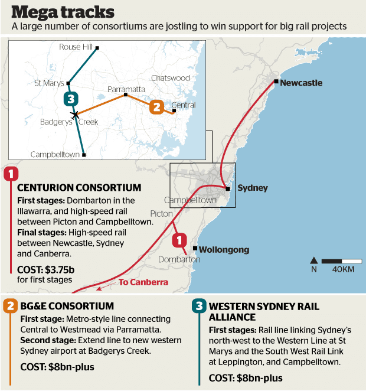

# *TABLE TALK*

**AUSTRALASIAN TIMETABLE NEWS**

**No. 288, August 2016 ISSN 1038-3697, RRP \$4.95**

**Published by the Australian Timetable Association**

[**www.austta.org.au**](https://www.timetable.org.au)

# **TOP TABLE TALK – HIGH SPEED RAIL**

## **Land deals sealed for \$200bn high-speed east-coast rail link**

**by Sarah Martin, the *Australian* 14 July**

Work on the 40-year nation-building infrastructure project, which would
create eight new ­regional cities, could begin within five years if it
wins support from three tiers of government and ­affected communities.
The private company behind the ambitious plan, Consolidated Land and
Rail Australia (CLARA), has met Malcolm Turnbull and the Victorian and
NSW governments to seek support for the project, which it claims will
not require any capital investment from taxpayers. If the world’s
fastest trains were used for the rail line, the travel time for the 915
km route would be as little as 110 minutes.

The multi-billion-dollar project is being heralded as one of the world’s
largest ever high-speed rail infrastructure projects, with the potential
to ease pressure on ­Sydney and Melbourne as their populations grow over
coming decades, CLARA co-founder and chairman Nick Cleary said the
project could be funded through the “value capture” of land that would
be transformed from mostly ­farming land to new city ­developments.

Under the value-capture model, land bought for \$1000 a lot could be
sold for housing for up to \$150,000, allowing the profit margin to
developers to fund the rail and civil infrastructure needed. “We are a
decentralisation program,” Mr Cleary said ahead of the project’s
official launch in Melbourne today. The train allows for the cities to
be viable, and the cities make the train viable — they are ­symbiotic.
We don’t anticipate asking any level of government for a ­direct
financial injection; what we really need is the assistance to plan out
these communities to secure the corridors of the rail which state
governments have to do. We are under no illusions as to how difficult it
is, and we are buoyed by the fact that both commonwealth and state
government are open to enter into co-­ordinated discussions.”

The new city sites will be greenfield developments that are at most 15
km away from existing ­regional towns, with land at each of the eight
target sites already ­secured. The company has been negotiating with
property owners for the past 12 months, and has ­secured legal rights
over 40 per cent of the land needed for the ­development, more than
16,000 hectares, through option agreements signed with about 70 land
owners.

“They are contracts to purchase on condition that we pass the regulatory
milestones that we need, which is basically having a mandate from the
state government in return for us to provide the rail and civil
infrastructure,” Mr Cleary said. They (the new cities) will be
stand-alone, sustainable, smart and designed from the internet up.”

The company also intends to fund the acquisition of the rail ­corridor,
estimated at \$1.2bn, but the legal apparatus to do so rests with the
states and could be done through compulsory acquisition.

The project has established a high-profile advisory board that includes
former NSW premier Barry O’Farrell and former Victorian premier Steve
Bracks, along with recently retired federal trade minister Andrew Robb.
American board members are also involved in guiding the project,
including former US diplomat Niels Marquardt, former US ­secretary of
transportation Ray LaHood, former White House ­fellow and City of
Chicago chief ­financial officer Lois Scott, and former Clinton advisers
David Wilhelm and Mark Doyle.

Mr Bracks said that while there was public scepticism about the project,
given previous failed ­attempts at a high-speed rail link between the
nation’s two largest cities, he believed the funding model being
promoted by CLARA was a key difference that made the project viable. “I
understand the scepticism, but this is a different proposal,” the former
premier said. “It is as much about regional development, and if you
like, uplift in land value capture as part of that. It is a regional
development project as much as it is a rail project. I think it deserves
consideration because the public benefit would be enormous.”

Mr O’Farrell said that past proposals had failed because of unrealistic
demands on the public purse. “What excites me is rather than it being a
thought bubble from federal or state governments it is coming directly
from the private sector, and the bald fact is that only the private
sector can deliver and pay for a project of this size,” the former NSW
premier said. “And secondly they are being upfront about how it will be
paid for which essentially is about the development of regional cities.”

Phase one of the project would be focused on the greater Shepparton
area, north of Melbourne, with high-speed rail connecting the two to be
operational in about a decade at a cost of about \$13bn.

The company is confident that if the plan is supported through the
regulatory period by government at all levels, it could be “turning
dirt” by 2021. A linked line from Sydney through to Melbourne could be
operational by the 2040s, with the new cities being developed and
populated through the 2020s and 2030s. But Mr Cleary said the government
needed to help push the project before urban sprawl threatened to make
the acquisition of the rail corridor too ­difficult. “One of the reasons
we are ­acting now is so that the corridor doesn’t get lost to further
urban sprawl,’’ he said. “Now is a very, very defined window of
opportunity to get this off the ground. If we leave it now and come back
in 10 years the ­opportunity could be lost.”

The consortium met the Prime Minister in March, who is understood to be
encouraging of the proposal. It also met Victorian Treasurer Tim Pallas
and NSW Premier Mike Baird in April. “We have been invited to provide
more details and there has been an openness to carry on further
discussions,” Mr Cleary said. “There are challenges; we don’t want to
give the impression that we thought this was going to be easy. This is a
big project and everybody needs to be hands on. “This is a national
discussion, it is a national decision about the next 50 years of our
nation and we can’t allow sectional specific interest to play too large
a role in any of this. There has to be balance reached, there has got to
be compromise and we come to it with an open mind and good intentions.”

***More information at <http://www.clara.com.au/>***

## **NSW: High Speed Rail to everywhere**

**by Matt O’Sullivan, *Sydney Morning Herald*, 30 June**

A rapidly growing list of large investors and property developers is in
a high-stakes race to win state government backing for mega rail
projects, including a Chinese-backed proposal for a fast-rail line
between central Sydney and Wollongong. The plans are at various stages
of development and come just weeks before a joint state and federal
options paper on the viability of building an express rail link to the
new airport at Badgerys Creek in western Sydney is due to be released.
Most of the projects are predicated on funding a substantial part of
them by placing levies on new homes and businesses built along the
proposed lines and train stations.

Sydney property developer Centurion, the local partner for state-owned
Chinese interests, is proposing a fast rail from Sydney to the Illawarra
as part of a more ambitious high-speed train project for NSW. It boasts
that an enhanced link to the Illawarra will slash travel times between
Redfern in inner Sydney and Wollongong by more than half to about 35
minutes. But Centurion's proposal is only one of the projects under
development and lobbying for government support. They include:

-   A metro-style line from Central Station to Westmead via Olympic Park
    and Parramatta, eventually linking to the planned Western
    Sydney Airport.\

-   North-south rail line linking Sydney's north-west to Western Line at
    St Marys, Bringelly, the South West Rail Link at Leppington
    and Campbelltown.

With a rapidly increasing population, Sydney and its satellite cities
are proving to be a big drawcard for Australian and overseas investors
eager to become involved in major rail projects. The proposals are in
addition to the mammoth government projects under way such as [Sydney's
\$20 billion-plus metro
railway](http://www.smh.com.au/nsw/sydney-skyline-gets-shakeup-as-towers-face-wrecking-ball-for-new-metro-stations-20151122-gl4sos.html),
and [new
CBD](http://www.smh.com.au/nsw/sydney-cbd-light-rail-construction-workers-to-rip-up-same-stretch-of-cbd-roadway-and-relay-it-24-times-20160626-gpshwl.html)
and [Parramatta light
rail](http://www.smh.com.au/nsw/parramatta-light-rail-line-via-sydney-olympic-park-gets-green-light-20151207-glhxhg.html)
lines.

Critics say many of the private-sector proposals are pushed by property
developers whose primary aim is to unlock housing development and enrich
themselves, rather than build public transport where it is needed most.
But Professor Peter Newman, of Curtin University in Western Australia
and a former board member of federal advisory body Infrastructure
Australia, said it was an inevitability that the private sector would
play a bigger role in public transport projects. "It is absolutely
critical to have consortia now. We have been through the era of
Stalinist transport planning and it doesn't work – there is no money for
it," he said.

Centurion and partners China Development Bank and China Railway
Engineering Corporation want to complete the so-called missing link in
the Illawarra between Maldon and Dombarton, and connect to Port Kembla.
Under the consortium's proposal, the dual freight and passenger line
would link to a new 12-km section of "high-speed track" between Picton
and Campbelltown. It would allow services between Redfern and Wollongong
to travel at speeds of up to 250km/h on sections of the line, meaning an
express train could complete the journey in about 35 minutes. At
present, a limited-stop service between Wollongong and Redfern takes
about an hour and 20 minutes. The consortium says Baird government
ministers have told it that the plan for the new rail links in the
Illawarra will trigger the "Macarthur Plan", opening the way for the
release of land for construction of about 100,000 homes. Using so-called
value capture, the group wants to fund the proposed rail link by
imposing a levy on new houses in the area of \$250 a square metre.

The consortium also has longer-term proposals to build a high-speed rail
link between Canberra and Newcastle via Sydney's CBD. Under those highly
ambitious plans, a 45-km tunnel would run under Sydney, and connect
Hornsby, Circular Quay, Central and Western Sydney Airport to
Campbelltown and the Hume corridor.

{width="5.2406222659667545in"
height="5.59375in"}

Centurion has been pushing its plans for a high-speed line between
Newcastle, Sydney and Canberra for a number of years. Its call early
this year for the government to enlarge the planned tunnels under Sydney
Harbour for the new metro line to make them suitable for bigger trains
fell on deaf ears.

Another group backed by engineering group BG&E and design company
Conybeare Morrison plans to submit an unsolicited proposal to the state
government within the next two months for a link between central Sydney
and Parramatta. The two-stage project known as the Sydney West Metro
Link is aimed at complementing the NSW government's \$20 billion-plus
metro rail project, which is under construction. The first stage of the
private-sector proposal is for a 26-km line from Central Station,
Darling Harbour, Bays Precinct, Canada Bay, Strathfield and Flemington,
and on to Olympic Park, Camellia, Parramatta and Westmead. The
consortium says it has the support of a "significant number" of large
property owners in a development corridor between Olympic Park and
Parramatta. One option for later stages is to extend the line west to
the new airport at Badgerys Creek. Another is to extend the line east
from Central to Kingsford, Maroubra, and La Perouse, where the
government has said it is keen to sell Long Bay Jail. The consortium is
also open to eventually extending the line to Leppington, where it would
connect to the South West Rail Link.

In western Sydney, several councils and large property developers such
as Roy Medich and Tony Perich are also pushing plans for a north-south
rail line linking Sydney's north-west and Campbelltown via St Marys,
Bringelly and Leppington.

Western Sydney Rail Alliance convener Christopher Brown said the plans
for a north-south line would provide a much-needed missing link in
Sydney's rail network. "It would unlock Sydney in a blink. It stops
western Sydney having to be exclusively car dependent," he said.

Fairfax Media is also aware of other private-sector proposals in early
stages of development. Sydney Business Chamber's western Sydney
director, David Borger, said extending the South West Rail Link from
Leppington to the new airport at Badgerys Creek was the best plan to
pursue in the short term. "As the first step, that makes eminent sense
because the cost of doing it is by far the cheaper option," he said.
“Once we have done that, we need to pause and think about the next
step." The political climate is conducive to private transport
proposals. Prime Minister Malcolm Turnbull has declared his enthusiasm
for "City Deals" that could include developers. Bill Shorten has also
said a Labor government would set up a \$10 billion finance facility to
be accessed through "innovative" infrastructure finance schemes.

Grattan Institute transport director Marion Terrill said rail lines were
better suited than roads for applying value capture as a means of
funding projects. "Rail is just much more promising because you can
identify the beneficiaries much better than you can for roads," she
said. "You can more clearly say that the people who live within 500
metres of a railway station will benefit."

The plans for the new lines and upgrades to existing rail infrastructure
in Sydney and its hinterland come on top of an audacious proposal for
high-speed rail from Sydney to Melbourne via Canberra and Wagga Wagga.
The proposal is spearheaded by Melbourne group [Consolidated Land and
Railway
Australia.](http://www.theage.com.au/victoria/new-melbournesydney-fast-rail-pitch-to-malcolm-turnbull-20160316-gnkrc6.html)
A 2013 feasibility study by the federal government put the cost of a
high-speed rail link between Brisbane, Sydney and Melbourne at an
eye-watering \$114 billion.

# **RAIL AND TRAM NEWS**

**Population projections**

Projections of population by the Australian Bureau of Statistics – vital
for transport planning - are:

             **Sydney**   **Melbourne**   **Brisbane**   **Perth**   **Adelaide**   **Australia**
  ---------- ------------ --------------- -------------- ----------- -------------- ---------------
  **1901**   0.5m         0.5m            0.1m           0.1m        0.2m           3.8m
  **2001**   3.9m         3.3m            1.6m           1.3m        1.1m           19.3m
  **2015**   4.9m         4.5m            2.3m           2.0m        1.3m           24.0m
  **2061**   8.5m         8.6m            4.8m           5.5m        1.9m           41.5m
  **2101**   11.0m        11.1m           6.2m           7.0m        2.5m           53.6m

**Queensland Rail CityTrain: Kippa-Ring line**

There is reported to have been “good progress” on remedying the
signaling system problems on the Kippa-Ring line, but it is still
unclear when it will open. On 15 July a QR spokeswoman rather
diplomatically said they were “urgently working to resolve the
signalling issues. QR is taking the lead in finalising the commercial
and technical arrangements required to get the signalling system up to
standard, online and tested.” She said QR was working with the
Department of Transport and Main Roads, and the contractor, to ensure
“an efficient, safe and reliable service was delivered. We have made
good progress, but the task is complex and safety must be paramount ...
we hope to have a clearer picture in the coming weeks about the timeline
for opening the line.”

**Pacific National**

The Australian Competition and Consumer Commission approved on 21 July
the acquisition of Asciano, including rail freight operator Pacific
National, by a consortium of Qube, Brookfield and a group of global
investment funds. “After careful consideration, the ACCC has concluded
there is not likely to be a substantial lessening of competition in any
market,” ACCC chairman Rod Sims said.

**Australian Rail Track Corporation WTT 8 August**

A new Working Timetable for ARTC will be introduced from 8 August. It is
on their website at
<http://www.artc.com.au/customers/operations/mtp/2016-08-07/> This
coincides (nearly) with Sydney Trains WTT of 6 August (see below) and
John Holland Rail’s new Working Timetable of 6 August (recorded in July
*Table Talk*, pages 2-3). Those alterations in ARTC’s WTT that have been
detected are:

-   to GSR’s eastbound and westbound Indian Pacific and to GSR’s
    southbound Ghan, as mentioned in the next news item, and
-   a second Pacific National freight train daily conveying Sydney
    rubbish from Clyde to Tarago and empty return, as mentioned in the
    July *Table Talk* report on John Holland Rail’s new WTT.

If normal practice is followed a new Transport for NSW WTT – at least
for freight trains – will also be introduced on the same weekend for the
Sydney area.

**Great Southern Rail: Indian Pacific and Ghan alterations**

From next winter, 1 April, the start of GSR’s main tourist season, both
transcontinental trains will be slowed – again – and made even more
touristy.

The **eastbound** departure of the **Indian Pacific** from Perth, once
weekly on Sundays, will be brought forward one hour to 0900. It will
apparently, however, arrive Kalgoorlie at the same time as now (2050).
There will be a “new and improved” tourist excursion at Kalgoorlie and a
new “morning outback experience” at Rawlinna. The Indian Pacific will
depart Kalgoorlie 79 minutes later than formerly (at 0120 on Mondays),
run correspondingly later, have a lengthy stop at Rawlinna for the
“outback experience” (0600 to 0805 compared to 0439 non-stop formerly),
but due to the elimination of the former very lengthy stop at Port
Augusta (0040-0315), it will run virtually as now from then onwards to
Adelaide and Broken Hill. It will depart Broken Hill 35 minutes later
(at 2000 on Tuesdays), but due to the elimination of a lengthy cross at
Menindee, arrive Parkes at the same time as formerly. It is said to
arrive Sydney 23 minutes later than now on Wednesdays at 1130, however
this may just be a new advertised time, as there appears to be no change
in the Working Timetable.

The **westbound Indian Pacific** runs unchanged from Sydney to Adelaide.
It is then altered to leave Adelaide 80 minutes later than formerly (at
2245 instead of 2125 on Thursdays). However, the elimination of lengthy
crosses at Bolivar (100 minutes) and Two Wells (34 minutes) means it
runs earlier from Two Wells onwards. For example, westbound passengers
will have their “outback experience” at Rawlinna from 1755 to 2035
instead of the former 1840 to 2110. Therefore arrival at Parkeston will
be 36 minutes earlier than formerly (at 0030 instead of the former
0106). A longer wait here until 0255 means that arrival into Kalgoorlie
remains unchanged at 0305.

From November the **southbound** **Ghan** in the off-peak season will
arrive Adelaide 85 minutes later than now at 1255 on Fridays. (It will
have a 65 minute cross at Two Wells – 1045 to 1150.)

The season for the ultra touristy southbound Ghan will be extended. This
is the train that replaces the ordinary Ghan during the peak winter
tourist season. It has an all-day stay at Alice Springs and an all day
stay at Manguri (for Coober Pedy), for excursions, and it takes 25 hours
longer than the ordinary southbound Ghan. This year it had 13 departures
and ran from 3 August to 26 October. Next year it will have 26
departures and it will operate from 3 May until 25 October. GSR states
that there has been “high demand” for this train.

These changes follow the withdrawal of Red (economy) class travel from
both trains.

**Sydney Trains WTT 6 August**

A new Working Timetable for Sydney Trains/Transport for NSW, edition
5.25, will commence from Saturday 6 August. The main alteration relates
to Hamilton-Wickham resignalling. The next WTT will be issued in October
for the introduction of a turn-back at Parramatta.

**North-South line: Freight Hubs**

Construction of a \$39 million freight hub at **Barnawatha**, south of
Wodonga, for SCT Logistics is advancing rapidly.

The City of Wagga Wagga has secured \$13.2 million in NSW government
funding for the proposed Riverina Intermodal Freight and Logistics
(RiFL) Hub (Stage Two) at **Bomen**. This includes an underpass and a
5.8km master rail siding. About \$70M of works will be required. A
\$14.5M grant from the Federal government is also available. The next
step of the proposed RiFL Hub project is finalising commercial terms
with Council’s private sector partner, Genesee & Wyoming Australia
(GWA). These negotiations are progressing well and it is envisaged that
terms will be finalised over the next six months, but are still subject
to several commercial decisions.

Loading of shipping containers with radiata pine and eucalypt logs at
**Goulburn** for transport to Port Botany commenced on 13 July.
Initially there is one train of 25 containers per week, but this will
increase to trains thrice weekly.

Construction of a \$30 million intermodal freight terminal at
**Bromelton** for SCT Logistics has commenced. It is expected to open on
15 January 2017.

**NSW TrainLink: Bus alterations**

From 4 July minor alterations took effect for TrainLink buses in
northern NSW / southern Queensland. The 1910 from Casino (connect with
1841 arrival train from Sydney) now departs ten minutes later at 1920,
and runs ten minutes later throughout to Robina. The 1510 from Brisbane
(a popular service) now departs ten minutes earlier at 1500 and is also
ten minutes earlier at Beenleigh, but arrives at Casino, for the train
connection to Sydney, at the same time as formerly (1832). The 1615 from
Robina now departs 15 minutes earlier at 1600 and arrives Casino 17
minutes earlier at 1855.

**Sydney Trains: ETCS signalling**

Alstom has supplied, installed and tested Australia’s first ETCS
(European Train Control System) Level 2 signalling in NSW as a pilot
trial as part of the Automatic Train Protection Project for Transport
for New South Wales (TfNSW). The installation of on-board and trackside
equipment covers four test trains and a distance of 11 km between
Arncliffe and Oatley on the Illawarra line. The pilot project allows
TfNSW and operator, Sydney Trains, to test the functionalities of the
ETCS system which will support the further roll-out across critical
sections of Sydney network. Deployment of the ETCS technology will
enhance the safety and improve the capacity of the rail corridors.

**Canberra Metro**

Planning of the Canberra Civic to Gungahlin tramway is complete. Actual
construction on the ground commenced in July – just a few metres from
the editorial address of *Table Talk*. On 21 July The ACT government
released four possible extensions for the tramline, and said it will
announce its preferred route before the ACT election:

-   City to the airport along Constitution Avenue then Parkes Way,
-   City to the Belconnen town centre along Barry Drive and past Calvary
    Hospital and the University of Canberra,
-   City to the Parliamentary Triangle along either Commonwealth Avenue
    or Kings Avenue bridge, and
-   City to Mawson via Woden.

This project is still subject to the outcome of the ACT election on 15
October in which it will be a major campaign issue. The ACT Liberals
have promised to scrap the project, in a similar manner to Victorian
Labor scrapping the East-West expressway.

**V/Line: NW freight lines standardisation**

Conversion of the Mildura line from broad to standard gauge is expected
to commence around June 2017. The section
Gheringhap-Ballarat-Maryborough-Dunolly will be dual gauged. Conversion
of the Korong Vale group of lines will commence about a year later.

**V/Line: Warrnambool line blocked**

The 1321 Melbourne-Warrnambool passenger train smashed into a
semi-trailer blocking an unprotected level crossing at Pirron Yallock,
163.9 km, on the down side of Colac, at about 1540 on Wednesday 13 July.
Nineteen people were injured and the locomotive and carriages were
damaged. The line was closed for the rest of the day and until Sunday 17
July. A recovery train, to retrieve rolling stock of the train, operated
from Melbourne (via the Regional Rail Link) to the site on Saturday 16
July. It was scheduled to return as far as North Geelong that evening,
and then to Newport Workshops (direct via Werribee) late on Sunday
evening. A special empty car train was scheduled from Melbourne to
Warrnambool on Sunday evening for “rail conditioning” and to place a
train for Monday morning’s up service.

**V/Line: Alterations 18 July**

From Monday 18 July the 0803 Traralgon-Melbourne and 1737
Melbourne-Traralgon were altered to be operated by VLocity DMUs instead
of by an N locomotive and FN carriage set, because of the carriages
damaged in the Warrnambool line accident.

Also from 18 July there were alterations to platform working at Southern
Cross “to improve passage of trains through Franklin St interlocking”.

**Transport for Victoria**

On 27 June Victorian Minister for Public Transport Jacinta Allan and
Minister for Roads Luke Donnellan announced the establishment of
Transport for Victoria (TFV) as a new central transport agency to
coordinate and plan Victoria’s transport system. It will bring together
agencies such as VicRoads and Public Transport Victoria (PTV). Transport
for Victoria will come into operation by the end of the year.

**TasRail storm repair**

TasRail’s Melba Line between Burnie and the West Coast re-opened on 28
June, three weeks after it was closed on 6 June by a major landslide.
TasRail chief executive Damien White said it had been a difficult task
repairing it. He said trains would run twice a day to make up for lost
mineral freight volumes from the MMG zinc and lead mine. The Western
mainline, specifically the repaired Kimberley Rail Bridge, re-opened on
21 July. This enables a resumption of container, coal and paper services
between the NW ports and Hobart. The heavily damaged bridge was the
biggest task of 65 flood repairs across the system. The cost of repairs
was about \$8-10 million.

**Adelaide Metro: Gawler line**

On 7 July trains on the Gawler line were replaced with buses so train
drivers could attend the funeral of a long-serving colleague. Services
were replaced by buses from 1030 until 1430. A Transport Department
spokeswoman said the passing of a “well-respected long-serving train
driver has considerably impacted rail employees”. “This (solution) will
ensure rail service levels are maintained for peak travel times and the
Adelaide Oval football match (tonight) as well as allowing many staff to
attend the funeral service of a much-loved colleague,” she said.

**South Australian Budget**

The SA Budget, presented on 7 July, included the following new public
transport funding:

-   \$50 million for a one km extension of the Adelaide tramline to the
    city's East End as the first stage of an expanded network. Three
    stops will service universities along the route as well as the old
    Royal Adelaide Hospital site, which is marked for
    future development. This is the first stage in a planned city loop
    around the CBD and marks the beginning of EastLINK, which will
    eventually connect to Kent Town in the eastern suburbs. SA Premier
    Jay Weatherill said the extension would provide an economic boost to
    North Terrace and Adelaide's east end. Adelaide City Council will
    contribute another \$5 million to help "fast-track the project". The
    government hopes work will begin towards the end of 2016.
-   \$58 million over three years to modernise and upgrade the existing
    diesel railcar fleet.

**Wellington Metlink**

On 3 July a joint venture of Transdev and Hyundai Rotem took over
operation of Metlink, the Wellington suburban rail network from
government railway, KiwiRail. The consortium has a contract with Greater
Wellington Regional Council to operate the service for nine years, with
two three-year extensions, subject to meeting performance and customer
satisfaction targets. The company has about 450 staff and operates 2,189
trains per week. A new service control centre at Wellington station, due
for completion before the end of the year, will bring together
operational controllers and customer communications functions in a
single facility.

The consortium has promised to work with GWRC to ensure that the rail
network is fully integrated with other public transport operations,
including better integrated timetabling between trains and buses, and
introduction of a single ticketing system

**Britain’s *Rail Times* changes format**

*Rail Times*, the British hard copy timetable book published by
Middleton Press, has changed format. Hitherto, it consisted of a printed
compilation of the PDF timetables of all British lines produced by
Network Rail, the infrastructure owner, and placed on Network Rail’s
website (see <http://www.networkrail.co.uk/aspx/3828.aspx>). These
covered every station on every line, including suburban. The result was
a huge book of about 1400 pages in very small print and thin paper. It
cost £26. From the Summer 2016 edition it comprises an extract of the
British pages from the *European Rail Timetable* (the successor to the
*Thomas Cook Timetable*). Hence, it now covers only principal stations
and does not include every line. However, it does include all services
of interest to tourist and business travellers. The result is a much
smaller book of 88 pages. But it is now has larger print, thicker paper
and it claims, improved accuracy. The cost is now £9.95. See
<https://www.middletonpress.co.uk/railtimes/britains-rail-times.html>

A Summer 2016 edition of *Rail Times* was also produced in the old
format, but with numbers printed strictly limited to the number of
pre-orders.

**Thanks** to Tony Bailey, Scott Ferris, Victor Isaacs, Geoff Lambert,
Dennis McLean, Geoff Mann, Len Regan, Michael Smith, ABC News, ABS,
*[www.railexpress.com.au](http://www.railexpress.com.au),
[www.railpage.com.au](http://www.railpage.com.au), Australian, Daily
Telegraph, Semaphore* (Signalling Record Society Victoria), and *Sydney
Morning Herald* for Rail news.

# **RECOMMENDED READING & VIEWING**

## **Sydney Trains: Running on time**

Recently prepared by Sydney Trains’ oral history program, this report
and associated video traces the evolution and introduction of railway
time and its influence on the standardisation of time in NSW and
Australia. It includes the physical manifestation of the system via the
clocks, watches, and time-keeping and recording devices that connected
railways across the state. The report also documents the history of
collecting railway clocks and their wider interest as collectable
antiques. See <http://www.sydneytrains.info/about/heritage/oral_history>

On the same website, is Sydney Train’s oral history program’s equally
excellent 2015 report and associated video “End of the Line: The
Electric Train Staff System”, a history of the Electric Staff system of
train control in NSW.

## **Metro Trains Melbourne: Level crossing removal**

For a remarkable view of level crossing removal on the Frankston line
see
<http://www.premier.vic.gov.au/the-level-crossing-removal-authority-presents-game-of-drones/>=

# **LETTER TO THE EDITOR**

**Albert Isaacs** writes: On page 4 of *Table Talk* (July 2016), the
following is said: “The Victorian Government launched a Regional Network
Development Plan on 30 May – the first-ever long term plan to improve
public transport in regional Victoria.” The last part of that sentence
was taken directly from a Media Release by the Victorian Minister for
Transport and has also been repeated in other sources. C’mon! I can’t
recall such unashamed and easily disproved spin! *The first-ever long
term plan to improve public transport in* ? Just who does the Minister
think she’s kidding? Here are some of the earlier predecessor schemes:

*VICTORIAN TRANSPORT PLAN* – 2008 The Minister must have a very short
memory if she can’t recall this recent Plan by a government of which she
was actually a Minister. (Whilst mainly centring on metropolitan
Melbourne, this Plan certainly also included strategies for regional
Victoria.)

*REGIONAL FAST RAIL PROJECT* – 2000-2006. Surely most current regional
commuters would well remember that scheme and in many cases, it would
have been the major influence in their decision to commute by rail
rather than by other means;

*NEW DEAL FOR COUNTRY PASSENGERS* – 1981. This plan was the railways’
answer to the Lonie Report which, if implemented, would have seen the
closure of virtually all regional Victorian passenger rail, as well as
many Melbourne rail and tram lines and a number of rural freight lines.
The *New Deal* was meticulously planned through thorough consultation
with passengers, rural communities and even rail enthusiasts;

*OPERATION PHOENIX* - 1950-1956. This ambitious plan was designed not
only to catch up on work that had not been done during World War II, but
to also to make up for the problems that the railways suffered on
account of the 1929 Depression.

*THE RAILWAY CONSTRUCTION ACT 1884*, commonly known as “THE OCTOPUS ACT”
– 1884-1890. There were 59 tentacles or new lines planned by this Act,
most of which were built and many of which still survive today.

So, despite what the current Minister, The Hon. Jacinta Allan, would
have us believe, her recent Regional Railway Plan is just one of at
least six; there may also be others not mentioned. That being said, my
hope is that the 2016 *REGIONAL DEVELOPMENT PLAN* will turn out to be as
successful as most of its successors in revitalising the network and in
helping many people decide to commute by rail in the future.

# **BUS NEWS**

## **Interstate**

**NSW TrainLink:** Minor changes to bus timetables are noted in the
Train news above.

## **Australian Capital Territory**

**ACTION:** A new weekday timetable will be introduced on 29 August. A
key feature will be significantly improved services for Weston Creek and
the rapidly growing Molonglo region. This will include the introduction
of the Weston Line – an all day service linking Woden, Cooleman Court
and Civic via the Cotter Road, an all day service via the North Weston
Park & Ride/Bike & Ride, as well new services into Coombs. Some of the
changes are:

-   The extension of Blue Rapid 300 services to Kippax (West Belconnen)
    along Southern Cross Drive.
-   Introduction of the Weston Line, an all day service linking Woden,
    Cooleman Court and Civic via Cotter Road.
-   Extension of services to Coombs with Route 83 to Woden and Xpresso
    783 to the City during peak times.
-   All day services for the North Weston Park & Ride/Bike & Ride,
    providing a 15 minute journey to the City.
-   New direct peak services from Crace to the City and Parliamentary
    Zone during peak times.
-   New direct peak services from Florey and Latham to the City, Woden
    and Tuggeranong during peak times.
-   Additional Xpresso services on Route 743 and 744 to cater for
    growing demand from West Belconnen and on Belconnen Way.
-   Minor changes to school services.
-   Tourist route 81 will now service the new Tourist Information Centre
    at Regatta Point and Westside Acton Village.
-   Adjustments to Route 88 to align with new prison visiting hours.
-   Increased service from City West in the evenings.
-   Route changes to School Route 613 to service Belconnen for
    Orana School.
-   Introduction of new school services for John Paul College.
-   Minor school bus timing changes.

There is a new website for ACTION at
<http://www.transport.act.gov.au/home>

**QCity Transit** will provide three additional weekday services to Oaks
Estate, an isolated part of the ACT, closer to Queanbeyan than to
Canberra. This adds to the present three services.

## **Queensland**

**Sunshine Coast:** Three new bus routes will be introduced on the
Sunshine Coast to cater for growing demand following the opening of
Sunshine Coast University Hospital (SCUH) at Kawana and growth of demand
in Nambour.

New route 611 (Maroochydore to the SCUH) will operate generally every 30
minutes on weekdays and hourly on weekends, including major stops at
Mooloolaba and Kawana. Existing route 607 (Caloundra to USC via Kawana)
will also be upgraded to run generally every half hour between 0500 and
2100, and will also stop at the SCUH, servicing the hospital during core
operating hours. Maroochydore, Caloundra and Sippy Downs passengers will
also have access to weekend bus travel to the hospital from 0600 to
2100. These will provide greater access for developing residential areas
such as Woombye, western Nambour, eastern Burnside and Palmwoods.

The infrequent loop route 639 (Nambour area local service) is replaced
with two new hail ‘n’ ride routes: 637 (Nambour local loop) and 638
(Nambour to Palmwoods loop). Route 637 will operate generally every 60
minutes seven days a week, providing weekend buses for the first time to
western Nambour and eastern Burnside. Route 638 will replace the
Palmwoods loop of route 639, with greater coverage in Woombye and
Palmwoods. There are more direct routes, more regular services including
on weekends and an increase in the number of bus connections with trains
at Nambour station.

**Mackay TransLink:** Draft timetables for the introduction of a new
network in late 2016 are at
<https://haveyoursay.translink.com.au/mackay-bus-service-improvement-project/news_feed/proposed-timetables>

**Thanks** to Tony Bailey, Agnes Boskovitz, Victor Isaacs, *Canberra
Times* and *Transit Australia* for Bus news.

# **About *Table Talk***

***Table Talk*** is published monthly by the Australian Timetable
Association Inc. (Registration No. A0043673H) as a journal of record
covering recent timetable news items. The ATA also publishes the
***Times*** covering timetable history and analysis. Contributions are
invited and are very welcome. Please send these to the appropriate
Editor. ABN 74248483468.

The **deadline** **for *Table Talk*** is the last weekend of the month,
but contributions are welcome at all times.

**Editor, Rail and Tram, Air, Ferry:** Victor Isaacs,
[***abvi@iinet.net.au***](mailto:abvi@iinet.net.au), 11 Blacket St Downer ACT 2602.

**Editor,** **Bus**: As an interim arrangement, please send your Bus
news to [***abvi@iinet.net.au***](mailto:abvi@iinet.net.au)

**Production and Mailout**: Geoff and Judy Lambert.

**Proofreaders:** Agnes Boskovitz, David Cranney and Geoff Hassall.

Original material appearing in ***Table Talk*** may be reproduced in
other publications but acknowledgement is required.

**Membership of the Australian Timetable Association** includes monthly
copies of the *Times*, *Table Talk*, the Distribution List of
timetables, and the monthly Auction catalogues. The membership fee is
\$60 (Adult) and \$36 (Junior) pa. Membership enquiries should be
directed to the Membership Officer, Len Regan, at
[***membership@austta.org.au***](mailto:membership@timetable.org.au)

Back issues of ***Table Talk*** are available on the Australian
Timetable Association’s website, [***austta.org.au,***](https://www.timetable.org.au) after two months.

**Table Talk Newswire** is an advance monthly email of Rail news. To
obtain this, ask the Rail Editor at
[***abvi@iinet.net.au***](mailto:abvi@iinet.net.au)
