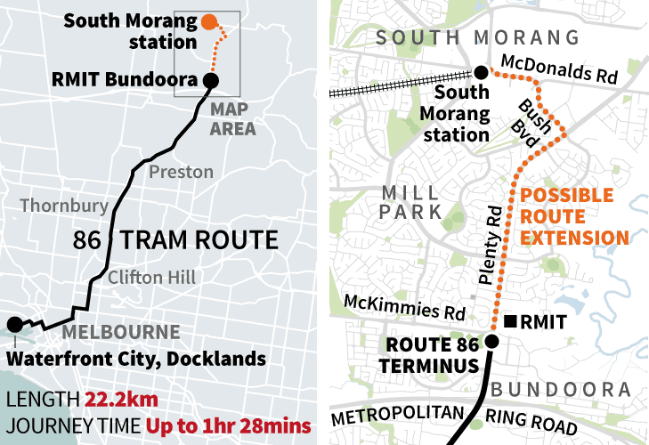
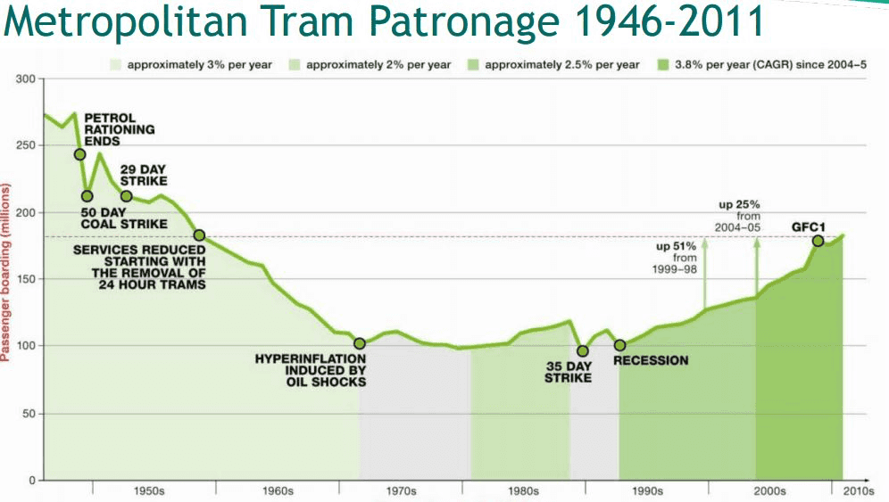
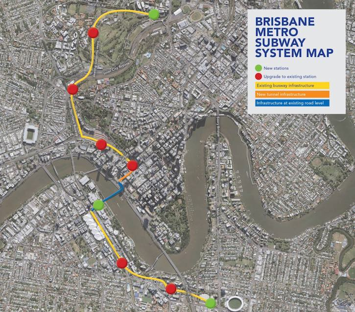

TABLE TALK

# **AUSTRALASIAN TIMETABLE NEWS**

**No. 291, November 2016 ISSN 1038-3697, RRP \$4.95**

**Published by the Australian Timetable Association**

[**www.austta.org.au**](https://www.timetable.org.au)

# **TOP TABLE TALK – MELBOURNE’S GROWTH**

## **Population flip: All out, All change**

*by Bernard Salt, the* Australian*, 13 October*

Melbourne is doing what no other Australian city is doing: flipping. The
focus of the southern capital’s growth for 160 years was east towards
the Dandenong Ranges and then southeast towards Cranbourne, Pakenham and
Berwick. However, Melbourne’s future growth lies nowhere in the east but
everywhere in the west and north. New tracts of developable residential
land west of Deer Park, north of Hoppers Crossing and north of
Broadmeadows are taking Melbourne in an entirely different direction.

On the one hand this can be viewed as the mere machinations of a city’s
changing demography. But on the other hand this flip-city act represents
perhaps the greatest shift in capital city property values since the
completion of the Harbour Bridge opened up Sydney’s north shore in the
1930s. But the land deals in the pathway of Melbourne’s western,
southwestern and northern surges have long been done. The big players
are right now carving new residential estates from Tarneit and Truganina
to Plumpton, Delahey and Craigieburn. And yes, there are infrastructure
plays that will help unlock and deliver fluidity to the west. The
Westgate Bridge will need to be replicated in form or in function. The
Western Ring Road will need to and indeed is being upgraded.

Hipsters have already colonised Yarraville and I am told there have been
beard sightings on The Strand at Williamstown. Not only that but
Sunshine is surely a hipster hotspot in waiting: all that ethnic
eclecticism; all that industrial chic authenticity. Mark my words.

But all of this is a mere chimera. The main game in property revaluation
has yet to play out. And partly, I suspect, because no-one has put all
the pieces together in Melbourne’s extraordinary flip-city
reconfiguration. Melbourne is lopsided because the locals have always
preferred the undulating hills of the east over the flat basalt plains
of the west. This meant railway lines evolved to harness the east’s
commuter reserves. There are 10 lines serving the east from Flinders St,
namely (clockwise): South Morang, Hurstbridge, Lilydale, Belgrave,
Alamein, Glen Waverley, Pakenham, Cranbourne, Frankston and Sandringham.
These lines channel commuters from three-quarters of Melbourne’s
population mass into Flinders St, which now manages around 30 million
passengers a year, up from 25 million less than a decade ago.

Melbourne’s workers and city-shoppers have always spilt out of Flinders
St and made a beeline to Collins St offices and retail stores (Myer and
David Jones) in Bourke St. So intense are these ant tracks that over
time a series of arcades have evolved to allow shoppers to get to Bourke
St via the Block Arcade, The Royal Arcade, The Causeway, Port Phillip
Arcade, the Degraves St Subway and others.

But about a decade ago Melbourne’s growth began flipping. The city’s
southeast growth municipalities of Casey and Cardinia began giving way
to the west’s power couple, the municipalities of Wyndham and Melton, as
Victoria’s and then Australia’s growth hotspot. Bolt on the City of Hume
to the north and Melbourne’s flip is underway, delivering more and more
commuters into Southern Cross station in the process.

The west’s flat plains may have been shunned by Melburnians for more
than a century but this is where the focus of metropolitan growth will
remain in the first half of the 21st century. And the reason is simple:
Melbourne’s western growth front offers affordable housing that is
closer to the CBD than the eastern and southeastern edges. The Melbourne
flip was always going to happen; it’s happening now and it’s written
into the city’s strategic plan to 2050.

This is important because Melbourne’s new western growth front is
serviced by railway lines that connect not into Flinders St but into
Southern Cross, including lines to (clockwise): Williamstown, Werribee,
Geelong, Melton, Sunbury, Craigieburn and Upfield. Spencer St, the name
of Southern Cross’s predecessor station, was always Flinders St’s less
glamorous cousin.

Southern Cross, Spencer St’s reincarnation, not only wrangles suburban
commuters form the burgeoning west and north but it also snares bus
interchange travellers to the airport and beyond, and the entirety of
the Victoria’s rural railway system. Melbourne visitors from Bendigo,
Ballarat, Mildura and Bairnsdale alight at Southern Cross. In this
regard the new Southern Cross station is more like a sleeping beauty
that has been reimagined … and it ain’t going back to the way it was.

The completion of the Regional Rail Link in 2015 accentuated the western
flip by streaming commuters from new stations such as Tarneit and
Wyndham Vale into Southern Cross, whose patronage now tops 25 million,
up from barely 13 million almost a decade ago. Make no mistake, Southern
Cross is stalking Flinders St for supremacy as the point of access to
CBD offices, shops and other attractions. If, by the middle of the
2020s, Southern Cross was to deliver, say, 35 million commuters and
Flinders St only 33 million, then new retail space must be developed
either within Southern Cross and/or in the precinct.

In a highest and best use of land consideration, office space gives way
to retail space, so Melbourne’s retail anchors would then contort to
capture the new foot-traffic hot spots.

It is true that the proposed Melbourne metro tunnel will divert some of
the west’s rising commuter flows to new stations along the CBD spine,
but most will channel through to Southern Cross to get to workplaces in
Docklands and Collins St West.

Residential property values around new stations at Melbourne University
and the Domain in particular will reflect the premium associated with
access to the best jobs and cultural infrastructure in the state of
Victoria.

No capital city has been transformed the way the Melbourne CBD will be
transformed by the city’s demography-inspired flip leading to a power
shift from Flinders St to Southern Cross. The commuter flows tell the
story of a rising force that is unstoppable. Pump more people into the
catchment of railway lines that feed into Southern Cross and the CBD’s
primary access point and property valuations will shift from the
gracious arcades around Flinders St to the pulsing heart of Southern
Cross station.

Melbourne at eight million people by mid-century will be serviced by two
landmark railways stations just as London and Paris at eight and 10
million today are serviced by several big stations. The question is
whether well before mid-century Melbourne won’t also have a second CBD,
possibly based around new technology and located somewhere along the
longest urban corridor at say Box Hill or at, say, Monash-Chadstone.

Meantime it is not possible to retain old CBD configurations and
property valuations when a city is taken from four million residents
through to five million and beyond. Melbourne is expanding in a new
direction; the CBD will expand in a new direction.

It’s time to think about the way in which CBD property values will be
reshaped by the reconfiguration of the greater metropolitan area of
Melbourne. And one of the first signs to watch out for in this story of
the rising influence of the west will be the sighting of hipsters in
places like Sunshine.

## **Franchises**

The Victorian Government is considering new seven year franchises for
suburban rail and tram. Operators will be required to abide by
conditions which will include prohibition of skipping stops at stations
to make up late running, and standards for reliability, accessibility
and maintenance. Operators of trains and trams would face spot
infrastructure audits. Last year, about 300 services became instant
expresses to avoid late running penalties. However, after widespread
condemnation, the number of station-skipping incidents has dropped from
almost 200 a quarter to 46 in the most recent three-month period. Public
Transport Minister, Jacinta Allan said all scheduled stations would be
measured for punctuality under new contracts, effectively putting an end
to station skipping. At present, trains and trams are measured at just a
few points on their journey.

Metro Trains and Yarra Trams are favourites for the new seven-year
agreements. Under the current franchise agreements, the government must
negotiate exclusively with Metro and Yarra Trams about a new seven-year
deal. If the two companies satisfy government demands, they would
negotiate new deals, but if they fail to meet requests the process could
be opened to other bidders.

## **Soon to be non-level crossing city**

A consortium led by CPB Contractors will remove four level crossings on
the Belgrave and Lilydale lines. There will, however, be dire
consequences for train services in the short term. Acting Premier
Jacinta Allan announced the work at Blackburn Road in Blackburn,
Heatherdale Road in Heatherdale, and Mountain Highway and Scoresby Road
in Bayswater from 15 October, “well ahead of schedule”.

The Minister said Bayswater station will close and be demolished, before
being rebuilt to suit the new track alignment. Belgrave line trains will
run express through Bayswater during this time, with buses running from
stations either side.

The Belgrave line will fully close between Ringwood and Belgrave for a
37-day construction blitz beginning in November, with 63,000 cubic
metres of soil and rock to be excavated to lower the rail line, before
road bridges are built over the tracks, to replace level crossings at
Mountain Highway and Scoresby Road, in Bayswater.

Buses will replace trains between Box Hill and Ringwood stations for 34
days from 27 December to 29 January while 800 workers lower the rail
line under Blackburn and Heatherdale Roads, upgrade Blackburn station,
and build the new Heatherdale station.

## **Infrastructure Victoria**

On 4 October Infrastructure Victoria released a draft infrastructure
strategy for the next 30 years. It is now open for consultation. The
draft covers everything from education to transport, telecommunications,
energy and justice. It makes 134 recommendations worth around \$100
billion to address the Victoria’s current and future needs.

Public transport recommendations are:

-   Geelong/Werribee/Wyndham rail: New stations, extra tracks and
    electrification. 5-15 years. Cost: Up to \$3 billion.
-   Level Crossing removals: Develop plan within five years to remove
    more crossings beyond current target of 50.
-   Melbourne Metro 2: Tunnel linking Clifton Hill to Fishermans Bend,
    then Newport needs investigation in next five years and could be
    required in 15-30 years. Cost: More than \$10 billion.
-   A railway to Wollert and Epping North within 15 to 30 years.
-   High capacity signalling upgrades on the metropolitan rail network.
-   Upgrades to some of Melbourne’s busiest train stations, including
    South Yarra and Caulfield.
-   New mass transit light rail or bus networks for major metropolitan
    employment centres – such as Monash and Latrobe – to connect with
    rail lines.
-   Introduce new regional bus services to connect regional towns with
    regional cities.
-   Expand bus services in growth suburbs, as well as SmartBus services
    and improved DART services to Doncaster.
-   Reconfigure the City Loop to increase capacity on the Craigieburn
    and Upfield lines.
-   Remove barriers to innovative rideshare and carpooling schemes.
-   Trams: Extend services to Fishermans Bend and Footscray. 5-10 years.
    Cost: Up to \$3 billion.
-   Reserve land for possible railway to Torquay (see item below).
-   Melbourne Airport Bus: Create priority bus lane to Airport within 10
    years. Cost: Up to \$100 million.
-   Metropolitan bus network: Overhaul routes within 5 years.

But the report recommends deferring construction of a railway to
Melbourne Airport, saying it will only be needed once SkyBus is full in
15 to 30 years. It also finds new rail lines to Monash University and
Rowville, and to Doncaster, cannot be justified.

The full draft report can be accessed at
<http://yoursay.infrastructurevictoria.com.au/30-year-strategy/>

Infrastructure Victoria concluded that the Melbourne Metro 2 project - a
proposed \$19 billion train tunnel from Clifton Hill to Newport via
Parkville, Southern Cross Station and Fishermans Bend - could add about
\$20 billion to land values. It warned that residential and commercial
properties set to benefit from big infrastructure projects might need to
get used to the idea of helping pay for them. In a controversial
approach to funding infrastructure known as "value capture", which is
championed by Prime Minister Malcolm Turnbull, it concluded that about
one-quarter of the project costs could be funded by hitting those who
benefit with a "betterment levy". Under the most likely scenario, all
residential and commercial properties within 1 km of the rail corridor
would pay the new tax. In the first year of operation, the average rate
would be \$435 for residential properties, or \$21 and \$10 per square
metre for commercial and industrial properties.

Construction is unlikely to start until at least 2034.

A spokesman for Treasurer Tim Pallas said Infrastructure Victoria's
final recommendations were due in December and would be "fully
considered" ahead of a five-year infrastructure strategy due to be
released by the middle of next year. With infrastructure funding a major
political issue, the idea of hitting households or businesses with
higher taxes to help pay for it is already proving highly controversial.

The idea of "value capture" - where the households and business that
directly benefit from a project are required to help fund it - was
heavily spruiked by Mr Turnbull. In April this year, he said major
projects needed to harness the boost in property values that resulted
from them, and called for a "cultural gear change in the way that we
look at urban infrastructure".

But the details about how the concept could be put into practice to fund
big projects have so far proved elusive. Infrastructure Victoria said
methods of applying the concept could include "betterment" levies,
developer contributions, and cashing in on property development around
train stations. It said there was evidence that certain types of
infrastructure such as train stations increased nearby land values,
providing "significant windfall gains to land owners. A park, for
instance, is more readily enjoyed by those living nearby; a train
service is most beneficial for those living and working near a station.
Even state-wide services, such as hospital care, are most valuable to
those with ready access to them.

The concept of value capture is not a new one. It was used to help fund
Melbourne's City Loop, with a variety of levies and charges. It is also
being used to fund London's Crossrail project through a levy on
non-residential properties.

## **Tram to South Morang?**

Less than five years ago the first Metro train ran all the way out to
South Morang. Such is the frenetic pace of urban growth in Whittlesea
Shire – a population almost the size of Shepparton has moved there in
the last five years – the Victorian government is already contemplating
putting in a tram line just five years after the railway was opened to
South Morang.

The government is investigating a possible five-km route extension of
route 86 from Bundoora, as part of a \$1 million spend on readying the
line for E-Class trams. "We're investigating a range of improvements to
Route 86, including infrastructure upgrades for the rollout of bigger,
safer, more accessible trams, and planning for a potential extension of
the line in the future," Public Transport Minister Jacinta Allan said.

A tram reserve already exists in the median of Plenty Road, which would
cover most of the proposed extension, before the trams would veer left
along Bush Boulevard and past Westfield shopping centre to the station.

{width="6.108262248468941in"
height="4.1875in"}

Alahna Desiato​, a spokeswoman for the community campaign, said the tram
extension would benefit locals in many ways, but a new public transport
route into the city would not be one of them. Passengers who caught the
tram from the new terminus all the way into the city would likely face a
near two-hour commute, given the ride from Bundoora already takes about
an hour and a half. "I believe the tram's purpose is more for local
trips, whether to access nearby facilities or to reach another form of
public transport," Ms Desiato said. "It would give residents a choice,
which they don't currently have." Students could reach RMIT and La Trobe
universities in Bundoora without driving, and commuters could catch it
to South Morang station, easing pressure on its car park, which
routinely fills before 7am, she said.

*Maps and article from the* Age, *13 October.*

## **Route 8 re-routing**

The route 8 (Toorak) tram along Domain Road and Park St in South Yarra
will be taken out of service, perhaps permanently, when work starts on a
new underground railway station at the corner of Domain and St Kilda
Roads. An environment effects statement for the nine-kilometre Melbourne
Metro rail tunnel, published in June, said diversions to route 8 while
Domain station is built would be temporary. But Public Transport
Victoria is now believed to be considering re-routing route 8 along
Toorak Road for good. PTV does not plan to make a decision soon and said
it would first assess the performance of the Toorak Road diversion after
trams begin to use it when Metro tunnel construction begins in 2018.

## **Tram patronage increase to lead to traffic improvement measures**

Passenger numbers on Melbourne's trams have soared 12% over the past 12
months to 203.8 million trips in 2015-16. Numbers are now at levels not
seen since private car travel began to overtake public transport use in
the 1950s.

Public Transport Victoria has attributed the rise to the introduction of
the free City tram zone in 2015 and to Melbourne's apartment boom, which
is concentrated along inner-city tram corridors. "Since 2012 more than a
third of building approvals for new dwellings have been nearby tram
routes," it said in its annual report. "As these dwellings are built and
occupied, this leads to a significant population growth in the tram
catchment."

Tram speeds in Melbourne are among the slowest in the world, at a
network-wide average of about 16km/h, according to Yarra Trams, and
PTV's annual report noted that "trams continue to be affected by traffic
congestion". In an effort to improve this, the Andrews government will
introduce two trials of new technology on the roads next year. Minister
for Roads Luke Donnellan​ said it is hoped the intelligent transport
technology trial will reduce congestion. "Improving the flow of trams at
intersections will make services more reliable and reduce congestion on
our roads, helping to get passengers where they need to go, on time," he
said. The first trial will involve installing devices inside trams and
traffic signal boxes, which will communicate with each other to alert
the traffic lights to approaching trams.

The co-operative intelligent transport system will be more responsive
than the current tram priority signals that sit beneath the surface of
the road, which are triggered each time a tram passes, regardless of the
level of congestion. The second trial will use GPS technology to track
trams in relation to other traffic on the road, feeding that information
back to Yarra Trams and VicRoads' traffic control centres in real time.

{width="7.364583333333333in"
height="4.156961942257218in"}

VicRoads has also begun to look at measures to reduce delay on route 11,
between West Preston and Docklands, which has suffered a sharp fall in
punctuality this year. One in four trams on route 11 ran more than five
minutes late last month, the worst performance of all routes in
Melbourne. The proposed route 11 revamp is part of the authority's
annual traffic light review, which targets bottlenecks in the road
network. Other roads under review are Victoria Parade, the Nepean
Highway, Stud Road and Derrimut Road. The \$669,000 tram priority trial
will be run by the Australian Road Research Board and is funded through
the government's Smarter Journeys program.

*Graph and article from the* Age, *17 October.*

## **South Yarra stand-off**

The Victorian Government is refusing to add a new South Yarra station to
the Melbourne Metro tunnel project, despite moves by the Federal
Government to send Victoria \$600 million to pay for it. Victoria is in
a standoff with Canberra over a bonus owed the state under the federal
Asset Recycling Initiative for the Port of Melbourne sale. The Andrews
Government argues that under the original terms of the federal scheme,
Victoria [should receive \$1.45
billion](http://www.heraldsun.com.au/news/victoria/prime-minister-witholds-14-billion-asset-recycling-cash-bonus/news-story/d357b9fb673105999e45385595c58535)
— 15% of the \$9.7 billion the state will get from selling the port. The
Commonwealth has agreed in principle to give Victoria \$877 million. But
it is now debating whether to offer the rest only if a new South Yarra
station is linked to the Metro project. The Turnbull Government is
threatening to pay the money that is owed to Victoria only if South
Yarra railway station is included. The \$10.9 billion Melbourne Metro
does not currently include plans for a stop at South Yarra, despite
proposed new rail lines passing within 80 metres of the station. The
State Government says it would cost too much. Public Transport Minister
Jacinta Allan said the South Yarra extension did not stack up
financially and would only provide a minimal return on investment. She
said the potential federal offer was simply about saving Liberal MP
Kelly O’Dwyer in the seat of Higgins, and accused the Turnbull
Government of playing politics with money that was owed to Victoria.

## **Late night transport**

Figures published in Public Transport Victoria's annual report show that
each weekend an average of 35,000 people catch a late-night train, tram
or bus that runs as part of the \$83.6 million, 12-month trial of
all-night public transport on Fridays and Saturdays. Each passenger on
Melbourne weekend all-night public transport is subsidised more than
\$45. The trial's \$83 million cost comprises \$50 million to put on the
extra services – 300 trains, 250 trams and 485 bus services – and \$34
million for extra transit police and protective services officers. The
extra PSOs only patrol premium railway stations, not every stop on the
Metro network, as well as working outside Night Network hours.

The Victorian government said from the outset that the trial, which
commenced on January 1, would need to prove its popularity to continue
indefinitely. The trial has since been extended a further six months.
Public Transport Minister Jacinta Allan said more than 20 per cent of
Night Network passengers worked late for a living, in hospitality and
essential service. "All night public transport provides a safe, cheap
and easy way for shift workers to get home and supports our night
economy, as well as helping people enjoy the world's most liveable city
for longer," she said.

## **Torquay line?**

A railway to Torquay is being investigated by Infrastructure Victoria.
It would branch from the Geelong-Warrnambool line between Marshall and
Waurn Ponds. The 30-year draft plan recommended the land for the rail
corridor be reserved immediately and that construction begin in 15-30
years. According to the draft plan, the line would open up Armstrong
Creek and Torquay for growth and reduce residents’ reliance on cars.
Buses could be used until the rail link was needed. Costs for the
project have been estimated to be \$250-\$500 million.

Public Transport Minister Jacinta Allan would not rule out the proposal.
“We’ll consider Infrastructure Victoria’s final report when it is
released,” she said. But we’re already investing in more services for
Geelong and Warrnambool, and planning for the extension of services to
Armstrong Creek towards Torquay.”

Infrastructure Victoria CEO Michel Masson said significant growth was
expected in Torquay and Armstrong Creek over the next 30 years. “As the
population grows and the demand for access to public transport
increases, it is likely that this corridor will need a higher-capacity
bus or rail link in the next 15-30 years. Infrastructure Victoria has
recommended that we should take steps to protect a public transport
corridor linking Torquay with Geelong within the next five years,” he
said.

## **Southern Cross station expansion**

Melbourne Southern Cross station may be overhauled under a \$300 million
plan to cope with an unprecedented surge in patronage that is
threatening its ability to function, just ten years after the station
was rebuilt. The station is already believed to have around 25 million
passenger visits a year, and is approaching 30 million. The station's
owner, AssetCo, a subsidiary of industry superannuation behemoth IFM,
has lodged an unsolicited bid proposal believed to be worth about \$300
million that includes a new elevated bridge running down the middle of
the station to provide extra access to its 16 platforms, lengthening
platforms and overhauling the dingy and inadequate coach terminal.

AssetCo is believed to have the lease to operate the station until 2034,
including control of retail space. Under the terms of the contract
between the state and IFM, once the station hits a capacity trigger
point of about 30,000 passengers per peak period, IFM has the right to
renegotiate the deal to factor in extra costs linked to overcrowding.
That could cost the state hundreds of millions of dollars extra over the
life of the contract. IFM is believed to want to extend the lease, in
return for the meeting the costs to dramatically boost the capacity. of
the station.

## **Metro Trains Melbourne: Working Timetable 5 September**

Amended weekday pages effective 5 September for the Caulfield Group and
the Northern Group of lines were issued for the Metro Trains WTT. The
main change was the return of the Frankston line to normal following
completion of the level crossing removal project. The Stony Point
changeover train now operates on Sundays rather than Mondays. There were
minor fiddles elsewhere, including one additional train mid-afternoon
from Lilydale to Ringwood as a NonPSR service. This is a peculiar
Melbourne institution of a train additional to Metro Trains’ contractual
obligations, ie, Non Public Service Requirement. If a NonPSR train does
not operate, there is no penalty.

An unusual twist in the layout of the WTT was moving some trains
operating after 0300 on Friday and Saturday nights to the next timetable
day. This was possible with the removal of earlier software restrictions
on the system. However, other software restrictions mean that some
trains that formerly departed at 0300 or 0301 now depart at 0302.

# **RAIL AND TRAM NEWS**

## **Opening of the Redcliffe Rail line**

*by Hilaire Fraser*

We were fortunate to be able to arrange a family holiday in Brisbane to
coincide with the opening of the Redcliffe Peninsula Rail Line on Monday
3 October 2016. The new line was opened at Kippa-Ring by the Prime
Minister, Malcolm Turnbull, and Queensland Premier, Annastacia
Palaszczuk, at 1000. The official party travelled on the first train
with 230 members of the public who were successful in a ballot. Then
free shuttle services operated between Kippa-Ring and Petrie, the
junction for the line to Caboolture, Nambour and Cairns, between 1000
and 1500.

We travelled on the 1100 regular Nambour train from Roma St and joined a
shuttle train at Petrie at 1150. On the east side of Petrie station a
new island platform has been constructed, forming platform 4 on the
western side for Brisbane bound trains from Caboolture and Nambour and
platform 5 on the eastern side for Brisbane bound trains from Redcliffe.
On 3 October shuttle trains arrived at and departed from platform 5.
Trains departing from platform 5 ran wrong line until a cross-over east
of Petrie. The stations between Petrie and Kippa-Ring are Kallangur,
Murrumba Downs, Mango Hill, Mango Hill East and Rothwell. The new line
is double track throughout and all stations on the branch have two
wayside platforms, except for Kippa-Ring which has an island platform
surrounded by two terminating tracks, allowing trains to arrive and
depart from each side. On the opening day a commentary on the history of
the project and its features was given on the “next station” displays in
the trains as well as by audio. Although tickets to the open day were
obtained on the internet, patronage was handled well by four six-car
trains operating a fifteen-minute service, and it was not necessary to
check tickets as a means of controlling passenger numbers. The day was
wet, but each train had a nearly full sitting load. We returned from
Kippa-Ring at 1220, and after a slight delay at Kallangur to allow a
train to clear platform 5 at Petrie, we were returned to Petrie. Petrie,
like other stations, had a Translink stall where a limited range of rail
and bus timetables could be obtained as well as other information. Other
stalls offered sausage sandwiches, soft drinks, coffee and ice-creams.
We returned to Brisbane City on the 1258 train from Nambour.

The following day was a perfect warm sunny Brisbane spring day. We
caught the 0952 train from Brisbane Central to Kippa-Ring. Kippa-Ring
trains show a regional ”Redcliffe” destination like Varsity Lakes
trains, which show a “Gold Coast” destination. At Petrie, the Redcliffe
train used platform 3, then passed under the relief Brisbane-bound line
from Caboolture that entered new platform 4. Our train was due at
Kippa-Ring at 1045, offering connections as follows:\

1050 route 660 Redcliffe Jetty via Redcliffe Hospital, from Caboolture\

1051 route 680 Redcliffe Jetty via Anzac Avenue direct, from Chermside\

1052 route 694 Redcliffe Jetty via Clontarf\

1052 route 699 Redcliffe Jetty via Scarborough\

1059 route 696 Redcliffe Jetty then Woody Point clockwise\

1059 route 696 Woody Point then Redcliffe Jetty anticlockwise\

1055 route 690 Duffield Rd, Clontarf\

1100 route 690 Sandgate via Scarborough and Redcliffe Jetty,

All these services operate every 30 minutes Monday to Friday daytime and
thus can meet every train. However, our train arrived at 1052 and
consequently the 660, 680 and 699 connections had gone, so we caught the
694 to Redcliffe via Clontarf. Possibly the late arrival was due to a
slower train speed on the new track, particularly at the new junction at
Petrie. The Marine Parade at Redcliffe offers beautiful views over
Moreton Bay and out to Moreton Island as well as a number of worthwhile
eateries. The Visitors’ Centre on Marine Parade had local train and bus
timetables. I was assisted by a very helpful staff member.

After lunch we caught the 1256 route 680 bus to Chermside via Kippa-Ring
station, the huge North Lakes shopping centre, Petrie station and
Strathpine. A 680 journey takes 90 minutes. Catching the bus to
Chermside gave us another way of returning to Brisbane and allowed us to
collect an item, not available from Myer Brisbane City, from Myer
Chermside. Finally, we caught the 1600 Brisbane Transport route 333 bus
back to Brisbane City for a swift trip via the Northern, Inner Northern
and City busways.

The new line received much media publicity and made a very favourable impression. Hopefully, normal service trains will be able to run on time so that all bus connections will be made. The line has been promoted as offering a 55 minute service from Brisbane to Kippa-Ring.

## **Interim timetable as Queensland Rail CityRail struggles with staffing issues**

An emergency interim timetable was introduced by Queensland Rail CityRail from Tuesday 25 October for at least two weeks as it struggled to deal with staffing shortages brought on by opening of the Kippa-Ring line. It provides for an 2.3% reduction in services. The Minister for Transport Stirling Hinchliffe directed QR to:

1.  initiate the recruitment of an additional 100 drivers immediately;\

2.  complete the recruitment and training of 100 additional drivers and 100 additional guards approved by the Government in November 2015;\

3.  deliver the interim timetable to minimise the disruption to the travelling public;\

4.  maintain the supply of train drivers by ensuring guards are stationed and trained on the Next Generation Rollingstock – providing a pipeline of future drivers with route knowledge;\

5.  work with its employees to develop more flexible working arrangements, including part-time arrangements – boosting the longevity of the existing workforce and creating driver roster flexibility

He apologized that “Queensland Rail hasn’t delivered to the high standards that we set for ourselves. Despite clear and repeated advice from QR that it was prepared for the extra services with the opening of the Redcliffe Peninsula line services, it is now clear that this was not achieved. On time performance for QR in August and September was between 95% and 96%. It is expected to be 91% for October. This is not acceptable to the Government and more importantly, it’s unacceptable to the travelling public.

Under the interim timetable, there will be the cancellation of 30 services and the alteration or partial cancellation of 11 other services. The number of train services will be reduced from 1306 per day to 1276 per day (or 2.3%). According to the Media Release twenty-five of the cancelled services will have a wait of less than 15 minutes to the next service. The other five cancelled services will have a wait of less than 30 minutes for the next service. However on some lines it's more like a 60 minutes gap. For example, on the Ipswich line the 1037 train from Ipswich to the City is cancelled which means there's a gap of 1 hour from the service at 1007 until the next one at 1107. Likewise, in the afternoon the 1507 train Ipswich to the City is cancelled creating a gap of 1 hour between the 1437 and 1537 services. With the cancellation of the 1037 train ex Ipswich it also creates a 41 minute connection time with the Rosewood shuttle that arrives Ipswich at 1026 resulting in a wait until the 1107 train.

On Fridays, 32 services are cancelled and 21 altered or partially cancelled, reducing the number of train services from 1342 to 1310 a day (or 2.4%). The total number of services under the interim timetable remains higher than before the Redcliffe Peninsula line became operational of October 4 when there were a total number of 1218 services on Monday to Thursday and 1244 on Friday.

New drivers and guards will be trained on the Next Generation
Rollingstock – the 75 new Bombardier EMUs being delivered up until late
2018 – with Hinchliffe saying this measure will provide a pipeline of
future drivers with route knowledge.

Queensland Premier Annastacia Palaszczuk said "I'm absolutely furious. I
don't blame commuters for being furious as well," she said. Let me make
it clear - I want answers. And my Minister wants answers." Ms Palaszczuk
said Transport Minister Hinchliffe is “100% focused” on fixing
Queensland Rail’s timetable mess and there is no prospect he will lose
his job. But she had no such guarantees for QR chief executive Helen
Gluer following a one-hour Cabinet briefing on the saga.

On 25 October an unnamed senior Queensland Rail executive was suspended
for failing to act on driver shortages. Then on 27 October Queensland
Rail's CEO, Helen Gluer, and the Chairman of the Board, Michael Klug
resigned. The director-general of the Department of Transport and Main
Roads, Neil Scales, will replace Ms Gluer. He was the former
director-general of Merseytravel, the transport authority in northern
England. He joined the Queensland Public Sector in 2012 as CEO of
TransLink, responsible for the public transport network across the
state.

Former Rio Tinto executive Phillip Strachan has been appointed to
investigate what went wrong. The terms of reference for his
investigation include:

-   The adequacy of Queensland Rail scheduling, rostering, recruitment
    and training practices\

-   What circumstances led to the driver shortage\

-   When deficits in train crew availability were known and what action
    was taken\

-   The nature and suitability of actions taken by Queensland Rail once
    the train crewing issues manifested under the new timetable.

Queensland Rail has admitted it is woefully short of trainers to
properly meet its own recruitment targets. This is a to the government’s
promise to immediately recruit another 100 drivers to deal with the
staff crisis. QR said it was unable to start that driver training until
April 2018.

QR also claims this arises because 25 trainers were made redundant when
the Liberal National Party were in power.

Problems had first occurred on Friday 30 September when 50 train
services were cancelled because drivers were busy training other staff
[on the new Redcliffe Peninsula
line](http://www.couriermail.com.au/news/queensland/thousands-of-commuters-board-trains-on-opening-morning-of-redcliffe-line/news-story/0c20377bdbd76ebea63da0377c8da58f).
Thousands of passengers were delayed. A QR spokeswoman said the
disruption to 48 of 1259 services was because of seven shifts being
unfilled the day before the 1-3 October long weekend. An additional 31
shifts of the 600 drivers and guards rostered on needed to be covered
because qualified drivers were training on the new line. “On Friday
night, to facilitate intensive training requirements we needed to fill
an additional 31 shifts, as qualified drivers piloted others through new
infrastructure near Petrie to gain their competency,” the spokeswoman
said. She could not rule out future disruptions. “The intensive training
schedule through Petrie is due to be completed by the end of October and
we will be working hard to manage our resources and minimise disruption
for our customers,” she said

Disruptions continued, especially on Friday 21 October when about 100
services were cancelled. Buses replaced trains on the Springfield line
between Springfield Central and Darra and on the new Redcliffe Peninsula
line between Petrie and Kippa-Ring after 1900.

## **Brisbane cross-river rail; Brisbane Metro**

On 25 October the Federal Government announced \$10 million in planning
funding for Brisbane Cross River Rail, the first federal money they have
committed to the \$5.4 billion rail project. However, it is contingent
upon integration with Brisbane Metro, a 7 km subway system proposed by
Brisbane City Council at a cost of \$1.54 billion from Woolloongabba to
Herston, with stops at Mater Hill, South Bank, connecting to a new
underground station at Cultural Centre, continuing over Victoria Bridge
and into a new underground portal at Adelaide St linking with the King
George Square, Roma St, Normanby and QUT Kelvin Grove stations. At the
furthest points, interchanges will transfer bus commuters.

Cross River Rail’s 10.2km rail link would connect Dutton Park to Bowen
Hills via a 5.9km tunnel under the Brisbane River and CBD, with new
stations at Boggo Road, Woolloongabba and Albert St. It would ease
congestion on the Beenleigh, Gold Coast and Cleveland lines at the
Merivale Bridge, Brisbane’s sole rail river crossing in the CBD. *The
Courier-Mail* campaigned for Cross River Rail during its Go Queensland
series.

“We have two projects here – Brisbane Metro and Cross River Rail. They
are not competing, they are complementary and it’s important to make
sure we get the investment right and the planning right,” Mr Turnbull.
Premier Annastacia Palaszczuk last month voiced strong opposition to
Brisbane Metro.

The \$10m federal contribution tops up \$50 million allocated by the
Palaszczuk Government in the last State Budget to establish the CRRDA
and start early works.

{width="7.245138888888889in"
height="6.371683070866141in"}

The map shows the planned alignment of the Brisbane Metro Subway
System. The alignment will ensure that Brisbane Metro Subway System is
fully segregated from road traffic so that it is reliable and efficient.
The planned alignment will involve Brisbane Metro Subway System starting
at Herston and travelling underground on the existing Inner Northern
Busway to the King George Square station. The Brisbane Metro Subway
System will then continue along new tunnel infrastructure before
travelling on new above ground infrastructure to connect the subway from
Adelaide Street, along North Quay and over the Victoria Bridge. The
Victoria Bridge will become a green bridge - dedicated to Brisbane Metro
Subway System, other bus services, pedestrians and cyclists. Brisbane
Metro Subway System will then continue underground on the existing South
East Busway from South Brisbane to Woolloongabba. New stations created
along the alignment will be installed at the below locations: • Herston
• Culture Centre • Woolloongabba. Upgrades to existing stations will be
completed at the below locations: • Kelvin Grove • Normanby • Roma
Street • King George Square • South Bank • Mater Hill The legend shows:
• New stations in a green circle • Upgrade to existing stations in a red
circle • Existing busway infrastructure highlighted in yellow • New
tunnel infrastructure highlighted in orange • Infrastructure at existing
road level highlighted in blue.

## **Queensland railway infrastructure information 2016**

**Queensland Rail** has placed on their website new System Information
Packs dated October 2016 for their entire network, including track
diagrams. The Metropolitan System Pack’s track diagrams include the new
Redcliffe Peninsula line. See
<http://www.queenslandrail.com.au/forbusiness/the-regional-network>

**Aurizon** has also updated its System Information Packs dated July
2016. They also provide a system-wide track diagram pack dated June
2016. To access these go to
<http://www.aurizon.com.au/what-we-deliver/network/network-downloads>

## **Queensland: Collinsville coal**

Glencore’s Collinsville coal mine is to resume production after being
closed for almost a year. Presumably this will provide traffic for
Aurizon and/or Pacific National.

## **Infrastructure priorities**

Infrastructure Australia has placed the Perth’s airport rail line, the
Moorebank Intermodal Terminal in Sydney, and the Adelaide-Tarcoola Rail
Upgrade on its Priority List for “nationally significant projects and
initiatives.” IA chief executive Philip Davies said the IA board had
positively assessed business cases for the three rail projects, as well
as Victoria’s M80 Ring Road Upgrade project. “Adding these projects to
our Infrastructure Priority List demonstrates that they are sound
investments that have the potential to address some of the nation’s key
infrastructure challenges, such as urban congestion and the need to
improve national freight connectivity.”

The Perth—Forrestfield Airport Railway will address the lack of public
transport access to the eastern region of Perth and Perth Airport, and
reduce road congestion in the city’s east. Improving public transport
access to Perth Airport will help manage ongoing growth, as passenger
numbers double over the next 20 years.

Mr Davies said: “Development of an Intermodal Terminal at Moorebank in
Sydney’s south-west is part of a long-term strategy to increase the
carriage of freight by rail. The updated business case shows this
project will provide a significant boost to Sydney’s intermodal terminal
capacity, allowing for much more freight to be transported to and from
Port Botany by rail.”

Davies also said the Adelaide-Tarcoola Rail Upgrade would support
projected growth in national freight volumes by improving capacity on
the line between Adelaide and Perth. “Investment in Australia’s national
freight network is vitally important if we are to make the most of our
population growth and our close proximity to the booming economies of
China and South-East Asia.”

## **Aurizon traffic**

Aurizon chairman Tim Poole told the AGM on 18 October that difficult
market conditions in the resources and freight sectors “were tough on
our customers and this resulted in flat or lower volumes across our
businesses”. The operator announced a 3% decline in coal volumes in the
first quarter of the new financial year compared with the 2016 fiscal
year, along with a 14% decline in iron ore volumes, and a 10% decline in
freight volumes. The 10% decline in freight reflects the loss of
Queensland Nickel’s bulk volumes between its refinery and the Port of
Townsville. In terms of more traditional container freight, Aurizon was
pleased to announced a 2% increase in intermodal business, to 100,000
TEUs in the September 2016 quarter. Coal volumes were impacted by a 5%
year-on-year decline in Aurizon’s larger Queensland haulage business, to
39.7mt. This was somewhat counterbalanced by a 6% increase in the
smaller NSW volumes, to 11.5mt, but the overall coal haulage figure for
the September quarter was still down 3%, to 51.2mt. Iron ore volumes
declined 14% to 5.4mt, Aurizon said, reflecting smaller volumes from a
key customer.

## **NSW Hunter Valley coal: Glencore Rail**

In the midst of consideration by the Australian Competition and Consumer
Commission of competing proposals for Glencore Rail to be acquired by
either Pacific National or Aurizon, Genesee and Wyoming Australia
stepped in and acquired the company for \$1.14 billion. On 20 October
GWA announced this acquisition and the simultaneous divestment of 49% to
the Macquarie group. G&W is the predominant owner of short-line
railroads in the US and also owns railways in Canada, Australia,
Britain, Poland and Germany. It operates SA intrastate freight (the
little still surviving) and the Tarcoola to Darwin railway. In March
2015 it acquired Freighliner Australia. Glencore Rail (GRail) owns nine
trains, comprising 30 locomotives and 894 wagons. These are operated for
them by Genesee and Wyoming Australia, through Freightliner Australia.
GWA now intends to re-deploy locomotives from SA to the Hunter Valley
and purchase two additional train sets at a cost of \$50 million each.

The ACCC had provided a discussion paper raising various issues of
competitiveness if either acquisition goes ahead. This can be viewed at
<http://www.accc.gov.au/media-release/accc-releases-statement-of-issues-on-aurizon-and-pacific-national%E2%80%99s-competing-proposals-to-acquire-grail>
The following graph from ACCC’s discussion paper summarises the present
market shares of coal traffic providers in the Hunter Valley.

[\[CHART\]]{.chart}

## **NSW Hunter Valley coal: Aurizon**

Aurizon has obtained an 8.7 million tonne per annum coal haulage
contract with energy generator AGL. This will deliver coal to AGL
Macquarie, from Peabody’s Wilpinjong mine and Glencore’s Mangoola mine,
via ARTC track. AGL Macquarie includes the Bayswater and Liddell power
stations, and also consumes coal from BHP Billiton’s Mt Arthur coal
mine, delivered by conveyor.

The rail delivery contract is currently held by Pacific National.
Aurizon will take over that business from July 2017. Aurizon says the
AGL Macquarie volumes will bring its NSW tonnage to roughly 55 million
tonnes per annum.

## **Sydney: Infrastructure**

On 20 October the NSW government announced the successful sale of the
major part of its electricity distribution network for \$16 billion.
This money will be applied to infrastructure projects. The biggest
project is expected to be a Western Sydney Metro (ie, stand-alone line
with frequent trains) from the City to Parramatta to relieve the present
fully committed Western line, at a cost of \$10 billion.

## **Sydney: Minor infrastructure changes**

From 19 November overhead will be removed from the Mortuary Platform at
Sydney station. Electric train tours used to commence from that platform
over the years.

Control of the ESR, from Erskineville Junction to Bondi Junction, is
transferred from Sydney Signalling Complex to the Sydenham Signalling
Complex, from 17 October.

The Parramatta turnback was commissioned from 17 October.

## **Canberra Tram confirmed**

The ACT election was held on 15 October. It was an unusual election in
that the major issue was whether a public transport project – the City
to Gungahlin tram – would go ahead. The election resulted in the
incumbent Labor/Greens coalition government being returned. Hence, the
project is now proceeding. Planning for the second stage from the City
to Woden will now commence.

The election was generally seen as a referendum on the proposed tram.
The ACT Liberals (and others) campaigned vigorously against it. The
result was a significant swing against them. The result might be seen as
an indication that urban public transport projects are popular.

## **Espee Rail hits the ballast**

When existing contracts to provide ballast/works trains are completed,
Canberra-based Espee Rail will, for the time being, suspend operations.
The weekly Canberra to Sydney freight train conveying scrap metal has
not operated for nearly a year, due to a combination of an unsuitable
loading area in Canberra and low scrap metal prices.

## **Sydney-Melbourne freight blues**

*Geoff Lambert writes*: Since ARTC’s August 2016 Master Train Plan,
there have been big changes in the way Pacific National handles traffic
on the North-South route. Previously, PN ran two trains each way each
day between Brisbane and Melbourne. MB2/BM2 and MB4/BM4. The latter
still run to their old timetable, but the former have been replaced by
trains coded MW2/WM2. The “W” coding means Port Kembla and this implies
steel traffic. However all these trains are still coded by ARTC as
“Intermodal”. To replace the northern leg of the old MB2/BM2 service, PN
now runs a SB6/BS6 Intermodal train between Sydney and Brisbane. The
running of mixed “Steel/Intermodal” trains by PN dates from about two
years ago, following falling Intermodal volumes on the route. Most
Intermodal traffic on the North-South route is through traffic, but a
small amount serves Sydney. It is many years since the Melbourne-Sydney
and Brisbane-Sydney Intermodal traffic justified separate trains for
these two short routes. However, the SB6/BS6 trains represent a
reversion to this practice. Indicative of the predominance of steel on
the WM/MW services are the departure and arrival times at Sydney and
Melbourne – approximately 0200 departures and 1730 arrivals. This is
hopeless timing for Intermodal “just in time” delivery. In addition, the
transit times of these trains remains the same as it was with their
MS/SM predecessors of 16 years ago. This is despite billions of dollars
of expenditure designed to cut transit time by up to six hours

## **SCT intermodal services**

On Thursday 13 October, SCT (Specialised Container Transport) ran its
first train from its new intermodal terminal in Wodonga to SCT’s Perth
facility. The train number for the northbound train on the Albury line
is 6709V, and the southbound is 6708V. So far, the northbound has been a
night-runner. Interestingly, the new ARTC Working Timetable which
commenced on 16 October doesn't contain the schedules for these trains.
The 23-hectare Wodonga site has direct access to the mainline and
features a 6000m2 cross dock terminal, a 5000m2 container handling area
and in excess of 5km of internal rail track. The \$18 million terminal
investment will be officially opened in January 2017, in conjunction
with a new SCT service to Queensland. From January 2017, SCT will
provide trains to its new Brisbane Terminal in Bromelton. SCT's contract
with Aurizon is due to cease on 31 December, when it will be replaced by
SCT’s own MB9/BM9 services between Melbourne and Brisbane. Up to now,
SCT has regularly provided 12 wagons (and reportedly more on some
occasions) on Aurizon's MB7/ BM7 services.

## **V/Line: Albury line**

V/Line is refurbishing an additional power van for its standard gauge
Albury line trains so that it can reconfigure the present four standard
gauge sets into four train sets. Currently the Albury service operates
with three trains, with locomotives hauling four passenger carriages
each. V/Line plans to take one carriage off each of the existing trains,
and add it to the refurbished loco, to create four trains hauling three
passenger carriages each. The fourth train will not be used in standard
operations, but instead will be a standby train in case one of the three
other trains needs to be serviced. The investment is part of a \$15
million allocation included in this year’s Victorian budget. As well as
refurbishing the power car, the money will go towards cleaning and
repairing the interior of the existing carriages. The funding will also
go towards planning for the next generation of trains for the line. The
work is being undertaken at the Downer Rail workshop in Melbourne.

***Comment:*** *The effect of these changes is that for the two sets
required to provide the service, there will be two spare sets in
reserve, ie, a 100% contingency. Four carriages in a set, rather than
five carriage sets, would seem to indicate the trains could run faster,
but there is no indication of any changed schedules.*

## **V/Line Annual Report**

Some points from V/Line’s 2015/16 Annual Report are:

-   Total patronage is up 17.5 % on the previous year of which all the
    growth is in rail trips; coach patronage is stagnant. Train
    patronage on the South West + 57 % (since opening of new Regional
    Rail Link stations), Western + 12 %, Northern Static North Eastern +
    0.5 %, and Eastern slightly down (No trains Jan/Feb – bustitution).\

-   Proportion of full fare travellers steady at 62 % of pax. Concession
    38 % of pax.\

-   Subsidy per pax journey steady at \$ 22-12 per trip.\

-   The extra cost involved in the VLocity wheelwear saga and resulting
    free travel is not detailed.

## **South Australia off the map: 28 September**

A very severe storm hit SA on Wednesday 28 September. As a result the
entire State lost power in the late afternoon. At 1615 Adelaide Metro
advised that the electric train service on the Seaford and Tonsley lines
and the Glenelg trams were no longer operating and a few minutes later
advised that the entire metropolitan train network had ceased operating.
Services were restored next morning, but with delays.

## **GSR: Ghan alteration**

Following the altered timetable of the southbound Ghan from 14 September
(see October *Table Talk*, page 6), Adelaide arrival will be altered
again from 2 November. Arrival time will now be at 1255. This change is
because the off-train excursion from Mangurli to Coober Pedy has been
extended.

## **Bowmans Rail**

Bowmans Intermodal, based at Bowmans, north of Adelaide, has changed its
name to Bowmans Rail. It operates container trains of agricultural
products from Bowmans to Outer Harbor and mineral trains from Broken
Hill to Port Pirie.

## **TasRail future**

A Tasmanian Legislative Council Committee has recommended the Tasmanian
government consider splitting TasRail into above rail business
(carriages and locomotives) and below rail business (tracks and
infrastructure). Infrastructure Minister Rene Hidding responded that,
“Successive governments have supported this vertical integration as it
is a more streamlined approach to operations.” He noted committee
findings suggesting the case for separation of the two business units,
but not until the current \$120m below rail infrastructure investment
program was ready. Other Committee recommendations include:

-   The government monitor TasRail’s internal management culture and
    staff communications;\

-   The government develop a long-term state freight plan; and\

-   The government engage relevant expertise to assist TasRail to
    proactively address the barriers to passenger rail services on both
    existing and decommissioned lines; including heritage, tourist and
    commuter services.

The Report can be accessed at
<http://www.parliament.tas.gov.au/ctee/Council/GovAdminA_TasRail.htm>

## **KiwiRail: re-opening**

The railway from Wairoa to Napier in eastern North Island NZ is to
re-open for log traffic from late 2017. Two trains will operate on both
Saturdays and Sundays. The re-opening is 116 km of the 212 km line from
Napier to Gisborne, which was closed in 2012.

## **Changes to European Rail Timetable**

Since the *European Rail Timetable* was established in March 2014, it
has continued with the same timetable format and system that the *Thomas
Cook Timetable* previously used. The company now believes that the
recently released digital edition of the Timetable has been successful,
and mindful of increasing printing and distribution costs, has decided
to print only six issues of the timetable per year instead of the
current twelve. The digital edition will still be available to view
online and download onto smartphones, tablets and computers every month.
This change is effective immediately. The November 2016 edition will not
be available to purchase in printed format, but will be produced as a
digital edition. The printed version will then be available in the
months of December 2016 (Winter), February 2017, April 2017, June 2017
(Summer), August 2017 and October 2017. (In the “Beyond Europe” section
Australian/NZ schedules are in the February, June, August and December
editions). Existing subscribers will have their subscriptions extended
to substitute for the editions no longer printed.

**Thanks** to Tony Bailey, Graham Duffin, Hilaire Fraser, Victor Isaacs,
John Kain, Geoff Lambert, Len Regan, *European Rail Timetable,*
*[www.railexpress.com.au](http://www.railexpress.com.au),
[www.railpage.com.au](http://www.railpage.com.au), Catchpoint* (National
Railway Museum), ABC News, *Age, Australian, Courier-Mail, Daily
Telegraph, Herald Sun* and the *Sydney Morning Herald* for Rail news.

# **ODD SPOT**

## **Excuse for performance failure no. 79**

A wasp plague forced Metro Trains Melbourne to skip Parkdale station on
5 October to avoid commuters being stung by wasps. Drivers noticed a
"considerable number" congregating near the station around 1050. Metro
then advised staff to run express. The wasps hung around for about an
hour before dispersing and normal service then resumed. It is unclear if
any commuters were stung.

# **BUS NEWS**

## **National**

### **Greyhound suspends New England route**

Greyhound Australia has suspended its services between Sydney and
Brisbane via inland NSW after falling passenger numbers. The company
said without the numbers the service, which runs through Tenterfield,
Glen Innes, Guyra, Armidale, Uralla, Tamworth and down through the
Hunter, could not continue and was financially un-viable. It will
continue to operate the coastal route between Brisbane and Sydney, along
the Pacific Highway, which they consider “in a very healthy state.”

## **New South Wales**

### **Busabout Campbelltown area changes 5 September 2016**

-   47 Camden-Menangle and 47/9 Camden-Menangle-Razorback renumbered 49.\

-   878 Campbelltown-Campbelltown Road-Kearns returning to Campbelltown
    via Claymore 880 renumbered 878.\

-   880 Campbelltown-Claymore-Kearns returning to Campbelltown via
    Campbelltown Road 878 renumbered 877.\

-   880 Campbelltown-Claymore-Kearns-Minto unchanged.\

-   884/5 Campbelltown-Airds-Bradbury combined night service renumbered
    885A.\

-   New paper timetables issued for 49/889, 877/878/879/880 and
    884/884W/885 (includes 885A but not on the cover) as well as a new
    Campbelltown/Camden network guide.\

-   Route 878 Extension - Campbelltown to Kearns loop (anti-clockwise)
    servicing Campbelltown Rd, Kearns, Eagle Vale and Claymore.

### **Premier Illawarra Changes 5 September 2016**

Services to and from Stockland Shellharbour to Tullimbar will operate to
gauge the need for a permanent bus route. There will be two AM services
from Tullimbar to Stockland and two return PM services from Stockland:

Route 76 will depart Tullimbar at 0751 arriving Stockland at 834\

Route 76 will depart Tullimbar at 0840 arriving Stockland at 920\

Route 77 will depart Stockland at 1408 arriving Tullimbar at 1439\

Route 76 will depart Stockland at 1625 arriving Tullimbar at 1647.\

Premier Illawarra is still issuing the 71/76/77 paper timetable
effective 20 October 2013.

### **State Transit Service Changes 23 October 2016**

State Transit introduced additional services on 23 October as part of
the Transport for NSW Growth Services Program:

-   Extra weekday services operate on 169, E69, E70, E66, E76, E77, E50,
    E78, 179, E79, L80, 183, E65.\

-   169, E69, E68, E71, E70 services from the City leave from
    Wynyard-Clarence St Stand T, no longer travelling via Carrington St.\

-   All 178 & E78 trips operate from Maybrook Manor.\

-   On routes 184, 188, L88, 190 and L90 extra late evening trips
    operate weeknights and additional trips operate on Thursday and
    Friday nights.\

-   Additional Sunday and Public Holiday morning trips operate on routes
    190, L90 and 184.\

-   139 now has a 30 minute frequency, improved from 60 minute, during
    the day on Sunday & Public Holidays.\

-   143 weekend and Public Holiday services will be converted to route
    144 operating between Chatswood and Manly via Royal North Shore
    Hospital.\

New Timetables Effective 23 October 2016 on
[www.sydneybuses.info](http://www.sydneybuses.info)

131 132 E70 171 E71 Manly & Balgowlah Heights to City & Warringah Mall\

139 E65 Freshwater to Manly & City\

142 E66 Allambie Heights to Manly & City\

143 144 Manly to St Leonards & Chatswood\

E50 Manly to Milsons Point\

151 183 184 187 188 189 190 Palm Beach and Pittwater to City\

153 175 178 E78 L78 179 E79 180 L80 Cromer and Dee Why to City and
Milsons Point\

159 E76 E77 Wingala to Manly and City\

168 E68 169 E69 173 North Balgowlah & Narraweena to Manly and City.

The summer weekend beach service, Route 362 commenced on 22 October
2016. It runs between Coogee, Bronte, Tamarama and Bondi.

There are additional services in the Northern beaches area. From 23
October 2016, there will be 360 additional services on selected routes:
New timetables and flyers have been issued for routes
[169](http://www.sydneybuses.info/news/October_flyer_1692016.pdf),
[E69](http://www.sydneybuses.info/news/copy_of_October_flyer_1692016.pdf),
[E66](http://www.sydneybuses.info/news/October_flyer_E662016.pdf), [E76,
E77](http://www.sydneybuses.info/news/October_flyer_E762016.pdf),
[E50](http://www.sydneybuses.info/news/October_flyer_E502016.pdf), [178,
E78, E79, 180,
L80](http://www.sydneybuses.info/news/October_flyer_1782016.pdf), [179,
183, 184, 188, L88, 190,
L90](http://www.sydneybuses.info/news/October_flyer_1792016.pdf),
[179](http://www.sydneybuses.info/routes/153_20161023_tt.pdf), [183,
184, 188, L88, 190,
L90](http://www.sydneybuses.info/routes/151_20161023_tt.pdf), [139,
E65](http://www.sydneybuses.info/news/October_flyer_139Oct2016.pdf),
[143,
144](http://www.sydneybuses.info/news/October_flyer_143Oct2016.pdf) [245
and 246](http://www.sydneybuses.info/news/October_flyer_2452016.pdf).
There will also be minor timetable changes to the timetables of routes
[136/137/L60](http://www.sydneybuses.info/routes/136_20161023_tt.pdf),
[155/156/158/E86](http://www.sydneybuses.info/routes/155_20161023_tt.pdf),
[182/E83/185/E85/L85](http://www.sydneybuses.info/routes/182_20161023_tt.pdf)
and [191/192](http://www.sydneybuses.info/routes/191_20161023_tt.pdf).

### **September NSW timetables re-issue**

Re the comment in October *Table Talk*, “In early September, Sydney
Buses, Hunter Valley Buses and Interline uploaded new timetables. They
were identical to the prior editions except for Opal information and
retained their original dates,” this only applied to **Interline** and
**Hunter Valley Buses**. In the case of Sydney Buses – since the
beginning of 2015 their timetables have been shown as being operated by
**State Transit** and not Sydney Buses - the new Opal information was
only included in the new 5 September 2016 timetables. The term Sydney
Buses has become a generic term which covers all Sydney Bus operations
as used in the NSW Transport Info website. The new Opal information
includes specific information about the new Opal fares, which also took
effect on 5 September. The new Opal information was also included in
three new Busabout timetables, which also took effect on 5 September.
From their website ““Altered Route Numbers from Monday 5 September:
Routes 47, 47/9, 878, 880 & 884/5. Also introducing Route 877 and the
extension of Route 878”.

## **New Zealand**

### **New South Auckland Bus network**

On 30 October 2016 Auckland Transport implemented a new bus network in
south Auckland along the Southern train line to Papakura and Pukekohe.
Although a new network was introduced on the Hibiscus Coast, north of
Auckland, on 18 October 2015, this is the first major region to have its
new bus network introduced. West Auckland is due to have a new network
in mid-2017, Central Suburbs in mid to late 2017, East Auckland in late
2017 and the North Shore in 2018. The purpose of each network review is
to provide a network which is easier to understand, having as a core
frequent train and bus services with connecting and local bus services -
that is fewer and more frequent services providing comparable or greater
connectivity. The main features of the new network are:

New route numbers are used. 30 series route numbers are for three
frequent services and 300 series route numbers for connector and local
services, which usually operate at 30 or 60 minute intervals. Previously
300 and 400 series were used for South Auckland.

The new network provides three frequent 15 minute services namely:

31 Mangere Town Centre to Botany Town Centre via Papatoetoe Station and
Otara\

32 Mangere Town Centre to Sylvia Park via Massey Road and Otahuhu
station\

33 Otahuhu to Papakura.

Finally, the new network ends the procession of buses down Great South
Road between Downtown Auckland and Otahuhu, a journey of 45 minutes in
the off-peak. Previously routes 471 to Pahurehure via Papakura, 472 to
Red Hill via Papakura, 487 to Manukau via Otara and Preston Road and 497
to Manukau via Otara and Clover Park combined to provide a 15 minute
service between Downtown and Otahuhu. Now trains, taking 25 minutes,
from Auckland connect at Otahuhu with route 33 to Papakura. Route 33
also feeds Manukau station making a faster journey for those travelling
south of Manukau. Pahurehure is now served by 376 operating every 30
minutes, Red Hill by 373 operating every 60 minutes both from Papakura
Station. 487 is replaced by route 31 and 353 Manukau station to Botany
Town Centre via Preston Road, a 30 minute frequency service. 497 is
replaced by 325 Mangere Town Centre to Manukau station via Otahuhu
station, Otara and Clover Park operating every 30 minutes. The
frequencies for 31, 325, 353 are comparable with former 487 and 497 each
operating every 30 minutes between Otahuhu and Manukau with a 60 minute
frequency service on each route to Downtown. A Monday to Friday service
continues along Great South Road through Penrose as 321, an extension of
283 from Britomart to Greenlane Clinical Centre to Otahuhu and
Middlemore Hospital. 322 peak hour services operate from Britomart to
Otahuhu via Newmarket and Great South Road every 30 minutes with a
journey time of 60 minutes. 322 serves industries along Great South
Road. All frequencies are for Monday to Friday daytime services.

## **Queensland**

### **Proposed New Toowoomba network 2017**

Further to the brief report in the October *Table Talk*, the proposed
new Toowoomba Bus Network to be implemented in 2017 is:

901 Harlaxton-City-Harristown-Uni of Southern Queensland (currently 1)\

902 City-Glenvale (currently western part of 2)\

903 City-Mt Lofty (currently eastern part of 2)\

904 City-Centenary Heights-Uni of Southern Queensland (currently eastern
part of 4)\

905 City-Ruthven St South-Uni of Southern Queensland (currently western
part of 4) (some 905 trips extended to Westbrook)\

906 Airport Estate-City-Kelly’s Corner-Toowoomba Plaza (currently 5
continuing beyond Toowoomba Plaza to Uni of Southern Queensland)\

907 Wilsonton Heights-City-West St-Uni of Southern Queensland (currently
6)\

950 City-Highfields-Crows Nest (currently 300 from Crows Nest, 301 to
Crows Nest, 314 from Highfields, 315 to Highfields).\

The Kan-Go City-Rangeville Taxi-Bus service is unchanged.

The new Toowoomba Bus Network will be administered by Translink rather
than Qconnect.

**Queensland Regional Bus networks** will have route numbers in a state
wide numbering system as follows:

Cairns 100 series\

Townsville 200 series\

Mackay 300 series (from 28 November 2016)\

Rockhampton 400 series\

Gladstone 500 series\

Innisfail 801 to 805\

Sunshine Coast Hinterland 890, 891 and 892\

Caboolture to Kilcoy 895\

Toowoomba 900 series (from 2017)

Other centres have one or two-digit route numbers.

## **Tasmania**

### **New Burnie – Latrobe service**

With medical services being distributed between Mersey Regional
Hospital, Latrobe, near Devonport and the North West Regional Hospital,
Burnie, Metro introduced a new route 85 “Hospital Link” connecting the
two hospitals and bus interchanges in Burnie, Ulverstone and Devonport.
This service is operated by Metro Burnie. The new route, serviced by low
floor buses, commenced on 19 September. With a running time of
approximately 70 minutes, there will be four return trips Monday to
Friday and two return trips on Saturday, Sunday and Public Holidays. The
University campus is not serviced on weekends. Patronage among hospital
patients and persons visiting hospital patients is paramount when one
considers the likely market for the bus service as the service is free
to such passengers. Receptionists at the two hospitals will provide
tokens to appropriate passengers valid for a free return journey. The
new timetable also shows Metro 70/74/75 Burnie-Ulverstone trips
connecting with Merseylink 72 Ulverstone to Devonport trips, connecting
with Merseylink 40/45 Devonport-Latrobe trips as well as 78 Sulphur
Creek to Burnie and 79 Burnie to Penguin school trips.

### **Launceston Network Review**

Metro is conducting a review of the Launceston network between 17
October and 11 November 2016. The new network is due to be implemented
in July 2017. The network will be simplified from 37 routes and
variations to a network of 21 routes:

10 Kings Meadows-City-University (a new cross-city route)\

15 City-Rocherlea\

16 City-Alanvale via Mayfield\

17 City-Alanvale via Newnham\

20 City-Waverley via Ravenswood\

21 City-Ravenswood\

30 City-St Leonards via St Leonards Road\

31 City-St Leonards via Norwood (Peak Hour)\

40 City-Youngtown via Norwood\

41 City-Punchbowl via Talbot Road\

42 City-Punchbowl via Abbott St\

45 City-Youngtown via Kings Meadows\

46 City-Youngtown (Woolven St) via Clarendon St (Peak Hour)\

47 City-Kings Meadows (Ainslie Grove) (Peak Hour)\

50 City-Casino via Prospect\

55 City-Blackstone Heights via Prospect\

56 City-Hadspen via Prospect\

60 City-Prospect Vale via West Launceston\

65 City-Prospect Vale via Hillside Crescent (Peak Hour)\

80 City-North Riverside via West Tamar Road\

85 City-North Riverside via Trevallyn.

The Turn Up and Go zone between City and Mowbray will continue and be
provided by routes 10, 15, 16 and 17. A new Turn Up and Go zone between
City and Kings Meadow will be provided by routes 10, 45, 46, and 47.
Bi-directional loop services such as 40 City-Kings
Meadows-Youngtown-Norwood-City and 50 City-Norwood-Youngtown-Kings
Meadows-City will be split, in this case into 40 City-Youngtown via
Norwood and 45 City-Youngtown via Kings Meadows. Possibly Norwood to
Kings Meadow journeys will continue with 40 trips continuing as 45 and
vice-versa. Poorly-patronised and lengthy, winding routes that travel
via side streets and are difficult for buses to access will be removed.
This is part of a move towards operating a 100% wheelchair-accessible
fleet with heavier low-floor buses for which some streets currently
serviced are not suited.

### **Hobart**

Metro Tasmania says its revamp of Hobart bus services has resulted in
“unheard of” increase in passengers. Its annual report described a 2.2%
in passengers statewide as “very encouraging”. Metro chairwoman Lynn
Mason said the first six months of the new southern timetable led to a
3.5% increase in first boardings — a figure “unheard of for mature
public transport operators”. Under a major review of Hobart services
announced late last year, passengers were promised more frequent
services, better weekend and evening timetables, and more express trips
on key routes. The use of the cashless Greencard system has also
increased markedly since last year, up from 64% to 82%. Customer surveys
showed the main reasons Tasmanians caught the bus were shopping,
followed by going to work, visiting friends and accessing health or
welfare services.

## **Victoria**

### **Cranbourne Bus Network overhaul**

A major revision Cranbourne’s bus network is being implemented on Sunday
13 November, with 4 additional routes, changes to a further 13 plus the
removal of two confusing circular routes. Associated changes also
improve routes in the adjoining suburbs of Dandenong South, Endeavour
Hills, Langwarrin and Hampton Park.

Benefits include:

-   new routes into previously unserved areas\

-   more frequent routes\

-   introduction of Sunday and early evening services on four existing
    routes (789, 790, 796 and 799)\

-   more direct routes\

-   removal of several confusing operating patterns\

-   removal of route duplication\

-   improved train connectivity\

-   revised runtimes improving reliability and reducing missed train
    connections

Areas receiving additional bus coverage include:

-   Botanic Ridge (792)\

-   Clyde (897)\

-   Clyde North (798)\

-   Cranbourne North (799, 847 and 899)\

-   Cranbourne West (792)\

-   Cranbourne South (792)\

-   Dandenong South (890)\

-   Lyndhurst (897)

Endeavour Hills gains a new connection to Hallam station and Hampton
Park Shopping Centre (863) while Pearcedale residents will now have a
reinstatement of a direct Cranbourne connection (792).

The four new routes in the network are:

-   792 Cranbourne Station – Botanic Ridge – Pearcedale (Cranbourne
    Transit)\

-   863 Endeavour Hills – Hampton Park (Ventura Dandenong)\

-   890 Dandenong – Lynbrook via Dandenong South (Cranbourne Transit)\

-   899 Berwick – The Avenue Village Shopping Centre (Ventura Pakenham)

The new network discontinues the interpeak 797 Cranbourne Town Service
along with the convoluted 896 Trainlink service to Cranbourne East, both
Cranbourne Transit services.

A highlight of the new network is upgrading three connector routes to
operate at 20 min daytime headways 7 days a week:

-   798 between Cranbourne and Clyde North\

-   893 between Dandenong, Hampton Park, Lynbrook and Cranbourne\

-   897 between Lynbrook, Cranbourne and Clyde

#### *Frankston, Karingal and Langwarrin*

The Cranbourne-Frankston Road/Sladen St corridor, linking Frankston,
Karingal Hub Shopping Centre, Langwarrin and Cranbourne, is being
streamlined with more direct services, higher frequencies and consistent
operating patterns seven days a week. There were previously three
different service models operating along Cranbourne-Frankston Road
depending on the day of the week.

Under the old arrangement, weekday 789 trips ran between Frankston and
Langwarrin North (travelling as a loop through Woodlands estate) with
790 travelling the full corridor between Frankston, Langwarrin South
(Southgateway) and Cranbourne before effectively doubling-back to
Cranbourne West. 791 provided one direct morning peak trip each way
along with evening trips between 2000 and 2200. The last 789 ex
Frankston continued to Cranbourne, running the opposite direction
through Woodlands Park to all other weekday trips.

Langwarrin North (Woodlands) residents could not easily interchange from
789 to 790 for travel to Cranbourne, as by the time the bus completed
the loop, the 790 20 minutes later was already travelling down
Southgateway, so the connection would be almost 40 mins, with similar
issues in the opposite direction. Instead, they’d be wiser to walk as
far as 1.5km to their nearest 790 stop.

On Saturdays however 789 operated through to Cranbourne West (operating
bi-directionally through Langwarrin North/Woodlands) along with 790 via
Southgateway with each route running an 80 min path through Langwarrin
combining to a 40 min headway along the rest of the corridor. Then on
Sundays, 791 was the only route of the trio operating, running direct
along Frankston-Cranbourne Road through Langwarrin once an hour.

The new timetable sees 791 become a fulltime direct service between
Frankston and Cranbourne station, running at 20 min intervals on
weekdays right up to 2100 (doubling of the previous 790 every 40 mins)
and 40 mins on weekends (a 33% increase on Sundays).

The 789 and 790 now solely act as feeder routes to/from Frankston,
branching off to serve either Langwarrin North or Langwarrin South
before reaching a common terminus on Centre Road south of
Frankston-Cranbourne Road, where passengers can interchange to 791 to
travel onto Cranbourne. Buses return to Frankston via the sister route.
The 40 mins weekdays and 80 mins Saturday headways have been maintained,
but new Sunday services have been added, also at 80 min intervals. 789
has been streamlined in Langwarrin North, no longer operating up Stevens
Road,

A more frequent combined corridor now operates between Frankston,
Karingal Hub and Gateway Plaza in Langwarrin, with services every 10
mins all day on weekdays. Weekend departures ex Frankston are every 20
mins but services into Frankston operate a lumpier 10-30-10-30 min
headway (still meeting the 10 min trains at Frankston), This is a
significant boost on the previous 20 min weekday, 40 min Saturday &
hourly Sunday service levels.

The Frankston terminus for these routes has been relocated to Fletcher
Road, which appears connected to interchange upgrade works (see separate
news item below). As it is, a majority of arriving passengers into
Frankston alight the bus here anyway.

Further to the frequency improvements, services should become more
reliable – for several years the 789/790/791 timetable has suffered late
running due to unrealistic travel times, which failed to reflect the
downgrade of the 100km/h speed limits on Cranbourne-Frankston Road to
80km/h ten years ago.

#### *Cranbourne West, Botanic Ridge, Pearcedale and Devon Meadows*

The former Cranbourne station – Cranbourne West section of the
789/790/791 now forms part of the new 792 service. The former
arrangement dates back to March 2003 when trips were through-routed with
the then 798 feeder route, bringing the Frankston routes to Cranbourne
Station (buses had continued to terminate 1 km away at Cranbourne Park
Shopping Centre after the electrification was completed in 1995).

Route 792 follows a more direct route path in Cranbourne West than the
former 789/790/791 but continues to pass the Sandhurst Shopping Centre.
The eastern end of Duff St now receives a much more regular service than
the old 797 town service. Passengers along Camms Road can catch the
enhanced 897 service. The existing 40 min Monday to Saturday headway is
retained, with Sunday services boosted to every 40 mins.

From Evans Road 792 continues via Hall Road, Atlas Drive and Everlasting
Boulevard incorporating newer parts of Cranbourne West before continuing
onto the Settlers Run estate in Botanic Ridge, an area overdue for a bus
service for more than five years.

Following community requests, selected trips (generally every 2 hours)
continue a further 6km through Cranbourne South to the Pearcedale
Township, providing residents with an alternative option to the 776 to
Frankston. Either option takes roughly 90 mins to reach Melbourne. Casey
Council previously funded a trial of a shopper 794 service between
Cranbourne and Pearcedale during 2005 and early 2006.

Early residents moving into the Summerhill and Acacia Estates off Craig
Road benefit from a basic upgrade to the 796 timetable, buses on the
loop via Botanic Ridge, Devon Meadows, Five Ways and Clyde will now
running every 90 mins during peak times and 2 hourly interpeak as well
as weekends for the first time. Devon Meadows briefly enjoyed a trial of
limited weekend 795 services in 2005 and early 2006 funded by Casey
Council.

All 796 trips now travel via Clyde village, there are no trips returning
to Cranbourne direct along South Gippsland Highway from Five Ways. It is
unknown if school buses are being added to serve Clyde village, as the
new timetable no longer appears to cater for school students attending
school locally in Cranbourne.

One criticism is the weekend 796 timetable has been designed too closely
around train connections, resulting in trips dwelling at the older Clyde
village for 15 minutes meaning the route fails to operate as a true
circular route. Preference should have been made to meet trains in the
main direction depending on the time day, at the expense of a clockface
timetable.

The timetable for the complex 795 to the coastal villages of Warrnett,
Tooradin, Blind Bight and Cannons Creek is unchanged but it is unclear
if school day only restrictions have been removed from the 0710 and 1620
trips (there may be an error on the PTV website).

#### *Cranbourne East, Clyde and Clyde North*

The booming suburbs of Cranbourne East, Clyde and Clyde North continue
to be a focus of service upgrades in light of the lack of the proposed
extension of the Cranbourne line.

The complicated 896 Cranbourne East Trainlink service has been
discontinued after 13 years of operation. Like the former 571 to South
Morang, the route was designed as a pseudo way to deliver the 1999
election promise of an extension (which has become expensive to deliver
due to the preference to grade separate the major arterials of both
South Gippsland Highway and Cameron St).

The route however was somewhat illegible, running a large circular path
incorporating Cranbourne Park Shopping Centre and Casey Complex (a site
of numerous community facilities, such as a library, aquatic centre,
indoor sports centres/skate parks) along with the local TAFE and Casey
Grammar.

Early morning and late evening trips often bypassed Cranbourne Park
Shopping Centre or Casey Complex, although the July 2014 timetable
introduced early morning trips from Cranbourne Park Shopping Centre to
provide a frequent station connection for those in the Livingstone
estate south of Berwick-Cranbourne Road.

The circular format meant passengers alighting trains had a timetabled
connection to Cranbourne Park Shopping Centre 1km away but there was
often no equivalent bus back to the station. This also skewed patronage
figures, when many passengers alighted before the bus proceeded to
Cranbourne East.

Furthermore, 896 trips often terminated mid-loop in Brindalee Place
before resuming again at Hunt Club Boulevard and running through the
various back streets in Cranbourne East a second time, to ensure ideal
train connections at either end of the trip. Other than a poor use of
resources, it meant anyone boarding the bus at Casey Complex at these
times (including most weekend trips) would have to endure a lengthy trip
back to the station. Similarly, until the introduction of 898 in
December 2010, Camms Road effectively only had a useable service in one
direction, towards the station.

Two late night Friday and Saturday evening buses ran a larger ‘Nightlife
Shuttle’ loop incorporating Cranbourne West, but it is doubtful if they
regularly carried passengers away from the standard route. This
variation dates back to October 2006 when 0030 and 0100 trains were
added on most lines, at a time when local youth were campaigning for a
NightRider link (delivered in November 2008). Cranbourne West residents
can continue to access the 982 Night Bus overnight.

Resources saved from abolishing 896 have been reinvested into
strengthening the existing 798 and 898 routes and extending 897,
providing three direct options accessing both the station and Cranbourne
Park Shopping Centre.

798 continues to operate between Cranbourne Park Shopping Centre and
Clyde North via Cranbourne station, Camms Road and Linsell Boulevard.
The route has finally been extended into Selandra Rise, via Selandra
Boulevard and Heather Grove.

Four extra trips have been added on Saturdays, while Sunday service has
been doubled to 20 minutes, matching other days of the week. Services
continue to run until 2415 on Saturdays but on other nights buses finish
around two hours earlier, a reduction in span to the old 896 which ran
to last train. The average peak headway has been lengthened from 15 mins
to 20 mins, resulting in some 30 min gaps as the timetable is still
customised to meet 15 min trains.

Hunt Club Estate residents continue to be served by local feeder Route
898, which now travels via Cameron St (past the TAFE) and Cranbourne
Park Shopping Centre enroute to the station, avoiding duplication with
798 on Camms Road. Weekday peak services now operate every 20 mins
(formerly 25 – 30 mins), matching the interpeak upgrade in July 2014.
Saturday services have been increased from hourly to 40 mins.

Route 897 has been extended east to Clyde via Berwick-Cranbourne Road
and Pattersons Road. The route serves new estates beyond the reach of
the former 896, passing Casey Complex (896) and Blue Hills Retirement
Village (797) enroute, along with Casey Fields sporting precinct, the
sister Blue Hills Rise Retirement Village and ‘Shopping on Clyde’,
facilities only served by 796 trips before. The Ramleigh Springs estate
provided indented bus stops and a turning circle on Pattersons Road
encouraging the early extension of the route when few homes have been
built to date.

As per 798, buses on 897 operate 20 minutes, seven days however there is
no late evening Saturday service.

Although Cranbourne East and Clyde is largely well served for now, a
further route along Lyneham Drive for residents moving into the Parks
Edge estate will surely be needed within the next couple of years to
cater for the current rate of growth.

#### *Lyndhurst and Central Park*

At the other end, 897 has been extended north from Central Parkway to
Lynbrook via the Marriot Waters estate and Shopping Centre in Lyndhurst,
another area crying out for a bus route for several years. The current
loop north of Central Parkway is removed but most residents remain
within walking distance to alternative stops.

The 20 minute seven day headway is a significant increase for passengers
along the existing parts of 897, which previously ran every 25 to 30
mins in peak periods and just once an hour on weekends.

#### *Cranbourne Park Shopping Centre*

Passengers on the restructured 897 and 898 should notice buses now
operate to/from Cranbourne Park Shopping Centre in both directions.

Stretched resources in the December 2010 network had created a bizarre
operating pattern, with offpeak trips on Route 898 departing Cranbourne
Park Shopping Centre for Archers Field Dr but on return terminating at
the station, with passengers required to seek a connecting bus. The
vehicle would then continue west to Central Park as 897. Upon return to
the station, the bus would continue back to the shopping centre – thus
897 buses failed to provide a direct bus home from the shops. On
weekdays, a footnote advised 897 customers at Cranbourne Park Shopping
Centre to catch an 898 bus 7 minutes earlier to connect with their bus.

This model continued in July 2014 with the upgrade of interpeak services
from 30 mins to 20 mins, although a connection from 898 to 897 was no
longer timetabled.

With the introduction of 798 at the same time, the timetable was
thoughtfully designed to provide a consistent rail connection from
Cranbourne Park Shopping Centre, meeting trains in both directions,
which also assisted passengers trying to navigate Routes 897 and 898.

While this is no longer the case with the new 798 timetable, buses on
791, 897 and 898 have been relocated to a common stop on High St outside
the centre, with all three routes generally timed to meet trains towards
Melbourne.

The only Cranbourne route not to serve Cranbourne Park Shopping Centre
is 792 however there are ample connecting options under the new network.

#### *Dandenong South*

The original 2014 state election promise to operate 897 to Dandenong via
Dandenong South has been delivered by introducing a separate 890 route
between Dandenong and Lynbrook, providing bus services to light and
heavy industry businesses along Greens Rd, Kitchen Road and Abbotts
Road. Buses operate every 40 mins during the day and hourly in the early
evening – a 30 min weekday peak and peak-shoulder service would have
been more attractive for workers, with hourly clockface services
acceptable at other times. A 0425 departure from Lynbrook on weekdays
will struggle to find passengers.

#### *Cranbourne North*

Cranbourne North has also grown in recent years, now expanding on the
eastern side of Narre Warren-Cranbourne Rd. The Avenue Village Shopping
Centre will become a focal point for three initial routes for local
residents

A new 899 service operates directly from Berwick and Eden Rise Shopping
Centre via Clyde Road, Arbourlea Boulevard, Wheelers Park Drive, Alisma
Bouleavard and Mountainview Boulevard. This was a late addition, not
mentioned during the consultation phase, which could explain the lesser
40 min frequency that operates, even at peak times.

A southward extension of 847 from Casey Central to The Avenue Village is
more direct than planned as a result of the 899, now travelling the
length of William Thwaites Boulevard. Duplication with 834/835 on
Heritage Drive has been removed. Existing headways are maintained - 30
min peak, 40 min interpeak and hourly weekends.

Initial plans for 799 have also been revised, with the service extended
to The Avenue Village Shopping Centre rather than Casey Central Shopping
Centre, providing an east-west connection to Merinda Park Station on the
Cranbourne line.

799 has finally received a minimum standards boost, with later services
Monday to Saturday along with new Sunday services. Weekend services
operate every 40 mins (versus the former hourly Saturday timetable)
however peak services have been cutback to 40 mins, reflecting poor
patronage. Buses no longer run express in the counter-peak direction,
assisting those wanting to transfer to 847 or 899 to reach Berwick.

799’s interpeak and Saturday extension from Merinda Park to Cranbourne
Park Shopping Centre has been deleted, passengers must now interchange
to 841 or 893 (arguably many residents will find it acceptable just to
walk to either route instead). Buses continue to travel along Waverley
Park Drive, maintaining coverage in the Lawless Drive area and allowing
same-stop transfers to/from 893 – it was proposed buses continue along
Huon Park Drive into Wentworth Avenue.

Ventura’s 841 Cranbourne – Fountain Gate – Narre Warren North route
retains its existing timetable, which considering other upgrades in the
region, is now deserving of a more frequent timetable.

#### *Hampton Park*

Services in Hampton Park, which have developed haphazardly over several
decades with limited budgets, have also been revamped to provide a more
logical and direct offering, with reduced route duplication.

A number of the existing kinks in the 893 Dandenong – Eumemmering –
Hallam – Hampton Park – Lynbrook – Cranbourne service have been removed,
strengthening its role as the main north-south link along Hallam Road
and avoiding existing duplication with Routes 891 and 894 which were
added in later years. Following feedback during the public consultation,
services continue to travel via Lynbrook Shopping Centre however no
longer enter Lynbrook estate. The opening of the nearby station in April
2012 has reduced the need for 893 to travel through here, as did the
introduction of 891 in December 2010.

Weekend services on 893 have been tripled from hourly to 20 mins,
matching a previous upgrade of interpeak services in July 2014. This is
quite a contrast to the service levels just over 10 years ago, when
buses only ran every 40 to 45 mins interpeak and every 90 mins on
Saturdays!

Route 891 (Lynbrook – Hallam – Fountain Gate) is now the only option for
passengers along McDowall Rd and Cairns Rd, with passengers travelling
to/from Cranbourne now required to change to 893 at Lynbrook Shopping
Centre.

891 has been amended to operate via Oaktree Drive and Willow Drive to
cover off a removed section of 893. A planned change for buses to travel
along Jeffery St, Regans Road and Somerville Road did not proceed, nor
did a possible extension onto Narre Warren station.

Weekend services on 891 have been boosted from 60 to 40 mins but peak
services have decreased from 30 to 40 mins. All morning peak services
now travel to/from Fountain Gate, removing the Tinks Road shortworkings.

892 services between Dandenong and Casey Central now travel along Pound
Road rather than Somerville Road in Hampton Park. The existing 30 min
weekday frequency and hourly weekend frequency is maintained, when
arguably this route is more deserving of a 40 min weekend headway than
890 given it serves a mix of industrial and residential areas. Morning
peak runtimes have been reduced by around five minutes, but trips from
the outer end of Narre Warren South will still take about 40 to 45 mins
to reach Dandenong.

894 (Hallam – Amberly Park) and 895 (Fountain Gate – Narre Warren South)
uphold their existing timetables, which include peak services operating
express in the counterpeak direction to minimise bus requirements. 895
also continues to ignore Fountain Gate Shopping Centre during peak
times. Both issues require attention in a future revision.

Residents in south-west Hampton Park lose out with cuts of around 70% to
peak hour headways due to the routing changes for 892 and 893 - McDowall
Road and Cairns Road receive 1.5 buses an hour in peak periods on 891,
compared to five buses previously. Services per hour on Somerville Road
drop from seven to two, now only served by 894, with no services
operating in the counter-peak direction.

#### *Endeavour Hills*

A new 863 links Hampton Park and Endeavour Hills via Heatherton Road and
Hallam Road. This provides residents in eastern Endeavour Hills with a
Hallam rail connection for the first time, saving up to 15 mins versus
travelling into Dandenong. Extending 894 north to Endeavour Hills
Shopping Centre or 861 south would have been a more efficient way to
deliver this link, as the route has an unacceptably high 44% layover
ratio in its current form (or 35 mins layover for every 45 min round
trip). 863 operates every 40 minutes, seven days a week, with trips
until 2100.

Three decades after Endeavour Hills and Mossigel Park were developed
neighbourhoods adjoining Kennington Park Drive and Shetland St finally
now have a direct option to reach Endeavour Hills Shopping Centre, with
843 now travelling a spur along Mossigel Park Drive. This adds five
minutes to a trip to the terminus though.

The combined 843/861 trip late on Sunday afternoons continues to
operate, bypassing Endeavour Hills Shopping Centre.

Bus services in Endeavour Hills unfortunately continue to operate below
minimum standards level, particularly on Sundays when buses operate
every two hours, starting as late as 1100 (861) and finishing between
1630 and 1800. This was despite information during consultation that the
843 would be upgraded to operate every 40 mins on Saturdays and every 60
mins on Sundays.

An upgrade to 842 between Endeavour Hills and Fountain Gate Shopping
Centre is also solely needed – this was promised by the Liberals prior
to the 2014 state election.

Overall, despite a few remaining quirks, the new network is a
significant boost for residents in Melbourne’s outer south-east.
Although some areas were well overdue to receive bus services, in other
cases buses are being delivered as residents move in, which coupled with
semi-frequent and direct seven-day routes should tame the car culture
often synonymous with outer suburban living. Captive passengers who’ve
tolerated the existing network will now enjoy fewer long waits and will
no longer have to understand complex service patterns.

### **Caroline Springs upgrades**

From 31 October CDC Melbourne introduced an enhanced timetable for Route
418 between Caroline Springs & St Albans. Two extra morning peak trips
have been added from Caroline Springs boosting frequency from 20 mins to
15 mins, while weekend headways have gone from 60 mins to 40 mins.

During October PTV also sought public input regarding proposed changes
to bus changes in the Caroline Springs area in outer north-west
Melbourne. Following the success of networks in Brimbank, Wyndham and
Plenty Valley, PTV will again develop another frequent combined corridor
and apply their two-tier model of semi-frequent connector routes
supported by local routes operating less often.

The changes would be delivered in two stages, with changes to 461 and
462 scheduled for early next year when the new station opens at Caroline
Springs, further expanding Kastoria’s footprint within Caroline Springs.
Other changes are earmarked for later on. There are two variations on
the plan for routes 456 and 462.

Proposals include:

-   *215 (Caroline Springs Town Centre - Highpont)* Hourly Weekend
    frequency (currently 60 - 80 mins)\

-   *216 (Caroline Springs (Rockbank Middle Road) - City - Brighton
    Beach)* Split at Sunshine, western end to Caroline Springs forms
    part of new 426\

-   *426 (Caroline Springs Town Centre - Sunshine)* New route
    incorporating Transdev's 216 trips on the Ballarat Road corridor,
    finally extended north to Caroline Springs Town Centre. Route will
    altered to serve Burnside Heights in 2018 once Westwood Drive bridge
    opens.\

-   *456 (Melton - Sunshine)* The Sunday route along Neale Drive and
    Rockbank Middle Road (past Sri Dunga Manor Temple) would now operate
    seven days a week. Option A sees buses operate direct along Rockbank
    Middle Road, while option B sees the route travel along The Parkway
    and Bridgewater Terrace should 462 not be extended to Deer Park (see
    below).
    Interpeak headway will be reduced from 30 to 40 mins to offset with
    new 426.\

-   *426 and 456 (Burnside - Sunshine combined corridor)* Splitting the
    216 at Sunshine will allow headways west of Sunshine to be
    harmonised with 456, improving train-bus coordination at Albion and
    Sunshine. Buses will also be more reliable as they will no longer be
    travelling 40km from Brighton Beach in unpredictable inner City
    traffic conditions. Services will be offset to provide flat 10 min
    headways at peak periods with 20 min interpeak and weekend daytime
    headways, mirroring new corridors in Plenty Valley. The weekday
    interpeak headway would drop from four to three trips per hour to
    harmonise with trains, but the current combined timetable is often
    lumpy.
    215 also travels this corridor, but it will continue to bypass
    Albion station.\

-   *460 (Watergardens - Caroline Springs Town Centre - Caroline Springs
    station)* 460 will be further strengthened as a trunk north-south
    route by being extended south down Caroline Springs Boulevard to the
    new station south of the Western Highway. Peak service upgraded from
    25 mins to 20 mins, interpeak service upgraded from 40 mins to 20
    mins. Weekend service possibly a 20-40-20-40 min headway to meet the
    Ballarat line timetable, this is a bit unclear.\

-   *461 (Watergardens - Caroline Springs Town Centre)* Revised to
    operate along City Vista Ct in the new parts of Plumpton. Peak
    service upgraded from 40 to 30 mins.\

-   *462 (Watergardens - Caroline Springs Town Centre - Deer Park
    station) and 464 Caroline Springs Town Centre - Deer Park station)*
    There are two options for 462, the first sees the route extended to
    serve The Parkway and Bridgewater Terrace before counting to Deer
    Park station via Caroline Springs Boulevard, Ballarat Road, Westwood
    Drive, Robinsons Road and Foleys Road, serving industrial areas in
    Ravenhall and poorly served housing in south-west Deer Park.
    Option B would leave 462 at the current terminus, with 456 taking in
    The Parkway and Bridgewater Terrace. A separate 464 would cover the
    above mentioned unserved areas south of Ballarat Road. Option A
    would see 462 operate every 45 mins along the entire route at peak
    times, while option B would see 462 run a 33 - 66 min peak headway
    and 464 run just hourly. Outside peak times, a tokenistic hourly
    headway remains in either option.

### **Ginifer alteration**

As of 31 October, buses on CDC Melbourne’s 423 (St Albans – Brimbank
Central) were adjusted to omit Clare St when travelling west, now
stopping outside the relocated and grade separated station now adjacent
to Furlong Road. Trips to St Albans continue to follow the existing
route.

### **Another depot move for Transdev**

For a third consecutive month, Transdev has relocated buses following a
depot closure, with last shifts at the temporary North Melbourne depot
in Laurens St on Friday 28 October, just shy of 5 months. This interim
depot commenced operation in conjunction with timetable changes on
Sunday 5 June. The depot was created to allow upgrade works to take
place at the Doncaster and North Fitzroy depots, with a moderate number
of buses, shifts and drivers moved due to reduced space while works took
place. The depot largely operated Monday to Friday only, with only a
handful of weekend shifts.

Among the associated shift and roster changes with the closure of North
Melbourne depot, Sunshine West depot lost its limited shifts on Routes
234, 235, 236 and 237 in the Port Melbourne area.

### **Ventura updates**

Revised timetables will be introduced on the following routes at the
Ventura’s Dandenong, Moorabbin and Oakleigh depots on 4 December:

-   703 SmartBus (Blackburn – Middle Brighton)\

-   708 (Hampton – Carrum)\

-   800 (Dandenong – Chadstone)\

-   811 (Dandeong – Brighton)\

-   812 (Dandenong – Brighton)\

-   813 (Dandenong – Waverley Gardens)\

-   822 (Chadstone – Sandringham)\

-   857 (Dandenong – Chelsea)\

-   885 (Glen Waverley – Springvale)

Runtimes are being updated, including additional peak hour travel time
and better portioning at other times to avoid mid-trip dwells.

Additionally, 703 will regain Sunday service between Middle Brighton and
Bentleigh for the first time in almost 20 years, but continues to fail
to meet the SmartBus frequency standard, running at 45 minute intervals.
Before the Sunday service became Bentleigh to Blackburn in early 1997,
Sunday buses ran from Middle Brighton Beach to Monash University, a
legacy of the old Quince’s 634 cross-suburban Metlink route of the late
80s.

### **Run Melbourne detours**

Morning road closures for Run Melbourne marathons on Sunday 16 October
saw various detours and stop closures affecting Routes 216, 219, 220,
246, 600, 605, 606 and 922 across the inner south. CDC Melbourne’s 606
services from Port Melbourne were truncated at Park Street, St Kida with
no service in Elwood or Elsternwick before 1230 – passengers were
advised to use Transdev’s 246, which in turn was operating in three
connecting segments to minimise delays – Elsternwick to Woonsocket
Ct/Barkly Street St Kilda; Woonsocket Ct/Barkly St to High St/Punt Road
and High St/Punt Road to Clifton Hill.

### **Elsternwick tram works**

The unofficial Melbourne Cup Long Weekend from 29 October to 1 November
saw tram track renewal works take place at the intersection of Nepean
Highway and Glen Huntly Road in Elsternwick. Routes 216, 219, 246 and
606 were affected by stop closures. In particular, passengers travelling
to Elwood and St Kilda on 246 were required to walk 500m from
Elsternwick station and shopping precinct to a temporary terminus on
Rusden St near New St.

### **Frankston Station Precinct redevelopment**

As part of a \$13 million package of works to redevelop Young St and the
Frankston station bus interchange, bus stops will be relocated to
alternative locations from Sunday 6 November until May 2017. Some routes
depart a five minute walk away in Beach St, while others will stop at a
temporary location on Young St south of Wells St, although full details
were not available at the time of writing. Routes 789, 790 and 791 to
Langwarrin and Cranbourne will be relocated to Fletcher Road on the
eastern side of the station.

### **New interactive bus network map**

In mid-October PTV launched a new interactive bus network map on a
dedicated website –
[www.melbournebybus.com.au](http://www.melbournebybus.com.au) The map
allows passengers to trace individual metropolitan bus routes on a
Google Map background as well as preform journey plans but does not
include train, tram or regional routes at this time. A quirk is the map
shows the full 684 service to the rural hamlet of Eildon, 140km from the
Melbourne CBD.

An associated advertising campaign is running alongside the map, which
includes promotional hangers on buses and a fold up map showing bus
routes in the Maribyrnong municipal area around Footscray and Highpoint.

Meanwhile, PTV have issued new Hume and Bendigo local area map PDF files
online illustrating the new 543 Roxburgh Park - Greenvale Gardens
service and changes to Bendigo’s Route 60 to East Bendigo (refer to
October *Table Talk*).

### **SkyBus fare discounts**

To attract passengers to Skybus’ new St Kilda Express route, they will
be discounting the return fare by \$1 to \$18 over summer. Seniors can
now enjoy a \$3 fare reduction on the \$19 single fare, a 16% saving. A
new 5-trip online ticket has been introduced for \$85, saving \$10, a
\$2 discount per ride. A separate 10-trip ticket can be purchased at
ticket booths for \$160, with a greater \$30 saving, a \$3 discount per
ride. The family fare was heavily discounted earlier in the year - up to
4 children travel free with a paying adult.

### **Further Bendigo changes**

A revised Christians route 54 timetable was introduced on 15 March. The
timetable now better indicates the bus travels through the Beckhams Road
terminus twice, before and after doing the eight minute loop of Maiden
Gully. A new timepoint has been added at Rathbones Lane and Monsants
Road. The departure times back towards Bendigo have been moved four mins
later to better reflect runtimes around this loop. Additionally, four
morning peak buses now travel via the loop at Maiden Gully before
heading into Bendigo, as does the first bus on a Saturday.

Further to the routing changes to route 60 on 4 October (as reported
last month), Christians have adjusted the 0806 route 52 service to
depart Eaglehawk four minutes earlier, improving service reliability and
ensuring the onward connection for students connecting with a school bus
to Victory Christian College.

### **Geelong Show extras**

To cater for crowds attending the Geelong Show, McHarrys operated an
enhanced Route 31 timetable from 14 to 16 October. The usual hourly
weekend headway was increased to approximately half hourly, while on
Friday over a dozen extra trips ran in either direction, including
special late nights back into Geelong between 2100 and 2215.

## **Western Australia**

### **Transperth service changes**

It is proposed to supplement route 41 Perth-Bayswater services with
additional 41 Maylands Station-Bayswater short trips. This will provide
a frequency of ten minutes in the peak and 30 minutes during the day
between Maylands Station and Bayswater. It is also proposed to extend
route 406 Glendalough Station to Edith Cowan University, and Mt Lawley
to Maylands Station. The 15 minute peak and 30 minute off-peak
frequencies will be maintained.

From Sunday **30 October**, route 370 will undergo time changes. This is
to better reflect the running time of the route and allow for a quicker
journey. The departure times from Mirrabooka Bus Station in the morning
and Perth Busport in the afternoon will remain unchanged.

From Sunday **13 November**, routes 111, 114, 115, 148, 150, 158, 160,
501, 502, 503, 504, 511, 512, 513, 910, 15, 402, 403, 404, 407, 441,
442, 443, 444, 445, 446, 447 and 990 will undergo time changes. There
will be no changes to the number of journeys or the route taken.

### **Transperth Timetable Guide**
*by David Whiteford*

In July 2016 *Table Talk* I reviewed Transperth’s *Timetable guide* of
31 January 2016 (re-issue). There have been two further editions already
this year: ‘Effective opening of Perth Busport’ (17 July) and 9 October.
Both are due to major bus service alterations. I will only compare
specific issues raised in my earlier piece with the latest issue.

The diagrammatic map now has an inset of central Perth. In the suburb
index Butler is *still* not shown as being served by Joondalup line
trains despite the railway opening to Butler on 21 September 2014. I
repeat my moan about railway station names without suburbs (eg Challis)
not appearing in this list while suburbs without a railway station (eg
Heathridge) are recorded as served by a rail timetable. Muchea – which
lost its bus service a while ago – still is listed for TT91. Suburbs or
towns serviced by buses are still not listed (e.g Serpentine), and
you’ll still find it hard to get to Cardup using TT3.

One thing I missed in the 31 January issue is that the Elizabeth Quay
Bus Station – the opening of which the issue was for – did not appear in
the Bus Station timetable list. It wasn’t in the ‘Busport’ opening issue
either, but does appear in the 9 October edition.

Maybe someone should tell Transperth that the WA Museum (Perth) is
closed for a few years of rebuilding and either delete it from ‘popular
destinations’ or add a note about the closure.

### **New Bunbury Network.**

The new Bunbury network detailed in the September *Table Talk* will be
implemented on 16 October 2016 with the addition of two return trips on
new 842 Park Centre Shops to Dalyellup.

**Thanks** to Jason Blackman, Barry Blair, Ian Cooper, Hilaire Fraser,
Craig Halsall, Bradley Matthews, Peter Parker, Len Regan, Lourie Smit,
David Whiteford, various contributors on *Australian Transport
Discussion Board* and the Hobart *Mercury* for Bus news.

# **FERRY NEWS**

From Monday 17 October, there are minor changes to the **Brisbane
CityCat** timetable due to construction along the Brisbane River and the
implementation of 'go slow' zones. The Bulimba-Teneriffe CityFerry
timetable will also change to align with the updated CityCat timetable.

Sydney shopping centres, **Birkenhead Point** Outlet Centre and
Harbourside, have launched a new ferry service, the Hello Sydney!
Shopper Hopper, as part of the Hello Sydney! tourist program. It will
provide a regular water service to the two Centres, with a sightseeing
tour of attractions, including the Sydney Harbour Bridge, Sydney Opera
House, Luna Park, Cockatoo Island and the City skyline. The service will
also provide transport for the local commuters of Drummoyne. Since the
previous ferry to Birkenhead Point was decommissioned in 2010 due to the
no wash zone at Iron Cove, commuters have been unable to travel by ferry
into the city. The new route, direct to Circular Quay, will cut the
journey time down from approximately 45 minutes by road to just 22
minutes across the harbour. Fantasea Cruises will provide and operate
the ferry.

**Captain Cook Cruises** will operate its White Bay ferry for Sydney
cruise passengers from 4 November from King St Wharf No.1 (Barangaroo),
instead of from Circular Quay, decreasing travel time by up to 15
minutes. The new departure point is made possible by the opening of
Wynyard Walk, a new path from Wynyard station to King St Wharf and
Barangaroo. The six-minute Wynyard Walk provides access to the
waterfront, avoiding steep inclines and road crossings for people with a
disability, the elderly and people with luggage or prams. The King St
Wharf departure also enables Captain Cook to operate the ferry more
frequently -- every 15 to 20 minutes -- and with ferry travelling time
reduced to just 10 minutes, compared to 25 minutes from Circular Quay.
The White Bay ferry [started in November
2015](http://www.cruisecritic.com.au/news/news.cfm?ID=6666) as the first
direct ferry service to and from the city for cruise ship passengers and
crew. With a lack of other public transport options, it has been
successful.

Trials of the **Wyndham-Melbourne** ferry finished on 14 October, but
Port Phillip Ferries has indicated a permanent service may be introduced
later. Owned by prominent businessman Paul Little, the company had poor
patronage for the original daily commute service and changed it to
weekend services only. However, it reported more success with week day
and weekend services between Portarlington and Docklands. Mr Little said
a key issue was the low speed limit in the Yarra River, but he had been
hoping to resolve it in talks with authorities. He also indicated then
the possibility of potential services to much closer bay suburbs such as
Frankston, Brighton and St Kilda.

**Thanks** to Tony Bailey, Paul Brown, Hilaire Fraser and the *Herald
Sun* for Ferry news.

# **AIR NEWS**

## **International**

**Hong Kong Airlines** will fly two additional weekly services to the
Gold Coast and Cairns from 9 December to provide five flights a week
(daily during Chinese New Year).

**Qantas** will launch daily flights between Sydney and Beijing from 25
January 2017 to tap into the exceptional growth of the Australia-China
travel market. This marks Qantas’ return to the route for the first time
since 2009 and makes Beijing the national carrier’s third destination in
Greater China, including its existing daily return services to Shanghai
and 28 return services a week to Hong Kong. The new service is part of
the expansion of Qantas’ joint venture partnership with China Eastern
which will also see three international codeshare routes between
Australia and China being added under their strengthened agreement:
Sydney-Hangzhou, Sydney-Kunming and Brisbane-Shanghai. China Eastern
will codeshare on Qantas’ new Beijing service.

The new Sydney-Beijing route represents an 18% increase in Qantas’ total
capacity into China and a 7% increase in its total capacity into Asia.
50% of Qantas’ and Jetstar’s international capacity is now dedicated to
the region, compared with 30% ten years ago. Including codeshare
services with China Eastern and China Southern, Qantas offers more than
130 return services a week between Australia and China.

**Cathay Pacific Airways** will start commence an international weekly
scheduled air cargo service from Toowoomba Wellcamp Airport from 22
November. The flight will start from Sydney, then land in Melbourne,
then Toowoomba before the nine-hour direct flight to Hong Kong.

**Thanks** to Tony Bailey for Air news.

# **RECOMMENDED READING**

*Freightline 4—Australian coal freight transport*, [Bureau of Infrastructure, Transport and Regional Economics](https://bitre.gov.au/) at <https://bitre.gov.au/publications/2016/Freightline_04.aspx>

This publication summarises coal production, export and use in
Australia. It includes maps of the Queensland and New South Welsh
railway coal networks, and of the traffic task conveyed.

# **About *Table Talk***

***Table Talk*** is published monthly by the Australian Timetable
Association Inc. (Registration No. A0043673H) as a journal of record
covering recent timetable news items. The ATA also publishes the
***Times*** covering timetable history and analysis. Contributions are
invited and are very welcome. Please send these to the appropriate
Editor. ABN 74248483468.

The **deadline** **for *Table Talk*** is the second last weekend of the
month, but contributions are welcome at all times.

**Editor, Rail and Tram, Air, Ferry:** Victor Isaacs,
***[abvi@iinet.net.au](mailto:thetimes@austta.org.au),*** 11 Blacket St Downer ACT 2602.

**Editor,** **Bus**: As an interim arrangement, please send your Bus
news to [***abvi@iinet.net.au***](mailto:thetimes@austta.org.au)

**Production and Mailout**: Geoff and Judy Lambert.

**Proofreaders:** Agnes Boskovitz, David Cranney and Geoff Hassall.

Original material appearing in ***Table Talk*** may be reproduced in
other publications but acknowledgement is required.

**Membership of the Australian Timetable Association** includes monthly
copies of the *Times*, *Table Talk*, the Distribution List of
timetables, and the monthly Auction catalogues. The membership fee is
\$60 (Adult) and \$36 (Junior) pa. Membership enquiries should be
directed to the Membership Officer, Len Regan, at
***<treasurer@austta.org.au>***

Back issues of ***Table Talk*** are available on the Australian
Timetable Association’s website, ***austta.org.au,*** after two months.

**Table Talk Newswire** is an advance monthly email of Rail news. To
obtain this, ask the Rail Editor at
[***abvi@iinet.net.au***](mailto:abvi@iinet.net.au)
