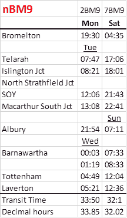
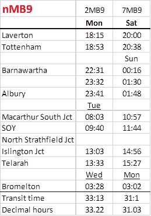
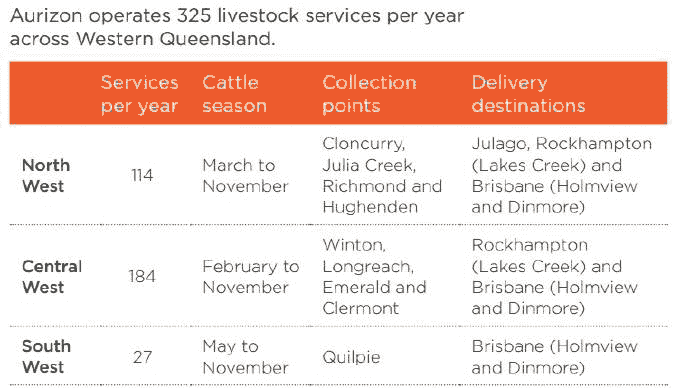

TABLE TALK

**AUSTRALASIAN TIMETABLE NEWS**

**No. 293, January 2017 ISSN 1038-3697, RRP \$4.95**

**Published by the Australian Timetable Association**

[**www.austta.org.au**](https://www.timetable.org.au)

# **TOP TABLE TALK – “RAIL FAIL’: BRISBANE’S SUBURBAN TRAINS IN DISARRAY**

“Rail Fail” the phrase now being commonly used in the Brisbane media to
describe Queensland Rail Citytrain’s current state of service.

Weekend train services resumed on the Ipswich-Rosewood line from
Saturday 10 December, with the former hourly frequency restored, in
place of the substitute buses.

Introduction of Citytrain’s New Generation Rollingstock has been delayed
from mid 2016 until 2017. One reason has been the diversion of driver
trainers from testing the new trains to training new drivers recruited
to ease the severe driver shortage.

Unrelated to the driver shortage – except in terms of commuter anger –
on Thursday 8 December overnight maintenance work went overtime. This
caused delays of up to an hour that lasted until midday across the
network.

By 28 November 2016, 231 driver and 227 guard candidates had passed the
first stage of testing, as recruitment was fast-tracked to increase QR’s
train crew numbers and restore services. Panel interviews began on 21
November and testing was underway to judge candidates’ situational
awareness, reaction time, visual coordination, stress recovery and speed
and trajectory judgement.

On Friday 16 December 18 trains were cancelled on the Caboolture,
Cleveland, Ipswich, Redcliffe Peninsula, Shorncliffe, Springfield and
Sunshine Coast lines, mainly between 1200 and 1500 but some in the
evening. A Translink spokesperson said the cancellations were in
relation to an operational issue.

New QR Brisbane suburban timetables have been issued dated **19 December
2016**. Changes are:

* Updated fare zones that commencing 19 Dec 2016
* Weekend Train services to Rosewood (although a bus is still operating
a Friday afternoon return service).
* A new Inner Northern timetable which shows services between City
stations and Northgate.

On Christmas Day, 235 trains, a third of all scheduled services,
services were cancelled because of driver shortages.

On 28 December, QR’s Chief Operating Officer, Kevin Wright, resigned as
a result of the problems. This followed the resignations of the Chairman
and Chief Executive.

It is being claimed in the media that Queensland Rail train crew are
taking sick leave days that coincide with long weekends and public
holidays.

QR issued a Summer School Holiday Timetable for their Brisbane region
services, valid from Wednesday 28 December 2016 until Sunday 22 January
2017, the last day of the Queensland school holidays. This is believed
to be first time special holiday timetables have been issued for
Brisbane.

Highlights of this Summer timetable are:

* Services will operate every 15 minutes during peak times on the
Caboolture, Shorncliffe, Ferny Grove, Redcliffe Peninsula, Beenleigh,
Gold Coast, Cleveland, Ipswich and Springfield lines while Sunshine
Coast, Rosewood and Doomben trains will operate every 30 minutes during
peak times.

* Apart from the Darra - Northgate corridor, most lines have services
operating every 30 minutes during the off peak and weekends. This is a
result of the short working weekday services from Coopers Plains to
Ferny Grove and from Cannon Hill to Shorncliffe being cancelled.

* There are no changes to Airtrain services.

* Apart from the express running on the Gold Coast, Airport, Caboolture,
Sunshine Coast and Redcliffe Peninsula services other lines have lost
their express services such as the express peak hour services on the
Cleveland and Ipswich lines.

* There is no separate timetable for Friday services as occurred in the
previous temporary timetables since November.

* The Friday afternoon return rail bus service from Ipswich to Rosewood
is now a train. This means all Rosewood services seven days a week are
trains again.

* Some bus connections with trains are affected however those details
are currently only shown in the Translink Journey Planner.

Interestingly, in addition to the individual summer line timetables, QR
have also re-issued their Inner north timetable (for services Roma St to
Northgate) and also issued a 21 page timetable entitled “Inner City
stations” which shows train services between Park Road and Northgate.
They are effective from Wednesday 28 December.

**Thanks** to Graham Duffin, Dennis McLean, Victor Isaacs, the
*Australian* and the *Courier-Mail* for Top Table Talk.

# **RAIL AND TRAM NEWS**

## **New Kid on the Block**

A third Intermodal rail operator, SCT Logistics, is due to enter the
Brisbane-Melbourne market on 22 January 2017, the date of a new ARTC
Master Train Plan. SCT Logistics, established in 1974, has always tended
to offer non-containerised freight carriage over the interstate rail
network. It has a number of customers who prefer this method. When
National Rail ceased running non-containerised traffic in 1998, SCT
started its own service for this traffic, mostly between Laverton near
Melbourne and Perth. It also has been sending such traffic on the
Aurizon Melbourne-Brisbane-Melbourne trains. In 2016, SCT set up two new
depots – at the “Logic \[sic\] Centre” at Barnawartha and at Bromelton,
south of Brisbane. SCT began running its own trains (termed “shuttles”)
from Barnawartha to Melbourne (thence Perth) on 12 October 2016. These
trains did not appear in the ARTC MTP, but were carded by VLine as 6708V
and 6709V.

From 22 January 2017, SCT will commence a four days per week
“Intermodal” service each way between Bromelton and Laverton, with all
trains also spending time at Barnawartha to pick up and set down
traffic. The schedules for the Monday and Saturday trains are shown
below. The trains are not particularly fast runners, being carded at a
B1 schedule and appear to be held for many prolonged crosses.

When this service starts, Aurizon will lose this traffic from its MB/BM7
trains. As Aurizon is rumoured to want to pull out of Intermodal, this
may well provoke something. Presumably the 6708/6709 shuttles will also
cease as of 22 January. At the Bromelton end, SCT is promising a shuttle
to the Port of Brisbane at some unspecified time.

{width="2.25in"
height="3.8541666666666665in"}

{width="2.6979166666666665in"
height="3.8541666666666665in"}

## **ARTC WTT 22 January 2017**

The Australian Rail Track Corporation Working Timetable of 22 January
2017, tabular version, is on their website at
<https://www.ptv.vic.gov.au/getting-around/maps/#networkmap>
<http://www.artc.com.au/customers/operations/mtp/2017-01-22/> The
graphical version is on their website at
<http://www.artc.com.au/customers/access/access-interstate/committed-capacity/>.
For alterations see the article above.

## **Sydney Trains WTTs 21 January and 6 May 2017**

It is not known if Sydney Trains will issue a new Working Timetable
dated 21 January 2017, or if the changes on that date will instead be
covered by a Special Train Notice. Thee appear to be no major changes.
Reasons for change have been given as C and K sets reliability project
and Tangara

Another WTT is expected to be dated 6 May 2017, to take account of the
Flemington Car Sidings Junction review.

## **John Holland Rail WTT 21 January 2017**

The John Holland Rail NSW Country Regional Network Working Timetable of
21 January 2017 is on their website at
<http://www.jhrcrn.com.au/what-we-do/network-operations-access/standard-working-timetable-swtt/>
The following alterations to services apply:

###**Alterations**

#### *Western Area*

**8964** (QUBE 750m) for -M-W-F- will depart Sealink Siding 1755, pass
Murrobo 1800, Newbridge 1819, Bathurst 1854, Kelso 1903, Raglan 1914,
Tarana 1953, Wallerawang 2031, arrive Coxs River 2034, depart 2047, pass
Hermitage 2105 thence run as tabled by Sydney Trains.\
**9865** (QUBE 750m) for --T-T-- will run as tabled by Sydney Trains to
pass Hermitage 2339, arrive Wallerawang 2356, depart 0015, pass Tarana
0048, Raglan 0125, arrive Kelso 0130, depart 0142, pass Bathurst 0150,
Newbridge 0246, Murrobo 0307, arrive Sealink Siding 0310 – forms 8964.

#### *Southern Area*

**1221** (PNRB 850m) for -MTWTF- will run as tabled by ARTC to pass
Joppa Junction 0608, pass Springfield 0624, arrive Tarago 0640, depart
0645, arrive Crisps Creek 0649 – forms 2120 (length amended).\
**2120** (PNRB 850m) for -MTWTF- will depart Crisps Creek 1125, arrive
Tarago 1135, depart 1140, pass Springfield 1156, Joppa Junction 1215
thence run as tabled by ARTC (length amended).\
**1223** (PNRB 660m) for -MTWTF- will run as tabled by ARTC to pass
Joppa Junction 1009, pass Springfield 1025, arrive Tarago 1041, depart
1046, arrive Crisps Creek 1051 – wait 2120 depart, shunt, forms 2122.\
**2122** (PNRB 660m) for -MTWTF- will depart Crisps Creek 1630, arrive
Tarago 1640, depart 1645, pass Springfield 1701, Joppa Junction 1719
thence run as tabled by ARTC.

### **Additions**

####*Western Area*

**9865** (QUBE 750m) for ------S will run as tabled by Sydney Trains to
pass Hermitage 2259, arrive Wallerawang 2315, depart 2319, pass Tarana
2352, Raglan 0029, Kelso 0033, Bathurst 0039, Newbridge 0135, Murrobo
0156, arrive Sealink Siding 0159 – forms 8964 (Mon).

####*Northern Area*

**4565** (QUBE 750m) for ------S will run as tabled by ARTC to depart
Narrabri Junction 0710 (next day), arrive Narrabri West 0715, depart
0928, arrive Narrabri Junction 0933 thence run as tabled by ARTC.\
**4565** (QUBE 750m) for --T-T-- will run as tabled by ARTC to depart
Narrabri Junction 0715 (next day), arrive Narrabri West 0720, depart
0926, arrive Narrabri Junction 0931 thence run as tabled by ARTC.\
**5466** (QUBE 750m) for -M-W-F- will run as tabled by ARTC to depart
Narrabri Junction 1520, arrive Narrabri West 1525, depart 1658, arrive
Narrabri Junction 1703 thence run as tabled by ARTC.\

###**Deletions**

####*Coal Services*

**CB01** (SSH 875m) for SMTWTFS\
**CB02** (SSH 875m) for SMTWTFS

####*Western Area*

**9865** (QUBE 750m) for S------\
**8922** (PNRB 660m) for SM--T--\
**8924** (PNRB 660m) for S--W--S\
**9823** (PNRB 660m) for --T--FS\
**D802** (SCT 100m) for -----F-\
**D801** (SCT 100m) for --T---S

## **ARTC Infrastructure information**

ARTC has placed new Network Information Books and Line Diagrams on their
website. The Network Information Books replace the Local Appendices
inherited by ARTC from NSW Rail Corp, which are now withdrawn (ARTC SAFE
Notice 2-2736 refers). The books are comprehensive but bulky; the
diagrams are convenient but have very small type size. See
<http://www.artc.com.au/customers/operations/nib/>

**Geoff Lambert** adds: These books have been around (but hidden) for
about two years now. They derive from what used to be called
“Appendices”. The latter name really became obsolete a century ago.
Appendices were first produced in the UK in about 1874 in order to cut
printing requirements for the frequently-amended WTTs. When they became
Appendices also to the rule books, the name was already rather
confusing. The ARTC, quite properly, never warmed to the name. In NSW,
ARTC simply scanned the old Local Appendices of the SRA and used those
(punch holes still visible!) issuing amendments as “Safe Notices”. The
heritage of the books is acknowledged on the cover sheets (not always
Local Appendices); the content, as shown by the Index, closely follows
that of the old LAs. What was once very messy is now coherent, but, as
yet, the old versions remain.

## **ARTC: Inland Rail**

A reference group and chair have been established to help the Australian
Rail Track Corporation finalise the alignment of Inland Rail through
Queensland. Federal Infrastructure and Transport Minister Darren Chester
on 30 November named Bruce Wilson AM to the role of chair of the
Yelarbon to Gowrie Project Reference Group which will provide local
community input on the review of alignment options for this section of
the Melbourne to Brisbane inland line. “Mr Wilson has held many senior
leadership roles, including director general of Queensland Transport,
and has the required technical expertise to deliver a major
infrastructure project such as Inland Rail,” Mr Chester said. “He has
worked closely with many Queensland communities during his career and
this experience will hold him in good stead as he talks with people
about the Inland Rail project.” The group began their consultations in
early December.

On 22 December the Federal Government announced that phase two of market
testing for private sector involvement in Inland Rail will be held in
late January and early February. Five elements have been identified for
the phase two market testing including opportunities to improve the
performance and value of the project as well as design and construction
procurement models.

## **Sydney-Melbourne High Speed Rail**

Privately funded proposals for a high-speed rail line on Australia’s
east coast should be assessed by the government to fast-track the
long-stalled project, a bipartisan Federal Parliamentary Committee has
found. Releasing a report into Transport Connectivity on 6 December,
Liberal MP John Alexander, chairing the House of Representatives
Standing Committee on Infrastructure, Transport and Cities, said “value
capture” should also be pursued to fund new transport infrastructure
alongside high-speed rail to encourage growth in regional areas. Mr
Alexander indicated that expressions of interest could be called late
next year and funded through a “real estate deal” based on land value
increases. The committee’s report specifically recommends a framework
for “the specification and evaluation” of proposals for the development
of a high-speed rail network, including private funding through value
capture. It proposes a new system for co-ordinating major infrastructure
projects across all levels of government, to reduce regulatory hurdles
for projects needing state and local government approvals.

In the Foreword, the Committee’s Report says, “Contrary to popular
belief, High Speed Rail’s prime purpose is not an alternate mode of
transport between capitals. Rather is it a tool to effect dynamic
regional growth as land near regional stations will then compete with
the most expensive land in the world, namely that of Sydney and
Melbourne. Evidence claimed that the corridor between Melbourne and
Sydney represents the greatest potential for uplift of land values
anywhere in the world when connected with High Speed Rail; this can
therefore provide the precondition for value capture to completely fund
this major infrastructure. It is essential that the government
establishes an Australian model of value capture that addresses our
unique opportunities. The development of our value capture model should
consider the private consortia that are committed to the development of
High Speed Rail funded by profits of their privately held lands.”

The Report is available online at
<http://www.aph.gov.au/Parliamentary_Business/Committees/House/ITC/TransportConnectivity/Report>

## **Queensland Rail Citytrain: Cross River Rail**

On 2 December the Federal Minister for Urban Infrastructure Paul
Fletcher and Queensland Deputy Premier Jackie Trad signed a Memorandum
of Understanding for the Australian government's \$10 million
contribution to planning, readiness for market and establishment of the
Cross River Rail Delivery Authority. The Authority will assess the
integration of Cross River Rail and mass transit systems such as the
Brisbane City Council's proposed Brisbane Metro Subway System, which is
currently in the early stages of business case development.

Planning and procurement for the revised Cross River Rail project began
in early 2015 and the business case is currently being assessed by
Infrastructure Australia. The Cross River Rail Delivery Authority was
officially established through the Queensland Parliament on 1 December
as an independent statutory body to lead the development, procurement
and delivery of the project and drive urban renewal within the
development corridor.

## **Queensland: Townsville rail access**

Announced in the Mid Year Economic and Fiscal Review on 19 December was
that the Federal government will provide \$150 million over four years
from 2016‑17 toward the Townsville Eastern Access Rail Corridor project,
which will connect the North Coast Line directly with the Port of
Townsville.

## **Queensland livestock trains**

The first western livestock rail freight service in 23 years to the
Oakey Beef Export plant near Toowoomba operated from Quilpie, western
Queensland on 29 November. This is the only such livestock train in 2016
but in 2017 it is hoped they will operate fortnightly. Re-opening the
branch line involved removing old track and completing earthworks,
before construction of 1.3km of upgraded track, laying more than 1900
sleepers and about 2300 tonnes of ballast. A separate project, likely to
be completed next year, involves lowering tunnel floors to allow the
clearance of 9’6” high freight shipping containers, which are
increasingly used to transship goods, via the Toowoomba range line, to
the Port of Brisbane.

{width="7.416666666666667in"
height="4.170532589676291in"}

*Source: North Queensland Register*

## **Carmichael mine and railway approval**

The \$21.7 billion Carmichael coal and rail project secured its final
major State and Federal Government approval, with an application for the
project’s rail line into Abbot Point approved on 5 December by the
Queensland Coordinator General. State Development Minister Dr Anthony
Lynham said the latest, and final, secondary approval was for about 31.5
kms of permanent rail line and a construction camp. The rail section
will form part of the 389 km standard gauge, heavy haul railway line
from the mine in the Galilee Basin to the coal export port.

## **Summer weather**

The **Gold Coast** G:Link tram did not operate on the weekend of 10/11
December due to fibre-optic communication system damage caused by a
violent storm a few days earlier.

Operations around the **Sydney** City Circle railway were severely
disrupted in the middle of the day of Tuesday 13 December, with
repercussions spreading across the system, when extreme hot weather
caused a fractured pipe which then caused signal failures.

According to **V/Line**’s network service plan, freight trains on the
Swan Hill, Echuca, Shepparton, Murrayville, Mildura and Dimboola-Yaapeet
lines will be stopped when temperatures reach 33C. Freight on the
Manangatang and Sea Lake lines will be stopped at 36C. V/Line said it
was “looking at what could be done”. “These restrictions are put in
place every year to ensure the safety of freight services during hot
weather, and are communicated well in advance so the industry can plan
ahead,” V/Line spokeswoman Catalina Filip said.

## **Newcastle Transport**

The New South Wales government has announced the creation of Newcastle
Transport as the new integrated public transport provider for Newcastle.
It will operate buses, ferries, light rail and the new multi-modal
transport interchange currently under construction at Wickham. Keolis
Downer will run Newcastle Transport over the next ten years. Newcastle
Transport will be responsible for bus and ferry services from 1 July
2017, the new transport interchange when it opens in late 2017; and
light rail services when they start in 2019. Keolis Downer won’t make
any major changes to services in 2017, “but will work with the
community, the government and other key stakeholders to re-work the
transport network in Newcastle and provide wholesale improvements to
services, ready for implementation in 2018.” Keolis Downer has their
headquarters in Newcastle, where the delivery team will be based. This
includes proposals for buses on demand – services more appropriate for
small country towns.

## **Sydney Trains**

The New South Welsh government on 1 December announced \$1.5 billion for
24 new Waratah-style trains to address rapidly-increasing demand on
Sydney's rail network. It promised that over the next three years there
will be:

-   hundreds of extra services across the network, starting with peak
    hour express services between Parramatta and Sydney CBD
-   new trains added to the network that will spend less time in
    maintenance and more time on the tracks
-   upgraded rail infrastructure allowing greater capacity, including
    better signalling systems, power supply upgrades and station
    improvements.

Adding an extra four express trains between Parramatta and the Sydney
CBD in both the morning and afternoon peaks equates to services every
three minutes, or up to 20 trains per hour in the busiest periods. Work
on a new timetable to implement the extra services on the T1 Western
Line will begin by late 2017.

Minister for Transport and Infrastructure Andrew Constance said the
government had to act quickly to keep the train system running well.
"We've seen average train loads rise significantly, which is starting to
impact on customers' ability to get on a train in peak periods," he
said.

## **Sydney patronage**

An annual review by the NSW Audit Office shows patronage across the
public transport network increased by 12% in 2015/16. Trips on the rail
network increased 10.7% from 328 million to 363 million. Trips on
Sydney's buses increased 12.8% from 257 million to 290 million. Trips on
the light rail line increased by 67% from six million to 10 million,
while ferry trips remained stable. The Audit Office attributed the huge
growth in passenger trips across Sydney partly to the increased take-up
of the Opal card.

But the Audit Office also highlighted the failure of buses, in
particular, to run on time. The report said buses operated by private
companies "almost never" met punctuality targets for the middle or the
end of their trips, while the government-owned State Transit bus
operator "did not meet any punctuality targets during the year".

## **Sydney Rail disruption 20 December**

Rail transport in Sydney was severely disrupted on Tuesday evening, 20
December, because of the failure of a bracket used to hold up power
lines between Wynyard and Town Hall. Two trains needed to be evacuated
through underground rail tunnels. Hundreds of passengers were left
stranded on other trains in tunnels.

The Transport Minister, Andrew Constance, described the events as a
"bugger of a situation for everyone", and thanked commuters for their
patience. "I know how frustrating and difficult the situation was for
commuters," he said. "We are not sugar-coating.

The chief executive of Sydney Trains, Howard Collins, attributed the
fault to one of tens of thousands of brackets, sometimes called
"droppers", which hold the overhead wiring used to power trains. "For
some reason just one of those brackets broke, the wire dropped down, it
was actually touching on the top of the train," Mr Collins said. "This
particular bracket had been inspected according to the routine - it was
all OK even in the morning." He said overhead power lines were checked
every 45 days, and the line between Town Hall and Wynyard had been
checked on 5 December. In addition, a track patrol vehicle travelled the
line on Tuesday morning. After there were reports of a noise on the line
there was another inspection that did not notice anything unusual.
"Nothing was reported in that area, no drivers reported the wire was
lower, hundreds of trains went through there until the peak, and then
obviously this occurred," Mr Collins said. He said there were fewer
overhead wiring faults on Sydney's train system than in the past. "It is
a rare occurrence. In hot conditions in the past the wires would sag
because they expand, we've done a lot of work in that area. I think the
last incident was in February this year when we had a problem with a
dropper."

## **NSW grain trains**

As is usual in the wheat harvest season, ARTC’s line from Camurra (near
Moree) to North Star was re-opened from 28 November 2016 (ARTC SAFE
Notice 2-2738 refers).

Two trains hired directly by grain-growers Stuart and Lyndall Tighe of
Milguy, northeast of Moree in NSW operated on 30 November conveying
barley and chickpeas to Newcastle for export to India. One 750m train of
48 wagons carried 6000 tonnes.

The first grain train for the season departed from the newly upgraded
Burren Junction site on 30 November, after a major upgrade was completed
as part of the NSW government’s \$400 million Fixing Country Rail
program. The siding was extended from 500 to 1500 metres.

After good rains, and an absence of adverse events, a bumper wheat
harvest is expected in south east Australia.

## **Hawkesbury River bridge**

Limits have been imposed on freight trains over the Hawkesbury River
bridge after engineering reports found cracking in the bridge's concrete
and "consistent defects" in its steel frame. A ["load rating and fatigue
assessment
report"](http://www.smh.com.au/cqstatic/gt2gyq/HawkesburyBridge.pdf)
prepared for Sydney Trains in July recommends strengthening of the upper
sections of the bridge. The report, by engineering consultants SMEC,
identifies defects through parts of the concrete, some of which indicate
that "corrosion may have been initiated in some locations". The NSW
government assured commuters there are no safety issues, but there is
now a limit of one fully-loaded freight train at a time.

## **Elvis travels on NSW TrainLink**

This year’s TrainLink XPT special (8 carriages, the maximum) to the
annual Parkes Elvis Festival ran on 12 January, arriving Parkes at 1615.
The return departed Parkes at 0830 on 16 January. For the duration of
this period the Dubbo XPT was replaced by an Xplorer DMU. (John Holland
Rail Country Train Notice 5-2017 refers.) The Elvis special is no longer
advertised on the TrainLink website as it is booked out a year ahead.

## **Holiday services**

**Queensland Rail** is operating a reduced summer school holiday
timetable from 28 December until 22 January reflecting, it says, reduced
passenger demand over the holiday period. However, probably another
factor is the current driver shortage. It says patronage drops by more
than 25% in January, averaging 776,749 trips per week, compared with
non-holiday patronage at 1,046,675 trips a week. Services will be
reduced by 11% across the network and the majority of changes will be
outside of peak. Airport services won’t be changed reflecting the demand
for these services over the holiday period.

-   Services will operate at 15 minute frequencies in AM peak from
    Caboolture, Shorncliffe, Ferny Grove, Redcliffe Peninsula,
    Beenleigh, Gold Coast, Cleveland, Ipswich and Springfield.
-   Services will operate at 15 minute frequencies in PM peak to
    Caboolture, Shorncliffe, Ferny Grove, Redcliffe Peninsula,
    Beenleigh, Gold Coast, Cleveland, Ipswich and Springfield.
-   Services will operate at 30 minute frequencies in AM peak from the
    Sunshine Coast and to the Sunshine Coast in PM peak.

From 25 December 2016 to 1 January 2017 **Sydney Trains** passenger
services ran to a Saturday base timetable with some additional services.
Similarly, **NSW TrainLink** operated on Saturday schedules on these
dates. In fact, changes were few: the up Bathurst train ran at 0725
instead of 0549 (with consequent alteration to the Lithgow-Bathurst
placement service), and the evening up Canberra train ran at 1720
instead of 1725.

**Sydney Light Rail** was replaced by buses between Central station and
the casino because of tram construction work in George St.

**V/Line** had a Holiday Saturday service on Christmas Day. Travel on
all Victorian public transport, as per the usual custom, was free on
Christmas Day and New Year’s Eve.

## **New Victorian public transport map**

A new Victorian train network map has been introduced. It shows the
regional and metropolitan train networks in a single map. An extract is
below. Public Transport Victoria claims that the new map draws on best
practice from around the world, with colours carefully chosen to be
distinguishable by people with the two most common types of colour
vision impairment. The same colours for each line will also be used in
PTV’s network status boards and on the [Live travel updates
page](https://www.ptv.vic.gov.au/live-travel-updates/) on the PTV
website. A grid has been added to the new map linked to an alphabetical
index at the side as another improvement to help users locate unfamiliar
stations.

{width="7.207392825896763in"
height="4.694658792650919in"}

The map includes the SkyBus route from Southern Cross station to
Melbourne Airport. The Flemington Racecourse/Showgrounds line is marked
as a hollow line, to represent special event service.

Integration of metropolitan and country lines into one sheet means that
the network is “geographically-challenged”. For example, it makes
Bairnsdale appear not much further from Melbourne than Belgrave; also
that the Bairnsdale line turns north after Pakenham, or that the Albury
line turns east after Craigieburn; or the Swan Hill line turns south
after Bendigo; and that Bendigo to Eaglehawk is about the same distance
as Eaglehawk to Swan Hill.

Different types of marking are used to distinguish metropolitan lines,
V/Line lines on which myki is required and V/Line lines with paper
tickets.

The map can be accessed at
<https://www.ptv.vic.gov.au/getting-around/maps/#networkmap>

The print edition of the *Age* also showed a map that is not on the
electronic version. This shows all lines, Metro and V/Line, but with
only major stations. In the Metro region, only eventual termini are
shown and no intermediate stations are displayed, not even junction
stations like Clifton Hill, Footscray, Dandenong, Ringwood, etc. This
map shows all V/Line lines, with eventual termini and junction stations
(Seymour, Bendigo and Ballarat) shown. There are no other intermediary
places shown, not even Victoria’s second largest city (Geelong).

## **Metro Trains Melbourne services**

From 27 December 2016 to 29 January 2017 buses are replacing trains
between Box Hill and Ringwood while the line was lowered, Blackburn
station rebuilt and a new station built at Heatherdale.

A new Metro Trains Melbourne timetable in 2017 is expected to provide 47
Altona loop weekday extensions to the City, four extra weekday trains on
each of the Werribee, Craigieburn and Sunbury lines and one extra Eltham
service. Other lines will not be altered. The proposed update is
regarded as good news for Altona passengers who at present have an
off-peak shuttle service between Laverton and Newport. Most shuttle
services will be replaced with a direct service to and from Flinders St.

Metropolitan train patronage grew 2.7% last financial year. The proposed
timetable update addresses significant peak-hour rail overcrowding in
Melbourne's western suburbs, but leaves mostly unused the capacity – up
to 23 extra metropolitan trains an hour – created by the \$3.65 billion
Regional Rail Link. A timetable update originally planned for April 2015
that would have used the new capacity to add services to nine lines was
rejected by the Andrews government.

A coalition of transport and planning groups has proposed that suburban
train services run every ten minutes to improve Melbourne’s liveability.
This would, it is claimed, increase service by 21% and lead to less
crowding while boosting economic growth. Backers of the 10min Train
Campaign include organisations Transport for Melbourne, Rail Futures
Institute, Planning Institute of Australia and Engineers Australia.

A submission calling for upgraded services from 0700 to 2100 to be
included in the 2017 Metro Trains franchise deal has been lodged with
the Victorian Government. Campaign convener Eric Keys said the push was
needed because the government had failed to introduce minimum 10-minute
frequency services as recommended by its own body, Public Transport
Victoria. Turn-up-and-go services would mean no timetables, and they
would be rolled out mainly in so-called trunk rail lines that serve key
job hubs and activity centres such as East Werribee, Sunshine,
Footscray, Broadmeadows, Epping, Box Hill, Ringwood, Dandenong and
Frankston. Mr Keys said the proposal wouldn’t require extra trains or
infrastructure. “Driver recruitment and training would be the main
barrier to making it happen,” he said.

The government took issue with the claim that increasing services by 20%
was a “break-even” proposition. Transport Minister Jacinta Allen said
Labor had added hundreds of extra services across Melbourne and regional
Victoria. “(We) are getting on with the projects we need to run more
trains when they are needed most — in the peak,” she said.

A sticking point could be the need for extra train drivers and improved
driver productivity — a key union says it won’t change its current
industrial deal. Rail, Tram and Bus Union state secretary Luba
Grigorovitch said while 10-minute services would be welcome, the
government would need to buy more trains and hire extra drivers without
changing current work practices. “The RTBU will not agree to relaxing
the enterprise agreement that was negotiated last year and lasts until
2019,” she said.

## **V/Line timetables 29 January**

The new V/Line public timetables of 29 January were placed on their
website commendably early, on about 29 November. See
*<https://www.vline.com.au/Timetables/Additional-pages/2017-Timetable-list>
*

Not all of the extra services detailed in November *Table Talk,* pages
6-7, are implemented in this timetable. Ballarat weekday off-peak trains
are still at hourly frequencies, not every 40 minutes. Geelong weekend
frequency is still hourly, not 40 minutes. It is believed the increased
frequencies will be introduced later in 2017. The additional Warrnambool
trains - 0905 up and 1713 down weekdays, 1125 up and 1300 down Sundays –
apparently work through to Melbourne, not requiring a change at Geelong
as was mooted. There is an additional bus service to and from Portland,
connecting with the new weekday Warrnambool trains.

Most trains on the Ballarat line stop at the new Caroline Springs
station, 19.6 km from Southern Cross between Deer Park and Rockbank.

More additional services will be introduced in the next timetable in
mid-2017.

## **V/Line: Speed restrictions**

From 5 December “to facilitate recovery from late running due to speed
restrictions imposed on level crossings on the Warrnambool line”, the
1250 Melbourne-Waurn Ponds and the 1454 Waurn Ponds-Melbourne VLocity
DMUs are cancelled between Geelong and Waurn Ponds and replaced by
buses.

## **Yarra Trams: May 2017 timetable**

There will be major timetable changes in May, which reflect announced
route changes and a continuing cascade of trams as E class are
delivered. Changes include merging routes 8 and 55 to form route 58.
Low-floor trams currently on route 8 will operate on route 58. Route 6
will be extended from Melbourne University to Moreland to replace route
8 services on Lygon St.

## **Portland terminal**

A planning permit application to establish an intermodal facility near
the old North Portland railway station is expected to be lodged soon
with the Glenelg Shire Council, according to shire chief executive
officer Greg Burgoyne. He said the council had been in discussions with
a “large international company for the past 12 months”

## **Adelaide Metro: Flinders railway**

Announced in the Mid Year Economic and Fiscal Review on 19 December was
that the Federal government will provide \$42.8 million over two years
from 2016‑17 for the Flinders Link Rail Project in South Australia. The
project will extend the Tonsley rail line and create a new transport
interchange at the Flinders Link Medical Centre.

## **Adelaide Metro: Outer Harbor and Grange lines**

As part of the Torrens Road to River Torrens Project, the Outer Harbor
and Grange rail lines are closed from Monday 2 to Monday 23 January to
allow construction of the new rail overpass over South Road. In
addition, additional maintenance works on the lines including
maintenance of the Port River Bridge, early works for Torrens Rail
Junction, Level crossing upgrades at Harris St, Hargrave St and Gedville
Road, maintenance at various stations, track replacement between
Woodville station and Port Road, signalling maintenance, and vegetation
management. Substitute buses operate.

## **Adelaide trams**

The SA government called tenders on 6 December for the \$50 million
first stage of the expansion of Adelaide’s tram network. This will
extend the existing line along North Terrace to East End, forming part
one of EastLINK, the proposed line with future stages planned through
Kent Town to the Eastern suburbs. The one km extension will also become
the first stage in the CityLINK loop around the CBD. It will feature
three new stops and provide a link between the Riverbank’s Educational
and Cultural Precinct, Entertainment Precinct and the Health and
Biomedical Precinct. The State government is also calling tenders for
improvements to the existing network, including an upgrade to the City
South tram stop and upgrading tracks.

Then on 15 December another short extension was announced, to the
Festival Plaza on King William Road, plus the purchase of three
additional trams. The extension will minimise future disruption at the
North Terrace intersection and improve access to [Festival
Plaza](http://www.adelaidenow.com.au/news/south-australia/the-first-photos-of-the-adelaide-riverbank-redevelopment-are-here-as-the-state-government-awards-the-construction-tender/news-story/65c8744d1cff98433a2adfd2fe0e70ac),
which is being transformed into Adelaide’s Riverbank entertainment
precinct. The tender documents show that the junction at King William
St/Road and North Terrace will be a Grand Union, meaning that movement
will be possible in all directions. With three extra trams, a 10-minute
free shuttle service could transport more than 2000 people an hour along
the Riverbank. Work on the new Festival Plaza stop is due to start in
the first quarter of next year and be completed by the end of 2017.

## **TransPerth: Armadale/Thornlie line**

From the evening of Friday 6 January until last service Sunday 22
January there are a series of shutdowns and a significant decrease in
the number of trains operating on the Armadale and Thornlie lines.\
**Weekdays:** From first service until approximately 1830 trains between
Armadale and Perth will run on a half hour schedule. Passengers will be
required to change trains at Carlisle Station.\
**Weeknights:** All trains on the Armadale and Thornlie lines will be
cancelled from approximately 1900. Train replacement buses will operate.\
**Weekends:** Trains will run on a reduced frequency between Carlisle
and Armadale. Trains will be cancelled between Perth and Carlisle. Train
replacement buses will be operating.

## **Auckland trams**

The Auckland tourist tramway has resumed operation in the Wynyard
Quarter. However development of this area is still underway, so the
trams are operating on only a limited section of track, and only on
Sundays/Public Holidays. It is expected that full operation of the
circuit will resume in mid-2018.

## **KiwiRail: Auckland passenger network**

A new timetable will be introduced on 12 March, which is intended to
speed up services and release some sets allowing the operation of more
six car trains. This timetable will also see services serving the new
station at Parnell. Southern line trains will stop there during the day
as well as Western line services in the evenings and at weekends. The
old Newmarket station building has been moved to the site and is being
refurbished. Onehunga line trains will run express from Ellerslie to
Newmarket.

KiwiRail is investigating how to split Auckland's freight and passenger
services as they deal with huge passenger growth on the network.
Currently all trains share the same tracks and congestion is especially
bad in south Auckland. In its 2016 annual report, KiwiRail cites
Auckland resilience as one of the main challenges the company is facing.
Ultimately, separation of the two networks will be required and would
require an ‘integrated and comprehensive response’ from all stakeholders
including Auckland Transport and the New Zealand Transport Association,
the report says. The reliability and regularity of Auckland's passenger
trains are a common gripe of users, despite the introduction of the
electric trains. KiwiRail Asset Management and Investment General
Manager David Gordon said separating the networks would mean building
additional tracks and potentially flyovers. It would also involve
developing freight handling sites that were closer to marshalling yards
and away from crossing tracks with dense passenger traffic. KiwiRail is
working with transport agencies to investigate the benefits of a third
track between Westfield and Wiri.

## **KiwiRail: Main Trunk electrification to end**

KiwiRail has announced it will replace electric traction between
Palmerston North and Hamilton on the North Island Main Trunk line with
diesels. The line was electrified 30 years ago as part of the Muldoon
government’s “think big” policy. The electrification covered the 305 km
central section of the Main Trunk – the mountainous section. But it left
136 km at the southern end and 139 km at the northern end unelectrified,
meaning that trains had to undergo two locomotive changes. The 16
electric locomotives are now old and prone to breakdowns. Eight
additional diesel locomotives will be purchased, following other
purchases of DELs recently. KiwiRail will maintain electric
infrastructure on the line to allow for any future use.

Peter Reidy, KiwiRail chief executive, said they were “essentially
running a railway within a railway. The doubling up of service
facilities, inventory, training and maintenance required with two
separate systems on the line adds to the inefficiencies and
unreliability. We looked long and hard at the electric options and for
our business, and most importantly our customers, they just did not
stack up."

This decision has been long anticipated. Green groups criticised it.

## **KiwiRail: Earthquake repair**

Following the earthquake of 14 November centred on Kaikoura which did
substantial damage to the infrastructure, the Coastal Pacific passenger
train, Christchurch-Picton and v.v., has been cancelled for the entire
2016-2017 summer season. Another earthquake hit the area on 29 December.

NZ’s Cabinet has agreed to rebuild the rail and road corridor north and
south of Kaikoura, at a cost of up to \$2 billion. Transport Minister
Simon Bridges on 15 December said additional funding would speed up the
process. He said the road and rail corridor would be rebuilt, with
additional improvements to increase safety and resilience. “Since the
day of the earthquake, restoring access to Kaikoura has been our number
one priority. Agreeing to restore the coastal route demonstrates our
ongoing commitment to getting this region back on its feet as quickly as
possible. To provide certainty, the Crown will fund the work required.
Exact costs are still being determined, but the current estimate is
between \$1.4 billion and \$2 billion.” In addition to funding, Cabinet
said emergency legislation passed through Parliament last week will cut
through red tape, and ensure repairs to the existing route can be
accelerated.

Bridges warned, however, that even with an accelerated process, there is
a long way to go. “The precise work required to repair the route is
still under investigation and it will be a very complex job,” he said.
“However, the Government is confident that limited access via the
coastal route can be restored in about 12 months.

KiwiRail chief executive Peter Reidy welcomed the announcement, saying
the operator would work to restore freight services for customers on the
Main North Line from Picton to Christchurch as soon as possible.

KiwiRail plans to look for temporary fixes in some parts of the line to
allow for restricted, freight-only rail services in the first instance
while the permanent road and rail lines are completed. “KiwiRail will
use the latest technology in slip identification and movement to allow
our train drivers to safely navigate areas while permanent repairs are
made. While there will be time delays on the route once opened, it will
offer a reliable, cost-effective service with fewer emissions for our
customers while taking heavy vehicles off the roads. Every tonne of
freight moved by rail delivers a 66% reduction in emissions for our
customers, and the country,” he said.

He added that KiwiRail’s passenger train, the Coastal Pacific, would
eventually return to the route. “International tourists are increasingly
attracted to New Zealand’s spectacular train journeys and this is an
important plank of our tourism growth strategy. Safety is always our
number one concern and so we won’t rush the necessary measures that need
to be taken but we will be working intelligently at speed. Even without
any other unforeseen events, this is an enormous job. We have 21
tunnels, 80 bridges, and a lot of twisted or broken track to fix.”
Timaru's mayor is lobbying for the re-introduction of a passenger train
service between Christchurch and Dunedin using the Coastal Pacific
carriages. KiwiRail says it will consider this, but whether or not it
comes to fruition will be determined by its financial viability. The
Southerner passenger train in this route ceased operation in 2002.

## **Hungarian timetable book**

It is believed that the 2017 timetable book published by MAV, Hungarian
State Railways, will be the last printed edition. It is valid for the
2017 European timetable year – 11 December 2016 to 9 December 2017. The
book has been a well-produced volume, and included not just the MAV
network, but also the timetables of GySEV (the Western Hungarian
railway), international services, and even the children’s railway in the
Budapest hills and the so-called forestry (ie, rural, narrow-gauge)
railways. In recent years, the book has been hard to find on sale at
stations

## **North America: Amtrak and VIA system timetables**

The last hard copy, system timetable book for Amtrak, the
Federal-government owned long-distance passenger train operator in the
United States, was published last year. Notwithstanding this, a PDF
version of the current system timetable book, dated 3 October 2016, is
available on Amtrak’s website. See
<https://www.amtrak.com/train-schedules-timetables> The system PDF
timetable contains more information than the collection of individual
line timetables, for example, the names of host railroads each train
operates over.

VIA, the Federal-government owned long-distance passenger train operator
in Canada, has re-instated their system timetable book, at least on
their website. See
<http://www.viarail.ca/en/plan-your-trip/customize-your-train-schedule>

For the past few years, they had only provided individual line
timetables However, it must be admitted that outside of southern Ontario
and southern Québec, the VIA network is sparse.

## **China Railways**

Chinese Railways will carry more than 3 billion passengers in 2017,
compared to the 3.7 billion air passengers carried by all the world's
airlines in 2016. In 2017 China will complete over 2,000 kilometres of
new track, extending the country's network to more than 126,000
kilometres.

**Thanks** to Tony Bailey, Graham Duffin, Hilaire Fraser, Albert Isaacs,
Victor Isaacs, Geoff Lambert, Dennis McLean, Len Regan, Michael Smith,,
*European Rail Timetable,*
*[www.railexpress.com.au](http://www.railexpress.com.au),
[www.railpage.com.au](http://www.railpage.com.au), Catchpoint* (National
Railway Museum), *Today’s Railways Europe, Transit Australia,* ABC News,
*Age, Australian, Courier-Mail, Daily Telegraph, Herald Sun, North
Queensland Register,* and the *Sydney Morning Herald* for Rail news.

# **ODD SPOT**

A recent review made the assertion that “Sydney buses are always late”.
It was therefore interesting to find the following post on the TfNSW
Open Data website forum:

***Malformed delay on 4Trak feed:*** *I'm noticing some trips are
displaying a delay of around 600 thousand million years. The
documentation doesn't shed any light about this. I'm assuming this is a
bug, so I'm curious as to how we should handle these?*

By way of information, 4Trak is the software package used by ARTC and
John Holland to track their trains in real-time. This feed is now made
available to app developers and it has been possible to track country
trains on your phone for a couple of months now. This was demonstrated
to attendees at the November 2016 Sydney ATA meeting. Given that the
Universe is only 13.5 billion years old, these services must have
started somewhere west of the Big Bang.

**Thanks** to Geoff Lambert for Odd Spot.

# **BUS NEWS**

## **Australian Capital Territory**

During the holiday season, ACTION provided Night Rider services between
the City, Gungahlin, Belconnen, Woden, Tuggeranong in partnership with
UBER, running every 20 minutes until 0200 on the nights of Friday: 9
December 2016, Saturday: 10 December, Friday 16 December, Saturday: 17
December, Friday: 23 December and Saturday: 31 December 2016 (New Year’s
Eve). Regular MyWay or cash fares applied on Night Rider services. UBER
partnered with Transport Canberra to provide a \$10 discount to continue
the journey.

From 7 January buses recommenced using Constitution Avenue between
London Circuit and Corranderk St following completion of prolonged
reconstruction works.

Free off-peak travel for seniors and concession MyWay cardholders
commenced on 14 January for a 12 month trial. It applies between 0930
and 1630 and after 1800 on weekdays and all day on weekends.

## **New South Wales**

Route 33 from Bondi Junction to Randwick racecourse commenced on 22
October 2016, apparently for special race occasions.

Due to construction of a dam and levy at the Kensington Ponds Centennial
Park, the bus roadway is closed to all regular route services from
Monday 21 November 2016. All regular route services now operate along
Alison Road and Anzac Parade at all times in both directions.

Route T80, on the Liverpool to Parramatta Tway, became Sydney’s first
Rapid route on 26 November 2016, with a ‘turn up and go’ timetable in
operation throughout the week. Weekday frequencies are every 10 minutes
or better between 0600 and 1900 in the peak direction, whilst services
at the weekend will operate every 15 minutes. Changes to the service
included:

-   Additional trips during the peak hours between Miller and
    Parramatta;
-   Additional trips between Smithfield and Liverpool in the early
    morning;
-   Revised departure times to some early morning and evening trips; and
-   New weekend timetable with services every 15 minutes between 0700
    and 1900.

With effect on 1 November 2016 **Forest Coach Lines** purchased Coffs
Harbour operator **Ryans Bus Service**. Ryans operate TfNSW contracted
and charter services in the Coffs Harbour district with depots in Coffs
Harbour, Woolgoolga and Grafton.

## **Victoria**

### **Ballarat boost**

Ballarat is the latest regional centre to enjoy a major revision to
their bus network, with more direct and more frequent services to be
introduced by CDC Ballarat on 29 January alongside a revised V/Line
timetable. The bus network upgrade was deferred by 18 months due to
funding issues, it was initially due to begin in June 2015 in
conjunction with the new Regional Rail Link timetable.

The number of routes has been rationalised from 19 to 15, as follows:

-   *10 (Ballarat – Alfredton via Wendouree):* replaces former Route 1
    along Howitt St, former Route 16 in Lake Gardens (but directly along
    Gillies St North) and former Route 15 along Strut St
-   *11 (Ballarat – Wendouree station via Howitt St):* largely replaces
    former Route 1
-   *12 (Ballarat – Wendouree station via Forest St):* replaces parts of
    former Routes 2 and 6 in Wendouree area
-   *13 (Ballarat – Invermay Park):* largely replaces former Route 4 but
    also incorporates the former Route 2 along Lydiard St
-   *14 (Ballarat – Black Hill):* largely replaces former Route 5 but
    with more bi-directional operation
-   *15 (Ballarat – Brown Hill):* replaces former Route 7 with expanded
    coverage in Brown Hill and now travelling via Museum of Australian
    Democracy at Eureka (section along former Routes 8 and 9)
-   *20 (Ballarat – Canadian):* Replaces the south-east sections of
    former circular Routes 8 and 9
-   *21 (Ballarat – Buninyong via Federation Uni):* Replaces former
    Route 10
-   *22 (Ballarat – Federation Uni via Sebastopol):* Replaces former
    Route 12 along Albert St before providing a new weekday link from
    Sebastopol to Federation Uni
-   *23 (Ballarat – Mt Pleasant):* Replaces former Route 11
-   *24 (Ballarat – Sebastopol):* Replaces former Route 13 along
    Pleasant St and Alfred St before incorporating former Routes 12 and
    19 in western parts of Sebastopol, providing some streets with a
    Ballarat link and full time buses for the first time
-   *25 (Ballarat – Delacombe):* Replaces former Route 14 in Delacombe,
    along with much of the Route 13 loop through south-west Delacombe,
    improving local access to the new Delacombe Town Centre
-   *26 (Ballarat – Alfredton):* Replaces former Route 18 with greater
    coverage west of Alfredton Primary School
-   *30 (Ballarat – Creswick):* Replaces former Route 3
-   *31 (Wendouree Station – Miners Rest):* Replaces former Route 17 but
    now travels via Wendouree Shopping Centre en route to Wendouree
    Station

Confusing and poorly documented through-routing in Ballarat, which had
failed to make it clear most routes served the station (as they were
passing the station showing the number of the through-routed service),
has been eliminated. A consistent operating pattern has been introduced,
with buses on all routes now heading to the station. Inbound buses
travel along Curtis St while all outbound trips operate via Little
Bridge St.

Wendouree and Alfredton residents benefit from enhanced access to their
local Wendouree station (opened on 12 June 2009), which is now directly
served by Routes 10, 11, 12 and 31, compared to just Route 17 under the
former network. Other routes had run nearby but failed to call at the
station, and in some cases (such as Route 2) the nearest stop was up to
a 15 minute walk away.

In a related win, Wendouree Station gains more weekend trains from 29
January, eliminating gaps of over 5 hours when trains had originated or
terminated at Ballarat.

Bus frequencies have been standadised to clockface headways, although
there is little consistency of service levels between routes:

-   Routes 21 and 22 operate a 30 minute Monday to Saturday headway with
    hourly buses on Sundays. Route 22 terminates in Sebastopol on
    weekends. Information on the CDC website suggests Route 21 between
    Federation Uni and Buninyong would only be served hourly on weekdays
    but the existing half-hourly service has been retained.
-   Routes 12, 14, 15 operate a 30 minute weekday headway and hourly at
    weekends
-   Route 11 operates a 30 minute Monday to Saturday headway but just 3
    trips on Sundays
-   Routes 25 and 26 operate a 30 minute weekday headway, hourly
    Saturdays and 90 minute Sundays
-   Routes 20, 23 and 24 all operate hourly 7 days
-   Routes 10, 13 operate an hourly Monday to Saturday headway and every
    90 mins on Sundays
-   Route 30 operates hourly Monday to Saturday with 3 trips on Sundays
-   Route 31 operates hourly Monday to Saturday with no Sunday service

In particular, the hourly and 90 minute Sunday services are significant
increases – it was common for Ballarat routes to operate just 3 or 4
trips across the day, using a limited number of vehicles.

The proposed introduction of a new regional numbering system with
town-prefixes (eg B24), to avoid conflicts between different towns’
information (thus improving search results on the PTV website and app),
discussed last during the Ballarat consultation last year, has not gone
ahead.

### **Caroline Springs changes**

In conjunction with the opening of the new V/Line station at Caroline
Springs on the Ballarat line, January 29 also sees the implementation of
the first stage of the new Caroline Springs bus network.

Kastoria’s Route 460 from Watergardens to Caroline Springs Town Centre
via Gourlay Road is being extended south along Caroline Springs
Boulevard to the new station. Weekday trips now operate every 20 mins
all day (previously every 25 – 30 min peak and 40 mins interpeak), while
weekend services will now operate to a 25 to 35 min headway instead of
every 40 mins. This is the latest boost for Route 460, which ran hourly
throughout the week as recently as July 2014.

Meanwhile, CDC Melbourne’s Route 461 between Watergardens and Caroline
Springs Town Centre will now incorporate City Vista Ct, to serve the
growth suburb Plumpton South. The terminus at Caroline Springs Town
Centre will be relocated to Caroline Springs Boulevard (instead of
behind Caroline Springs Square Shopping Centre). Peak hour buses will
now depart twice an hour instead of every 40 mins.

Several other route changes in Caroline Springs are planned for mid
year, as reported in the November *Table Talk*.

### **Revised connections**

Coinciding with the V/Line 29 January timetable, connecting bus services
at these locations will also be receiving revised timetables:

-   *Camperdown:* Timboon intertown service (Pope’s)
-   *Geelong area:* Routes 1, 20, 22, 23, 24, 25 and 43 (CDC Geelong)
-   Routes 19, 30, 31, 32, 40, 41, 42, 50, 51, 55, 56 and 61 (McHarrys)
-   *Lara:* Routes 10, 11 and 12 (CDC Geelong)
-   *Kilmore East:* Town Service (Mitchell Transit)
-   *Melton*: Routes 453, 455, 457, 458 and 459 (Sita)
-   *Wallan*: Town Service (Mitchell Transit)
-   *Wyndham area*: Routes 150, 151, 153, 160, 161, 166, 167, 170, 180,
    181, 190, 191, 192, 439 and 443 (CDC Melbourne)

In many cases run times in Geelong, Lara and Wyndham Vale have been
adjusted to better reflect actual journey times, including cases where
as much as 10 mins runtime has been slashed to avoid mid-trip

Route 56 (Geelong – Queenscliff via Ocean Grove) gains additional school
time trips ex Geelong at 0756 (plugging a 3 hour gap) and ex Queenscliff
dwells and improve efficiency. at 1506 (plugging a 2 hour gap)

Connections on Route 190 (Werribee – Wyndham Vale) for travel to/from
Geelong have largely been standardised at 5 mins in either direction –
in the initial June 2015 timetable transfer times varied, with longer
connections of up to 10 mins common. This change strengthens the primary
role of the route after Geelong trains were rerouted via the Regional
Rail Link in 2015. The consequence, however, is poorer connections with
trains to/from Melbourne at both Wyndham Vale and Werribee and lower
vehicle efficiency, particularly in the evenings.

### **Holiday timetables**

While there are now scarce examples compared to little over a decade
ago, a select number of bus routes operated to a reduced weekday
timetable in the weeks after Christmas, largely clustered around Moonee
Ponds in Melbourne’s north. University shuttles across Melbourne
generally operated to either reduced timetables and/or with periods with
no service altogether. To cater for beachgoers and holidaymakers on the
Mornington Peninsula, Route 788 again operated to an increased timetable
on weekends and public holidays.

#### *East-West*

-   *301 (Reservoir – LaTrobe Uni):* Service suspended from 19 November
    following the conclusion of semester 2, link maintained by Route 561
    over summer. Service expected to return mid February

####*Sita*

-   *401 (North Melbourne – Melbourne Uni):* Peak service frequency
    reduced from 3 mins to 4 mins from 24 October until 26 February
-   *403 (Footscray – Melbourne Uni):* Maintained its 20 – 30 min
    interpeak weekday headway to serve those attending the Parkville
    Hospital precinct

#### *Kastoria*

-   *475 (Moonee Ponds – East Keilor):* Peak service reduced from 20
    mins to 40 mins from 28 December until 13 January
-   *501 (Moonee Ponds – Niddrie)*: Peak service reduced from 20-30 mins
    to 45 mins, interpeak service reduced from 40 mins to 45 mins from
    28 December until 13 January.

#### *Moonee Valley*

-   *503 (Essendon – East Brunswick):* Peak service reduced from 20 mins
    to 25 mins from 28 December until 13 January.
-   *506 (Moonee Ponds – Westgarth):* Peak service reduced from 15 mins
    to 20 mins with tight peak runtimes from 28 December until 13
    January.

#### *CDCM Oakleigh:*

-   *601 (Huntingdale – Monash Uni (Clayton campus)):* Frequency reduced
    from 4 mins to 12 mins from 21 November until 16 February, no
    service during week commencing 26 December due to summer semester
    break.
-   *605 (City – Gardenvale):* Selected peak trips cancelled 28 December
    until 20 January.

#### *Ventura:*

-   *201 (Box Hill – Deakin Uni):* No service 24 December until 8
    January during the Trimester 3 break. Link maintained by Routes 281
    and 767. *(also see later item)* .
-   *733 (Box Hill – Oakleigh):* Peak frequency between Box Hill and
    Monash Uni (Clayton campus) reduced from 15 mins to 30 mins from 28
    December until 20 January.
-   *768 (Box Hill – Deakin Uni):* Service suspended after 21 October
    due to mid semester break. Expected to return early March.
-   *788 (Frankston – Portsea):* Weekend and public holiday frequency
    enhanced to every 40 to 50 mins from usual 70 to 80 min headway from
    26 December until 29 January (in previous years has ended on
    Australia Day).
-   *887 (Rosebud – Monash Uni (Peninsula campus):* Service suspended
    from 19 November following the conclusion of semester 2, expected
    return mid February.

Bus services both in Melbourne and around the state generally ran their
usual public holiday patterns on each of the public holidays during the
festival period. Two exceptions were that on Christmas Day Holiday buses
in Warrnambool operated a Sunday timetable (normally there is no public
holiday service), while Horsham residents had a normal weekday timetable
on their town network.

It was noted that PTV’s website and GTFS data lacked timetable
information for Christmas Day Holiday (27 December) and New Years’ Day
Holiday (2 January) for several routes in regional areas that were
operating. Information for Route 605 also incorrectly suggested a
Saturday timetable was in operation on these two days when a Sunday
timetable applied.

### **Shopping shuttles**

In a bid to reduce the annual parking chaos, Highpoint Shopping Centre
again enlisted Sita to operate free shuttle buses from West Footscray
and Essendon stations for their 34-hour trade and Boxing Day sales.
Buses operated half-hourly instead of the hourly timetable of previous
years, although still not harmonised with the existing Ryans’ Route 468
from Essendon departing every 40 mins. On 23 December the shuttles ran
0830 – 2230, on 24 December from 0830 – 1730 and on Boxing Day from 0730
– 2130.

Chadstone again ran a staff shuttle bus during the peak shopper season,
running to/from off-site parking at the nearby Holmesglen TAFE. CDCM’s
Oakleigh depot provided the buses once more, using a mix of their 601
express shuttle fleet and charter low floors.

### **New Years’ Eve extras**

For a third year running Transdev Melbourne provided an enhanced
timetable for DART customers travelling between the Manningham area and
the City celebrations on New Years’ Eve. Unlike 2014 and 2015 however,
services were only extended until 2am rather than right through the
night, although Night Bus Routes 961 (Doncaster) and 966 (Box Hill)
served the region after the DART routes concluded.

In addition to a more frequent timetable for Routes 905 to 908 (roughly
every 15 mins instead of half-hourly), Route 908 was extended to the CBD
after 18:30 inbound and after 20:45 outbound, avoiding the need for
customers to connect to Route 907 at Doncaster Park+Ride.

Those living along Routes 234 (City – Garden City) and 250 (City –
LaTrobe Uni) also enjoyed an extended timetable for the first time –
buses ran every 15 mins after 1900 with last trips leaving the city just
before 0200 instead of concluding as the clock struck twelve. These
areas also had alternative all night options such as the 109 tram along
the nearby Port Melbourne Light Rail or Night Bus 955 in Heidelberg
West.

Due to issues finding drivers, Transdev was forced to sub-contract
shifts to drivers from charter operators Crown and Driver to cover the
advertised timetable. Crown has had an ongoing relationship with
Transdev, in the past assisting to cover AM school peak trips and
providing buses and drivers to cover an ongoing shortage of operational
midi vehicles for Routes 280 and 282 (Manningham Mover).

Although no formal celebrations were held along the Mornington
Peninsula, the local shire ran a special overnight free service from
Sorrento to Safety Beach along Point Nepean Road using four buses hired
from Ventura Rosebud. It is not clear if a reported vandalism spree in
Sorrento was a result of the bus service providing an option home for
bored teens.

### **Summer roadwork detours**

Vicroads, Transurban and the Level Crossing Removal Authority all took
advantage of reduced traffic over the summer period to conduct major
roadworks across Melbourne. In each case, nearby services also
experienced delays due to traffic seeking alternative routes.

From 1900 26 December until 1500 28 December services on Routes 232
(Queen Victoria Market – Altona North) were diverted along Lormier St
due to West Gate Freeway works.

Services on Route 220 (Gardenvale – Sunshine) travelled via Sims St and
Dynon Road from 3 January until 8 January due to works on Shepherd
Bridge in Footscray.

From 2200 5 January until 1000 8 January SkyBus services were forced to
travel along Calder Freeway, Keilor Park Drive and Airport Drive due to
works at English St, adding around 20 minutes to the journey – extra
buses will in use to maintain the usual headways. Advice from PTV
incorrectly stated buses would use the M80 Ring Road despite the lack of
ramp access to do so!

Due to the removal of the level crossing at Heatherdale Road,
Heathedale, Route 742 (Eastland – Chadstone) is diverting via Molan St
and New St from 27 December until 5 February.

Shortworkngs on Route 742 that previously originated at Heatherdale from
a peak-hour only stop in Forster St were relocated to the full-time stop
on Heatherdale Rd from 3 October in what is believed to be a permanent
move.

### **Monash Uni Transport Interchange update**

As works progress on the new Monash Uni Transport Interchange at their
Clayton campus, Ventura’s Route 737 to Croydon returned to the main
interchange on 10 December. Buses had been departing from outside Robert
Blackwood Hall on Scenic Boulevard since 15 August. The works are due to
be complete in time for semester 1, so it is assumed that the
intercampus buses to the Berwick and Peninsula campuses should return to
the interchange in February. Trips had been leaving from Sports Walk and
Scenic Boulevard since 15 August.

### **SkyBus to Avalon, less stops for FAPAS**

SkyBus continues to grow their Melbourne operation, announcing in
mid-December that they have purchased Sita’s Avalon Airport Shuttle
route, with the handover to take place on 1 February. Sita have operated
the service since commercial flights at the airport took off in June
2004, initially under their (since sold) Sunbus Airport Transfers brand.
SkyBus had the route in their sights in 2004, and made a premature
announcement they intended to serve Avalon before the Victorian
Government awarded the route to Sunbus/Sita.

The Murrell Group’s Avalon Airport Shuttle operation continues to serve
Geelong. It is unlikely the timetable will be improved, as service
already meets all Jetstar flights (and in the past also met Tiger
flights). A key change however is that the existing SkyBus hotel
transfer service will ferry passengers into Southern Cross, rather than
the coach operating via CBD hotels as is the case with Sita. The stop at
Werribee RSL is being retained but will no longer require pre-bookings
for travel towards Avalon.

Fares remain at \$22 one-way and \$42 return but free travel will now be
available for children, as is already the case on the City – Tullamarine
Airport route.

Meanwhile, SkyBus have announced changes to their Frankston and
Peninsula Airport Shuttle service from 6 February. Stops in St Kilda
will be removed to encourage people onto their St Kilda Express route,
while the once daily return service to the peninsula towns of Dromana
and Rosebud will be discontinued, with these trips now starting and
ending at Mornington.

SkyBus has also recently established a partnership with Virgin’s
Velocity Frequent Flyer loyalty program enabling SkyBus passengers to
earn points when using the City – Tullamarine Airport service (this
offer does not apply on the St Kilda or FAPAS routes).

### **Hawthorn bus**

There used to be a bus along Burwood and Camberwell Roads from Hawthorn
Bridge to Camberwell Junction. According to the *Bus Australia –
Australian Transport Discussion Board* website, it started pre-1925 and
closed on 28 September 1991. Originally numbered route 10, it became
route 58A for most of 1928, before reverting to route 10. It became
route 608 in 1971. For much of the latter part of the route’s life, the
operating company, Hawthorn Bus Service, was owned by the Haoust family
who, in 1987, sold their route services to Ventura. Hawthorn Bus Service
then became Crown Coaches which is now a major bus charter company,
often providing replacement buses for train and tram services. The
Haoust family still has major interests in Crown. There is an irony in
the Hawthorn Bridge-Camberwell Junction route being sold to Ventura
because, in the 1920s, the route was started by Harry Cornwall, who was
also the founder of Ventura, in 1924. (The third generation of the
Cornwall family still operates Ventura.)

“What place has all this got in a current news magazine?”, you ask. The
former route 608 bus stop on the corner of Burwood Road and Yarra St
still has visible remnants over 25 years after the route closed. The
eastbound stop is indented away from Burwood Road, and sits in the
south-eastern corner of St James Park. Ever since the route closed,
Victoria Police have recognised this indented former bus stop as the
ideal place to place their *booze-buses*. A couple of times each month,
such police vehicles can be seen there, along with a queue of vehicles,
each containing a much frustrated driver. If one looks carefully at the
site of the westbound stop, there are still the white lines indicating
that it was once a bus stop. 25 years of road traffic have been unable
to remove these!

## **Western Australia**

The operation of **TransGoldfields** services to and from Kalgoorlie and
Coolgardie, Route 865, on Thursdays and Kambalda, Route 866 on
Saturdays, was continued for a further 12 months from November 2016.

**Thanks** to Tony Bailey, Jason Blackman, Agnes Boskovitz, Ian Cooper,
Andrew Fairhall, Geoff Foster, Hilaire Fraser, Craig Halsall, Albert
Isaacs, Victor Isaacs, Matthew Jennings, Bradley Matthews, Peter Parker,
various contributors on *Australian Transport Discussion Board.* and
*Transit Australia* for Bus news.

# **FERRY NEWS**

The Barker family that owns the **Bluebridge Cook Strait** ferry service
has sold the bulk of its transport business to Champ Private Equity, an
Australian equity company. Strait Shipping started its Cook Strait
service with one ferry in 1992 when Mr Barker wanted a service to
transport cattle. It now operates two ferries, the Straitsman and Strait
Feronia. The Barker family will retain ownership of Bulklines and
Stocklines, which are not included in the sale.

**Thanks** to Tony Bailey for Ferry news.

# **AIR NEWS**

On 12 December 2016, Malcolm Turnbull MP, Prime Minister, and Paul
Fletcher MP, Minister for Urban Infrastructure, announced the
finalisation of the **Western Sydney (Badgerys Creek) Airport** Plan.
Minister Fletcher's determination of the Airport Plan authorises the
development of the proposed airport. Details are at
<http://westernsydneyairport.gov.au/airport_plan/index.aspx>

## **Domestic**

**FlyPelican** will commence flights between Canberra and Dubbo from
Monday 30 January – from Dubbo at 0750 on Mon, Tue and Fri, and at 1600
on Mon, Wed, Thur and Fri; and from Canberra at 0920 on Mon, Tue and
Fri, and at 1730 on Mon, Wed, Thur and Fri. FlyPelican already flies
Newcastle-Dubbo and Newcastle-Canberra.

**Fly Corporate** will commence flights between Brisbane and Orange on
Mondays-Fridays from 20 February: Brisbane dep 0750, Orange arr 1050;
Orange dep 1125, Brisbane arr 1220.

## **International**

**Qatar Airways** has announced that in 2017-18 it will add Canberra to
its network, its fifth destination in Australia.

**Qantas** will operate non-stop flights from Perth to London using the
787-9 Dreamliner starting in March 2018. The 14,498 km service will be
the first regular passenger service to link Australia with Europe with
non-stop flights.

Qantas Group CEO Alan Joyce said the history-making route would be a
watershed for travel, tourism and trade. “When Qantas created the
Kangaroo Route to London in 1947, it took four days and nine stops. Now
it will take just 17 hours from Perth non-stop. This is a game-changing
route flown by a game-changing aircraft. Australians have never had a
direct link to Europe before, so the opportunities this opens up are
huge.”

The flight will take approximately 17 hours (slightly more or less
depending on winds). When it launches, it is expected to be the
third-longest passenger flight in the world. It will be the longest
flight on the Qantas network, followed by the non-stop A380
Sydney-Dallas service (13,730km). It will be the longest Boeing
Dreamliner flight in the world.

The new flight will operate through Qantas’ existing domestic terminals
(T3/4), which will be upgraded to accommodate international flights. The
airline’s current international services from Perth to Singapore and to
Auckland will also move to this terminal. The WA government committed
\$14 million for capital works to accommodate infrastructure
requirements for Commonwealth border services at Perth domestic terminal
T3.

Qantas will extend its seasonal Sydney to Denpasar route to a year-round
schedule from March. The flights will depart from Sydney on Wednesday,
Friday, Saturday and Sunday each week.

**Jetstar** will discontinue its direct Melbourne – Wellington flights
from 1 March. The four flights a week have operated since 2014.

**Singapore Airlines** will introduce an extra daily flight to Brisbane
adding to their existing three, bringing services to 28 each week.

**Thanks** to Tony Bailey, Agnes Boskovitz, Victor Isaacs, *Australian,*
*Canberra Times* and *Central Western Daily* (Orange) for Air news.

# **About *Table Talk***

***Table Talk*** is published monthly by the Australian Timetable
Association Inc. (Registration No. A0043673H) as a journal of record
covering recent timetable news items. The ATA also publishes the
***Times*** covering timetable history and analysis. Contributions are
invited and are very welcome. Please send these to the appropriate
Editor. ABN 74248483468.

The **deadline** **for *Table Talk*** is the second last weekend of the
month, but contributions are welcome at all times.

**Editor, Rail and Tram, Air, Ferry:** Victor Isaacs,
[***tabletalk@austta.org.au***](maito:tabletalk@austta.org.au) 11 Blacket St Downer ACT 2602.

**Editor,** **Bus**: As an interim arrangement, please send your Bus
news to [***tabletalk@austta.org.au***](maito:tabletalk@austta.org.au)

**Production and Mailout**: Geoff and Judy Lambert.

**Proofreaders:** Agnes Boskovitz, David Cranney and Geoff Hassall.

Original material appearing in ***Table Talk*** may be reproduced in
other publications but acknowledgement is required.

**Membership of the Australian Timetable Association** includes monthly
copies of the *Times*, *Table Talk*, the Distribution List of
timetables, and Auction catalogues. The membership fee is \$60 (Adult)
and \$36 (Junior) pa. Membership enquiries should be directed to the
Membership Officer, Len Regan, at [***treasurer@austta.org.au***](mailto:treasurer@austta.org.au)

Back issues of ***Table Talk*** are available on the Australian
Timetable Association’s website, [***austta.org.au***](https://www.timetable.org.au), after two months.

**Table Talk Newswire** is an advance monthly email of Rail news. To
obtain this, ask the Rail Editor at
***[abvi@iinet.net.au](mailto:abvi@iinet.net.au)***
