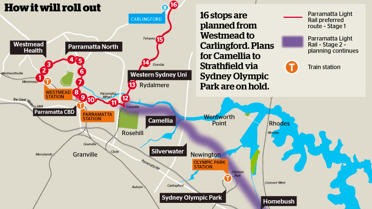

TABLE TALK

**AUSTRALASIAN TIMETABLE NEWS**

**No. 295, March 2017 ISSN 1038-3697, RRP \$4.95**

**Published by the Australian Timetable Association**

[**www.austta.org.au**](http://www.austta.org.au)

# **TOP TABLE TALK – QR CITYTRAIN TIMETABLE DISARRAY**

The report of the Commission of Inquiry chaired by Phillip Strachan,
former President and CEO of Rio Tinto Bauxite and Alumina, into the
driver shortages following opening of the Kippa-Ring line on 4 October
2016, was provided to the Queensland government on 3 February 2017.
Notwithstanding that the report found he was not responsible for the
failings, on the following weekday, 6 February, the Minister for
Transport Stirling Hinchliffe, resigned. **This is believed to be the
first resignation of a government minister in Australia because of a
railway timetabling issue**. The Deputy Premier, Jackie Trad, is the new
Minister for Transport. Mr Hinchliffe’s resignation followed the earlier
resignations of Queensland Rail’s Chairman, QR’s Chief Executive and
QR’s Chief Operating Officer, over this issue.

The author of the report, Phillip Strachan, was appointed the new
Chairman of Queensland Rail. The Premier, Annastacia Palaszczuk, said he
had “undertaken a comprehensive review of Queensland Rail, interviewing
senior staff of the organisation and gaining a thorough understanding of
its culture and practices. He has made wide-ranging recommendations to
ensure QR has sufficient drivers and a reliable pipeline of training to
deliver the services that Queenslanders will need into the future.
“Phillip Strachan is uniquely placed to lead the organisation through
what will be a significant transition to focus on its customers – the
travelling public.”

The Premier said that State Cabinet had endorsed all 36 recommendations
of the 300 page report. She said, “The people of Queensland 7have been
badly let down by Queensland Rail’s inability to maintain an effective
timetable, and my Government is very sorry and I apologise for that. The
problems that led to driver shortages from October 2016 were many years
in the making, but my government takes the responsibility, and is firmly
resolved to fix them.” She said the Strachan Inquiry report reveals a
culture of “relying on intuition, complacency and being reluctant to
share bad news” within QR’s Operations team. It recommends better and
shorter lines of communication within Queensland Rail, so that problems
can be identified and addressed much more quickly. “The Citytrain
Response Unit will in effect be a watchdog for QR, ensuring it stays on
track and on time in delivering these vital reforms. We will also be
meeting rail unions to determine what additional measures can be taken
to accelerate driver recruitment and training even further. That means
talking about external recruitment and allowing drivers to qualify more
quickly on a single sector of track.”

The Strachan Report found demand for train crews was rising as supply
fell, and was first identified by Queensland Rail in 2013. The Inquiry
identified a range of factors responsible for the driver shortage
including:

-   A QR preference to operate with a 5-10% undersupply of train crews
    and consequent over-reliance on overtime;
-   Restrictions on the external recruitment of crew;
-   A 12 month halt of driver training from February 2014; and
-   Driver training taking 18 months on average.

The Report found that passengers can expect ongoing train cancellations
until at least the end of 2018, with no new drivers out of the 200
promised fully trained. This could put at risk services to the 2018 Gold
Coast Commonwealth Games and cause further issues during school holiday
periods.

The recommendations to address these issues include:

-   Developing a five-year rolling monthly forecast of crew demand and
    supply;
-   Moving from intermittent recruitment campaigns to ongoing
    recruitment;
-   Assessing the sustainability of the current 23 January timetable to
    ensure stable services can be provided;
-   Opening driver and guard positions to external applicants, including
    those with no previous experience; and
-   Implementing ‘sectorised’ train crew deployment and accelerating
    average crew training from 18 months to 9.
-   Cabinet has also directed Queensland Rail to provide a high-level
    response plan within 30 days.

The Premier said the Citytrain Response Unit will be established for an
initial period of 12 months, and will monitor, audit and report on the
implementation of the inquiry’s recommendations and Queensland Rail’s
response and recovery plan. “This will include a rigorous assessment of
service levels under the current timetable to enable stable, reliable
services and sufficient training capacity to facilitate the long-term
return to full service levels,” she said.

The Commission had found that neither the board of Queensland Rail, nor
the Chief Executive Officer nor responsible Ministers - the Minister for
Transport and the Treasurer – were appropriately informed of the risk of
a train crew shortfall prior to the opening of the Redcliffe Peninsula
Line on 4 October, nor of the magnitude and longevity of the issues
faced from October 2016.

The Premier said other recommendations were designed to:

-   implement regular reporting on train crew demand, supply and
    shortfall initiatives to Queensland Rail’s Executive Leadership Team
    and the responsible Ministers.
-   implement transparent and timely reporting to TransLink and the
    public regarding operational issues that are affecting, or may
    affect, service delivery, to enable customers to plan alternative
    travel arrangements. This information is to be available in real
    time at stations, online and through call centres.
-   ensure that negotiations with train crew unions focus on best
    practice rules regarding continuous working time and other crewing
    practices to alleviate overtime pressure on train crews.
-   work with the train crew unions regarding introducing modern
    competency-based training arrangements. The new training regime will
    shorten the average training time for new recruits without
    compromising safety.

On 7 February it was announced that a Brisbane-based change management
specialist with extensive international experience, Jacqui Walters,
would lead the CityTrain Response Unit. Its immediate priorities
include:

-   Overseeing the implementation of a closely integrated public
    transport service;
-   Advising on the composition of the Queensland Rail Board;
-   Defining Queensland Rail's long-term industrial relations strategy
    to improve workplace flexibility and culture; and
-   Addressing systemic organisational issues identified in the Strachan
    Inquiry.

**The Commission of Inquiry reports that Queensland Rail calculates that
it will have train crew to deliver full timetables services by:**

-   **Late 2018, assuming 10% overtime,**
-   **Mid to late 2019, assuming no overtime.**

**Until such time, QR will continue to operate with reduced services and
high levels of overtime** (page 22 or Report).

It is claimed by the *Courier-Mail* that outdated and clunky IT systems
used to set rosters for Queensland Rail drivers made it impossible to
respond swiftly to the timetable meltdown. QR staff faced with unplanned
train driver absences had to key in roster changes manually, but the
time involved and complexity of union-agreed work rules meant
alterations took “days, not hours”. It left staff ill-equipped to warn
commuters of problems, including the horror Christmas Day collapse when
more than 200 services were cancelled without notice.

The Commission of Inquiry Report recommended speeding up a long-planned
software solution to QR’s rostering problems. Initiated in 2009, the
project has a completion date of 2017-18.

It is understood QR outsourced its systems in 2012. Until then, it had
rostered crews on an Excel spreadsheet. The inquiry found QR may have
accepted “overly restrictive crewing rules” imposed by unions because it
outsourced modelling and “could not readily determine” the rules’
impact. “Significant manual intervention is required to remove and
reallocate train crew job cards when train crew unavailability arises,”
the report found. “This is not conducive to being able to identify
affected services in a short time frame, which inhibits the provision of
timely notice to customers in relation to service cancellations.”

A briefing from QR on its Christmas Day fiasco described its rostering
system as “aged and heavily dependent on manual intervention”.
Understaffing had made it more difficult to change rosters. “The
integration between the various train scheduling and rostering systems
is sub-optimal and where changes are required to roster arrangements or
timetable services, a high degree of manual intervention is required,”
acting QR chief executive Jim Benstead wrote in the brief. It took
clerks six months to write job cards for train crews, which were then
subject to two months union consultation before settling on a master
roster.

On 11 February QR finally advertised for new drivers – but did not
follow the Commission’s recommendation to accept applicants who did not
have prior experience.

The Report and its Annexes contain a huge amount of data about
Queensland Rail’s operating practices and management practices. The
Report can be accessed at <https://www.strachaninquiry.qld.gov.au/>

*In a forthcoming edition of our sister magazine, the* Times*, Gordon
Dudman will offer an insight into driver rostering from a UK
perspective.*

# **RAIL AND TRAM NEWS**

## **Infrastructure Australia assessment**

On 25 February Infrastructure Australia (IA) released a revised
Infrastructure Priorities list.

**High Priority Projects** are potential infrastructure solutions for
which a full business case has been completed and been positively
assessed by the IA Board. A High Priority Project addresses a major
problem or opportunity of national significance: **All** projects in
this category are:

**M4 Motorway upgrade (Parramatta to Lapstone)** NSW: Connectivity in
outer western Sydney\

**WestConnex** NSW: Sydney inner west road congestion\

**Melbourne Metro Rail** Vic Melbourne rail network capacity\

**M80 Ring Road upgrade** Vic: Melbourne M80 Western Ring Road
congestion\

**Ipswich Motorway Rocklea–Darra Stage 1c** Qld: Southern
Brisbane-Ipswich road network capacity\

**Western Sydney Airport** NSW: Sydney aviation capacity\

**Perth Freight Link** WA: Perth freight network capacity

**Priority Projects** are potential infrastructure solutions for which a
full business case has been completed and been positively assessed by
the IA Board. They address a nationally-significant problem or
opportunity. **Rail and public transport** projects in this category
are:

**Murray Basin Rail Project** Vic: Freight rail connection between
north-west Victoria and the ports of Geelong and Portland\

**Adelaide – Tarcoola Rail Upgrade Acceleration** SA: Rail reliability
and axle loadings on the interstate rail network\

**Inland Rail (Melbourne to Brisbane via inland NSW):** National Freight
connectivity Melbourne-Brisbane\

**Eyre Infrastructure Project (Iron Road)** SA: Eyre Peninsula freight
capacity (Railway from Port Hardy to Central Eyre Peninsula Iron ore
project)

**High Priority Initiatives** seek to address major problems or
opportunities of national significance. **Rail and public transport**
projects in this category are:

**Sydney Metro: City and Southwest** NSW: Rail network capacity\

**Bus Rapid Transport: Northern Beaches, Parramatta Road, and Victoria
Road** NSW: Sydney corridor congestion: Northern Beaches, Parramatta
Road, Victoria Road\

**Southern Sydney to CBD public transport enhancement** NSW: Connection
between inner south urban growth area and Sydney CBD\

**Sydney Metro West: mass transit between Parramatta and Sydney CBD**
NSW: Connectivity between Parramatta and Sydney CBD\

**Cranbourne & Pakenham rail lines upgrade** Vic Melbourne outer
south-east suburbs access to CBD\

**Cross River Rail** Qld: Brisbane CBD public transport capacity\

**Perth CBD – north corridor capacity** WA: Perth northern corridor
capacity\

**Gawler Line rail upgrade** SA: Adelaide outer north east suburbs
access to CBD\

**Port Botany freight rail duplication** NSW Sydney Port Botany rail
freight capacity\

**Chullora Junction upgrade** NSW Sydney freight rail network capacity\

**Port of Brisbane dedicated freight rail connection** Qld Freight rail
access to Port of Brisbane\

**National Freight and Supply Chain Strategy** National: Strategic
planning for future freight initiatives\

**Preserve corridor for Western Sydney Freight Line and Intermodal
Terminal access** NSW: Future freight rail capacity to Eastern Creek
Intermodal and Sydney Main West Line\

**Preserve corridor for Lower Hunter freight rail realignment** NSW
Future freight rail bypass of Newcastle urban area\

**Preserve corridor for Outer Sydney Orbital road and rail/M9** NSW:
Future connectivity between Western Sydney and Central Coast/Illawarra\

**Preserve corridor for Western Sydney Airport rail connection** NSW:
Future rail connection to Western Sydney Airport\

**Preserve corridor for East Coast High Speed Rail** National: Future
connectivity between east coast capital cities

**Priority Initiatives** are potential infrastructure solutions for
which a business case has not yet been completed. These seek to address
a problem or opportunity of national significance. **Rail and public
transport** projects in this category are:

**Central Station redevelopment – rail and station infrastructure** NSW:
Connection between urban and intercity rail, buses, light rail and metro\

**Active transport (walking and cycling) access to Sydney CBD** NSW:
Inner city access to Sydney CBD\

**Public transport access to Parramatta CBD** NSW: Public transport
access to Parramatta CBD\

**Melbourne level crossings removal** Vic: Melbourne urban road network
congestion\

**Melbourne Airport to CBD public transport capacity** Vic: Access to
Melbourne airport\

**Melton Rail Line upgrade** Vic: Melbourne outer western suburbs access
to CBD\

**Melbourne outer northern suburbs to CBD capacity upgrade** Vic:
Melbourne outer northern suburbs access to CBD\

**Brisbane to Gold Coast transport corridor upgrades** Qld: Brisbane to
Gold Coast transport capacity\

**Perth major east-west and southern corridor capacity upgrades** WA:
Perth urban road network capacity\

**Adelaide north-south corridor upgrade (remaining sections)** SA:
Adelaide north-south urban road network capacity\

**AdeLINK Tram Network (Adelaide tram network expansion)** SA: Adelaide
public transport capacity\

**Canberra CBD to north corridor** ACT: CBD to north transport corridor
congestion\

**Canberra public transport improvements** ACT: Canberra public
transport capacity\

**Western Sydney Infrastructure Plan** NSW: Access to Western Sydney and
Western Sydney Airport\

**Freight rail access to Port Kembla** NSW: Freight rail access to Port
Kembla\

**Western Sydney Airport public transport connection** NSW: Access to
Western Sydney Airport\

**Northern Sydney Freight Corridor Stage 2 (additional track West Ryde
to Rhodes and Thornleigh to Hornsby)** NSW: Sydney freight rail network
capacity\

**Southern Sydney Freight Line upgrade** NSW: Sydney South to Moorebank
rail freight capacity\

**Lower Hunter freight corridor construction** NSW: Freight rail
capacity constraint in suburban Newcastle\

**Newcastle–Sydney and Wollongong–Sydney rail line upgrades** NSW:
Connectivity between Newcastle, Wollongong and Sydney CBD\

**Melbourne container terminal capacity enhancement** Vic: Container
terminal capacity\

**Beerburrum to Nambour rail upgrade** Qld: Queensland north coast rail
congestion\

**Mount Isa–Townsville rail corridor upgrade** Qld: Mt Isa–Townsville
rail capacity\

**Gladstone Port land and sea access upgrade** Qld: Land and sea access
to Port of Gladstone\

**Gawler Craton rail access** SA: Freight rail connection to Gawler
Craton mineral province\

**Melbourne–Adelaide–Perth rail upgrade** SA: Freight connectivity
Melbourne–Perth\

**Burnie to Hobart freight corridor strategy** Tas: Tasmania freight
network planning\

**Advanced Train Management System implementation on ARTC network**
National: Rail freight capacity constraint on ARTC network\

**Preserve corridor for Salisbury to Beaudesert, rail connection** Qld:
Future urban rail connection to Beaudesert

IA’s Report, with more information and reasoning, can be accessed at
<http://infrastructureaustralia.gov.au/news-media/media-releases/2017/2017_02_25.aspx>

## **House of Representatives Inquiry**

The Committee on Infrastructure, Transport and Cities presented a report
on 6 February into the role of transport connectivity in stimulating
development and economic activity in major urban areas, and in regional
Australia.

Evidence to the Committee indicated that value capture potentially
provides a mechanism by which planning and funding can be linked,
ensuring effective and efficient transport connectivity. A broad range
of potential value capture mechanisms could be applied. The Committee
noted that there is scope for the Australian government to design a new
value capture mechanism, to apply in cases where the value of privately
owned property increases as a result of a combination of new transport
infrastructure and rezoning of land. The Committee supported developing
value capture models that can be applied to major infrastructure
projects such as high speed rail.

The report can be accessed at
<http://www.aph.gov.au/Parliamentary_Business/Committees/House/ITC/TransportConnectivity/Report_1>

## **Senate Inquiry**

The Senate Rural and Regional Affairs and Transport References Committee
is inquiring into the state of Australia’s rail industry and how
government procurement, including through the Australian Rail Track
Corporation, and other policy levers can improve the value for money,
competitiveness, stability of work and capability of the rail
manufacturing industry.

The reporting date is 18 October 2017. Details and copies of submissions
are at
<http://www.aph.gov.au/Parliamentary_Business/Committees/Senate/Rural_and_Regional_Affairs_and_Transport/Railindustry45>

## **ARTC Rules**

From 5 February ARTC removed the following Rules and Procedures:

• ANSY 504 Electric Staff System,\

• ANPR 729 Using Electric Staff Instruments,\

• ANPR 730 Switching an Electric Staff Instrument,\

• ANPR 733 Using Drawer Locks, and\

• ANPR 736 Using Bell Signals.

These are now all obsolete.

## **Public Transport patronage**

Public transport patronage in capital cities in 2013-2014 was:

{width="7.822221128608924in"
height="3.3125in"}*Source: Tourism and Transport Forum via ABC News*

## **ARTC: Hunter Valley closedowns**

There will be two types of scheduled major closedowns of the Hunter
Valley network for maintenance in 2017. **Major** shutdowns will involve
the entire network from Kooragang to Narrabri and Ulan. Only the Port
Waratah terminal will remain open. **Mains** shutdowns will involve
Islington Junction (near Newcastle) to Maitland and Sandgate to Port
Waratah. The Kooragang terminals will remain open. Scheduled 2017
closedown dates are:\

21 to 24 February (Major),\

11 to 13 March (Mains),\

4 to 6 April (Major),\

9 to 13 June (Major and Mains),\

15 to 17 August (Major),\

26 to 28 August (Mains),\

10 to 13 October (Major),\

28 to 30 October (Mains), and\

20 to 24 November (Major).

## **ARTC WTT**

The following amendment to the 22 January 2017 Master Train Plan (WTT)
applies from 5 February:

6SP5 on Fridays will depart SOY 0015, pass Sefton Park Junctions (EW)
0021, Leightonfield (ARTC) 0027, Glenfield Loop 0039, Picton 0117,
arrive Moss Vale 0235, depart 0255, pass Exeter 0308, Wingello 0323,
Medway Junction 0331, Goulburn 0354, Joppa Junction 0359, arrive Harden
0627, depart 0654, pass Wallendbeen 0721, Cootamundra North Jct 0736,
Cootamundra West 0740, Stockinbingal 0812, Parkes Jct 1033, arrive
Goobang Jct 1035, depart 1410, thence as tabled.

## **Byron Bay train**

The Byron Bay Railroad Co expects to commence operation in April along 3
km of restored track of the former Murwillumbah line, north of the town
between Northbeach station in Sunrise Beach and the Byron Beach platform
located adjacent to the Shirley St level crossing. It will use a
restored 620/720 NSW Railways DMU powered by roof-mounted solar panels.
They propose an hourly service, from Byron Beach platform from 0800 to
2200. The Byron Bay Railroad Co is a not for profit company which is an
accredited heritage rail operator, owned by the Elements of Byron
resort. It hopes to eventually extend its line. Its website is
<http://byronbaytrain.com.au/>

## **Blayney-Demondrille line**

The prospect of the Blayney to Demondrille line reopening has again been
raised with a new study to examine the likely costs of re-establishing
the line. It will be completed by specialist rail consultants,
Lycopodium Group, and commissioned by the four councils along by the
line, Blayney, Cowra, Hilltops and Weddin. The impetus for the study has
come from the \$5 million that the NSW government set aside for the
reopening of the Demondrille to Maimaru section of the track.

## **QR CityTrain: New Generation Rollingstock**

Queensland Rail is undertaking testing of its New Generation
Rollingstock. The first trains are expected to enter service by
mid-2017, with full implementation in 2018.

## **QR CityTrain: Gold Coast line**

Duplication of the line between Coomera and Helensvale is currently on
schedule for completion in late 2017.

## **Brisbane Cross River Rail**

The Federal government has warned that Cross River Rail does not
properly integrate with the rest of Brisbane’s transport network, in a
blow to the State government’s top-priority project. Federal Urban
Infrastructure Minister Paul Fletcher has insisted that “more work” is
required on plans for the \$5.5 billion 10.2 km project to ensure a
better long-term solution for commuters. This could force the
cash-strapped Queensland government to find new funding solutions.

## **Aurizon: Diminishing in North Queensland**

At the end of 2017, Aurizon will stop carrying sugar and molasses from
Proserpine Mill to Mackay Port and from Burdekin to Townsville. It says
this is following “operational requirements” and commercial returns
review, as well as discussions between Aurizon and Wilmar Sugar.

Mining company Glencore plans to use more trucks in its Mt Isa copper
operations, after a review found it to be a cheaper short-term option
than rail. Glencore’s Australian copper assets chief Mike Westerman said
rail was in the company’s long-term plans, but road freight was cheaper
for now.

In January Aurizon took a \$10 million impairment over the loss of a
contract to haul mine inputs and outputs from Glencore’s Mt Isa
operation to the port at Townsville. Glencore reportedly said Pacific
National won the deal, but without wagons for now, the company has opted
to go with road haulage. “As any operation would do, we went out and
sought expressions of interest as \[Aurizon’s\] contract was ending As
part of that commercial process, we had a rail provider that was
significantly cheaper than the other and we eventually went for Pacific
National.”

After failing to come to terms on a deal to buy Aurizon’s wagons,
Glencore is spending over \$2 million to build its own. Until then, the
material will travel by road. “It would have been good to have an
orderly transition from one rail provider to another, but we were unable
to strike an agreement,” he was quoted as saying. I’m frustrated that we
can’t come to a solution that’s in the best interest of all parties.”

## **ARTC & Sydney Trains: NSW South line on 25 February**

The TABCorp Miracle Mile horse trotting meeting was scheduled for
Saturday evening 25 February at the Menangle Park trotting course, next
to the main south line south of Campbelltown. Sydney Trains scheduled a
fairly intensive series of trains shuttling between Campbelltown and
Menangle Park (8.2 km) to cater for patrons – ten trains (Endeavour
DMUs) each way between 1700 and 2400. These, apparently, were to use the
Up line when travelling in the Down direction between the Glenlee
Crossovers and Menangle Park (2.8 km). (This mainline is signalled for
two-way running on both lines in this area.) As well as these additional
trains, there are usually 19 trains in this section between these times.
It probably would have been much more interesting to watch the trains
rather than the horses. (ARTC Train Alteration Advice 0285-2017 and
Sydney Trains Special Train Notice 0192-2017 refer.)

## **Parramatta Light Rail**

On 17 February the NSW government announced plans for stage 1 of the
Parramatta light rail from Westmead via the Parramatta CBD and Rosehill
Racecourse to Carlingford. This will take over the Carlingford railway
between Camelia to Carlingford. Construction will start in 2018 and it
is planned to open in 2023. The proposed route will be 12 kms with 16
stops. The route, which is open for community feedback, has proposed
stops at Westmead, Westmead Hospital, Children's Hospital, Cumberland
Hospital, Factory St, Fennell St, Prince Alfred Square, Eat St,
Parramatta Square, Harris St, Tramway Avenue, Camellia, Rydalmere,
Dundas, Telopea, Carlingford. Services will run every 7½ minutes and use
Opal Card.

The decision to split the project into two stages means the
much-anticipated connection to Olympic Park is now years away from being
delivered. A new Western Sydney heavy rail line is being built from the
CBD and the government argues that it needs to integrate planning of
that project with the light rail, which is why Olympic Park is not on
the existing route map. Premier Gladys Berejiklian defended the
government's decision not to include Olympic Park, which suffers from
major transport connection issues, in the first section of the light
rail project. She acknowledged transport to Olympic Park was "a major
issue", but said the government was "absolutely" committed to delivering
the whole project, including the connection to Olympic Park in stage
two. She said more work was required to determine how the light rail
would intersect with the new metro station at Olympic Park, which is
part of the new Sydney Metro West underground rail link to be built by
the late 2020s. "We do need to finalise plans of where a future metro
will intersect with the light rail and that's why we are taking to the
end of this year to get stage two down properly."

The government has committed \$1 billion in funding for the project but
acknowledges the budget will increase. The business case is yet to be
finalised. Remaining funding will come from value capture.

## **NSW storms 17 February**

Severe storms in Sydney and surrounds on Friday afternoon 17 February
adversely affected train services. Sydney Trains services were delayed.
Power outages between Cowan and Woy Woy affected signals. Sydney Trains
consequently would not accept freight trains into their network. NSW
Train Link’s 1441 Sydney to Brisbane XPT – a train often affected by
delays along the long single-track mainline north of Maitland – was this
time affected closer to Sydney. By Wyong it was 162 minutes late. At
Casino it was 188 minutes late and terminated. It was replaced by a bus
beyond – a common occurrence for this train. That also, of course,
brought the consequential replacement of its return working, the 0455
Brisbane-Sydney XPT by a bus between Brisbane and Casino.

## **Sydney Trains: October 2017 timetable**

The October 2017 timetable will introduce major changes, including an
additional 1,800 services each week. It is designed to make full use of
recent infrastructure projects.

## **Sydney Metro: Bankstown line**

A planning application by the NSW government has been lodged for
conversion of the Sydenham to Bankstown line from rail to Metro
standards. The 11 stations between Sydenham and Bankstown will be
converted with lifts, level platforms and screen doors. This will
require a closure of between three to six months once Sydney Trains have
stopped operating the line. This closure will be just before Metro
services start in 2024. Transport for NSW is working on temporary
transport plans for this period

## **V/Line WTT of 29 January**

The V/Line WTTs of 29 January 2017 were placed on their website,
<https://corporate.vline.com.au/Network-Access/Network-service-plan> on
1 February. However, the passenger WTTs are undated. The freight WTTs
are dated.

There is one cross scheduled at the new Rowsley Loop (between Bacchus
Marsh and Ballan) each weekday at 2306-2309. The unusual thing is that
the up train goes into the loop. Day-by-day ordinary practice during
out-of-course running is that the down goes into the loop. The union had
put a ban on the use of the loop by up trains because of the adhesion
problems discovered on opening day last June.

## **V/Line timetable of 29 January put to the test**

***Geoff Mann*** *sampled the Geelong line on Monday 30 January, the first
weekday of V/Line’s new timetable:*

I had the pleasure of sampling the first public timetabled loco-hauled
express from Geelong to Melbourne since the opening of the Regional Rail
Link. The trip was on the newly introduced additional 0905 Up
Warrnambool service.

Late running on the line beyond Geelong has been prevalent since the
imposition of numerous speed restrictions at level crossings. There are
27 (some applying in one direction only), many of which are 60 km/h. One
applies over four kilometres.

I joined the Up Warrnambool at Waurn Ponds (departure 1142). The VDU and
auto announcement stated that the train was running 25 minutes late, but
recovery time into Waurn Ponds resulted in a 17 minute late departure
from there. Stops are Geelong, Footscray and Southern Cross.

Late running creates problems with crosses on the busy single line
section between Waurn Ponds and Geelong. The frequent out-of-course
running must be a pain for the signallers, but on my trip it was dealt
with sensibly, albeit at the expense of two other services. We ran
through 2 road at Marshall where a Down VLocity was held (7+ min late)
in the platform. At South Geelong, an Up Vlocity was held in the loop
(by then 4 minutes after its departure time) to give us a clear run.
Despite this, 5 minutes were lost in the 8 minute allowance from Waurn
Ponds to Geelong.

Geelong departure was 21.5 min late. The consist was N454 + three car
set N11. Trailing load a hefty 130t! With 1680Kw traction available, a
high power to weight ratio, but of course loco weight (124t) must be
added to this. So 6.6Kw/t is easy work over a level line. Speed was at
the max 115km/h over many km, apart from two minor temporary speed
restrictions.

Overall elapsed time Geelong to Southern Cross was 56min 32 sec
(schedule 61 min) for the approximately81km. Geelong to stop Footscray
was 46min 32 sec (≅76km) = 98km/h average. Net running time in from
Footscray was 9m15s, but we arrived at Plat 1. If we had arrived at a
more distant platform such as 2A it would have taken about 10 min.

The speed restrictions on the Warrnambool line present a massive problem
that might require total level crossing protection and re-signalling (as
some TSRs are due to signal design issues). Remedial action should be a
very high priority to overcome the prevailing unreliability.

*On the same day, **Albert Isaacs** had an incident-laden trip on the
inaugural day return service to Maryborough:*

The well-publicised recent changes to the V/Line TT laudably saw the
introduction of a number of new services on either Sunday 29 or Monday
30 January 2017. One of these was a regular Monday-Friday day return
Southern Cross-Maryborough, which supplements the evening down and
morning up over the same route, the latter introduced in December 2008.
Since then, a few day return specials have been run for specific events
such as the annual Clunes Book Fair. I have travelled on many of these
specials but decided that I would like to travel on the first of the
regular day returns from Melbourne.

Although there was already a regular service on this line, this second
service was treated to the type of hype that one usually associates with
a brand new service. At Ballarat, the Minister for Public Transport and
Major Projects, the Hon Jacinta Allan, made a speech welcoming the new
service. Although her speech was comparatively short, it did hold up the
train for five minutes. (The train was already running a little late due
to an extremely slow run through Parwan loop where a cross was made
without actually stopping.). Other special events to commemorate the
first day of service included complimentary fruit juice and a cake for
all passengers travelling beyond Ballarat, served by the Ballarat-based
female conductor. There were 50 or so people at Maryborough ready to
greet us, along with a banner and balloons. Included amongst those on
the platform were a number of local politicians, councillors and media.

There were nine passengers on board when the Down left Ballarat; they
were joined by two at Creswick and a group of 20 ex Clunes. This group
of Clunes locals had been organised by a well-known rail enthusiast now
resident in Clunes. They had lunch in Maryborough and did some shopping.

Let us now look at some of the other unusual things on this trip. The
0917 from Southern Cross was a joint train consisting of two VLocity
sets which were to split at Ballarat with one going to Maryborough and
the other to Wendouree. The VDUs and announcements at Southern Cross
stated that the front set would go to Maryborough and the back set to
Wendouree. About half-a-dozen on-train announcements to this effect were
made, and the conductors even went through the train and personally
asked each passenger where they were going. Immediately prior to arrival
at Ballarat an announcement was made rescinding all earlier
pronouncements and advising that the front set would go to Wendouree and
the back to Maryborough! Anyone who had looked at the timetable would
have guessed that this would have to be the case because the Wendouree
was due to leave Ballarat at 1043, with the Maryborough following at
1045. The Wendouree got away just one minute late, after which the
Maryborough set sidled a few metres along the platform where it stopped
again for the Minister to make her speech.

Monday 30 January was the second day (first weekday) of services to the
new station at Caroline Springs. Nevertheless the down
Wendouree/Maryborough was not tabled to stop there. However, on the up
eight people boarded at Caroline Springs during the tabled stop.

Weather forecasts were for temperatures of around 40˚ in Central
Victoria. As it happened, the weather was extremely mild. Nevertheless,
because of the forecast, V/Line had decreed their usual hot-weather
speed restrictions prior to the train departing, and these were adhered
to. Things weren’t that bad on the Down – after leaving Ballarat, 5½
minutes late, we arrived at Maryborough just 6¾ late, mainly due to a
lot of padding in the timetable. On the up, we left Maryborough half a
minute late and departed Ballarat 12½ late. Not only had we now lost our
path and not only were we still on unnecessary speed restrictions, but
someone at Control appeared to have decided not to worry about the
increasingly late running up and instead concentrate of getting the long
chain of peak-hour downs through as near to on time as possible.

The Maryborough/Ballarat train was due at Southern Cross at 1714 but the
conductor made an announcement after leaving Bungaree Loop East that
Control had given a revised arrival time of 5.40 (12 hour clock). For
the benefit of those boarding at Ballan, the announcement was repeated,
but this time the conductor appeared to have trouble with his 12 hour
and 24 hour clock and announced that the train would arrive at Southern
Cross at 7.40! Luckily, this was corrected within a couple of minutes,
but not before loud cries of consternation from many passengers.

So what of our hold-ups? We were held at Bungaree Loop East for 12¼
minutes to cross a Down VLocity. This was nothing, because at Parwan
Loop we were held for 21½ minutes. At the beginning of our wait, a very
embarrassed conductor told us that we would cross two trains. After a
Sprinter set and a local Bacchus Marsh pass had passed, the now even
more uncomfortable conductor had to tell us that there would actually be
a third cross (another VLocity). At Rockbank we were held in the
platform for 4½ minutes whilst there were another two crosses (both
VLocities). Times were comparatively good for the suburban section of
the journey, doing Sunshine-Southern Cross in 14 minutes instead of the
tabled 15.

Nevertheless, our Southern Cross arrival was 61 minutes late, at 1815!
What happed to Control’s promised 1740 arrival? So there you have it –
more than an hour added to a tabled 2¼ hour journey. What an
introduction for the first regular afternoon train out of Maryborough!
What a pity the politicians who were on the down were not on the up!

One final remark on the up train; this is the first time that I can
recall being on a V/Line service where tickets were not actually
checked! In case you think that this was some sort of sop on the part of
embarrassed conductors for the late running train, I should explain that
tickets were not checked even in the Maryborough-Ballarat section.

## **V/Line WTT amendments 26 February**

Commencing Sunday 26 February the following alterations occurred to
facilitate recovery from late running due to additional speed
restrictions imposed on level crossings on the Warrnambool line after
the finalisation of the current Network Service Plan (Working
Timetable):

### **SATURDAY & SUNDAY SOUTH WEST:**

0700 (No.8861) Pass; Southern Cross to Warrnambool altered to operate as
per NSP to Sherwood Park 1040, then arrive Warrnambool 1101 (10 minutes
later than NSP)\

1300 (No.8865) Pass; Southern Cross to Warrnambool altered to operate as
per NSP to Sherwood Park 1623, then arrive Warrnambool 1645 (10 minutes
later than NSP)\

1850 (No.8801) SATURDAY VLocity Pass; Southern Cross to Waurn Ponds
altered to operate as per NSP to Geelong 1645, then arrive Waurn Ponds
at 2013 (6 minutes later than NSP)\

1900 (No.8869) Pass; Southern Cross to Warrnambool altered to operate as
per NSP to Sherwood Park 2224, then arrive Warrnambool 2245 (10 minutes
later than NSP)\

0735 (No.8862) Pass; Warrnambool to Southern Cross altered to arrive
Southern Cross 1116 (10 minutes later than NSP)\

1125 (No.8864) Pass; Warrnambool to Southern Cross altered to arrive
Southern Cross 1512 (15 minutes later than NSP)\

1725 (No.8868) Pass; Warrnambool to Southern Cross altered to arrive
Southern Cross 2107 (10 minutes later than NSP).

### **MONDAY-FRIDAY SOUTH WEST:**

0720 (No.8861) Pass; Southern Cross to Warrnambool altered to operate as
per NSP to Sherwood Park 1053, then arrive Warrnambool 1113 (10 minutes
later than NSP)\

1320 (No.8865) Pass; Southern Cross to Warrnambool altered to operate as
per NSP to Sherwood Park 1645, then arrive Warrnambool 1705 (10 minutes
later than NSP)\

1713 (No.8867) Pass; Southern Cross to Warrnambool altered to operate as
per NSP to Sherwood Park 2048, then arrive Warrnambool 2109 (10 minutes
later than NSP)\

1905 (No.8869) Pass; Southern Cross to Warrnambool altered to operate as
per NSP to Sherwood Park 2238, then arrive Warrnambool 2257 (10 minutes
later than NSP)\

0555 (No.8860) Pass; Warrnambool to arrive Southern Cross 0957 (25
minutes later than NSP) *(A Maxi Taxi required at Waurn Ponds for
customers travelling to Marshall. A bus required at Marshall for
customers travelling to Geelong to connect with 0847 (8742) to Southern
Cross)*\

0905 (No.8862) Pass; Warrnambool to arrive Southern Cross 1313 (20
minutes later than NSP).\

1203 (No.8864) Pass; Warrnambool to arrive Southern Cross 1558 (22
minutes later than NSP) *(A Maxi Taxi required at Waurn Ponds for
customers travelling to Marshall. A bus required at Marshall for
customers travelling to Geelong to connect with 1447 (8778) to Southern
Cross)*\

1735 (No.8868) Pass; Warrnambool to arrive Southern Cross 2144 (20
minutes later than NSP) *(A Maxi Taxi required at Waurn Ponds for
customers travelling to Marshall. A bus required at Marshall for
customers travelling to Geelong to connect with 2034 (8868) to Southern
Cross).*

### **MONDAY-FRIDAY NORTH EASTERN BROAD GAUGE:**

2150 (No.8339) Pass; Southern Cross to Seymour altered to depart
Southern Cross at 2215 and now arrives Seymour at 2344 (25 minutes later
than NSP).\

The Victorian government is committed to upgrading 20 level crossings on
the Warrnambool l ine this year, to improve safety and restore the
timetable.

## **Metro Trains Melbourne: Hurstbridge line**

The Victorian government signed a \$395 million contract on 7 February
for improvements to the Hurstbridge line, comprising:

-   removal of level crossings at Lower Plenty Road and Grange Road,
-   duplication for 1.2 km between Heidelberg and the down side of
    Heidelberg (over the high overbridge and a new tunnel next to the
    existing single line tunnel), and
-   construction of a new station at Rosanna.

## **Yarra Trams: route 58**

Route 58 is to be introduced on 1 May. This will replace routes 8 and 55
and operate through from Toorak to west Coburg via William St, City.
Passengers for Swanston St will need to change at Domain Interchange
where there will be many connecting services.

## **WA election**

WA Labor has promised a \$2.53 billion expansion of Perth’s rail system
called Metronet. The first stage would include four new rail lines, the
removal of four level crossings, two new train stations and several
upgrades. In addition, the new railcars will be built locally, a \$410m
boost to WA’s manufacturing sector. Most of the money to build Metronet
will come from consolidated funds (\$1.01bn), land sales (\$667m) and
state government funds already allocated to Perth Freight Link road
project (\$486m).

## **WA wheat lines**

CBH has signed an agreement with Brookfield Rail providing access to WA
grain lines from 1 January until 31 December 2017. The parties are still
negotiating about a long-term access agreement.

## **WA flooding**

Record rainfall in SW WA caused TransWA’s Prospector to be cancelled
between East Perth and Kalgoorlie as well as the AvonLink between
Midland and Northam. These were replaced by buses from Friday 10
February to Wednesday 15 February. Freight services were disrupted on
the Eastern Goldfields Railway from Perth to Kalgoorlie until 16
February, the Great Southern Railway from Northam to Albany, the grain
freight rail network in the northern wheatbelt and the lakes district
and on the Leonora line from Kalgoorlie to Leonora.

## **NZ Midland line closure**

KiwiRail’s Christchurch-Greymouth line between Cass and Springfield
KiwiRail was closed on 4 February after it was damaged in a major
bushfire. After repairs, it will reopen on 3 April. Bridges, track and
signal systems were all damaged in the blaze. Affected services include
the TranzAlpine passenger train, coal and dairy freight services.

KiwiRail’s general manager of network services Todd Moyle said crews
from around the country would be brought in to tackle the reinstatement
of the line as quickly as possible. “Hot and windy conditions at the
weekend meant several of our bridges along the route were damaged,
including one bridge where 12 wooden piles will need to be replaced,”
Moyle said. “We are still working through the quickest course of action
to reinstate the line. Heat spots in the area remain a concern.”

Moyle was also confident the added work would not impact the rail
rebuild on South Island Main North Line, which is continuing towards a
return to service after November’s Kaikoura earthquake.

## **Auckland timetable 12 March**

A new timetable will be introduced from Sunday 12 March. The main
changes are:

-   Opening of the new inner city Parnell station between Britomart and
    Newmarket. Southern line trains stop there. Western line trains also
    stop, but only in the evenings and weekends.

-   Closing of Westfield station on the Southern line (12.9 km from
    Britomart). Auckland Transport says it was one of the quietest
    stations on the network – it had less than 330 passengers a day in
    November 2016. Forecasts indicated that demand was likely to remain
    low given the location in a light industrial area and new public
    transport options created recently in south Auckland, including the
    New Network for bus services in October 2016 and the new interchange
    at Otahuhu.

-   Weekday Onehunga line trains until 1912 will not stop at Parnell,
    Greenlane and Remuera. Remuera and Greenlane are the least used
    stations on the Onehunga line and are well serviced by the Southern
    line (10 minutes at peak times and 20 minutes between peak). When
    Southern line trains run less frequently in the evenings and
    weekends, Onehunga trains will stop at Remuera and Greenlane. Only
    3.5% of passengers from Onehunga and Te Papapa travel to Remuera and
    Greenlane. By reducing the travel time, it is possible to get more
    round trips from the same train which frees up a unit to be used to
    increase peak capacity on other parts of the network.

-   Most trains have altered departure times.

-   There are three additional trains Britomart-Puhinui after 1900.

-   Southern line trains are one minute faster outbound and three
    minutes faster inbound.

-   Most connection times at Papakura between Southern line trains and
    the DMU Papakura-Pukekohe shuttles are reduced.

-   An additional Onehunga train departs Britomart at 0012 on Friday
    nights.

-   Western line trains are one faster inbound and three minutes faster
    outbound. This is partially achieved by reducing the reversal time
    at Newmarket from four minutes to two minutes outbound and three
    minutes inbound.

-   An additional Britomart-Swanson train departs at 0040 on Saturday
    nights.

-   Additional trains run as six car units using the units freed up by
    reduced journey times.

The new timetables are online at
<https://at.govt.nz/bus-train-ferry/timetables/#Train>

The revised train network map also includes the North Shore Busway.

## **Auckland City Rail Link**

Rail Link has issued a call for pre-qualification to tender for two
inner city stations and tunnels for the \$NZ 3bn project to build a
cross-city line in Auckland.

**Thanks** to Tony Bailey, Gordon Dudman, Albert Isaacs, Victor Isaacs,
Geoff Lambert, Geoff Mann, Len Regan, Richard Talbot,
[*www.qld.gov.au*](http://www.qld.gov.au),
*[www.strachaninquiry.qld.gov.au](http://www.strachaninquiry.qld.gov.au),*
*[www.railexpress.com.au](http://www.railexpress.com.au),
[www.railpage.com.au](http://www.railpage.com.au), ABC News, Transit
Australia, Australian, Blayney Chronicle, Courier-Mail, Daily Telegraph*
and *Sydney Morning Herald* for Rail news.

# **BUS NEWS**

## **New South Wales**

### **State Transit changes 12 February:**

-   Route 301 has more than 75 additional weekly trips between Zetland
    and the City providing a 24 hour, seven days a week bus service in
    the growing Green Square area. Green Square and Waterloo also have
    30 additional weekly trips on 343 Martin Place-Kingsford and 160
    additional weekly trips on M52 Wynyard-Zetland. Waterloo, along with
    Wolli Creek and Wentworth Point, are suburbs mainly comprising
    apartments. Whilst Wolli Creek is on a rail line and Wentworth Point
    is connected to a rail line at Rhodes via the Bennelong
    bus/cycle/pedestrian bridge. Waterloo will be dependent on buses
    until the South-West Metro line to Bankstown and a light rail
    extension are completed.
-   895 UNSW (Anzac Parade)-Central station services have been
    renumbered 891 and now commence from Gate 3, High St. Present 891
    services will commence at Gate 9, High St and pick up at Gate 3.
    Morning 890 Circular Quay-UNSW (High St) via Taylor Square and
    afternoon 892 UNSW (High St)-Circular Quay via Central services have
    been discontinued.
-   Evening services are now provided on 477 Rockdale-Miranda.
-   Later evening trips are now provided on 370 Leichhardt to Coogee.
-   An additional trip is provided on 372 Railway Square-Coogee weekdays
    departing Railway Square at 1805.
-   Four additional weekday 389 trips will depart Seven Ways, North
    Bondi towards Bondi Junction at 0523, 0543, 0603 and 0656.
-   Extra weekday trips are provided on 433 Balmain-Martin Place from
    Balmain at 0655 and Harold Park at 0647, 0724 and 0908.

The *Manly Daily* reports that services from Manly are significantly
slower due to traffic congestion:

> L90 Palm Beach to City four minutes slower\
>
> 144 Manly to Chatswood four minutes slower\
>
> 143 Manly to Chatswood six minutes slower\
>
> E70 Manly to City one minute slower\
>
> 173 Narraweena to City four minutes slower\
>
> E65 South Curl Curl to City seven minutes slower\
>
> E50 Manly to Milsons Point 13 minutes slower\
>
> E66 Allambie Heights to City eight minutes slower\
>
> E69 Narraweena to City eight minutes slower.

During the evening peak, the University of NSW now has chartered buses
to run alongside Sydney Buses’ route 891 services from High St
Kensington to help to ease the queues for the trip to Central. These run
between 1600 and 1900 until Friday 31 March 2017 (covering the busiest
weeks of the year). Timetable changes have been made to simplify the
service:

-   Route 891 is the dedicated Uni NSW Express service. Route 895 has
    been renumbered to route 891 and starts from Uni NSW at Gate 3 –
    there has been no reduction in service levels.
-   Route 890 and 892 to and from Circular Quay no longer run.
-   All 891 trips towards Central run from High St (gates 9 and 3).

### **Hillsbus changes effective 19 February:**

-   Introduction of new route 605 North Kellyville to Rouse Hill Town
    Centre via Withers Road and Commercial Road operating hourly seven
    days a week.
-   Operation of route 607X Rouse Hill Town Centre to City: Saturday
    inbound services at 0421, 0521 - previous start 0621, Sunday inbound
    services operate at 0430, 0530, 0630, previously start 0654.
    Saturday and Sunday outbound services operate at 0426, 0526, 0626,
    0726, 0756 - previous start at 0826. Saturday afternoon inbound and
    outbound services operate every 15 minutes rather than every 30
    minutes.
-   Renumbering of route 610X Castle Hill trips to M61. 610 and 610X are
    used for Kellyville and Rouse Hill trips. Additional outbound 610X
    Rouse Hill Monday to Friday evening services provide a 30 minute
    frequency instead of hourly. Hourly Saturday 610 services to and
    from Castle Hill are supplemented by hourly 610X services giving a
    combined 30 minute services, 610X trips provided by extending M61
    trips to and from Castle Hill.
-   Addition of route 615X trips to and from North Kellyville.
-   Addition of peak trips on route 619 Rouse Hill to Macquarie Park and
    Castle Hill to Macquarie Park in the morning and from Macquarie Park
    in the afternoon.
-   Addition of extra Monday to Friday evening services on route 620X
    City to Cherrybrook, 621 Castle Hill to City with 1010 and 1120
    services terminating at Cherrybrook. Extra Saturday and Sunday
    inbound evening services are provided on 621 and extra Sunday
    outbound services are provided on 621.
-   Operation of route 611 Blacktown to Macquarie Park on Mondays to
    Fridays off-peak every 15 minutes instead of 30 minutes.
-   Operation of route 700 Parramatta to Blacktown on Monday to Fridays
    off-peak and Saturdays every 30 minutes instead of every 60 minutes.
-   Addition of Sunday services on T65 Parramatta to Rouse Hill Town
    Centre to provide a combined 15 minute service on T65/T66 instead of
    30 minutes.

### **New Hillsbus Timetables effective 19 February:**

-   605 North Kellyville to Rouse Hill Town Centre
-   607X 617X Rouse Hill to City
-   M61 610 610X Rouse Hill and Castle Hill to City
-   611 630 Blacktown to Macquarie Park
-   615X North Kellyville to City (from 20 Feb)
-   619 Rouse Hill Town Centre to Macquarie Park
-   620 620X 621 622 642 642X Castle Hill and Dural to City and North
    Sydney
-   700 Parramatta to Blacktown
-   T65 T66 Parramatta to Rouse Hill Town Centre.

**Newcastle** buses are likely to run down King St and Honeysuckle Drive
while the light rail is being built, and most services will terminate at
the Wickham interchange once the trams are operating on Hunter St. The
free buses that have run throughout the CBD since 2004 are also likely
to go once light rail starts. Although the NSW government and Transport
for Newcastle operator Keolis Downer say that final decisions are yet to
be made about the shape of the city’s new public transport system, the
light rail Review of Environmental Factors describes the removal of
seven existing bus stops” along Hunter St and Scott St. Hunter St is
likely to be shut, block by block, for up to 14 weeks at a time once
construction of the light rail begins. Keolis Downer takes over
Newcastle Buses and the Stockton ferry from July.

In an unusual move away from their home base, **Canty's** of Unanderra
(generally a hire drive operator) run the courtesy bus contract at the
Ramsgate RSL Memorial Club in Sydney. They have operated this contract
since around 2012/13. It operates a service on the hour. Mon-Thurs.
1700-2200, Fri: 1100-0400, Sat: 1700-0400, Sun: 1300-2400, using two
Toyota Hi Aces, distinctively painted all over dark blue with signage
for the club.

## **Victoria**

### **New Metropolitan Bus Contracts**

In mid February the Victorian government announced their preferred model
for new metropolitan bus contracts to commence in July 2018 for the 12
‘traditional’ private operators operating 70% of the Melbourne Bus
Network (Transdev, who operate 30% of the former government network,
have a separate contract framework for their 7-year contract that
commenced in August 2013, with an option to extend it for a further
three).

A damning report written by the Victorian Auditor General published in
May 2015 suggested a number of flaws with the existing contracts and
their management, including a lack of KPI benchmarking and associated
penalties for bad performance, issues with real-time bus tracking (still
ongoing), a failure to tackle fare evasion, limited options to deliver
value for money due to the lack of a competitive tender process and area
and route exclusivity preventing network reform. It had also found there
was an 18% saving with the Transdev contract compared to the previous
contracts with Nationalbus and Melbourne Bus Link, however rather than
enforce contract breaches, a number of extensions to various clauses had
been offered. The new model will give existing operators the opportunity
to negotiate a new 5-year contract with the state government or an
alternative 10-year contract that will include stricter performance
regimes.

Similar to the model adopted in Sydney after the 2004 Unsworth Report,
both options will require operators to give up their right to
exclusivity at the conclusion of their next contract period, with
contracts to set to go to open tender in 2023 or 2028. The government
believes that the contract overhaul will deliver a more efficient, cost
effective and customer focused bus network than present, and reverse a
slight decline in customer numbers since 2014.

BusVic has hit out at suggestions the existing operators are largely to
blame for the performance of the bus network saying that patronage
traditionally fluctuates with the price of oil, compounded by ongoing
issues with the myki system and underreporting of fare evasion on parts
of the bus network and lack of bus priority causing delays. Furthermore,
the lack of evening or Sunday services is a direct result of funding
provided by the government, who have also failed to provide funding
initiatives such onboard wi-fi, bike racks and electric or hybrid buses.
Additionally, the 16 bus reviews conducted between 2006 and 2010 led to
little network reform in many areas.

More specific contract details, such as consolidation of the number of
contract areas, scope of network reform, changes to depot locations
etc., have yet to be outlined.

### **Fawkner consultation for route 530**

PTV are currently considering making changes to Broadmeadows Bus
Service’s route 530 (Coburg – Campbellfield) to improve coverage for
residents living in the south-east pocket of Fawkner currently only
served by an off-peak deviation.

The local community is being asked their preference of one of three
options:

1.  Maintain status quo with off-peak deviation through south-east
    Fawkner
2.  Operate peak trips via off-peak deviation in south-east Fawkner

3.  Modify route via Queens Parade to improve directness and better peak
    coverage in south-east Fawkner. Fawkner station no longer served,
    but passengers can still transfer from trains at Coburg, Merlynston
    or Gowrie.

### **Route 600 timetable adjustments**

Transdev Melbourne made minor revisions to the timetable for their route
600 (St Kilda – Southland) service with the opening of the Heatherton
depot on 15 August, but the new timetable data only appeared on the PTV
website and GTFS feeds in mid February.

On Saturday afternoons the 1730 ex Sandringham to Southland has been
extended to commence at St Kilda at 1708. This rectifies an inadvertent
70 min gap between St Kilda departures on the 600/922/923 corridor
created in the previous June timetable change – the general Saturday
trunk frequency is 20 minutes daytime and then 40 minutes until
midnight. A few afternoon peak trips towards Southland have also been
retimed five minutes later than previously, improving train connections
at Sandringham and rostering efficiency.

The online timetable is still dated 5 June 2016 and a new printed
timetable has been yet to be sighted.

### **Thomastown Depot routes**

Further to the report in the February *Table Talk* regarding the planned
opening date for Transdev’s new depot on High St, Thomastown on Monday 6
March, sources suggest some shifts across the following routes will be
transferred to the new facility - 200, 207, 246, 250, 251, 281, 295,
302, 305 and 350, although Doncaster and North Fitzroy will continue to
operate several trips on each route.

The new depot will replace leased space at Tullamarine Bus Lines’
Airport West depot (an arrangement dating back to the formation of the
Green and Yellow Orbitals in 2010) with a number of shifts on orbital
routes 901 and 902 also moving across.

### **St Kilda Festival detours**

The annual St Kilda Festival on Sunday 12 February saw various detours
but failed to deliver any additional services:

-   Transdev route 246 (Elsternwick – Clifton Hill) was diverted
    directly along St Kilda Road and Brighton Road after 1130 to avoid
    traffic congestion on Barkly St, but missing 17 stops in St Kilda
    and along Glen Huntly Road in Elwood. Information online failed to
    highlight the detour until after 1800, leaving dozens of passengers
    waiting at stops for buses simply not coming, with either no
    information displayed at stops or poorly written advice at those
    stops shared with routes 600, 606 and 922.For around a decade
    afternoon buses on route 246 in the southern half of the route ran
    as a shuttle connecting with regular services terminating at Alma
    Road – it is unclear why Transdev did not follow this model in 2017.
-   Transdev routes 600 and 922 (St Kilda – Southland) and CDC Melbourne
    Route 623 terminated at Barkly St and Carlisle St, not serving St
    Kilda Light Rail station or Luna Park
-   CDC Melbourne route 606 (Elsternwick – Port Melbourne – Fishermans
    Bend) did not travel south of Park St and Mary St in St Kilda.
    Passengers travelling to Elwood and Elsternwick were advised to use
    route 246, but as noted above the service was bypassing Elwood
    altogether!

### **Another White Night**

Around 600,000 Melbournians descended on the Melbourne CBD between 1900
Saturday 18 February and 0700 Sunday 19 February for the annual White
Night arts and cultural festival.

To assist Doncaster residents, Transdev’s Route 907 (City – Mitcham) ran
an extended half-hourly headway overnight instead of finishing at
midnight, complementing Night Bus Routes 961 and 966. On White Night
2015, all DART routes ran overnight, but last year there was no DART
services operating.

Trams and buses across the CBD were diverted, with two bus hubs
established on the eastern and western sides of the festival from 1700
onwards.

Passengers for routes 200, 207, 216, 219, 220, 232, 234, 235, 236, 250
and 251 were directed to a Western public transport hub on Queen St
between Bourke St and Little Bourke St, while routes 302, 304, 605, 905,
906 and 907 left from Spring St between Bourke and Collins Streets
(outside Parliament station). Night Bus Routes 941, 942, 944, 945, 951
and 952 departed from Queen St while routes 955, 961, 966 and 969 left
from Spring St, with no buses operating the usual 6-stop CBD loop. It
was not clear if any later trips ran – official advice suggested
services would continue until 0630 – this is the usual finish time of
Night Bus Routes 961 and 966 but other routes conclude around 0530
normally.

**Thanks** to Jason Blackman, Geoff Foster, Hilaire Fraser, Craig
Halsall, Geoff Hassall, Geoff Lambert, Victor Isaacs, Peter Parker,
various contributors on *Australian Transport Discussion Board,* ABC
News, the *Herald* (Newcastle), and the *Manly Daily* for Bus news.

*# *FERRY NEWS**

From 1 February Chiswick Wharf, **Sydney Harbour**, closed for
approximately five months for an upgrade. A shuttle bus service, route
437 is running between Chiswick shopping centre and Abbotsford Wharf to
allow connections with Parramatta River ferry services

**Thanks** to Tony Bailey and *Transit Australia* for Ferry news.

# **AIR NEWS**

## **International**

**Tigerair** discontinued its flights from Melbourne, Adelaide and Perth
to Denpasar, Bali from 3 February, due to regulatory disagreements with
Indonesian aviation authorities.

**Qatar Airways** plans to commence services to/from Canberra, initially
via Sydney, in February 2018.

**Thanks** to Victor Isaacs for Air news.

# **ODD SPOT**

Transport investigators examining the [bus fire that shut down the
Sydney Harbour
Bridge](http://www.smh.com.au/nsw/bus-fire-closes-all-northbound-lanes-on-sydney-harbour-bridge-20160915-grhb8t.html)
last September were flabbergasted to discover a passenger ignored flames
to jump back on to the bus to "tap off" his Opal card. A review of CCTV
images from inside the bus showed him risking all in a bid not to pay
the highest fare – a consequence of not tapping off. But the perilous
pursuit of the correct fare was likely to no avail, according to Jim
Donovan of Action for Public Transport. "The Opal readers will only
allow people to tap off when the bus is at a stop. This person should
obviously just have stayed well clear in any case," he said.

**Thanks** to David Cranney and the *Sydney Morning Herald* for Odd
Spot.

# **RECOMMENDED READING**

“There’s a (transit) app for that”, *Trains* magazine, March 2017, pages
22-23. A variety of useful, innovative public transit apps are coming
into use in the US.

# **About *Table Talk***

***Table Talk*** is published monthly by the Australian Timetable
Association Inc. (Registration No. A0043673H) as a journal of record
covering recent timetable news items. The ATA also publishes the
***Times*** covering timetable history and analysis. Contributions are
invited and are very welcome. Please send these to the appropriate
Editor. ABN 74248483468.

The **deadline** **for *Table Talk*** is the second last weekend of the
month, but contributions are welcome at all times.

**Editor, Rail and Tram, Air, Ferry:** Victor Isaacs,
***tabletalk@austta.org.au*** 11 Blacket St Downer ACT 2602.

**Editor,** **Bus**: As an interim arrangement, please send your Bus
news to ***tabletalk@austta.org.au***

**Production and Mailout**: Geoff and Judy Lambert.

**Proofreaders:** Agnes Boskovitz, David Cranney and Geoff Hassall.

Original material appearing in ***Table Talk*** may be reproduced in
other publications but acknowledgement is required.

**Membership of the Australian Timetable Association** includes monthly
copies of the *Times*, *Table Talk*, the Distribution List of
timetables, and Auction catalogues. The membership fee is \$60 (Adult)
and \$36 (Junior) pa. Membership enquiries should be directed to the
Membership Officer, Len Regan, at ***treasurer@austta.org.au***

Back issues of ***Table Talk*** are available on the Australian
Timetable Association’s website, ***austta.org.au,*** after two months.

**Table Talk Newswire** is an advance monthly email of Rail news. To
obtain this, contact the Rail Editor.
