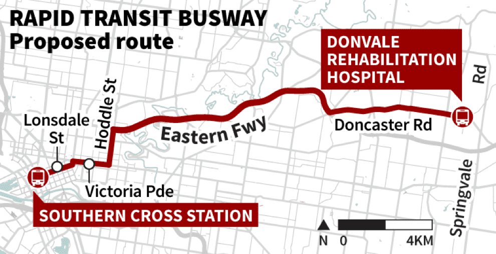
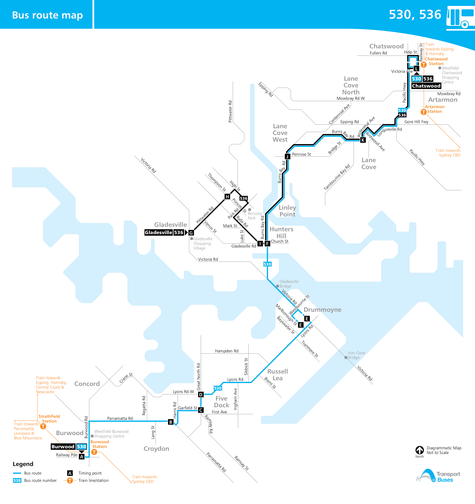

TABLE TALK

This issue is also available as an [ePub for book readers and tablets ](ttalk201707.epub) or a PDF  [exactly as printed 462kB ](http://cdnb.austta.org.au/tabletalk201707issue.pdf)

**AUSTRALASIAN TIMETABLE NEWS**

**No. 299, July 2017 ISSN 1038-3697, RRP \$4.95**

**Published by the Australian Timetable Association**

[**www.austta.org.au**](http://www.austta.org.au)

# **RAIL AND TRAM NEWS**

## **ARTC WTT 7 July 2017**

A new ARTC Working Timetable came into effect from 7 July. It can be
accessed at
<https://www.artc.com.au/customers/operations/mtp/2017-07-09/>

## **Aurizon future**

Aurizon is considering the sale of its intermodal business. The most
likely buyer is a consortium of Genesee & Wyoming and Macquarie Bank.
The sale might include Aurizon’s freight trains, wagons and terminals at
Enfield (Sydney), Dynon (Melbourne), Acacia Ridge (Brisbane) and
Forrestfield (Perth).

On 1 June Aurizon announced significant
reductions in staffing as “necessary to address varying demand in the
resources sector as well as changes to Aurizon’s operating footprint.”
The changes will be phased through to late 2018. There will be:

-   Staged closure of the Rockhampton rollingstock workshop by late 2018
    with a loss of 181 positions.
-   126 train crew positions phased out at Callemondah, Bluff, and
    Stanwell, and replaced with approximately 70 locally-based train
    crew contractor positions.
-   The reduction of approximately 62 permanent positions including
    train crew, freight operators and loaders at Mackay and Townsville,
    primarily as the result of the completion of Aurizon’s haulage
    contract with Wilmar Sugar in December 2017. The Mackay freight
    train crew depot will close.
-   Engagement of an additional 20 contractor train crew at the
    Coppabella depot in Central Queensland to meet increased customer
    demand on the Goonyella and Newlands Coal Systems.

## **Aurizon track diagrams**

Updated track diagrams of the Aurizon network are available on their
website. Go to
<http://www.aurizon.com.au/what-we-deliver/network/network-downloads>
and look for the heading “Reports & QCA”, then click on “Review of Rail
Transport Infrastructure and Line Diagrams – December 2016”.

## **Adani coal railway**

Part of the proposal by the Adani company to develop a giant coal mine
in the Carmichael Basin of Central Queensland is the construction of a
heavy haul railway from the mine to the port of Abbot Point, near Bowen.
Aurizon has, however, countered with a proposal for the new mine to be
connected instead to its existing Central Queensland coal network. This
is how the proposals compare, as far as is known:

                    **Adani**      **Aurizon**
  ----------------- -------------- ------------------------------
  Railway status    Stand alone    Add to existing network
  New kilometrage   388            190
  Gauge             Standard       Narrow
  Cost              \$2.5 b        \$1.25 b
  Ports served      Abbott Point   Abbott Point & Dalrymple Bay

## **Queensland Rail Citytrain reduces Sunday
services**

Queensland Rail will operate reduced train services on Sundays 25 June,
2 July and 9 July during the 2017 winter school holidays “to ensure full
service levels for weekdays and major events in June and July”. Services
will operate hourly on most lines, but half hourly on the Airport line
and two hourly services on the Sunshine Coast line. Additional services
will operate before and after sporting events.

## **Queensland Budget**

The Queensland Budget, delivered on 13 June, included funding of:

-   \$1.95 billion over the next three years, plus \$850 million already
    allocated, for commencement of the Brisbane Cross-River Rail from
    Dutton Park to Bowen Hills. This leaves \$2.5 b to be found from the
    Federal government or other sources. There will be new underground
    stations at Boggo Road, Woolloongabba, Albert St and Roma St, and
    upgraded stations at Dutton Park and the Exhibition Showgrounds.
-   \$233.5 million for Gold Coast Light Rail stage 2.
-   \$20.6 million towards the \$44.3 million upgrade of Central
    station.
-   \$23.5 million towards the \$131.5 million Coomera to Helensvale
    railway duplication.
-   \$16.9 million in 2017-18, and \$81.7 million in forward estimates,
    for North Coast line additional passing loops.
-   \$7.6 million towards the \$9.5 million Bromelton Interregional
    freight facility.

## **Gold Coast Light Rail**

The Gold Coast City Budget, presented on 19 June, included funding of:

-   \$20 million towards the completion of the Light Rail extension to
    Helensvale, and
-   \$5 million for planning of the Light Rail extension to Burleigh
    Heads.

## **Sydney Metro**

On 22 June the NSW government signed a \$28.1 billion contract for
construction of a second harbour rail crossing. The 15.5 km rail lines
beneath Sydney Harbour will form a crucial part of the planned \$20.8
billion, 66 km Metro rail route, running from the northwest, through the
CBD to Bankstown in the southwest.

## **NSW Budget**

The NSW Budget, presented on 20 June, included funding of:

-   \$2.1 billion this year (\$4.9 billion across four years) for Sydney
    Metro City and South West.
-   \$8.3 billion over four years for Sydney Metro Northwest.
-   \$658 million this year on 24 suburban trains, the purchase of which
    was [announced last
     une.](http://www.smh.com.au/nsw/nsw-state-budget-2016-1b-for-new-suburban-trains-for-sydney-rail-network-20160620-gpn80u.html)
    The total cost is estimated at \$1 billion, and their delivery is
   due to be completed by 2019.
-   \$252.8 million this year for new intercity trains.
-   \$268.6 this year for Automatic Train Protection (European Train
    Control System Level 1).
-   \$114.2 million this year for rail power supply upgrades.
-   \$102.6 million this year for the new rail operational centre at
    Alexandria.
-   \$1.8 billion over four years for the CBD and South East Light Rail.
-   \$25 million over four years for planning for Parramatta Light Rail.
-   \$206.1 million this year (\$313.4 million over four years) for
    Newcastle Light Rail
-   \$48 million this year for Central Walk, a new underground concourse
    at Central station.
-   \$200 million to improve access to public transport, commencing with
    upgrades at Beecroft, Casula, Como, Beverley Hills and Glenbrook.
-   More than 70 other accessibility projects, including upgrades to
    Leura, Toongabbie and Homebush stations, upgrades to Cockatoo
    Island, Abbotsford and Cabarita wharves, more car spaces at
    Ashfield, Merrylands, Pendle Hill and Penrith, and new
    Opal-activated bike sheds.
-   \$50 million for planning and delivery of freight rail
    infrastructure upgrades at key sites.
-   \$25 million for advance planning for a new fleet of diesel XPTs for
    regional services.
-   \$19 million for country rail investments including preservation of
    the Lower Hunter Freight Corridor and the Fixing Country Rail pilot
    program.

Bus and Ferry items are itemised below.

## **NSW TrainLink and Sydney Trains: Blue Mountains and Airport trains
-24 September timetable**

NSW Minister for Transport and Infrastructure Andrew Constance has
announced that – from an unspecified date, but presumably the next WTT
on 24 September – services between Sydney and the **Blue Mountains**
will be improved to deal with current overcrowding:

-   24 new express services between Sydney and the Blue Mountains on
    weekends;
-   Eight-car express tourist trains with around 10 minute cuts in
    travel times;
-   More than 25,000 additional seats every week, including an extra
    18,000 on weekends;
-   A new weekday Sydney – Lithgow return express service to increase
    capacity and improve journey times for connections to/from buses at
    Lithgow. The morning down train will connect with buses to Bathurst
    and Orange and the afternoon up with buses from Nyngan, Dubbo,
    Wellington, Molong, Orange, Lucknow and Bathurst.

In the near future, the Minister advised that capacity on six current
weekend Blue Mountains services will be increased from four to eight
carriages, providing more than 4,000 additional seats. A subsequent
Special Train Notice provided for weekend trains to be built up from 1
July to 20 August, from 9 September to 15 October, and from 4 November
to 25 November. At this stage, it is not known what is happening on the
weekends not covered by this STN.

It is believed that services on the **Airport** line will be improved
with 200 extra trains per week added at non-peak times, mainly on
weekends, when services will be doubled to about every seven and a half
minutes. There will also be an increase of late services on weeknights.
In 2014 there were 6.2m passenger journeys to and from Airport stations.
Since then, there has been an increase of a further one million journeys
to and from the Airport each year, and weekend patronage has grown
faster than weekday patronage.

## **Sydney Trains WTT 6 May**

Changes in the new Sydney Trains Working Timetable of 6 May 2017,
version 6.05, are all of a very minor nature. There are new timing
points at Berowra South Turnback and Eastwood South Turnback. From
23 January, Eveleigh Decant was renamed Eveleigh Engineering, and
Eveleigh Pres \[Presentation\] Centre renamed Eveleigh Oscar MC \[Outer
Suburban Carriages Maintenance Centre\].

## **Transport for NSW: Illawarra line**

Rail improvements between Wollongong and Sydney – including the
possibility of another line – have made the Infrastructure Australia’s
priority list – but in the “longer term” category - at least 10-15 years
away. The listing for the Wollongong rail upgrade mentions slow train
speeds of around 56 km/h and lengthy travel times as reasons the
improvements are needed.

## **Transport for NSW: Central station**

Contracts will be let in early 2018, to “revitalise” Central station
involving a 19-metre wide tunnel from Chalmers St to new, underground
metro platforms, easy access points to Sydney Trains platforms 16 to 23
and escalators to suburban platforms.

## **Sydney Metro**

Up to 12 rail stations may be built between Sydney's inner city and
Parramatta and Westmead under emerging plans for a Metro West train
line. These may incorporate overtaking lines to combine both express
trains between Parramatta and the central city, and trains stopping at
multiple new stations through Sydney's west and inner west. At present,
the NSW government has committed only to building stations at the Bays
Precinct around Rozelle and Olympic Park. At the other end, there is
speculation that the line may eventually be extended to south eastern
suburbs (but don’t hold your breath).

## **Sydney Metro draft timetable**

The draft Sydney Metro timetable referred to in the June *Table Talk*
was, in fact, an ATA Member-produced timetable, drawn up for analysis of
data provided in a booklet issued by Sydney Metro. It does not have
official status. Apologies for any misunderstanding.

## **Sydney Light Rail**

Some passengers have complained that crowding on Sydney's inner west
light rail line during peak travel periods is a "nightmare", despite the
introduction of an extra 90 weekly services last year on the 12.8-km
Central station - Dulwich Hill line. The number of passengers increased
by 59% to 9.73 million in the 12 months to June 2016. Patronage has
soared since a 5.6-km extension to Dulwich Hill opened in early 2014.
The line carried about 4 million passengers a year before the extension.

Transport for NSW said it would continue to monitor passenger numbers.
It said it put on an additional 107 services during off-peak periods on
weekdays and on Saturdays in January as part of a trial. The
introduction of extra services early last year led to trams running
every eight minutes during peak periods instead of every 10 minutes. The
afternoon peak was also extended by an hour to 1900.

## **Light Rail**

Email newsletter updates on progress with **Sydney** Light Rail
construction are available at
<http://sydneylightrail.transport.nsw.gov.au/>

Email newsletter updates on progress with **Canberra** Light Rail
construction are available at
<http://www.transport.act.gov.au/light-rail-network>

## **V/Line: Albury services**

Border Rail Action Group, BRAG, a NE Victoria lobby group, is advocating
operation of a standard gauge VLocity DMU providing services
Albury-Seymour and v.v., connecting at Seymour with existing broad-gauge
services to/from Melbourne, as an interim measure to improve services on
Victoria’s north-east line.

## **V/Line: Ararat services**

The Victorian government has announced a further nine new train services
every week for the Ararat line, on top of the 10 announced in May. There
will therefore be a total of 19 additional services each week from 27
August. The nine extra services include the extension of an existing
weekday afternoon Ballarat service to start in Ararat, and four new
weekend services. On Saturdays and Sundays, a new late morning service
will run from Ararat to Ballarat, and an early afternoon service from
Melbourne to Ballarat will be extended to Ararat. The earlier
announcement covered an extra weekday morning service from Ararat
connecting with a Melbourne train at Ballarat, and a weekday afternoon
service departing Southern Cross, extended to Ararat.

Timetables will be available for download from ptv.vic.gov.au in July.

## **Melbourne growth and Melbourne Metro**

Average weekday boardings on metropolitan trains are set to double from
750,000 to 1.5 million by 2031 according to the *Herald Sun* newspaper
(19 June). Melbourne’s population is expected to almost double from 4.4
million to 7.8 million by 2050. Rail patronage has soared from 150
million trips in 2005 to 233.3 million trips a year now — a jump of more
than 50%. Across the rail network, the number of people travelling into
the city in the morning peak (0700-0900) is expected to have grown by
90% by 2031 from 2011 figures.

While the City Loop has served the CBD well for more than 30 years,
Melbourne Metro Rail Authority chief Evan Tattersall said the time had
come for Melbourne’s rail network to expand to meet the ever-increasing
demand for public transport. Costing \$11 billion, the Melbourne Metro
Tunnel will add five new underground stations and 18km of new track into
an existing network of about 370km. “Melbourne is Australia’s fastest
growing city, but we can’t run more trains to and from the outer suburbs
because the City Loop is full,” Mr Tattersall said. “By taking some of
Melbourne’s busiest train lines through a new tunnel under the CBD, the
project will free up space in the City Loop. The result will be more
trains, more often, right across Melbourne, with a less crowded and more
reliable train network.”

The Metro Tunnel is expected to reduce crowding at the existing CBD
stations, with daily use at Flinders St station expected to be 257,000
people once Melbourne Metro is built, compared to 345,000 without it.
Similarly, daily passenger numbers at Southern Cross are expected to be
342,000, rather than 428,000.

To cater for the large growth in patronage, Metro Tunnel underground
station platforms will be extra-long — about 234m, or the length of two
soccer pitches. Sixty-five high-capacity trains will run through the
tunnel, capable of carrying up to 1300 passengers each. Passenger safety
will be enhanced with international style platform screen doors
installed in the five new underground stations, meaning faster boarding
and unboarding of passengers.

More than 40% of Melbourne’s population growth in the next 15 years is
expected to occur in greenfield residential developments in the north,
west and south-eastern growth corridors, significantly in Wyndham,
Casey, Melton and Hume.

By freeing up capacity in the City Loop, Mr Tattersall said the Metro
Tunnel would pave the way for future electrification, extension and
construction of rail lines across Melbourne. “Future projects such as a
rail line to Melbourne airport and the electrification of rail lines to
Melton will be one step closer because the Metro Tunnel will create more
space to run trains across the city. For the first time, Victorians will
have a train line to key destinations such as the St Kilda Road
employment precinct, the Shrine of Remembrance, the University of
Melbourne and world leading research and medical facilities at
Parkville.”

## **V/Line and Melbourne Metro: July disruptions**

As well as the usual range of weekend and evening closedowns / bus
substitutions, there will be bigger disruptions during the July school
holidays. Suburban trains will be suspended for civil engineering works
between Dandenong and Cranbourne from 6 to 14 July, and between
Dandenong and Pakenham from 8 to 14 July. V/Line Eastern line trains
will be replaced by buses 8-14 July between Southern Cross and Pakenham
for Traralgon trains, and for the entire journey for long distance
Bairnsdale trains.

Tram disruptions will also take place during this period – see the next
item.

## **Yarra Trams: Route 58 and other diversions**

Construction of new tracks along Toorak Road, South Yarra, to replace
the existing track via Park St and Domain Road, has been completed. This
deviation is to allow construction of Domain station for the Melbourne
Metro tunnel. Trams ceased using the former route after 128 years at
2200 on Friday 30 June. The new line will open on 12 July -the closure
period is during school holidays. A superstop is to be built near
Millswyn St and an elaborate junction in St Kilda Road, which will have
a third track for diverging trams. From 1 to 11 July there were no trams
between the Domain Road interchange and St Kilda Road/Commercial Road.
Buses filled the gap running all the way from St Kilda Road to Toorak
terminus. Other trams along busy St Kilda Road were replaced by buses
between stop 19 Shrine of Remembrance and stop 25 St Kilda
Road/Commercial Road, This significant new construction will actually
slightly reduce the size of the Melbourne tram network.

## **Taking to the air in Melbourne?**

Airshuttle Australia consortium has suggested driverless trains would
link Melbourne airport to the city and high-growth suburbs at Doncaster
and Monash. Supporters of the SkyLink RapidTransit proposal say the
technology could also be extended from the CBD to service “public
transport desert” suburbs and complement the existing tram and train
networks around Sunbury, Ringwood and Dandenong. Peter O’Brien, the head
of the consortium, is behind the \$1.5 billion push for super-fast rail
to the airport. Connecting Doncaster and Monash would bring the total
cost up to \$5 billion. Monash is the second-biggest employment centre
outside the CBD with more than 85,000 workers and 40,000 students. It is
projected to double to 170,000 workers over the next 30 years. He said
Monash was the main growth corridor in Victoria. “Doncaster is the other
big corridor. There are five cities out in the east without rail — and
they’ve been trying to get a train line for more than 100 years,” he
said. “We can do the airport link without doing Doncaster and Monash but
it’s not going to be as effective.

Infrastructure Victoria released a report last year that said a train to
the airport was needed in 15 years, but assumed the solution would be a
heavy rail link via the Albion East reservation. Costing up to \$5
billion to build, the trip would take up to 40 minutes — three times the
cost and time of the airshuttle. The number of airport users is expected
to grow to 60 million passengers a year by 2033. The airshuttle would
make the shortest trip between Southern Cross station and the airport
about 15 minutes. A one-way trip to or from the city would cost about
\$25. “We need to be carrying 12 million people a year on rail to and
from the airport in 10 years from now,” Mr O’Brien said. “In other
words, about 20% of the 60 million passengers visiting the airport each
year, with another 20% on buses.” To run trains at two-minute intervals,
Mr O’Brien said they would need to be automated.

Last month, the state government announced \$10 m in funding to examine
proposals for the best route for an airport rail link, its cost, and how
to deliver it.

## **New line to Port Adelaide**

A new – re-instated – 1 km railway will be built to Port Adelaide’s
commercial centre and the Dock One residential precinct, re-establishing
a connection after 36 years. The \$16.4 million project will lead to a
new railway station at Baker St, in the heart of the Port, the
Government announced in the SA Budget on 22 June. The new station will
be located on the doorstep of the Dock One waterfront redevelopment
which will include more than 750 new townhouses and apartments, a
refurbished Marine and Harbours building, and a waterfront boardwalk.
Construction will start in 2018. Since 1981, the railway has passed well
to the south of the town centre but the project will include
reconstruction and duplication of a spur line from the existing Outer
Harbor line at Grand Junction Road before the line crosses Port Road.

National Railway Museum executive officer Bob Sampson sad the new link
would be a “huge benefit” for Port Adelaide’s businesses, events and
local attractions. Port Adelaide Mayor Gary Johanson said he was “really
excited” because the project would open up the inner area of the Port.

## **South Australian Budget**

In addition to the preceding item, the SA Budget, presented on 22 June,
included funding of:

-   \$462.5 million for stage 2 of the Gawler line electrification from
    Salisbury to Gawler Central. However, this is contingent upon
    additional funding from the Federal government; and.
-   \$22 million to improve train services on the Gawler, Outer Harbor,
    Seaford and Belair lines. There will be a 30-minute frequency
    instead of 60 minutes during weeknights. Tonsley line peak services
    will run at a 20-minute frequency instead of 30 minutes.

## **Adelaide Metro: Oaklands upgrade**

The Federal government will provide \$95 million to upgrade the Oaklands
level crossing on the Seaford line in Adelaide’s south, in addition to
\$74.3 million from the SA government, and \$5 million from the City of
Marion. The railway will go underneath Diagonal Road and Oaklands
platforms will be extended to 160 metres for longer trains as patronage
continues to increase on the Seaford line. The project will start next
year, and is expected to take around 18 months to complete.

## **TransWA: AvonLink to continue**

TransWA’s AvonLink Northam to Midland train will continue, but at a
reduced frequency. On 1 June, Rita Saffioti, WA Minister for Transport;
said the service will revert to one return service per weekday following
an unsuccessful trial of a significantly expanded timetable. Poor
patronage, and a shortage of funding, has led the incoming state
government to end the trial of expanded services five months early. The
trial started in December 2014 and virtually trebled the number of
Midland-Toodyay-Northam trips. However, it only resulted in a small
increase in passengers while the average number of passengers per
service dropped. An average weekday AvonLink train was at 21% occupancy
before the trial but that figure has since dropped to 14% - an average
of 16 passengers per service on a train with a capacity of 116. From 1
July there will be return services running once a day from Monday to
Friday, which is the level the AvonLink ran at before the trial. There
will be no AvonLink weekend or special event train services.
MerredinLink services will revert to the pre-trial timetable offering
return services between Perth and Merredin on Mondays, Wednesdays and
Fridays.

**Thanks** to Tony Bailey, Dale Budd, Scott Ferris, Geoff Hassall,
Victor Isaacs, Geoff Lambert, Len Regan,
*[www.railexpress.com.au](http://www.railexpress.com.au),
[www.railpage.com.au](http://www.railpage.com.au), Railway Digest,
Transit Australia, Advertiser (*Adelaide), *Age, Australian,
Courier-Mail, Daily Telegraph, Financial Review, Gold Coast Bulletin,
Herald Sun,* and *Sydney Morning Herald* for Rail news.

# **BUS NEWS**

## **New South Wales**

### **Closure of [www.sydneybuses.info](http://www.sydneybuses.info)**

From 3 July, the **STA Sydney Buses** website ceased to exist and all
timetable information for their buses is only available in the new NSW
Transport Info format. Thus their full timetable PDF timetables no
longer be available online. The new NSW Transport Info format website is
not restricted to buses but also covers NSW trains, ferries and light
rail. In the case of light rail, ferries and some STA Metrobus routes,
this new website is the only website where timetable PDFs for such
routes are now available in this new format.

The Transport Shops at Wynyard, Queen Victoria Building and Railway
Square bus interchanges closed permanently from Friday 30 June.

***Hilaire Fraser*** *comments:* Although new State Transit bus timetables
effective 14 February 2017 and 4 June 2017 were not printed, the full
PDFs including route maps were found on the Sydney Buses website. The
PDFs found on the transportnsw website are split into separate routes so
one has to look up several timetables to find an appropriate service
along a common road. Taking as an example the Busways timetable for 67
Gosford to North Avoca and 68 Gosford to Wamberal, one has to search
separate 67 and 68 timetables to get trips to Terrigal which are common
to both routes. For route 67 there are separate timetable panes for
outbound terminating trips and Gosford returning trips with inbound
trips so once again the customer needs to do two searches. The 68
timetable is laid out in the same way, so the customer has to search two
timetables and four panes to find all Terrigal trips. For Forest Coach
Lines 195 Gordon to St Ives Chase there are four timetables to select
from, namely 195 Gordon to St Ives Chase. 195/6 Gordon to St Ives Chase/
Belrose, 195S1 school service St Ives Chase to Pymble station, 195S2
school service from Pymble station to Brigidine College via St Ives
Chase. Under Forest Coaches 196 Transportnsw TT combined St Ives Chase/
Belrose services are not mentioned. Not very seamless. From 1 July
[www.newcastlebuses.info](http://www.newcastlebuses.info) will also be
discontinued and integrated with transportnsw.info. From 1 July
Newcastle buses and ferries will be privately managed as Newcastle
Transport.

***Lourie Smit*** *comments:* When this new version was introduced a code
had to be entered for each timetable required – a route number for
buses, but for some trains and ferries the codes were virtually unknown,
making it difficult to find the timetables. After about six weeks they
reverted to separate input fields for each mode of transport - for buses
a route number, but for light rail, ferries and Sydney and Intercity
trains each route is displayed, so do not need codes. For regional
coaches and trains a code is still needed and this is still causing some
problems. This coincides with the demise of the Newcastle Buses arm of
the STA. It will be interesting to see if the new Newcastle Transport
website will contain timetable PDFs or whether it will also rely on
these new timetables.

***Geoff Hassall*** *comments:* On the recent long weekend, both an
experienced (myself) and an inexperienced timetable user had to resort
to the NSW Transport website for information regarding a Rail
Replacement bus service, and found it all but unintelligible. Not only
does one have to put up with ‘When do you want to travel?” and ‘Between
where and where?’ nonsense when you are looking for an overview of
options to choose from, but to put up with entering codes, as Lourie
points out above. To make matters worse, the codes exist only for the
duration of the trackwork, so there is no point in even a regular
traveller learning the relevant code (which bears no relation to the
route code of the train it is replacing). In other words, instead of
usefully displayed information (ie a timetable!) to base decisions on,
there is now no timetable information directly linked to the “Trackwork”
announcements at all!. It took us a good half-hour to untangle the pap
enough to find out the information once provided at a glance on a single
sheet of A4 paper or equivalent. Not only do they treat the general
public as idiots, they waste our valuable time chasing unnecessary
numbers through a myriad of poorly-labelled pages of guff.

### **New bus services**

Double decker buses will be re-introduced in Sydney. On 13 June NSW
Transport Minister Andrew Constance said, “We are replacing those bendy
buses with the double-deckers.". He was joined by Premier Gladys
Berejiklian to announce that the government would buy 176 new buses in
the 20 June NSW budget. 134 old buses will be replaced, and overall
fleet number boosted by 42. There will be more than 3300 additional
services for growth areas in Sydney and regions. Six double-decker buses
will replace bendy buses, bringing the total number of double-deckers on
Sydney roads to 44 by the end of 2017. There will be more than 1500
additional services for western Sydney, the Hills District and south
west Sydney with 11 new or extended routes, including an all-night
service from Parramatta to Macquarie Park. There will be more than 1600
additional services for metropolitan Sydney and extended or enhanced
all-night services

The following routes will have additional services: 195, 196 and 197
Mona Vale to Gordon and Macquarie Park via St Ives; 251 Lane Cove West
to City via Lane Cove; 270 Frenchs Forest District to City; 280
Chatswood to Warringah Mall via Frenchs Forest; 292 Marsfield and
Macquarie Park to City via Lane Cove; 324 and 325 Watsons Bay to
Edgecliff via Rose Bay; 352 Marrickville Metro to Bondi Junction via
Newtown and Surry Hills; 353 Eastgardens to Bondi Junction via Coogee;
370 Leichhardt to Coogee via Newtown and Green Square; 374, X74 Coogee
to City; 392, X92 Little Bay to City via Eastgardens and Kingsford; 418
Burwood to Bondi Junction via Sydenham and Mascot; 461 Burwood to City
via Parramatta Road; 504 Chiswick to City via Drummoyne; 506 Macquarie
Park and East Ryde to City via Drummoyne; 533, 534 Sydney Olympic Park
and Ryde to Chatswood via Wentworth Point and Mowbray Road; 914
Greenacre to Strathfield; M20 Zetland to Wynyard via Central station;
and M52 Parramatta to City via Victoria Road.

New, extended or enhanced all-night services will be introduced on the
following routes: 400 Burwood to Bondi Junction via Sydney Airport; 423
Kingsgrove to City via Earlwood and Newtown; N20 Riverwood to City via
Rockdale, Sydney Airport and Green Square; N81 Parramatta to City via
Sydney Olympic Park and Wentworth Point (Thursday-Saturday only); and
N91 Bondi Junction to Macquarie Park via Kings Cross, City and
Chatswood.

More than 1,500 additional services, including 11 new or extended routes
will be introduced in Western Sydney (including the Hills District and
South West) on routes: 632 Pennant Hills to Rouse Hill Town Centre via
Castle Hill and Norwest; 746 Riverstone to Rouse Hill Town Centre via
Box Hill; 747 Marsden Park to Rouse Hill Town Centre via Riverstone; 751
Blacktown to Rouse Hill Town Centre via Colebee and Marsden Park; 774 Mt
Druitt to Penrith via St Marys and Caddens; 840 Campbelltown to
Leppington via Gregory Hills and Oran Park; 853 and 854 Liverpool to
Edmondson Park via Carnes Hill; 859 Oran Park to Minto via Catherine
Field; 868 Edmondson Park to Ingleburn via Ingleburn Industrial Area;
and 896 Oran Park to Campbelltown via Harrington Park and Narellan.

Enhanced services will run on the following routes: 614X Crestwood to
City via M2; 711 Parramatta to Children's Hospital at Westmead; 817
Cabramatta to Fairfield via Bonnyrigg and Prairiewood; 887 Campbelltown
to Wollongong via Appin; M60 Hornsby to Parramatta via Castle Hill; M61
Castle Hill to City via M2; T80 Liverpool to Parramatta via Bonnyrigg
and Prairiewood.

New all-night services on route M54 Parramatta to Macquarie Park via
Carlingford.

Lower Hunter: Additional services will run on routes 130 Fingal Bay to
Newcastle via Nelson Bay and Anna Bay, 166 Cessnock and Kurri Kurri to
Stockland Green Hills via Maitland, 179 North Rothbury to Stockland
Green Hills via Maitland, 262 Cameron Park to Charlestown via Cardiff,
269 Toronto to Charlestown, 270 Toronto West to Wallsend via Stockland
Glendale and 275 Morisset to Toronto via Wangi Wangi.

Central Coast: More than 100 additional weekly services will be
introduced on the following routes: 36, 37 Gosford to Westfield Tuggerah
via Ourimbah, 47 Tuggerah to Ourimbah and 64 Woy Woy to Erina Fair via
Ettalong Beach and Kincumber.

Blue Mountains: More than 40 additional weekly services will run on the
following routes: 688, 689 Penrith to Emu Heights and Leonay and 692
Winmalee to Springwood.

Illawarra: Route 75 Calderwood and Tullimbar to Stockland Shellharbour
will be extended.

### **Northern Beaches Network Plan**

The new Northern Beaches Network plan is now available detailing
services which will operate following the introduction of the new B-Line
Service in late 2017.

-   New B-Line services will operate between Newport and the City,
    providing frequent services all day, every day, stopping only at
    Newport, Mona Vale, Warriewood, Narrabeen, Collaroy, Dee Why,
    Brookvale, Manly Vale, Spit Junction, Neutral Bay Junction and the
    City.
-   Route 199 will operate as a full time, all-stops service between
    Palm Beach and Manly via Avalon, Newport shops, Newport loop, Mona
    Vale, Narrabeen, Collaroy, Dee Why and Warringah Mall (Pittwater
    Road).
-   Routes E88 and E89 will have a modified stopping pattern, with
    services operating all stops to Narrabeen then stopping only at
    Neutral Bay Junction and the City. Additional route E88 services
    will be provided.
-   Route L90 will continue to operate during the weekday off-peak
    (0900-1500) and weekends (0700-2200), with a service frequency of 60
    minutes. For travel to the City outside of these times, passengers
    will have to catch route 199 and connect to B-Line services at
    Newport.
-   Routes 191 and 192 will operate every 30 minutes across the day.
-   New route E54 will operate between Mona Vale and Milsons Point via
    North Sydney, providing frequent services during weekday peak
    periods, stopping at Mona Vale, Warriewood, Narrabeen, Collaroy, Dee
    Why, Brookvale, Manly Vale, Spit Junction, Neutral Bay Junction, and
    then all stops to North Sydney and Milsons Point.
-   Routes 187 and L87 will no longer operate. For travel to North
    Sydney and Milsons Point, passengers will need to use B-line
    services or route 199 to Mona Vale, and connect to frequent route
    E54 to North Sydney and Milsons Point during weekday peak periods.
-   Route E87 will no longer operate. For travel to the City, passengers
    will have to catch B‑Line services at Newport, or routes E88 or E89
    at any bus stop along Barrenjoey Road.
-   Services via the Newport Loop will be provided by routes 199 and
    L90.
-   Route 156 will be modified to operate between McCarrs Creek and Mona
    Vale, with increased frequencies across the day. For travel to Dee
    Why, Warringah Mall or Manly, connect to all-stops route 199 at Mona
    Vale.
-   Route E86 will no longer operate. For travel to the City, use route
    156 and connect to B‑Line services at Mona Vale.
-   Route 155 will be modified to operate between Bayview Garden Village
    and Narrabeen only via Narrabeen Peninsula and no longer operate to
    Manly. For travel to Dee Why, Warringah Mall or Manly, connect to
    all-stops route 199 at Mona Vale or Narrabeen
-   Route 182 will be modified to operate via Samuel St, Parkland Road
    and Waratah St, replacing routes L85/185 in this area.
-   Route 185 will be modified to operate between Mona Vale and
    Warringah Mall (Pittwater Road) only. Route 185 in the Samuel St,
    Parkland Road and Waratah St area will be replaced by route 182
    which will be modified to operate in this area.
-   Route L85 no longer operates, replaced by all-stops route 185 to
    Warringah Mall (Pittwater Road). For travel to the City connect with
    B-line services at Narrabeen.
-   Routes 175, L78, 183, 184, E84, L84, L85, E86, 187, E87, L87 and L88
    will no longer operate, replaced by B-line services and routes E54
    and 199.
-   Route E85 will have a modified stopping pattern, with services
    operating all stops to Dee Why, then stopping only at Warringah Mall
    (Pittwater Road), Neutral Bay Junction and the City. Additional
    services will be provided.
-   Route E83 will have a modified stopping pattern, with services
    operating all stops to Dee Why, then stopping only at Warringah Mall
    (Pittwater Road), Neutral Bay Junction and the City. Additional
    route E83 services will be provided.
-   Route L80 to the City will be renumbered to route E80 and will
    operate all stops to Dee Why, then stopping only at Warringah Mall
    (Pittwater Road), Neutral Bay Junction and the City. Additional
    route E80 services will be provided.
-   New route 146 will operate between Wheeler Heights and Manly via Dee
    Why and Warringah Mall (Pittwater Road), replacing route 179 between
    Wheeler Heights and Warringah Mall.
-   Route 153 no longer operates. Alternative services to Dee Why and
    Warringah Mall will be provided by routes 146 and 178.
-   Route 179 no longer operates. New route 146 will replace route 179
    between Wheeler Heights and Warringah Mall. Travel to the City is
    possible by transfer to B-line services at Warringah Mall.
-   Route L60 will be renumbered to route E60, and will be altered to
    operate via Warringah Road through Narraweena and Beacon Hill. Route
    E60 will also be altered to operate via Boundary Road and Archer St
    in Chatswood. Additional services will be provided.
-   Route E69 has a modified stopping pattern, with services operating
    all stops to Avona Crescent, Seaforth then stopping only at Cremorne
    Junction, Neutral Bay (Watson St) and the City. Additional route E69
    services will be provided.
-   There will be no changes to routes 132, 135, 136, 137, 142, 143,
    144, 151, 158, 159, 169, 173, 178, 180, E41, E65, E66, E69, E76,
    E77, E78, E79, 188 and 248.
-   New route E75 operates between Warringah Mall (Pittwater Road) and
    the City, via Condamine St, Balgowlah Shops and Sydney Road. The
    service will operate all stops to Spit Junction then stopping only
    at Neutral Bay Junction and the City. Route E75 services will
    operate during weekday peak periods.
-   Route 145 no longer operates via North Seaforth.
-   Route 168 is modified to operate to Milsons Point only. Services to
    the City are still provided by route E68.
-   Route E68 has a modified stopping pattern, with services operating
    all stops to Spit Junction, and then stopping only at Neutral Bay
    Junction and the City. Additional route E68 services will be
    provided.
-   Route 130 (Pumpkin Bus) no longer operates. Late night services from
    Manly on Friday and Saturday nights are provided by additional
    services on routes 136, 142 and 169.
-   Route 131 no longer operates. Evening services to Balgowlah Heights,
    Seaforth and North Balgowlah are provided by route 132.
-   Route E36 no longer operates. Services to and from Manly to connect
    with the Manly Ferry are provided by routes 136 and 139.
-   Route 135 is extended to operate to and from North Fort Museum on
    all trips during the weekday off peak and weekend.
-   Route 140 no longer operates. Alternative travel between Manly and
    Macquarie Park is available by routes 143 and 144 to St Leonards,
    and connecting to other buses or trains.
-   Route E70 has a modified stopping pattern, with services operating
    all stops to Avona Crescent, Seaforth then stopping only at Cremorne
    Junction, Watson St and the City.
-   Route 171 no longer operates. Additional services are provided on
    route E71.
-   Route E71 has a modified stopping pattern, with services operating
    all stops to Spit Junction then stopping only at Neutral Bay
    Junction and the City. Additional route E71 services are provided.
-   Route E50 has a modified stopping pattern, with services operating
    all stops to Seaforth then stopping only at Watson St and then all
    stops from Miller St to Milsons Point.

Some bus timetables were amended from 26 June to accommodate ferry
timetable changes (see Ferry news below):

-   Route 466 Cabarita Wharf - Ashfield
-   Route 513 Meadowbank Wharf - Carlingford.

### **NSW Budget**

The NSW Budget, presented on 20 June, included funding of:

-   \$170 million this year (\$811.5 million over four years) for 132
    > buses to increase the size of the state's fleet, and another 314
    > to replace older vehicles.
-   \$201.5 million this year for bus infrastructure for the B-line.
-   \$301.4 million this year for new bus services.

Rail items are itemised above and Ferry items are itemised below.

### **Hillsbus**

On 19 May, the day after the Sydney bus strike (see June *Table Talk*,
page 10) at about 0630, 12 Hillsbus charter buses were seen proceeding
over Gladesvile Bridge. Apparently they had been sent to Abbotsford in
case the strike continued. Each displayed 438.

### **Transit Systems**

Following consultation on changes to local school bus routes, revised
services commenced on Tuesday 13 June:

801 (This is a normal route. This has a new timetable in Transport Info
but Transit Systems do not appear to have issued a new timetable), 9017,
9029, 9054, 9057, 9058, 9064, 9202, 9203, 9304, 9306, 9309, 9312, 9313,
9314, 9317, 9503, 9505, 9510, 9512, 9519, 9530, 9532, 9534, 9542, 9551,
9552, 9561, 9569, 9578, 9579, 9610, 9611, 9615, 9616, 9617, 9621, 9624,
9627, 9628, 9810, 9813, 9818, 9823, 9834.

### **Newcastle**

From Saturday 1 July, State Transit's Newcastle Buses and Ferries
services are operated by **Newcastle Transport**. Timetables and service
information are now available from transportnsw.info It appears that the
new Newcastle Transport website will have their own timetables.

### **On-demand buses**

**Newcastle**: A fleet of small- to medium-sized buses will run on
flexible routes and timetables throughout the city, changing drop-off
and pick-up points with an on-demand public transport system. Keolis
Downer, Australia’s largest private operator of public transport, will
begin the operation in July. Commuters will be able to make a phone
call, visit a website or use an app to order a bus to a “virtual bus
stop”.

**Dubbo** was the first place in NSW to get on-demand buses, with a
trial of a pre-booked transport pilot starting on 31 May. The trial
extends as far as Tottenham, a township of around 300 people, 140 km
away, giving it a public transport service for the first time in years.

## **Queensland**

### **Budget**

The Queensland Budget, delivered on 13 June, included funding of:

-   \$14.4 million to upgrade the Helensvale Bus Facility
-   \$16.6 million for eligible bus operators as part of the Queensland
    School Bus Upgrade Scheme, and
-   \$2.7 million for a Council bus safety review.

### **New Toowoomba network**

From 19 June Toowoomba’s Bus Services will be managed by Translink
rather than qconnect. The new network is:

-   901 Harlaxton to Uni of Southern Queensland (USQ) via City and
    Harristown
-   902 Glenvale to City
-   903 Mt Lofty to City
-   904 City to USQ via Centenary Heights
-   905 City to USQ and Westbrook via Kearney’s Spring
-   906 Airport Estate to Toowoomba Plaza (South Toowoomba)
-   907 Wilsonton to USQ via City and West St
-   950 City to Highfields and Crows Nest.

Rangeville continues to be serviced by the kan-go Hail n Ride service.
Route 3 is still used for the school service from City to Rangeville.

## **South Australia**

### **SA Budget**

The SA Budget, presented on 22 June, included funding of \$15 million to
build Park n Ride facilities at Klemzig and Tea Tree Plaza O-Bahn bus
stations.

## **Victoria**

### **Doncaster Busway proposal**

Transdev, operator of a third of Melbourne’s bus system, has proposed a
service with articulated buses running every three minutes between East
Doncaster and Southern Cross station. The premium bus service would be a
public-private partnership, mirroring Transdev operations in Nantes,
France, and Bogota, Colombia.

Senior ministers have been briefed on the proposal, including Treasurer
Tim Pallas and Public Transport Minister Jacinta Allan. Transdev and
infrastructure developer John Laing submitted the idea in May, using the
Department of Treasury's market-led proposal. It is estimated the
Doncaster-CBD busway would cost more than \$500 million to build, which
is 10 to 16% of the estimated \$3 billion - \$5 billion cost of building
Doncaster rail, a project Infrastructure Victoria assessed last year
would return just 10 cents for every dollar spent.

{width="6.693065398075241in"
height="3.4344214785651794in"}

Transdev wants to pave over the Eastern Freeway median – which has been
reserved for almost 50 years for a future Doncaster railway line – for
express buses. The buses would be double-articulated, with doors on both
sides like trains and trams, and big enough for 150 passengers. They
would run every three minutes in the peak and every five to six minutes
off-peak. Platform bus stops would have myki readers. New bus "stations"
would potentially be built at intersections above the Eastern Freeway,
at Chandler Highway, Burke Road and Bulleen Road. This would involve
building platforms with escalators and lifts down to road level. From
the Eastern Freeway the busway would join Hoddle St via a dedicated
ramp, then potentially follow Victoria Parade and Lonsdale St to a new
underground bus terminus at the northern end of Southern Cross station.
If the busway followed Lonsdale St, the trees and on-street car parks in
the median would be replaced by bus lanes and platform stops. Express
bus lanes would also be built in the centre of Doncaster Road, running
from the current park and ride bus terminus, which would be expanded
with a new underground car park, to a new bus terminus at Donvale
Hospital.

Modelling by engineering consultancy AECOM found the bus rapid transit
system would provide a reliable 30-minute journey between Doncaster and
Southern Cross station. Currently that journey takes 47 minutes, or more
in the peak due to inner-city traffic jams. AECOM forecast the service
would be used by 24,000 people in the combined morning and afternoon
peaks, roughly eight times more than use the current Doncaster bus
routes to the city. Transdev argues that its busway would be more like a
railway, with superior travel speeds and service consistency, than a
conventional bus route.

The busway would not preclude future construction of Doncaster rail in
the freeway median. The concept has already won the support of the
Eastern Transport Coalition, a group of seven eastern suburbs councils
pushing for better transport in Melbourne's east.

Transdev spokeswoman Kathy Lazanas said that the proposal put to
Treasury last month would evolve through consultation with the
community, should the Andrews government support it. "We will work with
the Victorian government through its well-established market-led
proposal process," Ms Lazanas said. The guidelines state all private
sector proposals put to the government must be unique.

### **Victorian Budget**

Funding initiatives in the 2017/2018 Victorian Budget benefiting bus
passengers include:

-   \$67 million to help fund new bus services in growth suburbs,
    targeted on the suburban electorates of Bentleigh, Frankston,
    Mordialloc, Narre Warren, Craigieburn, Sunbury and Broadmeadows.
-   \$2.1 million for extra peak hour bus services to Fishermans Bend on
    routes 235 and 237.
-   Additional services on route 401 between North Melbourne and
    University of Melbourne during Metro Tunnel construction in
    Parkville.
-   Continued funding for university shuttle services 301, 403 and 887,
    each introduced in February 2016.
-   \$13.7 million for interchange upgrades at Ballarat, Huntingdale and
    Werribee bus interchanges, along with additional parking at
    Ballarat, Montmorency and Cardinia Road stations.
-   Bus priority measures on Pascoe Vale Road, Broadmeadows.
-   \$193.2 million for four-year extension of Night Network, including
    all night trains, trams, Night Bus routes and Night Coaches to
    regional cities.

### **New Network for Warragul and Drouin**

The long-anticipated upgrade to town bus services in the West Gippsland
towns of Warragul and Drouin commenced on 14 May. The new network was
originally due to be implemented in 2010 following planning and
community engagement at the time but a lack of funding saw the plans
shelved by successive State governments until further consultation took
place mid last year. The Dineen Group has hired seven to eight new
drivers for their expanded Warragul Bus Lines operation.

The previous town bus offering in Warragul was extremely poor for an
increasing population that now exceeds 15,000. Former routes 1, 2 and 3
ran a mere three interpeak trips each between 0900 and 1430 on weekdays,
with route 4 operating just twice. General Manager of local operator
Warragul Bus Lines’ Philip Radford was highly critical of the old
network in local media in the past, stating new residents often
complained there was no buses and depot staff often having to field
phone calls that there was no return bus at the time a potential
passenger wanted to travel home.

Under the improved network hourly timetables are now provided, with a
longer span from 0600 to 1645 weekdays and for the first time, between
0900 and 1700 on weekends and public holidays. Unfortunately, it is
believed a funding shortfall resulted in services finishing well before
commuters return from jobs and study in Melbourne, the south-east
suburbs or Traralgon - on some routes, last buses depart town as early
as 1607 on weekdays, despite original plans for a 2000 finish.

Coverage across Warragul has been expanded considerably, with the
following routes now operating, each radiating from the station:

-   <u>Route 80 (Warragul South):</u> Travels in a loop via Howitt St,
    Fairview Village, West Gippsland Hospital, Landsborough St, King St,
    McMillian Drive, Lilleys Road and Burke St, providing better
    coverage to the south-west part of town, replacing former route 3
    and parts of route 4.
-   <u>Route 81 (Warragul North):</u> Circular service via Princes Way, La
    Trobe St, Sutton St, Bowen St (u-turning at Willow Cr), Sutton St
    and Brandy Creek Road. It replaces parts of former routes 1 and 4
    while providing new coverage to the top end of town along Bowen St.
-   <u>Route 82 (Warragul North):</u> Replacing most of former route 1, this
    route now serves more of the north-eastern parts of town, with buses
    now running along Stoddarts Road rather than the northern part of
    Normanby St. The revised route now incorporates the southern portion
    of Normanby St, catchment previously part of route 2.
-   <u>Route 83 (Warragul East):</u> Largely replacing former route 2, this
    route now features an eastern loop along Sutton St, Copeland St and
    Albert Road, however service has been removed along Stoffers St.

Each route travels via Warragul Shopping Centre after departing the
station and again before terminating back there, as does Route 85 to
Drouin (as below).

Nearby Drouin, 90 km east of Melbourne, previously held the title as the
largest centre in the state without a town bus service, with its
population more than doubling in the past 25 years, now nudging 10,000.
This unwanted title has now been lost with the addition of new routes 85
and 86, operating either side of the railway line.

#### Route 85 (Warragul – Drouin – Drouin South)

Route 85 is a dual-purpose route – other than supplementing the V/Line
train service between Warragul and Drouin, it provides access to the new
housing estates springing up in the 7.5 km corridor between both towns,
along with coverage to those living in Drouin South for the first time.

Route 85 supplements the existing “West Gippsland Transit” intertown
service, which parallels the rail corridor between Pakenham and
Traralgon. The timetable for the longer intertown service remains
unchanged and continues to operate to a quite erratic limited timetable
on weekdays and Saturday mornings.

(The intertown route incorporates various V/Line coach trips on the
Traralgon line, although at the time of writing, the full timetable has
incorrectly been deleted from the PTV website, and can only be found on
the Warragul Bus Lines website – this issue was still unresolved six
weeks into the new network!).

Passengers travelling between Warragul and Drouin on weekdays now have
access to 37 daily trips in either direction, consisting of:

-   19 V/Line train services
-   8 services on the intertown route (two operating locally Warragul to
    Drouin & 3 operating locally Drouin to Warragul)
-   10 services operating as the new route 85 service

On Thursdays the return Poowong East shopper bus provides a 38^th^
option, while a later train and Night Coach operates Friday evenings.

Upon arrival at Drouin station, route 85 travels a figure-eight path
south of the railway line along Drouin-Korumburra Road, Summerhill
Boulevard, Clifford Drive, Cook St, Lindman St, Drouin-Korumburra Road,
Lampard Road, Settlement Road, Church St and Porter Place before
returning to Warragul.

#### Route 86 Drouin North

A new bi-directional service, route 86, serves those living north of the
station and town centre. It operates via Hopetoun Road, Young St, Buln
Buln Road, Walker Drive, Hopetoun Rd, McNeilly Rd, Albert Rd, Armstrong
Avenue, Bennett St, Princes Way, Bloye St, Hearn St and Princes Way to
the terminus at Roberts Ct, adjacent to the El Paso Caravan Park on the
western outskirts of town, also the terminus for several trips on the
“West Gippsland Transit” intertown route described above. One oversight
though is the route fails to travel along Jacksons Drive, ignoring
residents moving into the growing Jacksons View estate. A revision of
the route to incorporate this housing development would be expected
within the next few years.

During consultation it was proposed that route 86 would travel into
Warragul, however ultimately trips have been confined locally. On
weekdays it is possible to transfer to the 85 when heading east,
although unfortunately the timetables don’t line-up for those heading
back from Warragul or on Saturdays. This is understandable as the out
and back travel time around Drouin for Route 86 is double that of route
85.

Further afield, the Noojee to Warragul bus, operating two return trips
on weekdays, maintains its existing timetable as a non-myki service, but
now operates as route 89 instead of route 5.

The Thursday return shopper bus from Poowong East to Warragul continues
to operate as an unnumbered non-myki service, but like the “West
Gippsland Transit” intertown route, the timetable has also been
incorrectly removed from the PTV website.

In conjunction with the new network, the familiar orange PTV signage has
finally rolled out along each route. As is often the case when new
routes are introduced, some homeowners grumbled to the local paper and
local members of parliament about having stops elected outside their
homes, which will include a concrete handstand area and tactiles at a
later stage.

### **Shepp Transit sold**

Yet another regional acquisition by the Dyson Group sees the purchase of
Fallon’s “Shepp Transit” operation, with takeover on 1 June, including
44 vehicles, the town bus network in Shepparton and various regional
V/Line and PTV to nearby major centres such Seymour, Moama and Bendigo.
The Fallons Group continue to operate across north-east Victoria from
their other operations radiating from Beechworth, Alexandra, Cobram,
Falls Creek, Wangaratta and Yea.

Also effective 1 June Dysons operate the Mallacoota – Genoa V/Line
connector, formerly operated by Mallacotta Explorer Tours. This bus
meets the Sapphire Coast V/Line coaches running between Bairnsdale,
Narooma and Batemans Bay. Dysons have also taken over a school run
between Kinglake and Whittlesea Secondary College from local operator
Latham’s, a service that parallels their limited route 384 service.

Earlier Dysons acquisitions this year have included O’Connell’s, who had
a handful of runs serving Omeo, Mount Hotham and Bright; and part of the
Houlahans’ school bus business in Axe Creek near Bendigo.

### **Greensborough – Hurstbridge Link begins**

As part of the as part of the Hurstbridge line upgrade funded in the
2016/2017 state budget, a new parallel bus service, route 343, was
introduced on 19 June. The service, operated by the Dineen Group’s
Panorama operation, was initially designed to provide residents of the
outer suburb Diamond Creek and the townships Wattle Glen and Hurstbridge
additional public transport links, which are not achievable due to the
current single track (with passing loops) beyond Greensborough.
Operating weekdays only, route 343 departs at 20 minute intervals during
the peaks and every 40 minutes interpeak. The PM peak is followed by 40
and 70 minute gaps with the last departure leaving Greensborough at
2056.

The route travels via St Helena following community consultation last
year that saw 51% of 840 respondents preferring this option, with better
access to local community facilities, than a quicker option along
Diamond Creek Road, as originally intended. Unfortunately, the longer
route and runtime has botched the interpeak timetable – while buses
towards Hurstbridge are off-set with the trains (providing an average 20
minute headway), return trips towards Greensborough merely meet City
trains originating from Hurstbridge. This is unavoidable without
horribly long layovers – had the trip been slightly faster, it would be
possible to off-set trips in both directions. At the Greensborough end,
buses operate via the Greensborough Plaza stop on Main St before
terminating back at the station – this is different to operation of
Dysons’ 385 and 518 services, which layover at near the station when
arriving from the north before looping past the plaza.

Other aspects of the Hurstbridge line upgrade underway include grade
separations at Grange Road, Alphington and Lower Plenty Road, Rosanna, a
new evaluated station at Rosanna plus the long overdue duplication of
the single track between Heidelberg and Rosanna.

### **New route 605 routing and timetable released**

As reported in the May *Table Talk,* effective 25 June route 605 travels
into the Melbourne CBD via Anderson St, Domain Road, Birdwood Avenue
(beside the Royal Botanic Gardens), Southbank Boulevard, Queens Bridge,
Queen St, La Trobe St and William St to terminate adjacent to Flagstaff
station, before heading along Lonsdale St, Queen St and the reverse back
to Alexandra Avenue. The City Loop route, as introduced in November 1999
following the closure of Batman Avenue, will cease. The route change
will compensate for the removal of route 58 trams along Domain Road from
August as part of major constriction works for the Metro Tunnel.

Owing to the ongoing congestion, due to the current widening of Swan St
bridge, an interim route change took effect on 10 May, with inbound
trips travelling via Burton Avenue and Wellington Parade, bypassing the
Melbourne Park precinct. On MCG event days when Burton Avenue is closed,
buses continue north on Punt Road to Wellington Parade.

The new timetable from 25 June shows the existing frequency and trip
count maintained, with 15 – 20 minute peak headways, 20 minutes
interpeak, 40 – 45 minute Saturday morning and 85 minute intervals gaps
Saturday afternoons and Sundays. Span is also unchanged, most noticeable
on Sundays, with the first departure ex Gardenvale remaining at 1015 and
ex Flagstaff at 1112.

Runtimes have been adjusted for the new route, however this leads to
significant layovers at Gardenvale, particularly inefficient on
weekends.

The previously non-uniform public holiday pattern (Sunday timetable with
no service on Good Friday or Christmas Day) has been corrected, with
buses now running the standard Saturday timetable other than Good Friday
and Christmas Day when the Sunday timetable now applies. Additionally,
all trips now operate 52 weeks a year – route 605 was among the last
routes to have peak hour reductions for the four weeks after Christmas.

### **Route 305 AM peak amendments**

Previously unreported was a new timetable for Transdev route 305 (City –
The Pines) introduced on 31 October 2016, with amendments during the AM
peak. The changes coincided with roster changes following the closure of
temporary depot in North Melbourne, with refurbishment works at
Doncaster and North Fitzroy complete. The online timetable has been
updated but a revised printed timetable has yet to be sighted.

### **Revised tram connections for route 732**

Coinciding with the new timetable for route 75 trams implemented on 1
May, Ventura updated the timetable for route 732 (Box Hill – Upper
Ferntree Gully) to maintain Knox Transit Link connections between
Vermont South and Knox City. Attempts to obtain an updated printed
timetable indicated one had yet to be issued six weeks after the change
took place.

### **New St Albans interchange opens**

A new train–bus interchange at St Albans finally opened adjacent to St
Albans Road on 4 June, six months after the opening of the new
grade-separated station. The interchange replaces the rudimentary
facilities that previously existed in Alfredia St for routes 408, 418,
419 and 421. The old stop locations were a five minute walk from the
station and had featured bus stops in the centre of the road! Route 425
has also relocated to the new interchange, leaving only routes 423 and
424 departing on the west side of the station in West Esplanade. Along
with the new interchange, minor alterations were made to the peak
timetable for route 418 to/from Caroline Springs.

### **Better access to Broadmeadows Shops on 477**

Passengers using Tullamarine Bus Lines route 477 between Broadmeadows,
Gladstone Park, Airport West and Moonee Ponds have improved access to
Broadmeadows Shopping Centre from 18 June, with trips towards Moonee
Ponds now operating past the shopping centre. Traditionally, passengers
would catch the bus at Broadmeadows Shopping Centre on trip arriving
from Moonee Ponds, which would then form the return trip within a few
minutes of arriving the station. This setup also applies to routes 532
and 541. This setup was unintentionally broken in June 2015 when a more
frequent interpeak timetable improved the headway from 30 to 20 minutes
but introduced 19 minute layovers at the station.

### **Monash University shuttle updates**

In a win for Monash University students living on the Mornington
Peninsula, the state government has announced recurrent funding for the
route 887 service, following a successful trial in 2016, which was later
extended to cover the first semester this year.

In 2012 the Labor Commonwealth Government funded a \$1.5M trial of a
free student shuttle buses between Rosebud and Monash University’s
Peninsula and Clayton campuses, marketed as PenBus. After funding dried
up at the end of June 2015, the service continued with support from the
local shire council, with students charged a \$3 fare each way. The
State government subsequently introduced a new two-hourly Route 887
limited stop service during university semesters in February 2016,
operating between Rosebud and Monash University’s Peninsula Campus,
timed to meet the intercampus bus funded by the university, which also
operated once every two hours.

A consequence however was a reduction in both in span and frequency of
services between Monash’s Peninsula and Clayton campus, as PenBus was
previously off-set with the university shuttle. This included the
removal of trips that suited 0800 classes at the Clayton campus along
with 1800 finishes. After continued lobbying by students and local
Liberal state MP Martin Dixon, this issue was finally rectified after
almost three semesters on 5 June. Students can now catch a Route 887
departing Rosebud at 0557, which connects with an intercampus shuttle
departing Peninsula Campus at 0700. Each afternoon there is now a later
intercampus bus from Clayton Campus at 1805, meet by a Rosebud-bound
Route 887 service at 1906.

In addition to the expanded semester timetable, the university is
trialing a return bus over the winter break from 25 June to 14 July,
departing Peninsula Campus at 0700 and returning from Clayton Campus at
1700. A reduced hourly timetable also applies between Monash’s Clayton
and Caulfield campuses during this period (this timetable also operates
for three weeks either side of the official academic year).

### **Route 301 to stay**

In addition to the State government announcements that route 887 was now
permanent (see above), La Trobe University students, staff and even
Vice-Chancellor Professor John Dewar are all celebrating after the news
that the route 301 express shuttle will be made permanent after a
successful 18-month trial. During the 2016 academic year the service
carried more than 280,000 students, or around 2,00 boardings a day
during teaching weeks, not factoring in those who opted to catch the
parallel Route 561 (Macleod – Pascoe Vale) all-stops service instead.

### **Route 833 onto Carrum**

PTV has announced that effective 27 August, services on Ventura’s route
833 between Frankston and Carrum Downs will be extended west to Carrum
through Sandhurst and Patterson Lakes, along Thompson Road and McLeod
Road. For the first time, residents of Carrum Downs will no longer have
to backtrack south to Kananook or Frankston to access train services, a
long-standing issue. The current half-hourly weekday and hourly weekend
timetable will be maintained.

### **Melbourne Visitor Shuttle to end**

At their May meeting Melbourne City Council councillors voted to
withdraw funding for the Melbourne City Visitor shuttle, with services
to conclude at the end of August, citing dramatic falls in patronage.
The service, which commenced in February 2006, ahead of the Commonwealth
Games, was initially operated by Ventura from their then Nationalbus
depot in North Fitzroy. Driver Bus Lines were successful in winning a
longer three-year contract from September 2007 when the service was
retendered – the service being an ideal pairing with Driver’s regional
Grayline sightseeing day tours. The contract was subsequently extended
to 2012 and then 2017. The service was funded by a CBD carpark
congestion levy introduced by the State government in 2005, and was free
during its early years, which often led to overcrowding on its half-hour
timetable. In recent years however, annual patronage has free-fallen
from 330,000 journeys in 2014 to a petty 43,000 last year, due to a
range of factors. At start of 2013 a \$5 fare was introduced, making up
for a \$500,000 shortfall in operating costs after the levy contribution
was capped at \$800,000 in 2009. This \$5 fare was later replaced with a
\$10 two-day ticket in July 2015. Private operator City Sightseeing
introduced their own tourist loop service in May 2013, operated using
semi-open top double-decker vehicles, fragmenting the potential tourist
market, despite charging premium fares of \$35 for 24 hours or \$45 for
48 hours. The addition of the free tram zone in 2015 was the final nail
in the coffin for the once popular service.

With the closure of the route sees the end of another era for Driver, as
they will no longer operate a traditional “hop-on, hop off” passenger
service in any form, the legacy the company was formed upon in 1931.
This follows the previous sale of the main route operation to CDC
Victoria in July 2013. They will continue to operate school buses across
Melbourne’s east, south-east and Mornington Peninsula, preform charter
work and operate the popular Gray Line sightseeing tours.

### **Frankston works delays**

The \$13M redevelopment of the Frankston station bus interchange on
Young St is running significantly behind schedule, with works not due to
finish as late as until October, failing to be completed in May as
planned. The works, which commenced on 6 November, have moved bus stops
up to 7 minutes walk from the station, with buses currently departing
three dispersed locations in Beach St, Young St and Fletcher Road that
are also several minutes walk apart from each other. As timetables have
not been adjusted, in some case passengers are forced to catch an
earlier train to maintain for connections. In May the *Frankston Times*
reported the delays have been caused by unexpected complications with
moving underground electrical cables and the discovery of asbestos in
Telstra pits.

### **Parkville proposals for Metro Tunnel works**

Constriction of the new Metro Tunnel station at Parkville from the end
of 2017 will see Grattan St closed to traffic adjacent to University of
Melbourne for a five-year period. During May and early June, the newly
formed Transport for Victoria undertook public consultation on likely
route changes affecting bus services serving the hospital and university
precinct.

It is proposed routes 401, 402, 403, 505 and 546 largely relocate to
Pelham St, about 200m south of the University. To facilitate the new
stop location, it’s likely trips on express Routes 401 & 403 would now
operate as a loop, only picking up outside Royal Melbourne Hospital when
travelling east, before departing new University terminus using
Leicester St and Queensberry St.

Route 402 services towards Footscray will deviate via Bouverie St,
Queensberry St and Royal Parade, with the nearest alternative stops up
to a 500m away.

### **Ventura Capel Sound Depot**

The Mornington Peninsula suburb of Rosebud West was officially renamed
Capel Sound in September 2016, removing a stigma some residents felt the
old name held. 56% of residents supported the name change. Ventura has
embraced the new name over recent months, and now refers to the local
bus depot as the Capel Sound depot rather than Rosebud depot. Prior to
2012, this depot was operated as the Portsea Passenger Service
subsidiary of Grenda Corporation. At time of writing, both PTV and
Google Maps still refer to the old suburb name in online maps and stop
information.

### **New Local Area Maps**

PTV have uploaded updated Local Area Maps effective May 2017 to their
website for Boroondara, Hume, Melbourne, Moonee Valley, Moreland, Port
Phillip and Stonnington, each documenting the introduction of the route
58 (West Coburg – Toorak) tram and extension of route 6 tram to
Moreland. New maps for Banyule, Darebin and Yarra have yet to surface. A
June 2017 map has been issued for Brimbank to mark the opening of the
new St Albans station interchange (see above) but fails to show Ginifer
station relocating south-west and associated minor route changes to
route 423 (St Albans – Brimbank Central). Following the introduction of
route 343 (see above), June 2017 maps appeared for Banyule and
Nillumbik, but not yet for Manningham or Whittlesea, two maps which also
show Greesnborough and surrounds.

### **Transdev (un)reliability figures revealed**

In late April both the *Age* and *Nine News* reported data obtained
under Freedom of Information concerning the reliability of Transdev’s
route services across Melbourne. The data, which has never been revealed
publicly, showed that about one in five Transdev buses ran more than
five minutes late during 2016 and that Transdev “has never met its
contractual monthly punctuality target”. The bus operator is responsible
for a third of Melbourne's bus network.

Transdev’s overall on-time performance of 80.7% is significantly lower
than Metro Trains and V/Line with just 14 of their 46 routes meeting the
overall 85% punctuality target required by their contract, although
somewhat on-par with Yarra Trams. Since timetable changes made in June
2016, the operation has been liable for fines for poor performance under
the 85% threshold. The tougher 90% benchmark originally proposed for the
contract has all but been abandoned by PTV and the state government.

Not surprisingly the three orbital routes all failed to meet punctuality
standards, nor their City – Doncaster area routes. The worst performing
route was the cross town route 220 (Sunshine – Gardenvale), with a third
(67.9%) of trips behind schedule, despite attempts to increase runtimes
over the impossible timetables of former operator Melbourne Bus Link.
Other poor performers were similar cross-town pair 216 and 219 (both
around 70%), 246 along Punt Road (72.5%) and the 901 orbital SmartBus
between Frankston & Melbourne Airport (73.3%)

Furthermore it was revealed that instead of increasing passenger numbers
5% a year, patronage has fallen significantly on many of its routes –
loadings on orbital route 903 (Mordialloc – Altona) alone have dropped
from 6.03 million to 5.18 million in little over 18 months.

In addition to failing to meet key performance benchmarks in its
contract, their new Greenfields bus network, with redrawn routes and
timetables, was blocked by the State government due to various cuts
foreshadowed, particularly along orbital SmartBus network in Melbourne’s
north and west.

## **Western Australia**

**TransPerth:** The Charles St bus bridge and busway opened in late
June, speeding up Northern Suburbs services. The \$32.1 million project
saw the construction of a 120 metre bridge over the Graham Farmer
Freeway, the creation of a new freeway off-ramp into Northbridge and 500
metres of new bus lanes on Charles St.

All routes along Charles, Loftus and Newcastle Streets have improved
journey times as a result of the opening of the bus bridge and
associated priority lanes. Loftus St routes 402, 403 and 404 are most
affected. In addition changes have been made to routes 15, 370, 384,
385, 386, 387, 388, 389, 970 and 990 also undergoing changes. In
addition, changes will occur to routes 81, 82, 83, 84, 85, 340, 341,
342, 343, 345, 349, 365, 372, 376, 377, 378, 379, 390, 450 and 461 as
part of Transperth's regular network updates.

## **Britain**

***Gerald Knight*** *writes:* **Transport for London** have stopped
printing their London area bus maps, the last edition being March 2016.
TfL state there is no demand for them, but they were increasingly
difficult to obtain in the first place. You could always get them at
London Council Tourist Information offices, but due to budget cuts these
have been closed over the years. The only other locations you could get
them was bus station offices, but the counters were rarely open to the
public, so it's no wonder there was no demand for them piled up in a
back office somewhere. TfL point you to the internet, saying you can
print them off, but the information when printed is so small it makes it
unreadable, and it's just the map with no index of where the routes
run*. Ironically, ATA Member Michael Marshall was in UK last month and
managed to obtain four sets of these guides. They are included in the
June 2017 ATA Distribution List.*

**Thanks** to Jason Blackman, Geoff Foster, Hilaire Fraser, Matthew
Gibbins, Craig Halsall, Victor Isaacs, Ben Knight, Gerald Knight,
Richard Peck, David Rae, Hayden Ramsdale, Lourie Smit, various
contributors on *Australian Transport Discussion Board* and the *Age,
Daily Telegraph, Sydney Morning Herald* for Bus news.

# **AIR NEWS**

## **International**

In 2016, major international airlines had the following **shares of
traffic** to/from Australia: Qantas 15.6%, Singapore Airlines 9.5%,
Emirates 8.8%, Jetstar 8.1%, Air New Zealand 6.8%, Japan Airlines 6.3%,
Cathay Pacific 4.9%, Virgin Australia 3.9%, United Airlines 3.1%, China
Southern 2.9%.

**Melbourne** is currently experiencing a boom in new international
flights. Over the coming months, almost a dozen new airlines will add
flights to Melbourne. In addition to several new routes to China, new
services include [Melbourne to Tokyo Narita on Japan
Airlines](http://www.australianfrequentflyer.com.au/community/travel-news/japan-airlines-begin-mel-nrt-83079.html)
from 1 September, [Melbourne to Colombo on Sri Lankan
Airlines](http://www.australianfrequentflyer.com.au/community/open-discussion/ul-is-coming-to-melbourne-82632.html),
[Melbourne to Vancouver on Air
Canada](http://www.australianfrequentflyer.com.au/community/travel-news/air-canada-launch-seasonal-mel-82651.html)
from 1 December, and [Melbourne to Santiago de Chile on LATAM
Airlines](http://www.australianfrequentflyer.com.au/community/travel-news/latam-to-fly-mel-scl-79725.html)
from 1 October.

**Malaysia Airlines** has cancelled its direct Darwin-Kuala Lumpur
service.

**Hainan Airways** will start a twice-weekly service between Brisbane
and Shenzhen from September.

## **Domestic**

**Qantas** will replace Boeing 737 aircraft between Melbourne, Sydney
and Brisbane on about 20 weekend flights with smaller Boeing 717s of
subsidiary QantasLink from 5 August. This, it is claimed, will reduce
operating costs and 'right-size' the weekend fleet on these routes,
which see lower passenger numbers compared to weekdays. B717s carry 110
passengers – including 12 in business class – compared to 174 on B737s.

Commercial passenger flights could operate from **Albion Park airport**
as early as October, according to Shellharbour mayor Marianne Saliba,
with possible flights to Brisbane and Melbourne. Qantas operated
Illawarra-Melbourne flights from June 2005 to July 2008. According to
the council, the airport’s catchment area now has a population base of
about 300,000 people.

**JetGo** Melbourne-Port Macquarie service, which commenced in
mid-November 2016, will cease from 16 July 2017. From 29 June JetGo will
commence flights Gold Coast-Albury on Thursdays, returning on Sundays,
to tap ski traffic. From 21 July JetGo will commence flights Melbourne
Hervey Bay and Brisbane-Hervey Bay.

**Virgin Australia** will cease flying Brisbane-Port Macquarie from 17
November, but the service will continue, by **Alliance Airlines.**

**Thanks** to Tony Bailey, Paul Brown, Tris Tottenham, *Illawarra
Mercury, NT News* and *Australian* for Air news.

# **FERRY NEWS**

## **Sydney Ferries**

Over 30 extra trips per week were added to F3 Parramatta River services
from Monday 26 June, including additional weekday morning and afternoon
peak services and later services on Sundays. This will allow for greater
capacity during periods of peak demand. On Sundays, services will run
until approximately 2130 instead of services ending at 1900. There were
also minor timetable changes on F3 Parramatta River and F4 Darling
Harbour ferry services. Some bus timetables were amended to accommodate
these ferry timetable changes – see Bus news above. F3 Parramatta River
and F4 Darling Harbour services stop at the new Barangaroo Wharf instead
of King St Wharf from Monday 26 June.

## **NSW Budget**

The NSW Budget, presented on 20 June, included funding of:

-   \$51.6 million for ferry fleet replacement.
-   \$25 million for Parramatta River new services, and
-   \$3.3 million for Barangaroo ferry wharf.

Rail and Bus items are itemised above.

**Thanks** to Paul Brown, Victor Isaacs and Lourie Smit for Ferry news.

{width="7.428725940507436in"
height="7.870928477690288in"}

***Table Talk*** is published monthly by the Australian Timetable
Association Inc. (Registration No. A0043673H) as a journal of record
covering recent timetable news items. The ATA also publishes the
***Times*** covering timetable history and analysis. Contributions are
invited and are very welcome. Please send these to the appropriate
Editor. ABN 74248483468.

The **deadline** **for *Table Talk*** is the second last weekend of the
month, but contributions are welcome at all times.

**Editor, Rail and Tram, Air, Ferry:** Victor Isaacs,
***tabletalk@austta.org.au*** 11 Blacket St Downer ACT 2602.

**Editor,** **Bus**: As an interim arrangement, please send your Bus
news to ***tabletalk@austta.org.au***

**Production and Mailout**: Geoff and Judy Lambert.

**Proofreaders:** Agnes Boskovitz, David Cranney and Geoff Hassall.

Original material appearing in ***Table Talk*** may be reproduced in
other publications but acknowledgement is required.

**Membership of the Australian Timetable Association** includes monthly
copies of the *Times*, *Table Talk*, the Distribution List of
timetables, and Auction catalogues. The membership fee is \$60 (Adult)
and \$36 (Junior) pa. Membership enquiries should be directed to the
Membership Officer, Len Regan, at ***treasurer@austta.org.au***

Back issues of ***Table Talk*** are available on the Australian
Timetable Association’s website, ***austta.org.au,*** after two months.

**Table Talk Newswire** is an advance monthly email of Rail news. To
obtain this, contact the Rail Editor.
