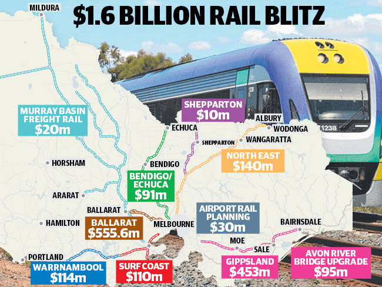
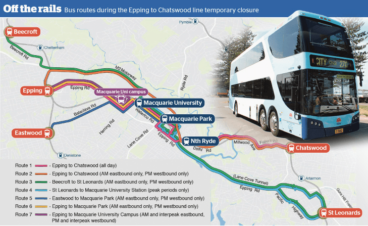
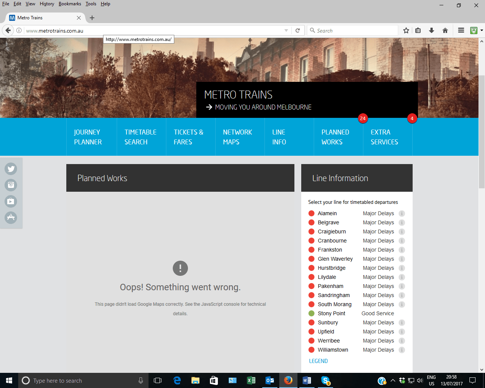
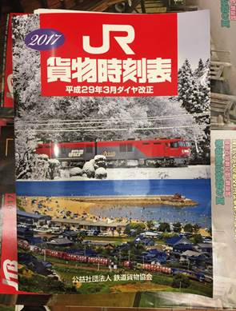

TABLE TALK

This issue is also available as an [ePub for book readers and tablets ](ttalk201708.epub) or a PDF  [exactly as printed 928kB ](http://cdn.timetable.org.au/tabletalk201708issue.pdf)

**AUSTRALASIAN TIMETABLE NEWS**

**No. 300, August 2017 ISSN 1038-3697, RRP \$4.95**

**Published by the Australian Timetable Association**

[**www.austta.org.au**](http://www.timetable.org.au)

# **TOP TABLE TALK: VICTORIAN PROJECTS**

## **Melbourne Airport railway**

The Federal government is willing to explore all options to commence
construction of a railway to Melbourne Airport. It is reported to be
keen for the railway to run through the former defence site at
Maribyrnong --- a 127 ha precinct that could fit up to 6000 new homes.
This route could link Footscray with Tullamarine, with a direct track
through the new suburb also servicing Highpoint shopping centre. Prime
Minister Malcolm Turnbull sees the multi-billion-dollar airport link as
a high priority and is keen to explore all viable funding options. These
could include outright federal ownership of the project. The
Commonwealth has committed \$30 million to develop a business case.
Private sector proposals will also be considered, with a strong emphasis
to be put on servicing growth areas and recovering some of the value the
project would generate for private landowners.

Prime Minister Turnbull says the Federal government will invest in a
viable project that delivers taxpayer value. "The Commonwealth isn't
just an ATM, we want to be a partner in infrastructure. All the world's
great cities have a rail link to the airport. Melbourne should be no
different, if the business case stacks up."

Mr Turnbull also pointed to the latest census figures, released
yesterday, showing Melbourne would soon be the nation's biggest city.

The Victorian government said in April it would look at opportunities to
save money and deliver the Tullamarine rail link sooner through private
sector proposals.

Federal Infrastructure and Transport Minister Darren Chester said
planning needed to start "as soon as possible. We need to work out
first, what's the question we're trying to answer? Is it just about a
rail link for the airport or is it to provide another function in terms
of linking the outer suburbs as well?" Mr Chester told the ABC.

Opposition Leader Bill Shorten has also flagged his interest in the
project this year, saying he wanted to work with Mr Turnbull to "look at
possible paths" for the rail line.

A \$5 billion private plan for a light rail line using driverless trains
to connect the city to the airport, Doncaster and Monash University is
also likely to be considered. The technology could then be expanded to
Sunbury, Ringwood and Dandenong.

Melbourne Airport has said a train connection would be required within
15 years, with Tullamarine expected to be catering for 64 million
passengers pa in that time, 30% more than predicted by Infrastructure
Victoria. The Airport argues this surge will increase traffic on the
Tullamarine Freeway by 50% and cause "untenable delays".

The *Herald Sun* reported last year that super fund giant IFM Investors,
which owns 23.67% of the airport, was interested in investing in the
rail link. IFM also owns Southern Cross station, the most likely
connection point for trains to and from the airport The pensions giant
is closely monitoring which infrastructure projects it can invest in,
with chief executive Brett Himbury even dining with US Vice-President
Mike Pence recently to discuss the Trump administration's planned \$1
trillion infrastructure blitz.

Acting Premier James Merlino subsequently said the "important project"
is being analysed in "partnership" with the Commonwealth. He said the
State government was working alongside its Federal counterparts on a
\$30 million study to determine the best route for the train to
Tullamarine, as well as the cost and "the best way to fund it".

## **Melbourne Metro congestion**

Metro Trains has warned the Victorian government that three of
Melbourne\'s rail lines have breached capacity at peak hour, with three
others to follow within the next two years. The crowd crushes and heavy
disruption experienced during the morning peak on the Sunbury,
Craigieburn and Upfield lines will soon become the norm on the
Cranbourne, Pakenham and Werribee lines.

Metro has proposed bypassing the City Loop more often in the peak and
running trains direct to Flinders St or Southern Cross, to squeeze more
capacity out of Melbourne\'s straining rail network. It says the problem
is most urgent on the \"northern group\" of lines that service
Melbourne\'s booming north-west. The Sunbury, Craigieburn and Upfield
lines share one of the City Loop\'s four tunnels and are all
experiencing rapid patronage growth and worsening overcrowding.

The government\'s solution to the issue is the Metro Tunnel, which is
due to open in 2026, but Metro has said there is \"an urgent need\" to
find an answer now. \"There is an urgent need to develop a solution for
the Northern Group to ensure that there is sufficient capacity on this
group until the commissioning of Metro Tunnel in 2026.\" The warning is
contained in Metro\'s 2016 Strategic Operational Plan, which was leaked
to Fairfax Media.

The plan reveals Metro has set an internal target to run 95% of trains
on time by 2026, the same year the Metro Tunnel opens. But it has also
warned the government that Melbourne\'s rail network needs significant
taxpayer investment to fix a host of problems, such as peak-hour
congestion in the City Loop, rail bottlenecks, and ageing trains and
signals, if it is to do so.

According to the plan, Metro also expects the Cranbourne/Pakenham line
to overflow with passenger demand in 2018, for the same reason -- a lack
of capacity in the City Loop. This is in part because the government
continues to run peak-hour Frankston trains through the Loop, Metro
said. It has proposed running more Cranbourne/Pakenham trains direct to
Flinders St as an interim solution. It also said the Werribee line in
Melbourne\'s south-west will be \"at capacity by 2019 once the
additional paths provided by the Regional Rail Link Project have been
used\".

Premier Daniel Andrews said that \"not enough has been done for a very
long time\" to deal with Melbourne\'s rail capacity problems. I think
Victorians appreciate there is a lot of catching up to be done and Metro
Tunnel project will take quite some time, because it\'s the biggest
public transport project our state has ever seen.\"

The \$11 billion Metro Tunnel will remove the Cranbourne/Pakenham lines
and the Sunbury line from the City Loop, and free up capacity for more
trains to run on other lines. But given it is not scheduled to open for
another nine years, Metro has urged the government to commit to a series
of smaller investments to help it keep pace with passenger growth. These
include removing rail bottlenecks such as junctions and single-track
sections.

## **Metro tunnel signaling**

The Victorian government has signed a \$1 billion contract for high
capacity signalling and communications in the Melbourne Metro tunnel to
be let to CPB Contractors and Bombardier Transportation. The advanced
technology will enable trains every two to three minutes -- creating a
true 'turn-up-and-go' train network for Melbourne. Dedicated control
centres will be built in Dandenong and Sunshine to support the new
technology. The centres will be staffed by experts who will monitor
trains on the new Metro Tunnel line.

## **Regional Rail upgrade**

The Federal government has confirmed that they will provide almost \$1.5
billion to Victoria under the Asset Recycling Initiative for the
[Regional Rail
Revival](http://www.premier.vic.gov.au/regionalrailrevival/) program
announced as part of the Victorian Budget in May. The package includes
the \$516.6 million Ballarat line upgrade already underway, with an
extra \$39 million for Stage 2 of the project, which will deliver better
services for Ararat and Maryborough. Also:

-   \$556.6 million will be spent on the Gippsland line, with \$435
    million for major upgrades between Pakenham and Traralgon, and \$95
    million to replace the Avon River Bridge.
-   \$110 million will fund the first stage of a massive new Surf Coast
    Rail Project, which will prepare the corridor for duplication
    between South Geelong and Waurn Ponds, while work is undertaken to
    complete the business case for the duplication. The funding will
    also reserve land for a future line to Torquay.
-   \$114 million will be spent on the Warrnambool line to upgrade track
    and signalling to enable more services and new VLocity trains to run
    to Warrnambool.
-   \$140 million will be provided for track, signalling and station
    improvements on the North East line.
-   \$91 million is provided for the Bendigo-Echuca line to run faster
    trains, an extra daily service to Echuca, and delivery of Bendigo
    Metro Stage 2 with more services to Epsom and Eaglehawk.
-   The package includes \$10 million to plan for an improved freight
    network in and around Shepparton and ensure it is not negatively
    affected by future increases to passenger services on the line.
-   The package includes just over \$20 million for the \$440 million
    Murray Basin Rail Project.

## **Murray Basin Rail project**

{width="6.948818897637795in"
height="6.791338582677166in"}

*Graphic from* Herald Sun

The Maryborough to Yelta and Ouyen to Murrayville sections will be
temporarily closed while upgrades are underway. Work to reopen the 87 km
rail line between Maryborough and Ararat starts in July, while
standardisation work on the Mildura and Ouyen-Murrayville lines is
scheduled for August. Axle loading will be increased from 19 to 21
tonnes (apart from Ouyen-Murrayville). (See the next item for the
Federal contribution.) The timeline is:

  **Work details**                                                                                                                                                 **Timing**
  ---------------------------------------------------------------------------------------------------------------------------------------------------------------- ------------------------
  Stage 1 Mildura and Hopetoun lines: Enabling works and repair of existing rail.                                                                                  Completed June 2016
  Stage 2 Maryborough to Yelta, Ouyen to Murrayville, and Maryborough to Ararat: Gauge conversion and upgrade works, including re-opening of Maryborough-Ararat.   July 2017-January 2018
  Stage 3 Dunolly to Manangatang, and Korong Vale to Sea Lake: Gauge conversion and upgrade works.                                                                 March 2018-August 2018
  Stage 4 Gheringhap to Warrenheip: Gauge conversion and upgrade works.                                                                                            March 2018-August 2018
  Stage 5 Warrenheip to Maryborough: Gauge conversion and upgrade works.                                                                                           To be advised.

# **RAIL AND TRAM NEWS**

## **Queensland Rail Working Timetables**

Some Queensland Rail non-metropolitan Working
Timetables are currently available on their website. WTTs are in
graphical format (and not particularly user-friendly) for some sections
of the North Coast line (Caboolture-Rockhampton and Mackay-Townsville);
Central West line; Main/Western line; South Western line; and Tablelands
line. A WTT for the Mount Isa line is in tabular format. However, it is
for the Down (Mount Isa to Townsville) direction only. Note that some of
the documents require printing manipulation before they are readable.

The site also includes some other operational information, viz, planned
track possessions (for civil engineering) and/or operation of inspection
trains, for the North Coast line (entitled NCL Supply Chain calendar)
July 2017 to December 2019; Western line (entitled Western Coal Supply
Chain Western Corridor Alignment Calendar), plus scheduled steam train
trips, for July-Dec 2017 and draft for Jan-March 2018; and for the next
few months for the Mount Isa line, South West line and the Far Western
line.

The site also includes a useful track diagram of the entire QR network,
entitled Network Infrastructure Ownership, dated April 2017.

The address is
<http://www.queenslandrail.com.au/forbusiness/access/access-undertaking>

## **Queensland Rail Travel: 28 August timetable**

The much delayed return to service of the second Electric Tilt Train
following refurbishment will take effect from 28 August. This will bring
the reintroduction of the Tuesday and Sunday evening services to
Rockhampton. Journey times will be faster than the interim replacement
diesel-hauled train.

The 0515 Bundaberg-Brisbane service will run Mon, Tue, Thur, Fri and
Sat; the 1655 Brisbane to Bundaberg train will run every day except
Saturdays and will be extended to Rockhampton on Tuesdays and Sundays;
the 1110 Brisbane-Rockhampton will run every day except Wednesdays; the
0710 Rockhampton-Brisbane will run every day. A summary is

                     **M, Tu, Th, F, Sa**   **Daily**
  ------------------ ---------------------- -----------
  Rockhampton                               0710
  Gladstone                                 0826
  Bundaberg          0515                   1005
  Maryborough West   0601                   1058
  Brisbane Roma St   0955                   1450

                     **Daily exc Wed**   **Daily exc Sat**
  ------------------ ------------------- ---------------------
  Brisbane Roma St   1100                1655
  Maryborough West   1440                2028
  Bundaberg          1531                2125
  Gladstone          1712                2317 Tue & Sun only
  Rockhampton        1845                0030 Wed & Mon only

The new system timetable is at
<http://www.queenslandrailtravel.com.au/Planyourtrip/timetable>

## **QR Citytrain: Redcliffe line signalling problems report**

The report by independent expert, Rob Smith, into the signalling
problems which caused the opening of the Redcliffe Peninsula line to be
delayed in mid-2016, can be found at
<http://www.parliament.qld.gov.au/documents/tableOffice/TabledPapers/2017/5517T812.pdf>

The report is largely about contractual issues. Some of the content is
already dated, as release of the report was delayed while these issues
were resolved. There has been some censorship of sensitive commercial
information. There are 40 recommendations which have all been, or are
being, implemented.

## **QR Citytrain: Peak shutdown 29 June**

Queensland Rail will investigate how a power failure at a radio
transmission tower on Mount Coot-tha caused a shutdown of the Brisbane
Citytrain network on Wednesday 29 June during the evening peak period.
Tens of thousands of commuters were delayed. The fault shut down the
communications system, and delayed trains from all lines for about 80
minutes on Wednesday evening during peak hour. Acting Transport Minister
Dr Steven Miles said the service disruptions were "very disappointing.
This particular fault was very difficult to predict or anticipate - in
fact something like this hasn't happened in decades." The fault was
identified within an hour and rectified within 10 minutes after that.
"Obviously, coming on the back of the series of concerns about
Queensland Rail, Queenslanders have a right to be concerned," he said.
Dr Miles said initial investigations suggested the back-up battery
system went dead, causing the power outage. "It appears that there
wasn't an alarm to alert the engineers that the redundancy (back-up) was
in place and, so, once the redundancy battery could no longer support
the system, there was no system in place to alert engineers that they
needed to get back out there," he said. QR chief executive Nick Easy
said a full investigation would be undertaken to find the cause of the
fault.

## **QR Citytrain: Major closure 22-23 July**

A major closure for planned civil engineering work closed half of the
Brisbane suburban network on the weekend of 22-23 July. Trains were
replaced by buses between Northgate, Corinda, Yeerongpilly and
Cleveland, including all trains through the inner city.

## **ARTC: Inland Rail**

The NSW Department of Planning & Environment has placed on exhibition a
State Significant Infrastructure Application for the section of the
Brisbane-Melbourne Inland Freight Railway between Parkes and Narromine.
The application covers;

-   Upgrading 107 km of existing track between Parkes and Narromine;
-   Realignment of sections of track within the existing corridor,
    including a slight deviation of the main east-west line west of
    Parkes, to ease curves;
-   Construction of three new crossing loops, probably at Goonumbla,
    Peak Hill and Timjelly; and
-   5 km of new line west of Parkes to connect to the Broken Hill line.
    The proposed Parkes National Logistics Centre will be placed within
    the triangle formed by this connection.

The report states that freight train numbers are expected to increase
from the present 1 to 2 per day to 11 in 2025 and to 17.5 trains daily
in 2040. Tonnage is expected to be about 11.8 million tonnes in 2025 and
19 million tonnes in 2040. The work is expected to be completed in mid
2019. Details are at
<http://majorprojects.planning.nsw.gov.au/index.pl?action=view_job&job_id=7475>

Consultation for the Parkes to Narromine project EIS will close on 18
August.

## **Great Southern Rail: Withdrawals and changes -- 1 April 2018**

From 1 April 2018 the following will apply to Great Southern Rail
trains:

**Overland** Melbourne-Adelaide and v.v: Worryingly, operation of the
Overland may not continue beyond 31 December 2018. This is when the
current subsidy from the Victorian and SA governments ends.

**Indian Pacific and Ghan**: Discounts for pensioners will be abolished.

**Indian Pacific** both directions: From 1 April 2018, the Indian
Pacific will no longer convey passengers to the intermediate stations of
Lithgow, Bathurst, Blayney, Orange, Parkes, Ivanhoe, Menindie,
Peterborough, Gladstone, Coonamia (for Port Pirie), Merredin and
Northam. Since "Red" fares (for seating or economy berths) were
abolished, unsurprisingly patronage to these points has dropped
significantly.

**Ghan** both directions: From 1 April 2018, the Ghan will no longer
convey passengers to Coonamia and Tennant Creek. Since "Red" fares were
abolished, patronage to these points has dropped significantly.

**Indian Pacific** eastbound Perth-Adelaide-Sydney: The stop at Rawlinna
for an "Outback Experience" breakfast will be abolished and replaced by
a "Nullarbor Lunch" at Cook. Passengers ("guests" as GSR calls them),
will have the option of detraining at Mount Victoria at 0850-0900 for a
tour of the Blue Mountains, before continuing to Sydney via NSW
TrainLink.

**Ghan Expedition:** The ultra-touristy, extended, southbound, winter
peak tourist season train will operate for seven months, from April till
October. It will not convey Motorail.

## **NSW website information**

In late July the **NSW TrainLink** website was incorporated into the NSW
Transport format. (This follows closure of the Sydney Buses website, and
incorporation of its information into the NSW Transport info format -
see July *Table Talk*, pages 5-6), NSW TrainLink claims the same range
of information is available. The site includes timetables for individual
trains, and also regional timetable compilations for North Coast, North
West, Western and Southern NSW. The new address is
<https://transportnsw.info/travel-info/ways-to-get-around/regional-trains-coaches>
but typing the former address of
[www.nswtrainlink.info](http://www.nswtrainlink.info) will lead to
automatic redirection to the new site.

From 26 July, Transport for NSW implemented timetable information for
regional train and bus timetables so that it is no longer necessary to
input some unknown code. NSW timetables can now be accessed at
<https://transportnsw.info/routes#/>

## **Sydney Trains: Strathfield control**

On 7 to 9 July control of Ashfield, Homebush, Strathfield and North
Strathfield areas was transferred to a Strathfield panel at Homebush
Control Centre. The former panels at Strathfield Signal Box were
decommissioned.

**Sydney Trains: Categories of train alteration notices**

***Scott Ferris*** *advises:* There are a variety of categories of advice
issued when alterations to train services occur.

Train Planning has to issue **Special Train Notices (STNs**) 14 days
before the operation of the applicable train working. The STN must reach
relevant stakeholders e.g. Train Control, Signallers and Station Staff,
seven days before the operation of the train working.

Any altered train working that needs to be issued within seven days must
then be issued by **Telegram**. There is a Register of Numbers for
Telegrams, brief details are entered in the register, and it is a record
of what number has been issued. Each year it starts back at 001. The
number format on the notices is nn-yyGM.

The other type of Telegram is a **Vide Telegram**. When a STN is issued
in a reasonable time to stakeholders (Train Control, Signallers, Station
Staff), any errors can be picked up and advised to the Train Planner.
The Train Planner can then make appropriate adjustments, and at the last
possible moment, usually three days before the train working is to
operate, issue a Vide Telegram to capture all the errors in the original
STN. The format is \"nn-yy\". Note the V in place of GM.

Train Planners only have one opportunity to issue a Vide Telegram. If
further adjustments are required, a further Telegram can be issued. This
will be a GM Telegram (nn-yy), note GM in the number, and will have the
following inserted \"to be read in conjunction with STN nnnn-yyyy\". The
word Vide is not used.*

*\[If we were to go back some 20 years, for a moment, this is what took
place.*

*Some STNs were produced with several different items of Special Trains,
or Tables. For example, items could include: Additional Trains for Crew
Training, Track Machine Transfers, SWTT changes, change to a previous
STN (which is a Vide). Each one of these may have only been a few lines
of Text. So you could have numerous items on a two page STN. The typist
would purposely fill a two page STN with these items. Weekend Train
Working was usually shown on one STN, separate to anything else.*

*STNs were normally issued between 14 and 7 days prior to the particular
Train or Table operating. If the Train Planners made a mistake, they
could place an Amendment on another STN, so long as it was not within 7
days of operation. There was no limit to the number of Amendments they
could make. Inside 7 days, any changes would be captured on a Telegram
and Faxed to the Sydney Telegraph Office for distribution.*

*For a period of time, Train Planners were being pushed to achieve more,
especially in the lead up to the Olympic Games. This seemed to cause a
spate of mistakes, from some Train Planners, and hence many Vices were
generated. This was playing havoc with Crew Schedulers, Train
Controllers, Signallers, and Station Staff, who had to read through
numerous STNs to establish the applicable train working. In some
instances the information on the STNs was being missed.*

*Train Control threatened to boycott some of the Track Possessions. They
insisted on only one Vide being issued against a STN and would not
accept any changes inside three days of the particular train working.*

*The Sydney Telegraph Office was closed down. Telegrams were Faxed by
Train Planners using Fax Machines pre-loaded with Fax numbers, which
could fax multiple numbers at the same time.\]*

## **Sydney Trains weekend timetable**

More than 750 new weekend train services will be added to the Sydney
Trains timetable to keep pace with demand. NSW Transport Minister Andrew
Constance said the bolstered timetables followed a 68% surge in weekend
demand between 2013 and 2016 and were part of an overall \$1.5 billion
program to get more trains on the network. The new services will be in
place by the end of the year. The Cumberland line will get more than 160
extra services on weekends. The Western and Northern lines will have
trains every 15 minutes on average.

**T1 Western line:** Frequency to the City doubled between Penrith and
Doonside with two additional trains every hour, or a train on average
every 15 minutes throughout most of the day.

**T1 Northern line:** Frequency doubled between Epping and Central via
Strathfield with an extra two services every hour, or a train every 15
minutes. Direct services doubled to the CBD between Hornsby and North
Ryde via Macquarie Park.

**T1 North Shore line:** An extra two trains per hour during the day at
Chatswood, Artarmon, St Leonards, North Sydney and Milsons Point.

**T2 Airport line:** Airport Line stations will receive a minimum 15
minute frequency throughout most of the day. Frequency doubled during
the day at Green Square, Mascot and Sydney Airport stations, as well as
most stations between Macarthur and Turrella on the T2 Airport Line.

**T5 Cumberland line** (at present without any weekend services): More
than 160 new services.

**T6 Carlingford line:** Frequency doubled during the day with an
additional train every hour or a train every 30 minutes.

**Blue Mountains line:** 24 dedicated express trains between Blue
Mountains and the CBD.

## **Chatswood-Epping conversion**

Thousands of commuters face journey times of at least an extra ten
minutes when buses are used to replace train services during the
seven-month shutdown of the Epping-to-Chatswood rail line from late
2018. More than 120 new buses will run as often as every six minutes
during peak periods, connecting stations disrupted by the conversion of
the existing 13-km heavy rail line, which only opened in 2009, to carry
single-deck metro trains. The conversion of the line is part of the
first stage of Sydney\'s [\$20 billion-plus metro
railway](http://www.smh.com.au/nsw/central-station-commuters-bear-brunt-of-disruptions-from-metro-line-construction-20160511-gosdlc.html)
from Rouse Hill in the north-west to Chatswood.

NSW Transport Minister Andrew Constance urged the more than 14,000
commuters who would be affected by the closure to \"bear with us\",
saying they would eventually experience a \"transformative\" service.
\"It is going to be a challenge, which is why we are urging people to
plan their trips. There is very significant congestion out there but we
will run the buses at the same time as we are investing in the
infrastructure to try to assist bus movements.\" He said the exact date
for the line\'s closure was not likely to be made public until about a
month beforehand so as not to confuse people.

As part of the changes, a shuttle bus will run between Epping and
Macquarie University, as well as express and all-stop services between
Epping and Chatswood. The other new bus routes will include Beecroft to
St Leonards; St Leonards to Macquarie University; Eastwood to Macquarie
Park; and Epping to Macquarie Park.

{width="7.560869422572178in"
height="4.636089238845145in"}

*Graphic from Sydney Morning Herald*

The government will spend \$49 million on alternative transport during
the closure of the line, including \$35 million to private bus operators
Hillsbus and Transdev. An extra 120 bus drivers will be hired.

CBD coordinator-general Marg Prendergast said commuters would probably
spend at least an extra ten minutes travelling from Epping to the CBD
but exactly how much longer would not be known until bus schedules and
timetables were completed. \"We will be flexible and agile - we will
cater for what we see,\" she said. \"We are confident that we have the
buses and the plan to do it.\" She said fares for the alternative bus
services would be the same as they would be if commuters were using the
rail line. \"We\'re coding Opal to actually be like a weekend rail
close-down.\"

Tens of thousands of commuters who travel by train between Bankstown and
Sydenham each day will also be forced to catch buses for [up to two
months each year for five
years](http://www.smh.com.au/nsw/extent-of-sydneys-bankstown-line-closure-revealed-in-government-report-20170227-gumd8v.html)
from 2019 while the line in Sydney\'s west is converted to carry metro
trains.

## **Sydney Metro**

Infrastructure Australia has promoted the Sydney Metro City & Southwest
project to its High Priority Project list. This is the second phase of
the Sydney Metro project which will extend the Sydney Metro Northwest
rail line from Chatswood to Bankstown, via new stations on the lower
North Shore and the CBD. The project's business case, evaluated by
Infrastructure Australia, calculated a benefit-cost ratio of 1.3 (i.e.
\$1.30 of economic returns for every \$1 invested). When wider economic
'city shaping' benefits are also included, the project's BCR increases
to 1.7.

## **Sydenham-Bankstown corridor revitalisation**

The NSW Department of Planning & Environment has released a revised
Urban Renewal Corridor Strategy for the 13.5 km Sydenham-Bankstown
corridor. The NSW government aim is to renew and reinvigorate the
corridor with the potential to deliver more than 35,000 new homes and
8500 jobs in 11 precincts along the new Sydney Metro train line.
Following extensive community consultation over the last 18 months, the
20-year vision for the Sydenham to Bankstown corridor has been updated
and put on public exhibition. Details are at
<http://www.planning.nsw.gov.au/News/2017/Revitalisation-for-Sydenham-to-Bankstown-corridor>

## **Transport for NSW Train Operating Conditions**

An updated edition of the Train Operating Conditions Manual for the
Greater Sydney area has been published dated 27 April 2017. Volume 1
General Instructions contain many updates, mainly to details of rolling
stock certified to run on the network. Volume 2 Division Pages (ie,
track data) contains a few amendments. Although Volume 3 Track Diagrams
has also been re-issued, there are no updates in this edition. They can
be accessed at
<http://www.asa.transport.nsw.gov.au/ts/asa-standards#rolling-stock>

## **NSW TrainLink: Unusual train replacement 2 July**

On 2 July, the train to form NT 31 XPT Sydney to Brisbane was cancelled
after experiencing mechanical problems at the depot at Sydenham. Two
hours after it was due to leave Sydney Terminal, Interurban sets V 1 and
V 9 were used to convey passengers to Broadmeadow where they were placed
on buses for the balance of their journey. The rear car was locked off
and used as a luggage car. The train stopped only at Strathfield and
Hornsby.

## **ARTC: Port Botany line**

By June 55% of works for Stage 3 of the Port
Botany Railway upgrade had been completed. This includes 1.5 kms of
track reconditioning, 9.9 kms of concrete re-sleepering, 8.4 kms of new
rail, 6 kms of new drainage, and two new retaining structures. \$75
billion of Federal funds have been spent for this and initial project
funding for a scoping investigation into potential capacity enhancements
for the Southern Sydney Freight Line/Metropolitan Freight Network, and a
Cabramatta Loop, including construction design and geotechnical
investigations. The government expects the project to be completed in
September 2019.

## **ARTC WTT 7 July**

The graphical version of ARTC's WTT of 7 July is now on their website at
<https://www.artc.com.au/customers/access/access-interstate/committed-capacity/wa-sa-vic/>
and
<https://www.artc.com.au/customers/access/access-interstate/committed-capacity/nsw/>

## **ARTC: Copper wire thefts**

Thefts of copper wire on ARTC mainlines has become a problem for ARTC.
For example, on 1 July there were thefts in the Hunter Valley. In the
early morning of 4 July, thefts occurred along both lines near
Yerrinbool on the Southern line. Three signals on the down line, and two
on the up were affected, moving to the fail-safe position of Stop.
Passenger trains were delayed about 15-25 minutes and freights about
25-40 minutes.

## **ARTC: South Control**

From 10 July Network Control Centre South (NCCS) will introduce a day
assist control board. The new Main South 'D' Control Board hours of
operation will be 0700--1500 Monday to Friday but can be altered subject
to operational requirements at the discretion of the Train Transit
Manager NCCS. The new Main South 'D' Board will control from Medway
Junction to Harden. During operation of the new control board, the Main
South 'A' Board will control Berrima Junction to Medway Junction and
Moss Vale to Unanderra.

## **South Coast line timetable gaps**

For details of a new Nowra Coaches service that operates between Kiama
and Bomaderry to fill gaps in the train timetable, see Bus News below.

## **Rail Motor Society**

In recent years many railway enthusiast / heritage train operators have
ceased operation. Those remaining seem to have secure, nearby large
markets, such as Puffing Billy in the Dandenong Ranges near Melbourne,
or have found a market niche. Perhaps the most interesting of these is
the Rail Motor Society, based at Paterson in the NSW Hunter Valley.
Perhaps Rail Motors can be described as a "fringe interest of a fringe
interest" (a term which has also often been used to describe the
Australian Timetable Association). Nevertheless, the Society appears to
be very successful. It operates its Rail Motors on tours on its own
account. It also often hires them for tours to other enthusiast groups
and community groups (for example, for local railway centenary
celebrations). But its most interesting hirings are of Rail Motors to
railway authorities themselves, The Australian Rail Track Corporation
and Transport for NSW often hire the Society's Rail Motors for track
inspections and radio testing. The most recent example was an ARTC
inspection train in late May using Rail Motor HPC 402 -- see ARTC Train
Alteration Advice 840-2017. On 26 July this operated from the Rail Motor
Society's siding at Paterson to Casino, then on 27 July from Casino to
Acacia Ridge and return to Grafton City, then on 28 July from Grafton
City past Paterson slightly onto Transport for NSW territory
(Broadmeadow?) before returning to the Society's siding at Paterson.
Another example is that on 27-29 and 31 May the Society's Rail Motors
were hired by Transport for NSW to carry out radio testing.

What makes the Rail Motor Society particularly interesting is that the
it usually places the Train Alteration Advices (ARTC), Special Train
Notices (Transport for NSW) and Country Train Notices (John Holland
Rail) on its website, and these go back to 2009 -- see
<http://www.railmotorsociety.org.au/tours_frame.htm>

## **V/Line: 27 August timetables**

The new V/Line public timetables from 27 August 2017 (as detailed in
June *Table Talk*, pages 6-7) are now on the V/Line website at
<https://www.vline.com.au/Timetables/Additional-pages/August-2017-Timetable-list>

**RAIL:** With the upgraded frequencies now applying, V/Line within the
commuting zone is like a giant suburban system. Usual off-peak daytime
frequencies, in minutes, are:

  **Line**    **Weekday day off-peak**       **Weekend day (less on Sunday morning)**
  ----------- ------------------------------ ------------------------------------------
  Geelong     20                             40
  Ballarat    60 (and 60 to Bacchus Marsh)   60
  Bendigo     60                             60
  Seymour     60-80                          80
  Traralgon   60                             60

The long-distance lines now have the following number of trains (the
supplementary buses vary slightly on some days):

  **Line**      **Weekdays**                    **Weekends**
  ------------- ------------------------------- ------------------------
  Warrnambool   4                               3
  Ararat        4 down, 5 up (& 4 buses)        3 (3 bus Sat, 4 Sun)
  Maryborough   2 (& 2 buses)                   2 (& 1 or 2 buses)
  Swan Hill     2 (& 2 buses)                   2 (& 1 bus)
  Echuca        1 (& 2 buses)                   2 (& 1 bus)
  Shepparton    4 (& 2 buses)                   3 (& 1 bus Sun)
  Albury        3 (& 2 NSW TrainLink & 1 bus)   3 (& 2 NSW TrainLink)
  Bairnsdale    3 (& 2 buses)                   3 Sat, 2 Sun (& 1 bus)

Additional / altered services are:

GEELONG: Weekdays Down 0730 Geelong, 1310 South Geelong, 1905 Wyndham
Vale, evening Downs at 40 mins till 0015, and 0115 Tues -- Sat.\
Saturdays Down goes to 40 mins till 2110, then 45 mins till 0010 Sunday
and 0110 Sunday.\
Sundays Down 40 mins till 2110 then 60 till 0010 Mon.\
Weekdays Up 0835 ex Geelong, 1435 Up ex Geelong, 2026 Up ex Geelong.\
Saturdays Up goes to 40 mins 0716 till 2236.\
Sundays Up goes to 40 mins till 2116 and 2236.

BALLARAT: Weekdays Down evenings 40 mins till 2155 then 2255 and 2355
now M-F.\
Saturdays Down Hourly from 0716 till 1916 then 2052, 2216, 2316, 0016
Sundays.\
Sundays Down hourly from 0816 till 1916 then 2052, 2256.

ARARAT: Weekdays Down 0816, 1216, 1416, 1823.\
Weekends Down 0816, 1216, 1816.\
Weekdays Up 0618, 0715, 1226, 1449, 1649.\
Saturdays 0715, 1115. 1610.\
Sundays 0815, 1115, 1610.

BENDIGO: Weekdays Down evenings goes to 40 mins to 2102 then 2152, 2252
and 2352.\
Saturdays Down hourly till 2225 then 2355.\
Sundays Down Hourly to 2025 then 2225.\
Saturdays Up Hourly till 1725 then 1842, 2009, 2127 Sundays Up Hourly
till 1725 then 1838 and 2046.\

SHEPPARTON: Saturdays and Sundays Down: 1252 Additional. Up: 1236
Additional

TRARALGON: Weekdays Down evenings 1938, 2044, 2144, 2300, 2359.\
Weekdays Up: 1715, 1750, 1848, 1942, 2021.\
Saturdays Down: generally hourly from midday till 1816 then 1935, 2135,
2305, 0005 Sun.\
Sundays: Generally hourly from midday to 1816 then 1935, 2135 Up:
Generally hourly to 1640 then 1803, 1849.

**BUS:** Changes noticed so far are:

The **Canberra Link** now departs Canberra ten minutes earlier at 0800
every day. The connection to the train is now advertised at Wodonga
instead of at Albury. (Possibly this is because NSW TrainLink is
reducing staffing at Albury.) Northbound, the change is much greater.
Connection is now made from the 0705 train from Melbourne (rather than
from the 1205 train as formerly). The bus connection is made at Wodonga
rather than Albury. Arrival in Canberra is at 1535, in place of the
former time of 2025. Since this service was inaugurated in October 1988
it has always departed Melbourne at around midday (at least on
weekdays). The northbound change means that both northbound and
southbound NSW TrainLink and V/Line Canberra-Melbourne services now run
at similar times.

The **Capital Link** via Gippsland is also substantially altered. The
Tuesday and Friday departures from Canberra now leave much earlier at
0740, instead of at 1135. This means that the bus to train connection is
now made at Traralgon rather than at Bairnsdale. Arrival in Melbourne is
now at 1935 instead of 2222. The Sunday School Holidays only southbound
and northbound services (Mondays and Thursday, plus School Holiday
Saturdays) are only altered to a minor extent.

The westbound **Adelaide Daylink** runs earlier. It now departs Bendigo
at 0940 every day, instead of at 1050. This means that on Sundays, it
departs Bendigo before the first train from Melbourne has arrived (which
is the Swan Hill train at 1005). So, whether for this reason, or to
provide an additional service to Bendigo, or both, the bus on Sundays
originates in Melbourne at 0730, and runs through all the way. Arrival
in Adelaide every day is now at 1850 instead of at 1920. The eastbound
Daylink leaves Adelaide 25 minutes earlier at 0650. The extra time is
taken up by refreshment stops at Tintinara and St Arnaud.

**Colac** (on the Warrnambool line) now has an early morning bus
departing at 0615 to Geelong (train connection at Waurn Ponds). It was
as recently as 29 January 2017 that the train service on this line was
increased from three to four trains daily on weekdays. There has long
been an afternoon Geelong-Colac bus, which was unbalanced. This now runs
earlier, departing Geelong at 1620 (connecting from the 1510 train),
instead of at 1745, giving a better spread of services.

The public timetables are in a clearer, easier-to-read format.

## **V/Line Albury line**

Victorian Premier Daniel Andrews has "re-confirmed" his promise to
North-East train travellers that upgraded rolling stock will be
forth-coming once major track upgrades are completed. [Mr Andrews
initially made the commitment on his most recent visit to the region in
April](http://www.bordermail.com.au/story/4612623/well-come-to-party-on-new-trains/)
before discussion with the Federal government ensued over the amount
dedicated to track upgrades. The Federal and State governments increased
funding from \$100 million to \$140 million and Mr Andrews confirmed
V/Line and the ARTC were in talks about upgrades. The \$100 million
commitment from the Federal government will improve ride quality between
Albury and Melbourne and a further \$40 million will be spent on station
upgrades at Wallan and Donnybrook. The latter investment is to
facilitate standard gauge Vlocity trains between Melbourne and Seymour.

## **V/Line: Real-time information**

Real-time platform information is now available on the V/Line website
and smartphone app. This gives passengers details about the arrival and
departure platforms at Southern Cross station. Information is available
30 minutes before a train's departure. The real-time platform
information can be accessed on the V/Line smartphone app, by using the
Next 5 feature or by selecting Arrivals & Departures from the dropdown
menu as well as from the Arrivals & departures section on the home page
of the V/Line website. The new platform feature is supported by the
real-time screens installed at 33 regional stations.

**Metro Trains Melbourne: 27 August timetable**

From Sunday 27 August altered timetables will be introduced with some
additional weekday peak services:

-   From Craigieburn at 0704 arriving at Flinders St at 0750.
-   From Flinders St at 1717, traveling direct via Southern Cross,
    arriving at Craigieburn at 1811.
-   From Sunbury at 0648 arriving at Flinders St at 0738:
-   From Flinders St at 1630 arriving at Sunbury at 1722.
-   From Werribee at 0815, arriving at Flinders St at 0854.
-   From Flinders St at 1718, arriving at Werribee at 1758.
-   Passengers on the Altona loop will no longer need to change at
    Newport to reach the city during inter-peak periods as all trains
    will be extended to run direct to Flinders St.
-   The existing 0815 train from Greensborough now begins at Eltham
    at 0808.
-   The existing 0823 train from Heidelberg now begins at Greensborough
    at 0811.
-   The Frankston line timetable has been adjusted to accommodate
    additional services on other lines and to incorporate the new
    Southland station.

## **Metro Trains Melbourne: WTT Network Configuration Manual**

On 31 March Metro Trains' Working Timetable System Description (WTT
Addenda) was superseded by the Working Timetable Network Configuration
Manual. This is in eight parts: Governance, System Description, Network
Boundaries, Line Description, Line Speeds, Ruling Grade Loads, Metro
Rolling Stock, and Third Party Rolling Stock.

## **Metro Trains Melbourne: Complete failure 13 July**

**Scenario**: *A major city of 4.6 million, heavily dependent on its
railway network, which completely fails just as the peak period is
starting on a busy weekday on a cold winter evening.*

**Reality:** All of the above in Melbourne on Thursday 13 July.

A computer fault brought the entire Melbourne suburban train system to a
halt just after 1600 on Thursday 13 July. A Metro Trains spokesperson
said the catastrophic system failure was due to a computer fault. He
said many of the trains were able to be brought back to nearby stations,
but an unknown number stuck between stations. Some were stuck in the
City Loop. Metro could not identify the cause of the problem. Metro
Trains chief executive Mike Houghton ruled out hackers as the cause of
the widespread outage. Metro said the Train Control and Monitoring
System suffered a total shutdown, and the backup Disaster Recovery
System Centre also lost power. Asked how this could occur, Metro could
only "sincerely apologise" to passengers for the disruption and
frustration. With the system down, train controllers were staring at
blank screens and literally did not know where in the network
Melbourne\'s trains were, so all trains were brought to a halt for
safety\'s sake. Trains pulled up, either at platforms or in between
stations, and sat there while staff in Metro\'s nerve centre raced to
identify the problem and get the system back on line. It took well over
an hour, leaving tens of thousands of commuters stranded on their way
home from work. Metro says it will conduct a full investigation into
what happened. Crowd control measures were in place at Southern Cross
Station and City Loop stations.

The system that failed is called TCMS and it cost \$88 million. It was
years in the making - first proposed in 1999 and only switched on 15
years later, in 2014, after interminable delays. It was meant to improve
the reliability of Melbourne\'s public transport system.

When all the trains stopped, Metro Trains released a series of tweets
and urged commuters to seek alternative transport. Metro was forced to
plead with commuters stuck between stations not to attempt to open the
doors of their train. After about 45 minutes some trains started
running.

After the train shutdown, **Yarra Trams** also reported major delays on
its lines due to demand.

One commuter at Flinders St described the scene as \"chaotic\". He said
it was confusing, as timetable screens were blank, even though lines had
resumed. \"The trains are being announced as they arrive,\" he said.

Commuters reported seeing Uber prices surge after the delays. The Uber
surcharge was hiked to 3.6 times immediately after the outage. One Uber
user claimed Uber was charging \$130 for a trip to Cheltenham and \$200
for the 27-km trip to Caroline Springs.

**V/Line** trains were also affected where it uses Metro tracks for the
Bendigo, Seymour and Gippsland lines.

VicRoads issued a warning for drivers to avoid boom gates as some were
down for long periods where stopped trains were within the level
crossing activation zones.

Metro Trains' website crashed, further adding to the chaos.

Train passengers resorted to running from platform to platform in hope
of finding a service.

Public Transport Minister Jacinta Allen said that what happened was
unacceptable and said the contract with Metro Trains allowed for
penalties to be applied. She said the backup system also failed, but it
was the first time this total system failure had ever happened.

On 13 July, Metro Trains said that travelers could apply for
re-imbursement by filling out a form, subject to consideration on a
"case-by-case basis". Next day, at State government direction, that was
changed to automatic refunds to all who were affected. Passengers who
touched on between 1500 and 1900 would be reimbursed for the cost of
their two-hour fare. The total compensation coat will be about
\$627,000.

The train meltdown could not have come at a worse time - both for
passengers, because it happened on the cusp of peak hour, and for Metro,
because the State government was believed to be on the verge of
announcing it will hand Metro a seven-year contract extension.

Metro Trains could face fines and penalties for the crippling network
shutdown, according to Ms Allan and she had already held talks with
public transport officials about it.

Metro chief executive Mike Houghton said they had never had a failure
like this before on a train control system and he expected they would
take \"a hit\" in terms of penalty. \"The fines and penalties are worked
out every month. It does happen every week by routine. So the hit we had
yesterday is a very large hit on our performance bonus.\"

Ms Allan said she had ordered a \"comprehensive investigation\" into
what happened, calling it \"unacceptable, infuriating and frustrating.
It does need to be recognised that this was an unacceptable impact on
passengers and the investigation needs to consider that as well as what
happened,\" she said.

Luba Grigorovitch, the secretary of the Rail, Tram and Bus Union,
claimed there was no backup system and the one that failed had over
1,400 faults. \"Metro haven\'t provided for any software or hardware
backup systems. We know for a matter of fact that there\'s 1,400 faults
with this new system that\'s been put in place by Metro,\" she said.

{width="7.268055555555556in"
height="5.814444444444445in"}

*The Metro Trains' website at 2100 on 13 July. By then, trains were
running again, but with considerable disruption.*

## **Metro Trains Melbourne: Murrumbeena closure**

While works take place as part of the Caulfield to Dandenong Level
Crossing Removal Project, Murrumbeena station will be temporarily closed
from 17 June for up to 11 weeks. During this time, trains will run
express through the closed station and replacement buses will operate
express between Caulfield and Murrumbeena stations. A shuttle service
will operate from Murrumbeena to Carnegie and Hughesdale stations.

## **Yarra Trams: Tram Route Guides**

Yarra Trams has issued Tram Route Guides -- undated other than a small,
hard-to-find "17" - comprising a diagrammatic map of the system, plus
for the routes within each set, details of frequencies, and details of
stops. The routes have been grouped into the Guides by the depot that
operates the routes. So, where two depots share operations, routes are
listed in two guides (routes 6 and 58). This also causes other
anomalies: Route 96 does not appear with other northern routes in Guide
A. Four eastern routes -- 3, 5, 6 and 67 - are divided between Guides E
and F. A major deficiency is the omission of road names along the tram
routes outside the CBD. As with previous route guides, these guides give
no indication of how long it takes to travel along any route. The Guides
are:

Set A: Routes 1 East Coburg-South Melbourne Beach, 6 Moreland-Glen Iris,
11 West Preston-Victoria Harbour Docklands, 86 Bundoora RMIT-Waterfront
City Docklands.

Set B: Routes 57 West Maribyrnong-Flinders St station, 58 West
Coburg-Toorak, 59 Airport West-Flinders St station and 82 Moonee
Ponds-Footscray.

Set C: Routes 3 Melbourne University-East Malvern weekdays, 3a Melbourne
University-East Malvern weekends (via St Kilda Beach). 64 Melbourne
University-East Brighton, 67 Melbourne University-Carnegie.

Set D: Routes 48 North Balwyn-Victoria Harbour Docklands, 70 Wattle
Park-Waterfront City Docklands, 75 Vermont South-Etihad Stadium
Docklands, 78 North Richmond-Balaclava, 109 Box Hill-Port Melbourne.

Set E: Routes 5 Melbourne University-Malvern, 6 Moreland-Glen Iris, 16
Melbourne University-Kew, 58 West Coburg-Toorak, and 72 Melbourne
University-Camberwell.

Set F: Routes 12 Victoria Gardens-St Kilda, 30 St Vincent's Plaza-Etihad
Stadium Docklands, 35 City Circle, and 96 East Brunswick-St Kilda Beach.

Copies can be obtained from the ATA June Distribution List.

## **Victoria: Wheat deliveries**

Road deliveries to Victorian ports exceeded rail this year with one
company seeing a road transport increase of around 20% during the past
harvest. Industry leaders say the shift is costing the industry, with
increased transport costs and grain sold out of other states. Grain
marketing and supply chain company Emerald Grain is one company that saw
a large shift from rail to road over the last harvest. Regional manager
Brad Cullen said they used 60 per cent road transport, where they would
normally have used 60% rail. \"It\'s certainly more road than we would
like. But due to rail issues we\'ve had to push it that way to get the
grain in.\" Heat restrictions and a week-long strike at rail company
Pacific National were part of the reason more grain was transported by
road. Mr Cullen said they had to maintain their rail contracts while
also paying for extra road access. \"We have actually relaxed our sales
program given the fact we\'ve had issues getting grain to port,\" he
said. The managing director of Wakefield Transport, Ken Wakefield, said
a lack of investment in rail infrastructure affected every grain grower.
\"It\'s about every single grain grower out there that relies on the
rail to send their grain to market,\" he said. Mr Wakefield said a lack
of infrastructure spending was behind the shift. \"What government needs
to do is ensure they have funding, major program maintenance for the
freight network. Because successive previous governments haven\'t done
this and what happens is you have a freight deficit.\" Victorian Farmers
Federation grains group president Ross Johns has been campaigning for
more spending on rail since he took over the role earlier this year.
\"It\'s a significant issue for the industry if the buyers of the grain
can\'t actually deliver it to the market place --- that impacts on the
entire industry and the growers directly. There was some other business
that was shifted from Victoria to other states, being South Australia
and Western Australia.\" Mr Johns said one possible solution was for
transport companies to invest in trucks with larger capacities. \"It\'s
going to be essential for the industry to look towards A-double and
B-triple truck movements. We should have them in Victoria to move grain
to port in a more efficient fashion.\"

## **Adelaide Metro: Major closures**

The Outer Harbor, Grange and Gawler Central lines were closed on the
weekends of 10-12 (Queen's Birthday Long Weekend) and 22-23 July to
allow works for the Torrens Rail Junction Project.

## **Adelaide Metro: Tram extension**

A consortium of Downer EDI Works and York Civil has won a contract to
construct four new stops -- one on King William Road, and three along
North Terrace, and rebuild the intersection between the two roads to
provide additional turning movements for trams. The SA Government has
allocated an additional \$10 million to the project, bringing the total
cost to \$80 million, to allow for the intersection work, and for the
tram track along King William Road to be extended a further 100 metres
north than originally proposed, to improve disability access and enhance
pedestrian connectivity. Work is scheduled to be completed by early
2018, weather permitting.

## **Transwa Eastern line timetables 3 July**

New timetables dated 3 July have been issued for the Transwa's
Prospector, AvonLink and MerredinLink passenger trains. The schedules
are a return to what prevailed before the trial of the augmented
AvonLink service (see July *Table Talk*, page 5), plus the insertion of
stops at Koolyanobbing for the Prospector trains -- the timetables are
available at
<http://www.transwa.wa.gov.au/Bookings-and-fares/Timetables#Rail-All-4>

## **WA rail access**

WA Treasurer Ben Wyatt has announced a review into the state's Rail
Access Regime, to "identify possible improvements" to its operation. The
Government is welcoming stakeholder comments, with public submissions
open until 8 September. The main issues discussed in the paper are:

-   balance of power in negotiations
-   accountability
-   capacity expansions and extensions
-   pricing mechanisms
-   marginal rail routes
-   greenfield developments
-   vertically integrated rail networks in the Pilbara
-   consistency with the National Access Regime.

The review is intended to take a broader scope than previous reviews
conducted by the Economic Regulation Authority, but will aim to address
the recommendations of the ERA reviews, in the context of potential
broader reforms. The WA Rail Access Regime has been in operation for
over 15 years. Its defined purpose is "to encourage the efficient use
of, and investment in, railway facilities by facilitating a contestable
market for rail operations".

The Issues Paper is available at
<http://www.treasury.wa.gov.au/Treasury/News/Review_of_the_Western_Australian_rail_access_regime/>

## **Arc Infrastructure: WA rural network**

On 11 July, Brookfield Rail, the Canadian-owned engineering company
responsible for managing the WA rural rail network, renamed its WA
operations Arc Infrastructure. It says that the new name will help
distinguish it from its parent company, Brookfield, which has major
stakes in several other infrastructure companies, including Pacific
National. Its new website [www.arcinfra.com](http://www.arcinfra.com)
has similar content to the former Brookfield website.

## **Watco WA expands**

Watco Western Australia has been the operator since March 2012 of grain
trains for CBH, the WA bulk grain handling company, Watco WA is a
subsidiary of Watco America. Watco WA has now expanded its business in
WA by winning contracts for the operation of infrastructure trains for
Arc Infrastructure, the WA rural railway infrastructure controller.
These have operated since December 2016.

## **Rio Tinto: Driverless trains**

[Rio Tinto](http://www.riotinto.com/australia-9559.aspx) says
AutoHaul---the US\$518 million automation of its Pilbara iron ore
heavy-haul rail network---is progressing well, with about 20% of all
train-miles now operating in autonomous mode, albeit with on board
locomotive engineers managing certain safety and reliability systems.
Improvements to system performance continue, and reports suggest that
Rio Tinto anticipates 100% of its network will be fully driverless by
the end of 2018. Rio Tinto says that, when completed and fully
operational, AutoHaul will be the world's first fully-autonomous,
heavy-haul, long-distance freight railway.

Rio Tinto first floated the concept in 2008, but there have been delays
in implementing the technology. The company is investing in automation
and other improvements to its heavy-haul lines in the Pilbara so that it
can increase capacity without the need to purchase additional rolling
stock. Testing of AutoHaul started in 2014, and throughout 2015,
AutoHaul-fitted locomotives were tested on the network to evaluate
onboard systems, signaling, safety mechanisms and communications with
the Rio Tinto operations canter in Perth. The centre enables all the
company's mines, ports and rail systems to be operated from a single
location.

Releasing its second quarter production results, Rio Tinto says its
Pilbara iron ore shipments reached 77.7 million tons in the second
quarter, despite being impacted by an increase in its track maintenance
program following poor weather in the first quarter. Total volumes for
2017 are forecast to reach around 330 million tons, which takes into
consideration first-half production and the additional track
maintenance.

## **Corridor protection**

On 7 July Infrastructure Australia launched a policy paper advocating
that Australian governments act to protect vital infrastructure
corridors and avoid cost overruns, delays and community disruption when
delivering new infrastructure. The third paper released as part of
Infrastructure Australia's *Reform Series*, [*Corridor Protection:
Planning and investing for the long
term*](http://infrastructureaustralia.gov.au/policy-publications/publications/corridor-protection.aspx)
shows that protection and early acquisition of seven corridors
identified as national priorities on the [Infrastructure Priority
List](http://infrastructureaustralia.gov.au/projects/infrastructure-priority-list.aspx)
could save taxpayers close to \$11 billion in land purchase and
construction costs. These strategic corridors are: East Coast High Speed
Rail, Outer Sydney Orbital road, Outer Melbourne Ring road, Western
Sydney Airport Railway, Western Sydney Freight Line, Hunter Valley
Freight Line, and Port of Brisbane Freight Line. The paper can be
accessed at
<http://infrastructureaustralia.gov.au/news-media/media-releases/2017/2017_07_07.aspx>

## **Veolia Auckland**

Auckland\'s booming commuter rail network could get 17 battery-powered
trains to replace diesel units at a cost of \$NZ 207 million. These
would run from Britomart to Pukekohe as electric trains, then continue
with battery power to Pukekohe. The batteries would recharge on the
electric line from Britomart to Papakura.

Mayor Phil Goff is backing the purchase, which meets an election promise
to provide battery-powered trains to Pukekohe. Once the line to Pukekohe
is electrified by 2025, the trains could be used to extend rail services
to Huapai and Kumeu on the western line. \"The proposal for the new
trains stacks up and will help meet the growth in rail patronage, which
is growing at 17% a year and due to increase from 18 million passengers
in June this year to 21.9 million passengers by the middle of 2019"
\[sic], he said.

The new trains would also provide resilience during construction of the
\$NZ 3.4b City Rail Link when there will be disruption to overhead power
lines. The project will only proceed if the NZ Transport Agency agrees
to pay at least 50% of the purchase price and running costs, and
Auckland Transport reprioritises its capital works programme to provide
\$NZ 50 million funding over three years.

## **KiwiRail: South Island reconstruction**

Reconstruction works on the earthquake damaged Picton to Christchurch
line are nearing completion, with only 10 kms of rail still requiring
repairs before trains will be able to operate over the whole length of
the 348-km line. The final 10 km includes some of the toughest jobs
since the earthquake in November 2016, according to KiwiRail's general
manager of network services, Todd Moyle. Their completion will allow
work trains to work along the entirety of the line for the first time.
"Having work trains operating on the line will be a significant
achievement in itself and is a key step in getting the Main North Line
re-opened for freight services. We are unable to put a firm date on the
re-opening yet, but we will get the freight trains running again as
quickly as is safely possible."

KiwiRail estimates that the Coastal Pacific passenger train will not
return for the 2017-18 summer season.

The Main North Line between Picton and Christchurch is a critical
section of the network connecting freight movements between New
Zealand's North and South Islands, with over 1 million tonnes of freight
being carried along its length between Picton and Christchurch before
the earthquake last year.

## **Japan Freight Timetable**

The Japan Rail Freight Association publishes a Cargo Timetable which is
sold publicly. The 2017 edition is illustrated.

{width="3.0729166666666665in"
height="4.052083333333333in"}

**Thanks** to Tony Bailey, Paul Brown, Scott
Ferris, Geoff Hassall, Victor Isaacs, Geoff Lambert, Dennis McLean, Len
Regan, Lourie Smit,
[www.railexpress.com.au](http://www.railexpress.com.au)*,
[www.railpage.com.au](http://www.railpage.com.au), Railway Digest,
Semaphore* (Signalling Record Society of Victoria), *Transit Australia,
Age, Australian, Courier-Mail, Daily Telegraph, Financial Review, Herald
Sun, New Zealand Herald, Sydney Morning Herald* for Rail news.

# **BUS NEWS**

## **Australian Capital Territory**

**ACTION:** To allow for Light Rail stage 1 construction works, stops
near Exhibition Park, Mitchell were permanently closed from Friday 30
June**.** Bus diversions were in place around Flemington Road (via
Sandford St) as closures took place for Light Rail works after 2000 from
Sunday 16 July to Wednesday 19 July.

## **New South Wales**

**Sydney:** **Chatswood-Epping interim services:** See item in the Rail
News above.

**New Northern Beaches Bus Network (late 2017)**

This report supplements the earlier information concerning the new
Northern Buses Network. Below is a route list for the new network, with
stopping patterns for express services. Also, some analysis of the new
network is provided.

**City Services**

-   B Line Stops Wynyard, Neutral Bay Junction, Spit Junction, Manly
    Vale, Brookvale, Dee Why, Collaroy, Narrabeen, Warriewood, Mona
    Vale, Newport (10 minute frequency Mon to Fri off-peak, 5 minute to
    Mona Vale, 10 minute to Newport peak). L90 Wynyard-Palm Beach
    operates hourly weekdays 0900-1500, weekends 0700-2200. L90 stops
    Neutral Bay Junction, Spit Junction, Brookvale, Dee Why, Collaroy,
    all stops from Narrabeen.
-   E65 Wynyard-South Curl Curl via Freshwater, E66 Wynyard-Skyline
    Shops, Frenchs Forest via Allambie Heights, E76 Wynyard-Dee Why
    Beach via North Curl Curl, E77 Wynyard-Dee Why via Wingala. 178
    Wynyard-Cromer Heights, E78 Wynyard-Cromer Heights, E79
    Wynyard-Wheeler Heights; E65, E66, E76, E77, E78, E79 stop Neutral
    Bay (Big Bear Shops outbound, Watson St inbound), Cremorne Junction,
    all stops from Manly Vale.
-   E68 Wynyard-North Balgowlah, E71 Wynyard-Manly via Clontarf and
    Balgowlah Heights. E75 (new) Wynyard-Brookvale via Sydney Road &
    Condamine St. E68, E71, E75 stop Neutral Bay Junction, all stops
    from Spit Junction.
-   169 Wynyard-Manly via Narraweena, E69 Wynyard-Narraweena, E70
    Wynyard-Manly via Balgowlah. E69, E70 stop Neutral Junction, Spit
    Junction, all stops from Seaforth.
-   180 Wynyard-Collaroy Plateau, E80 Wynyard-Collaroy Plateau, E83
    Wynyard-Elanora Heights, E85 Wynyard-Mona Vale via Warriewood
    Valley. E80, E83, E85 stop Neutral Bay Junction, Brookvale and all
    stops from Dee Why.
-   E88 Wynyard-North Avalon, E89 Wynyard-Avalon via Bilgola Plateau.
    E88, E89 stop Neutral Bay Junction and all stops from Narrabeen.
-   Wynyard to: 243 Spit Junction via North Cremorne, 244 Chowder Bay,
    245 Balmoral Beach, 246 Balmoral Heights, 247 Taronga Zoo, 248
    Seaforth, 249 Beauty Point.
-   City-Bridge St :to 201 Cammeray, 263 Crows Nest via Cammeray
-   Night services. Queen Victoria Building to: 151 Mona Vale via Manly,
    188 Avalon.
-   M30 Spit Junction-Sydenham.

**North Sydney/Milsons Point Services**

-   Milsons Point to: 168 North Balgowlah, 173 Narraweena, 227 Mosman
    Junction, 228 Clifton Gardens, 229 Beauty Point, 230 Mosman Wharf.
-   E50 All stops Milsons Point to Miller Street, then Neutral Bay (Big
    Bear Shops outbound, Watson St inbound), all stops from Seaforth to
    Manly.
-   E54 (new) All stops Milson Point to Neutral Bay Junction, then Spit
    Junction, Manly Vale, Brookvale, Dee Why, Collaroy, Narrabeen,
    Warriewood, Mona Vale.

**Manly Feeder Services**

-   Manly to: 132 Brookvale via Balgowlah Heights and North Balgowlah,
    136 Chatswood via Dee Why and Frenchs Forest, 139 Brookvale via
    Freshwater & South Curl Curl, 142 Skyline Shops via Allambie
    Heights, 143 Chatswood via St Leonards, 144 Chatswood via Royal
    North Shore Hospital, 146 (new) Wheeler Heights, 158 Cromer, 159 Dee
    Why via Wingala, 199 (new) Palm Beach (weekday frequency 15 minutes
    to Avalon, 30 minutes to Palm Beach, weekend frequency 15 minutes to
    Palm Beach).
-   135 Brookvale-North Head.

**Other Feeder Services**

-   137 Chatswood-Bantry Bay.
-   155 Narrabeen-Bayview Garden Village via Narrabeen Peninsula.
-   156 Mona Vale-McCarrs Creek.
-   182 Narrabeen-Mona Vale via Elanora Heights (now via Samuel St,
    Parkland Road and Waratah St).
-   185 Brookvale-Mona Vale via Warriewood Valley.
-   191 Avalon-Bilgola Plateau.
-   192 Avalon-Stokes Point.
-   E60 Chatswood-Mona Vale.
-   225 Neutral Bay Wharf-Cremorne Wharf.
-   236 Spit Junction-South Mosman Wharf.
-   238 Zoo Wharf-Balmoral Beach.
-   257 Chatswood-Balmoral Beach.
-   269 McMahons Point-Kirribilli.

Note: The B Line service operating Monday to Friday at a ten minute
frequency from the City to Newport replaces the 30 minute L85 operating
limited stops to Warringah Mall, 30 minute L88 and 30 minute L90 both
operating limited stops to Narrabeen. The problem is that passengers for
intermediate stops between B Line stops, Warriewood Valley and Palm
Beach will need to transfer to 199 Manly-Palm Beach (15 minutes to
Avalon, 30 minutes to Palm Beach) or 185 Warringah Mall-Mona Vale via
Warriewood Valley (possibly 30 minutes). L90 will continue to operate,
but at a 60 minute frequency. For example, visitors to Sydney staying at
the Narrabeen Lake Holiday Park at North Narrabeen often catch the bus
to the city, but instead of getting a direct L90 service will now
usually need to get a Warringah Mall or Manly bus to Narrabeen and
change to the B Line, then reverse the process on their return. Thus, B
Line will serve discrete stops like stations on a railway line. In the
new network "L" services have been discontinued except for the limited
operation of L90.

**Newcastle Transport**: issued seven timetables dated 1 July 2017:
Stockton Ferry plus night route 118, and seven area timetables for
routes:

-   100, 104, 106, 107 and 111.
-   201.
-   222, 224, 225.
-   226, 230, 231, 235.
-   310, 313, 317, 318, 320, 322.
-   334, 339, 363.349, 350, 352.

Their website says there are eight - there were eight previously with
separate timetables for routes 317 and 322 in a separate timetable and
routes 104 and 363 in separate timetables. They may not have updated
their count after the amalgamations. There do not appear to be
significant changes from the previous Newcastle timetables.

**Nowra Coaches:** A new weekday route 737 bus service operates between
Kiama and Bomaderry stations commenced in July for a 12 month trial.
This is to fill gaps in the train timetable. It stops at Berry and
Gerringong stations. Departures from Bomaderry at 0535, 0700, 1000,
1200, 1400 and 1935, and from Kiama station at 0800, 1000, 1300, 1500
and 2030.

## **Northern Territory**

The new NT government restored free public transport travel for all
Australian seniors from 1 July. This had been abolished in 2013.

## **Queensland**

From 17 July new bus route 567 has run from Holmview to Beenleigh
station hourly 0630-1830 on weekdays and 0730-1730 on Saturdays.

A strike by 800 Brisbane City Council bus drivers on Friday 28 July from
1400 until 1800 is estimated to have affected about 100,000 passengers.
The Council was offering a 2.5% wage increase and the union was seeking
3.5%.

## **Victoria**

**Public Transport Victoria** has issued a
series of pamphlets entitled *Explore the World of Melbourne by Bus*
containing publicity and maps for particular areas. Unfortunately, there
is nothing on the front or back cover, or even at the first unfold, to
identify which area is covered. This can only be identified by fully
unfolding the pamphlet. Three issues have been sighted:

-   Footscray (November 2016);
-   Port Melbourne/South Melbourne/St Kilda (March 2017); and
-   Wyndham/Werribee (March 2017).

Copies can be obtained from the ATA June Distribution List.

**V/Line:** Additions and alterations to V/Line bus services from 27
August are set in the Rail News section above.

**Gippsland Bus Services**: With the new Victorian timetables of 27
August, timed to start with the V/Line timetable of that date, the
Cowes-Anderson-Wonthaggi route has been reduced to only one weekday
return service between Cowes and Wonthaggi, plus a "pre-booked" service
on Fridays. Formerly, there were five daily return services (four on
weekends). However, the buses from Cowes to Anderson that connect with
the Inverloch-Melbourne buses are still shown as running on the V/Line
timetable, marked "Private coach service".

**27 August timetable updates**

Coinciding with the new timetables being introduced by Metro Trains and
V/Line from 27 August, operators around the State will introduce updated
bus timetables to maintain connectivity. Selected operators have also
taken the opportunity to revise runtimes to ensure more reliable
services, as noted below.

[Frankston line]{.underline} Ventura:

-   705 (Mordialloc -- Springvale)
-   708 (Carrum -- Hampton)
-   709 (Mordialloc -- Noble Park)
-   770 (Frankston -- Karingal Hub)
-   771 (Frankston -- Langwarrin)
-   772 (Frankston -- Eliza Heights)
-   773 (Frankston -- Frankston South)
-   774 (Frankston -- Delacombe Park)
-   775 (Frankston -- Lakewood)
-   776 (Frankston -- Pearcedale)
-   778 (Kananook -- Carrum Downs)
-   779 (Frankston -- Belvedere)
-   780 (Frankston -- Carrum)
-   781 (Frankston -- Mt Martha)
-   782 (Frankston -- Balnarring -- Flinders
-   784 (Frankston -- Osborne)
-   785 (Frankston -- Mornington East)
-   788 (Frankston -- Portsea)
-   825 (Moorabbin -- Southland)
-   832 (Frankston -- Carrum Downs)
-   833 (Frankston -- Carrum via Carrum Downs)
-   858 (Edithvale -- Aspendale Gardens)
-   970 Night Bus (Carrum -- Rosebud).

785 -- School Days short working at 0800 ex Bentons Square to Mornington
Secondary College now shown.\
833 -- Extended from Carrum Downs to Carrum via Wedge Road, McCormicks
Road, Thompsons Road and McLeod Road. This introduces a long overdue bus
service to Sandhurst; improves access to local shopping and schools; and
allows Carrum Downs residents to connect with a station closer to the
CBD, rather than backtracking to the end of the line at Frankston. The
timetable has been offset with Route 708, providing a half-hourly
combined headway between Carrum and Patterson Lakes on weekends, and
roughly every quarter hour during the day Monday to Friday, although
peak trips are not as well spaced. Unfortunately, weekday 833 trips to
Frankston will now pass through Carrum Downs and Frankston North around
the same time as the neighbouring 832 -- traditionally trips were about
15 minutes apart.

Cranbourne Transit:

-   789 (Frankston -- Langwarrin)
-   790 (Frankston -- Langwarrin)
-   791 (Frankston -- Cranbourne).

[Wyndham and Altona area]{.underline} CDC Melbourne:

-   150 (Williams Landing -- Tarneit)
-   151 (Williams Landing -- Tarneit)
-   153 (Williams Landing -- Werribee)
-   160 (Hoppers Crossing -- Tarneit)
-   166 (Hoppers Crossing -- Wyndham Vale)
-   167 (Hoppers Crossing -- Tarneit)
-   170 (Werribee -- Tarneit)
-   180 (Werribee -- Tarneit)
-   181 (Hoppers Crossing -- Werribee)
-   190 (Werribee -- Wyndham Vale)
-   191 (Werribee -- Wyndham Vale)
-   192 (Werribee -- Wyndham Vale)
-   400 (Laverton -- Sunshine) -- *shared with Sita*
-   411 (Laverton -- Footscray)
-   412 (Laverton -- Footscray)
-   414 (Laverton -- Footscray)
-   417 (Laverton -- Laverton North)
-   439 (Werribee -- Werribee South)
-   441 (Werribee -- Westleigh Gardens)
-   443 (Werribee -- South Werribee Loop)
-   494 (Williams Landing -- Point Cook South)
-   495 (Williams Landing -- Point Cook South)
-   496 (Laverton -- Sanctuary Lakes)
-   497 (Williams Landing -- Saltwater Coast)
-   498 (Laverton -- Hoppers Crossing).

161 -- 1415 ex Hoppers Crossing M-F moved four minutes later better
suiting bell times at Wyndham Central College.\
167 -- updates to runtimes around school times, with northbound trip
moved later to suit The Grange College dismissal time.\
181 -- 1525 ex Mossfiel Drive M-F moved 15 minutes later due to regular
late arrivals off Werribee Secondary College school trip\
190 -- No longer offer connections to all Geelong line trains at Wyndham
Vale, although the majority are maintained. In particular, night
services are timed to connect off train arrivals at Werribee. The final
trip remains Friday night only, despite the 0115 train ex Southern Cross
now running five nights a week.\
400 -- updated runtimes, with some full-length peak trips over ten
minutes longer.

[Ballarat line]{.underline} Bacchus Marsh Coaches:

-   433 (Bacchus Marsh -- Hillview Estate)
-   434 (Bacchus Marsh -- Telford Park)
-   435 (Bacchus Marsh -- Darley)

433, 434 and 435 -- Extra return trip in both peaks.

CDC Ballarat:

-   10 (Ballarat -- Alfredton)
-   11 (Ballarat -- Wendouree via Howitt St)
-   12 (Ballarat -- Wendouree via Forest St)
-   13 (Ballarat -- Invermay Park)
-   14 (Ballarat -- Black Hill)
-   15 (Ballarat -- Brown Hill)
-   20 (Ballarat -- Canadian)
-   21 (Ballarat -- Buninyong)
-   22 (Ballarat -- Federation Uni)
-   23 (Ballarat -- Mt Pleasant)
-   24 (Ballarat -- Sebastopol)
-   25 (Ballarat -- Delacombe)
-   26 (Ballarat -- Alfredton)
-   30 (Ballarat -- Creswick)
-   31 (Wendouree- Miners Rest).

Kastoria:

-   460 (Caroline Springs Station -- Watergardens)

460 -- Former 20 minute clockface headway interpeak now varies with gaps
of between 12 and 28 minutes to try to meet increased trains stopping at
Caroline Springs but connections off down Ballarat trains are just one
minute!

Sita:

-   453 (Melton -- Melton via Brookfield)
-   455 (Melton -- Micasa Rise)
-   457 (Melton -- Melton via Melton West)
-   458 (Melton -- Kurunjang)
-   459 (Melton -- Arnolds Creek)

453, 455, 457, 458 and 459 -- Runtime adjustments.

[Bendigo and Swan Hill line]{.underline} Christians Bus Company:

-   5 (Kangaroo Flat -- Bendigo -- Huntly)
-   50 (Bendigo -- Epsom)
-   51 (Bendigo -- Eaglehawk via Jackass Flat)
-   52 (Bendigo -- Eaglehawk via Arnold St)
-   53 (Bendigo -- Eaglehawk via Eaglehawk Road)
-   54 (Bendigo -- Maiden Gully)
-   60 (Bendigo -- East Bendigo)
-   61 (Bendigo -- La Trobe Uni via Strathdale)
-   62 (Bendigo -- Spring Gully)
-   63 (Bendigo -- La Trobe Uni)
-   65 (Bendigo -- Spring Gully)

52, 53 and 63 - Runtime adjustments

Dysons Kyneton: Sunbury -- Lancefield -- Kyneton. This somewhat complex
service, which connects with trains at Sunbury, Clarkefield, Riddlells
Creek and Gisborne depending on the time of day, now operates as a
regional bus route rather than as a V/Line bus. This presumably is in
preparation for the service to accept myki (myki is not valid on any
V/Line bus routes). Long distance buses from Melbourne to Barham and
Deniliquin continue to serve Romsey and Lancefield. Selected morning
peak trips on the local route are now up to 30 minutes earlier to allow
students to arrive into Sunbury by 0815 to connect with school buses.

Strathfieldsaye Transit (Whitmore Group):

-   70 (Bendigo -- Strathfieldsaye)
-   71 (Strathfieldsaye Loop).

Sunshine Tours: 474 Gisbus (Gisborne)

Swan Hill Bus Lines: Swan Hill -- Tooleybuc

[Geelong and Warrnambool line]{.underline} CDC Geelong:

-   1 (North Shore -- Deakin Uni via Geelong)
-   10 (Lara -- Lara South -- Corio Shopping Centre)
-   11 (Lara -- Lara East)
-   12 (Lara -- Lara West)
-   20 (Geelong -- Corio Shopping Centre)
-   22 (Geelong -- North Shore)
-   23 (North Shore -- Corio Shopping Centre)
-   24 (Geelong -- North Geelong)
-   25 (Geelong -- Bell Post Hill)
-   43 (Geelong -- Deakin Uni).

24 and 25 -- Runtime updates

43 -- Introduction of a deviation to Belmont Secondary College to cater
for students living in Highton

McHarrys:

-   30 (Geelong -- Whittington)
-   31 (Geelong -- St Albans Park)
-   32 (Geelong -- Leopold)
-   40 (Geelong -- Deakin Uni via Breakwater)
-   41 (Geelong -- Deakin Uni via Grovedale)
-   42 (Geelong -- Deakin Uni via South Valley Road)
-   50 (Geelong -- Jan Juc via Wombah Park)
-   51 (Geelong -- Jan Juc via Torquay)
-   55 (Geelong -- Ocean Grove)
-   56 (Geelong -- Queenscliff)
-   60 (Geelong -- St Leonards)
-   61 (Geelong -- Drysdale).

Popes: Camperdown -- Timboon

[Seymour line]{.underline} Seymour Coaches Kilmore Town Service

[Traralgon line]{.underline} Turnbulls: Traralgon -- Yarram

Warragul Bus Lines (Dineen Group)

-   80 (Warragul -- Warragul South)
-   81 (Warragul -- Warragul North)
-   82 (Warragul -- Warragul North)
-   83 (Warragul -- Warragul East)
-   85 (Warragul -- Drouin South)
-   86 (Drouin -- Drouin North).

86 -- Will operate directly along Albert Road rather than Armstrong St
and Bennett St -- this change appears to have already been implemented
on an unknown date.

**823 route change**

State member for Bentleigh, Nick Staikos, announced at the end of June
that Ventura route 823 (Southland -- North Brighton) will be amended
from late October to serve the Classic Residents Retirement Village on
Thomas St, after residents' pleas for a closer bus stop than the
existing half-kilometre walk. There will be consultation on further
network changes in other parts of the Bentleigh electorate in the coming
months, presumably including the controversial route changes in the
vicinity of the Glen Eira Sports and Aquatic Centre on East Boundary
Road.

**SkyBus from Avalon to Geelong**

Changes have taken place to the Avalon Airport shuttle from Geelong
after Avalon Airport management refused to extend the access agreement
for the Murrell Group, which had served the airport since commercial
flights began in 2004, although exact circumstances remain unclear.
After the Murrell Group announced they would stop their pre-booked
shuttle service on 7 July, SkyBus introduced a replacement service at
short notice from 10 July. SkyBus has only operated the Melbourne --
Avalon Airport service since February, when they purchased the run from
previous operator Sita. Airport management has indicated this is an
interim arrangement, with a long-term contract to be awarded in around
six months. SkyBus has reduced the one-way fare from \$22 to \$18, or
\$34 return, compared to \$44 under Murrell. As with other SkyBus
routes, children accompanied by adults travel free -- previously a \$15
one-way fare applied. Unlike the Murrell Group service, SkyBus does not
offer pick-ups from towns on the Bellarine Peninsula, Surf Coast or
Great Ocean Road. Instead, an arrangement has been reached with Geelong
Taxi Network to provide transfers at South Geelong station with flat
fares. The service is also timetabled to stop at Geelong station for the
first time. It will be interesting to see if Gull, the long-standing
operator between Geelong and Tullamarine Airport, will bid for the
long-term contract.

**Castlemaine Bus Lines sold**

On 1 July, the Whitmore Group expanded, acquiring Castlemaine Bus Lines
from the Hansford family after 48 years of business. The Castlemaine
operation consists of 22 buses on a range of Rural School, Urban,
Intertown and Charter services to Castlemaine and the surrounding
townships of Maldon, Harcourt and Taradale. The takeover marks the
Whitmore Group's largest expansion to date. After humble beginnings in
Boort in 1954 with a single school run, they would diversify into
charter and tour services, gradually expanding with the acquisition of a
further two school runs in Boort. In 2008 the company purchased Manleys
of Serpentine as a partnership, later dissolving. The Manley's operation
was subsequently rebranded to 'Loddon Transit', and in 2013
Strathfieldsaye Transit in Bendigo was purchased, marking the beginning
of urban service operation.

**Melton Highway detours**

Work continued on the removal of the Melton Highway level crossing in
Sydenham, from 1945 on 28 July until 30 July. Passengers for CDC
Melbourne Route 425 (Watergardens -- St Albans), Kastoria Routes 460
(Watergardens -- Caroline Springs Station), 462 (Watergardens --
Caroline Springs) and 476 (Moonee Ponds -- Plumpton) were required to
catch a shuttle bus from Sydenham Road side of Watergardens station to
reach their bus at Overton Lea Boulevard (425), Goulary Road (460) or
Calder Park Drive (462 and 476).

**Route 605 Run Melbourne detours**

Due to Run Melbourne marathon, CDC Melbourne Route 605 was diverted
until midday 29 July and 1030 30 July. Inbound trips travelled via
Alexandra Avenue, Punt Road, Toorak Road, St Kilda Road, Kings Way, King
St, Collins St and Queen St, while Gardenvale trips deviated via Collins
St, King St, Kings Way, Toorak Road West, Punt Road, Domain Road,
Darling Road and Alexandra Avenue.

**Thanks** to Jason Blackman, Agnes Boskovitz, Geoff Foster, Hilaire
Fraser, Craig Halsall, Victor Isaacs, Ross Morrison, Peter Parker,
Hayden Ramsdale, Lourie Smit, Brett Watkins, various contributors on
*Australian Transport Discussion Board* *Daily Telegraph, Sydney Morning
Herald* and the *Age* for Bus news.

# **AIR NEWS**

## **International**

On 30 June **Fiji Airways** launched twice weekly direct flights from
Adelaide to Nadi. The airline also has direct flights from Melbourne,
Sydney and Brisbane.

**Qantas** will fly from Sydney to Osaka thrice weekly from 14 December
to 24 March on Mondays, Thursdays and Saturdays. This is in response to
the booming tourist market.

From mid-February 2018 **Qatar Airways** will extend its Doha-Sydney
service to/from Canberra. Departure from Doha will be daily at 0810,
arriving Sydney 0615 next day and Canberra at 0825. Departure from
Canberra will be daily at 1345, Sydney 1445-1555, arriving Doha at 2230.
This will be the second international airline to regularly service
Canberra.

**Air New Zealand** discontinued its direct Auckland to Norfolk Island
flights in May. Air NZ was the only international airline serving this
location. It said there were not enough passengers for the two-hour
weekly flights. 13% of the Island's residents are NZ citizens.

The following are Australian airports where merely one international
airline operated in **2016**:

  **Airport**      **Airline**        **Destinations**                                                **Passenger seats**
  ---------------- ------------------ --------------------------------------------------------------- ---------------------
  Canberra         Singapore          Singapore, Wellington                                           62,444
  Norfolk Island   Air New Zealand    Auckland (but see News item above).                             17,386
  Port Hedland     Virgin Australia   Denpasar                                                        18,656
  Sunshine Coast   Air New Zealand    Auckland, Wellington, Christchurch (all holiday periods only)   24,813
  Townsville       Jetstar            Denpasar                                                        55,260

The other Australian international airports in **2016**, according to
the Bureau of Infrastructure and Transport Economics, were:

  **Airport**   **Airlines**                                                                                                                                                                                                                                                                                                                                                                                                                                                                                                                                                                                        **Total passenger seats**
  ------------- --------------------------------------------------------------------------------------------------------------------------------------------------------------------------------------------------------------------------------------------------------------------------------------------------------------------------------------------------------------------------------------------------------------------------------------------------------------------------------------------------------------------------------------------------------------------------------------------------- ---------------------------
  Adelaide      Air NZ, AirAsiaX, Cathay Pacific, China Southern, Emirates, Jetstar, Malaysia, Qantas, Qatar, Singapore, Tigerair, Virgin.                                                                                                                                                                                                                                                                                                                                                                                                                                                                          1,157, 569
  Brisbane      Air Australia, Air Caledonia, Air Canada, Air NZ, Air Niugini, Air Vanuatu, British Airways, (AirAsiaX from 2017), Cathay Pacific, China Airlines, China Eastern, China Southern, Emirates, Etihad, Eva Air, Fiji Airways, Garuda Indonesia, Hawaiian, Jetstar, Korean Air, Malaysia, Nauru Airlines, Philippines, Qantas, Singapore, Virgin, Xiamen Airlines.                                                                                                                                                                                                                                      7,277,885
  Cairns        Air NZ, Air Niugini, Airlines PNG, Cathay Pacific, China Eastern, China Southern, Continental Micronesia, Hong Kong, Jetstar, Jim Air, Philippines, Qantas, Silk Air, United.                                                                                                                                                                                                                                                                                                                                                                                                                       1,056,718
  Darwin        Indonesia, Jetstar, Jetstar Asia, Malaysia, Philippines, Qantas, Silk Air.                                                                                                                                                                                                                                                                                                                                                                                                                                                                                                                          441,994
  Gold Coast    Air NZ, AirAsiaX, Hong Kong, Jetstar, Qantas, Scoot, Virgin.                                                                                                                                                                                                                                                                                                                                                                                                                                                                                                                                        1,660,395
  Melbourne     Air Australia, Air Calédonie, Air China, Air India, Air Mauritius, Air NZ, Air Vanuatu, AirAsiaX, Beijing Capital Airways, Cathay Pacific, China Airlines, China Eastern, China Southern, Emirates, Etihad, Fiji Airways, Garuda Indonesia, Hainan Airlines, Indonesia AirAsiaX, Jetstar, Korean Air, Malaysia, Philippines, Qantas, Qatar, Royal Brunei, Scoot, Sichuan, Singapore, Thai, Tigerair, United, Vietnam.                                                                                                                                                                               12,317,747
  Perth         Air Mauritius, Air NZ, AirAsiaX, Cathay Pacific, China Southern, Emirates, Etihad, Garuda Indonesia, Indonesia AirAsia, Jetstar, Jetstar Asia, Malaysia, Mando Air, Philippines, Qantas, Qatar, Scoot, Singapore, South African, Thai, Tigerair, Tigerair Australia, Virgin.                                                                                                                                                                                                                                                                                                                        5,792,942
  Sydney        Aerolneas Argentina, Air Austral (based in Reunion), Air Caledonia, Air Canada, Air China, Air India, Air Mauritius, Air NZ, Air Niugini, Air Vanuatu, AirAsiaX, All Nippon, American, Asiana, British Airways, Cathay Pacific, Cebu Pacific Air, China Airlines, China Eastern, China Southern, Delta, Emirates, Etihad, Fiji Airways, Garuda Indonesia, Hainan Airlines, Haiyan, Indonesia AirAsiaX, Japan, Jetstar, Korean Air, LAN, Malaysia, Philippines, Qantas, Qatar, Scoot, Sichuan, Singapore, Solomon, Thai, United, Vietnam, Virgin Atlantic, Virgin Australia, Virgin Samoa, Xiaman.   19,786,098

## **Domestic**

A \$7 billion proposal to build a privately-owned international
**airport for Melbourne\'s south-east** was presented to the Victorian
government in July. Paragon Premier Investment Fund proposes an airport
between Koo Wee Rup and Lang Lang, to service Melbourne\'s booming
south-eastern suburbs and the state\'s east.

Building Melbourne\'s third major airport is already part of the state
government\'s long-term planning strategy and Paragon expressed interest
in developing it earlier this year. But the plan has taken an important
step towards becoming a reality, with Paragon\'s chairman Alande Mustafa
Safi saying he last week received a signed letter of intent from an
infrastructure financier pledging to bankroll the estimated \$7 billion
airport. The airport will not need any government funding, but the state
will need to deem it a necessary piece of infrastructure for the capital
partner to back it, Mr Safi said. The airport would initially have two
runways and be around the size of Canberra Airport, which handles about
2.8 million passengers a year. Cargo flights could begin by 2020,
followed by commercial domestic and international services in the two
years beyond that, he said.

An airport in the area would have a catchment of about 1.5 million
people, similar to the population of Adelaide, which has an airport
servicing 7.8 million passengers a year. It would service a population
of around 3 million by 2050. Mr Safi said there would be provisions to
build two more runways and increase passenger numbers beyond
Tullamarine\'s 35 million a year as demand grew. However the initial
focus would be on cargo, particularly exporting fresh produce overseas.

Melbourne Airport\'s chief executive Lyell Strambi has backed a Koo Wee
Rup airport, telling reporters last week that Tullamarine would
eventually reach its growth limit.

Federal Transport Minister Darren Chester said Commonwealth agencies
would work with \"any future private sector proponents of the airport\"
on issues such as aviation safety, airspace protection and security.
Infrastructure Victoria will advise the state government on feasibility
while the Commonwealth is responsible for granting approval to run an
airport.

**Thanks** to Tony Bailey, Paul Brown, Bureau of Infrastructure and
Transport Economics, the *Age*, *Australian* and *Canberra Times* for
Air news.

# **About *Table Talk***

***Table Talk*** is published monthly by the Australian Timetable
Association Inc. (Registration No. A0043673H) as a journal of record
covering recent timetable news items. The ATA also publishes the
***Times*** covering timetable history and analysis. Contributions are
invited and are very welcome. Please send these to the appropriate
Editor. ABN 74248483468.

The **deadline** **for *Table Talk*** is the second last weekend of the
month, but contributions are welcome at all times.

**Editor, Rail and Tram, Air, Ferry:** Victor Isaacs,
***[tabletalk@austta.org.au](mailto:tabletalk@timetable.org.au)*** 11 Blacket St Downer ACT 2602.

**Editor,** **Bus**: As an interim arrangement, please send your Bus
news to ***[tabletalk@austta.org.au](mailto:tabletalk@timetable.org.au)***

**Production and Mailout**: Geoff and Judy Lambert.

**Proofreaders:** Agnes Boskovitz, David Cranney and Geoff Hassall.

Original material appearing in ***Table Talk*** may be reproduced in
other publications but acknowledgement is required.

**Membership of the Australian Timetable Association** includes monthly
copies of the *Times*, *Table Talk*, the Distribution List of
timetables, and Auction catalogues. The membership fee is \$60 (Adult)
and \$36 (Junior) pa. Membership enquiries should be directed to the
Membership Officer, Len Regan, at ***[treasurer@austta.org.au](mailto:treasurer@timetable.org.au)***

Back issues of ***Table Talk*** are available on the Australian
Timetable Association's website, ***[austta.org.au](https://www.timetable.org.au),*** after two months.

**Table Talk Newswire** is an advance monthly email of Rail news. To
obtain this, contact the Rail Editor.
