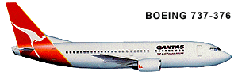
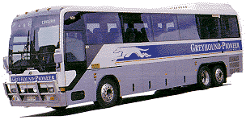
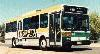
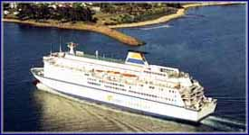

## Australian Cities and Areas

* [Integrated Transport Information Site (NSW)](http://www.131500.com.au)

## Railways

### Australia Long Distance Train Timetables

* [GetAbout Australia](http://www.getaboutaustralia.com/searches.php)
* [Australian Rail Maps](http://www.railmaps.com.au)

### International

* [RailEurope](http://www.raileurope.com/)
* [United Kingdom (Railtrack plc)](http://www.rail.co.uk/ukrail/planner/planner.htm)
* [Kiwi Rail - New Zealand Railways](http://www.kiwirail.co.nz)
* [Duncan Peattie's Chinese Railway Timetable Home Page](http://www.chinatt.org)
* [Hyperdia - Japanese Rail/Aviation Timetable Information](http://www.hyperdia.com/)

## Airlines

### Australian Domestic Airlines

* [Qantas](http://www.qantas.com/travel/airlines/timetable/global/en)
* [Virgin Australia](http://www.virginaustralia.com/au/en/plan/timetables-route-maps/flight-timetables/)
* [Jetstar Airways](http://www.jetstar.com/au/en/home)
* [Bonza](https://www.flybonza.com)
* [Regional Express](http://www.rex.com.au/Schedules/default.aspx)

* [Airnorth](http://www.airnorth.com.au/plan-your-trip/timetable)
* [Alliance Airlines](http://www.allianceairlines.com.au/when-we-fly/scheduled-services)
* [Cobham Aviation Services](http://www.cobhamaviationservices.com)
* [Sharp Airlines](http://sharpairlines.com.au/airline_services/flightschedules.html)
* [Skippers](http://www.skippers.com.au/Flights.asp)

### Australian Airports

* [Australian Airports](http://www.aeroseek.com/links/Airports/By_Region/Oceania/)

### On-Line Travel Agencies

These sites are commercial vendors of air travel and they include comprehensive
timetables of just about every scheduled commercial flight in the world!
It is possible to use these as a schedule reference without any financial commitment.

* [Travelocity](http://www.travelocity.com/)
* [Airfaresflights.com.au](http://www.airfaresflights.com.au/)

## Bus and Coach Lines

### Long Distance (Within Australia)

* [Getabout Australia](http://www.getaboutaustralia.com/searches.php) Guide to regional buses

### Metropolitan/Country (Within Australia)

As these links keep changing we suggest the [Bus Australia Website](http://www.busaustralia.com/) for links to most known operators.

## Trams and Light Rail

As these links keep changing we suggest the [Bus Australia Website](http://www.busaustralia.com/) for links to most known operators.

## Ferries and Ships

As these links keep changing we suggest the [Bus Australia Website](http://www.busaustralia.com/) for links to most known operators.

## Timetable collectors

* [NAOTC](http://www.naotc.org) Timetable Collectors Association of USA
* [Historic ACTION Timetables and Maps](http://actbus.net/gallery/index.php/History/Timetables)

## Further Sites

 If you cant find what you want here - take at look at
 the [Bus Australia Website](http://www.busaustralia.com/)
 which has a great list of Australian transport links (not just buses)
 with indicators which websites contain timetables.

And for New South Wales, Bus Australia also contains a
 [Public Transport Directory](http://www.busaustralia.com/fleetlists/directory.htm)
 which also contains operators without websites.
